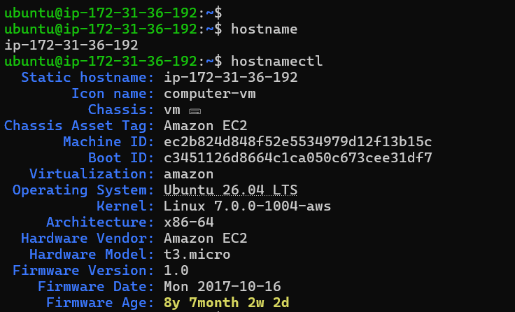
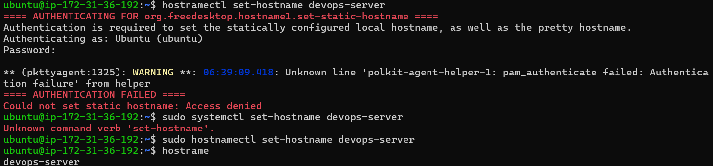
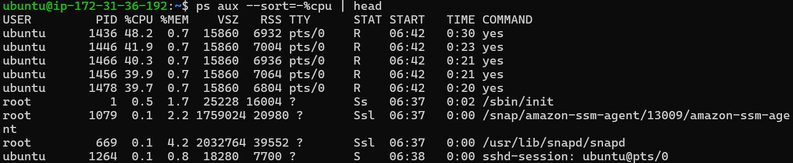
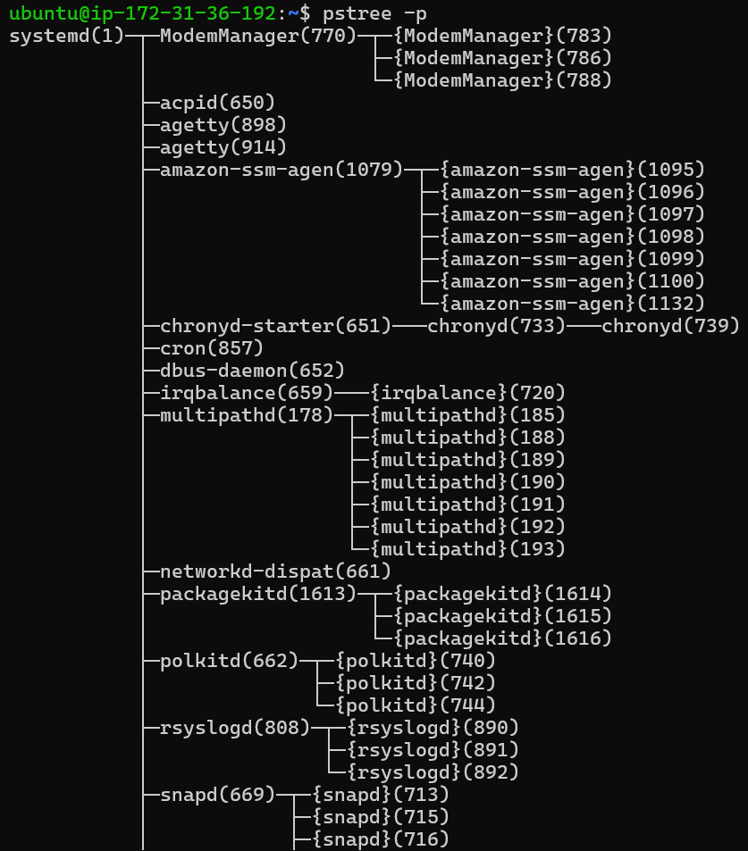
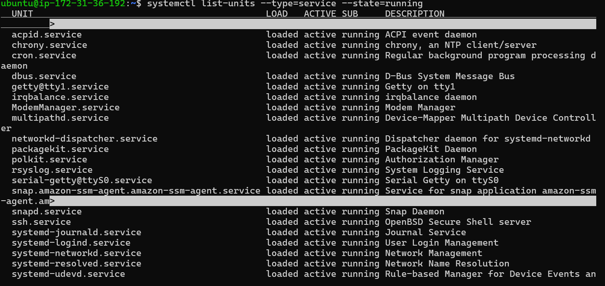
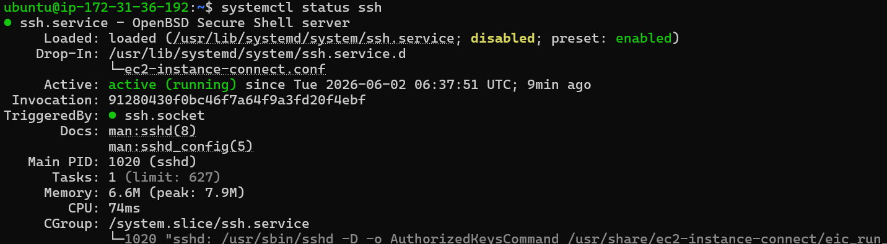
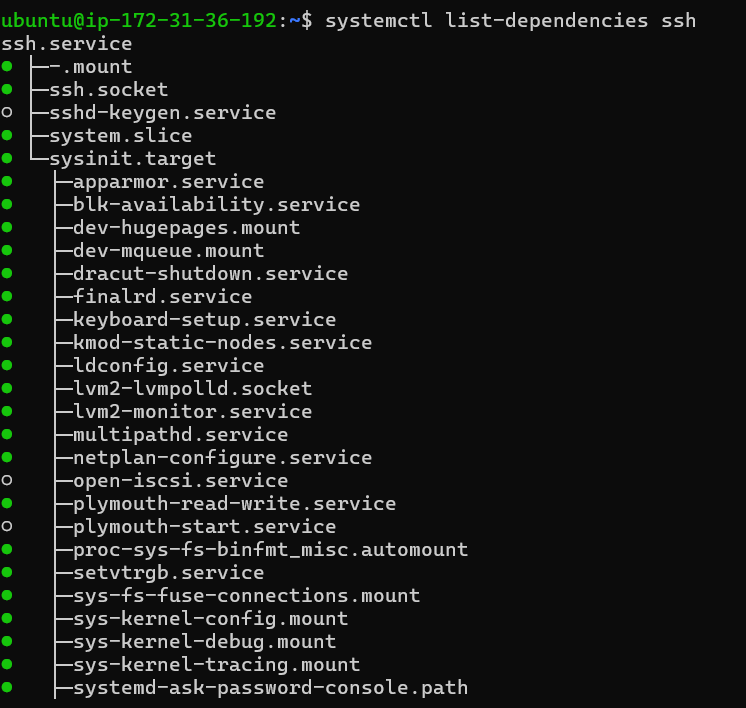
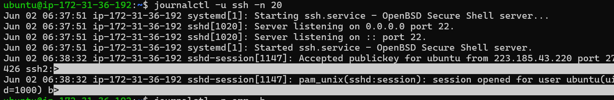
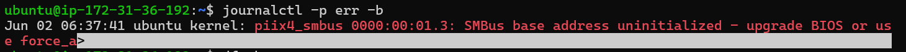
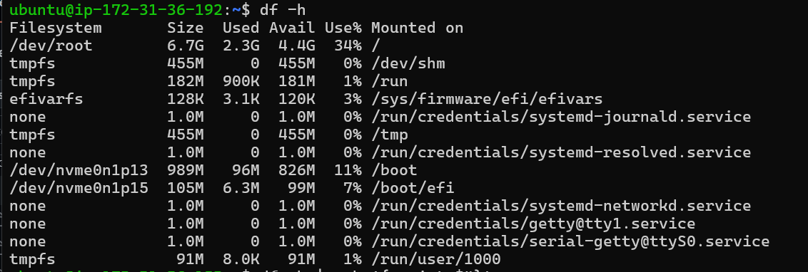

# Real Time Output of Commands I Practiced

## Hostname Commands

### 1. View Current Hostname

`hostnamectl` - Displays detailed hostname and system information.

### 2. Change Hostname

`sudo hostnamectl set-hostname devops-server` - Changes the system hostname.

---

## Process Commands

### 3. Check System Uptime

`uptime` - Shows how long the system has been running and load averages.

### 4. Find High CPU Consuming Processes

`ps aux --sort=-%cpu | head` - Lists processes consuming the most CPU.

### 5. Display Process Tree

`pstree -p` - Shows parent-child relationship between running processes.

---

## Service Commands

### 6. List Running Services

`systemctl list-units --type=service --state=running`

Shows all currently running services.

### 7. Check SSH Service Status

`systemctl status ssh`

Displays detailed information about the SSH service.

### 8. View SSH Service Dependencies

`systemctl list-dependencies ssh`

Shows services and targets required by SSH.

---

## Log Commands

### 9. View SSH Logs

`journalctl -u ssh -n 20`

Displays the latest SSH service logs.

### 10. View Error Logs

`journalctl -p err -b`

Shows boot-time error messages.

---

## Storage Commands

### 11. Check Disk Usage

`df -h`

Displays filesystem usage in human-readable format.

---

## What I Learned Today

- Learned how Linux manages processes and services.
- Explored process monitoring using `ps`, `uptime`, and `pstree`.
- Inspected SSH service status and dependencies.
- Viewed system and service logs using `journalctl`.
- Checked disk utilization using `df -h`.
- Changed the EC2 hostname using `hostnamectl`.
