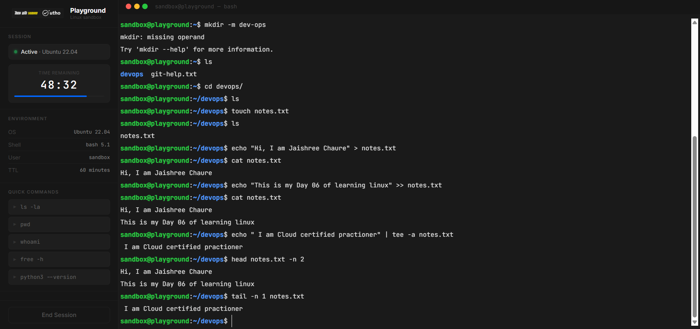

# Read and Write Text Files in Linux

- `touch notes.txt`

Create a text file named notes.txt

- `echo "Hi, I am Jaishree Chaure" > notes.txt`

Write text to notes.txt

- `echo "This is my Day 06 of Learning Linux" >> notes.txt`

Append text to notes.txt

- `echo "I am Cloud certified practitioner" | tee -a notes.txt`

Append text to notes.txt and display it on the terminal

- `cat notes.txt`

Read notes.txt

- `head -n 2 notes.txt`

Read the first two lines of notes.txt

- `tail -n 1 notes.txt`

Read the last line of notes.txt

## Hands on of above commands

