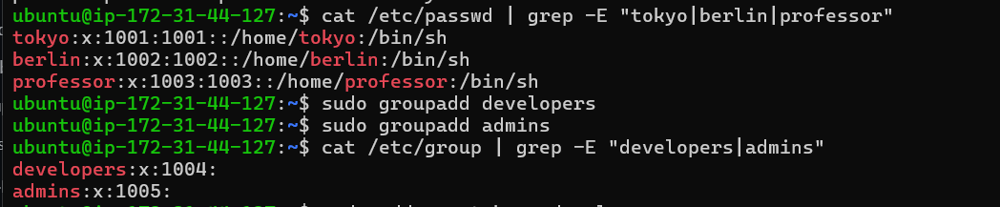
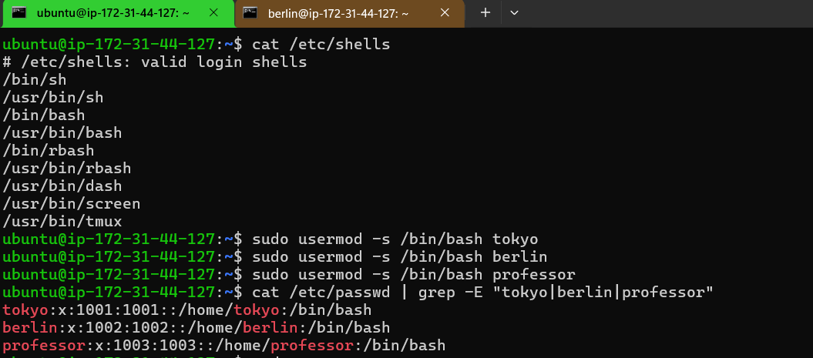
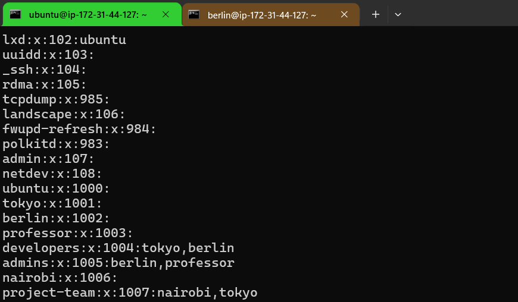
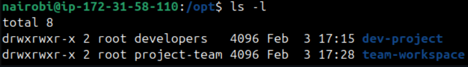
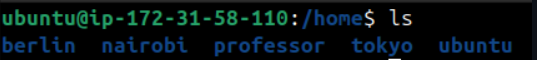
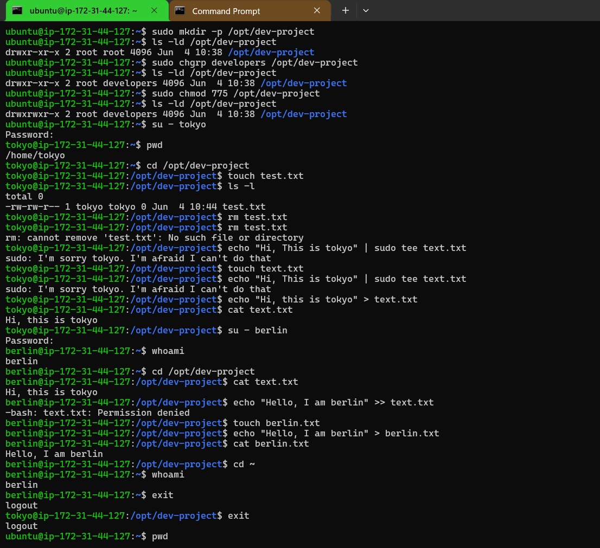
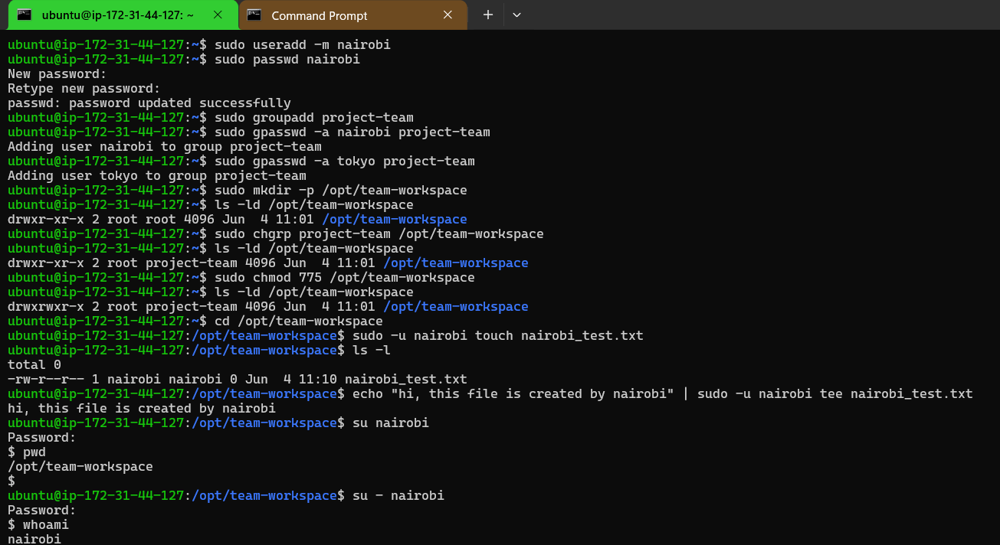
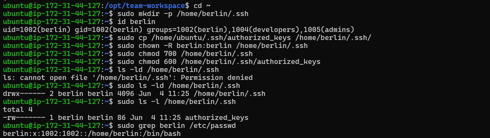
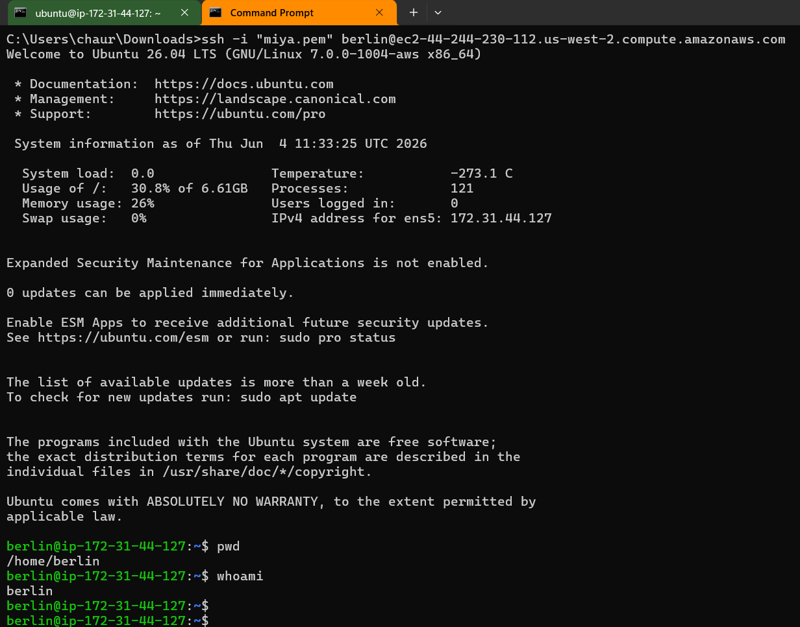

# Day 09 - Linux User & Group Management Challenge

## Task

Practice Linux user and group management by completing the following tasks:

- Create users and set passwords
- Create groups and assign users
- Configure shared directories
- Manage permissions
- Configure SSH login for custom users

---

# Task 1: Create Users

Created the following users:

- tokyo
- berlin
- professor

### Verification

```bash
cat /etc/passwd | grep -E "tokyo|berlin|professor"
```

### Screenshot



---

# Task 2: Create Groups

Created the following groups:

- developers
- admins

### Verification

```bash
cat /etc/group | grep -E "developers|admins"
```

### Screenshot


---

# Task 3: Change Default Shell

Changed login shell from `/bin/sh` to `/bin/bash`.

### Commands

```bash
sudo usermod -s /bin/bash tokyo
sudo usermod -s /bin/bash berlin
sudo usermod -s /bin/bash professor
```

### Verification

```bash
cat /etc/passwd | grep -E "tokyo|berlin|professor"
```

### Screenshot



---

# Task 4: Assign Users to Groups

### Group Memberships

| Group | Members |
|---------|---------|
| developers | tokyo, berlin |
| admins | berlin, professor |
| project-team | nairobi, tokyo |

### Verification

```bash
cat /etc/group | tail
```

### Screenshot



---

# Task 5: Create Shared Directory

Created a shared project directory:

```text
/opt/dev-project
```

### Configuration

```bash
sudo mkdir -p /opt/dev-project
sudo chgrp developers /opt/dev-project
sudo chmod 775 /opt/dev-project
```

### Verification

```bash
ls -ld /opt/dev-project
```

### Screenshot



---

# Task 6: Verify Home Directories

### Command

```bash
ls /home
```

### Screenshot



---

# Task 7: Test Shared Directory Access

Logged in as:

- tokyo
- berlin

Created files inside the shared directory.

### Screenshot



---

# Task 8: Create Team Workspace

Created:

- User: nairobi
- Group: project-team
- Workspace: /opt/team-workspace

### Commands

```bash
sudo useradd -m nairobi
sudo passwd nairobi

sudo groupadd project-team

sudo gpasswd -a nairobi project-team
sudo gpasswd -a tokyo project-team

sudo mkdir -p /opt/team-workspace
sudo chgrp project-team /opt/team-workspace
sudo chmod 775 /opt/team-workspace
```

### Screenshot



---

# Task 9: Configure SSH Access for Berlin User

### Commands

```bash
sudo mkdir -p /home/berlin/.ssh

sudo cp /home/ubuntu/.ssh/authorized_keys \
/home/berlin/.ssh/

sudo chown -R berlin:berlin \
/home/berlin/.ssh

sudo chmod 700 /home/berlin/.ssh

sudo chmod 600 \
/home/berlin/.ssh/authorized_keys
```

### Screenshot



---

# Task 10: Login as Berlin User

### Command

```bash
ssh -i "miya.pem" berlin@<public-ip>
```

### Verification

```bash
whoami
pwd
```

### Screenshot



---

# Commands Used

| Command | Purpose |
|----------|----------|
| useradd -m username | Create user |
| passwd username | Set password |
| groupadd groupname | Create group |
| usermod -s /bin/bash username | Change shell |
| gpasswd -a user group | Add user to group |
| mkdir -p directory | Create directory |
| chgrp group directory | Change group ownership |
| chmod 775 directory | Set permissions |
| ssh -i key.pem user@host | SSH login |
| cat /etc/passwd | Verify users |
| cat /etc/group | Verify groups |

---

# Learning Outcome

By completing this challenge, I learned:

- Linux user management
- Linux group management
- Group permissions
- Shared directory access
- Home directory management
- SSH key-based authentication
- Multi-user collaboration in Linux

