# Day 10 - Linux File Permissions & File Operations

## Files Created

Created the following files:

- `devops.txt`
- `notes.txt`
- `script.sh`

### Commands Used

```bash
touch devops.txt notes.txt
echo "Notes for 90daysofdevops" > notes.txt
echo "Hello DevOps" > script.sh
ls -l
```

### Screenshot

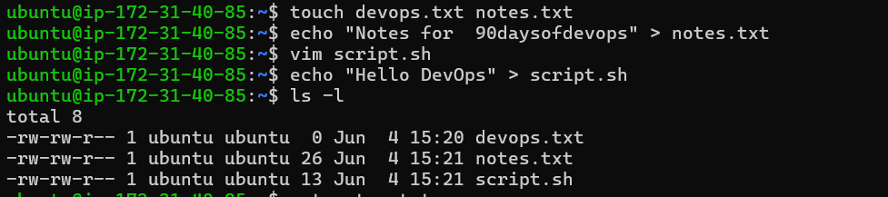

---

## Read File Content

Displayed the contents of `notes.txt`.

```bash
cat notes.txt
```

### Output

```text
Notes for 90daysofdevops
```

### Screenshot

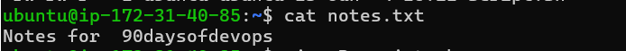

---

## View Script in Read-Only Mode

Opened the script file in Vim read-only mode.

```bash
vim -R script.sh
```

### Screenshot

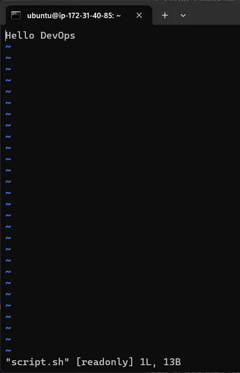

---

## Display First 5 Lines of /etc/passwd

```bash
head -n 5 /etc/passwd
```

### Screenshot

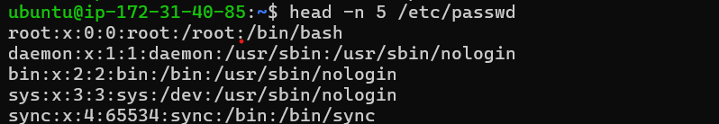

---

## Display Last 5 Lines of /etc/passwd

```bash
tail -n 5 /etc/passwd
```

### Screenshot

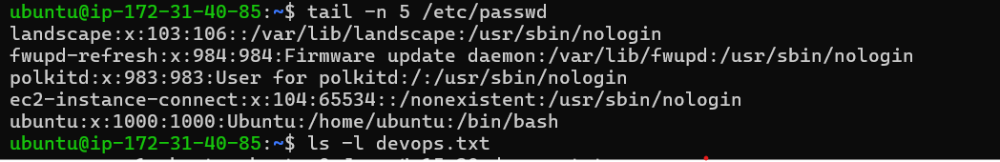

---

# Understanding File Permissions

Checked file permissions using:

```bash
ls -l
```

### Screenshot

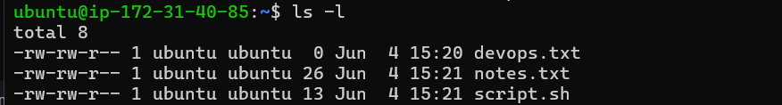

### Observations

| File | Permissions |
|--------|------------|
| devops.txt | rw-r--r-- |
| notes.txt | rw-r--r-- |
| script.sh | rw-r--r-- |

---

# Modify Permissions

## Make script.sh Executable

Initially, running the script produced an error because it contained plain text instead of a command.

After updating the file with:

```bash
#!/bin/bash
echo "Hello DevOps"
```

and granting execute permission:

```bash
chmod +x script.sh
./script.sh
```

Output:

```text
Hello DevOps
```

### Screenshot

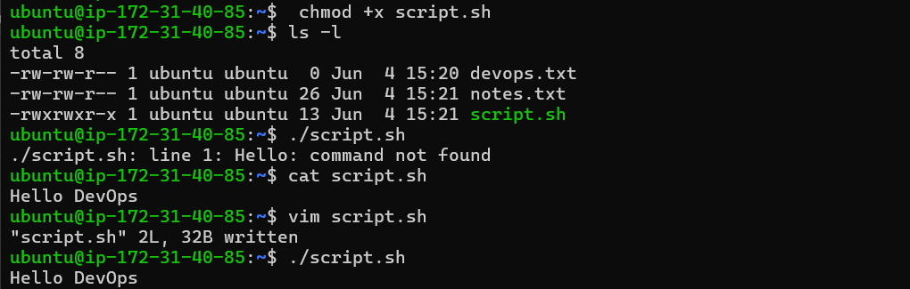

---

## Make devops.txt Read-Only

Removed write permission.

```bash
chmod -w devops.txt
ls -l
```

### Screenshot

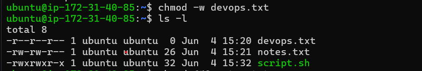

---

## Change notes.txt Permission to 640

```bash
chmod 640 notes.txt
ls -l
```

### Screenshot

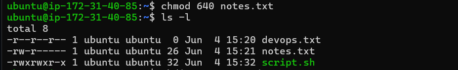

---

## Create Project Directory with Permission 755

```bash
mkdir -m 755 project
ls -ld project
```

### Screenshot

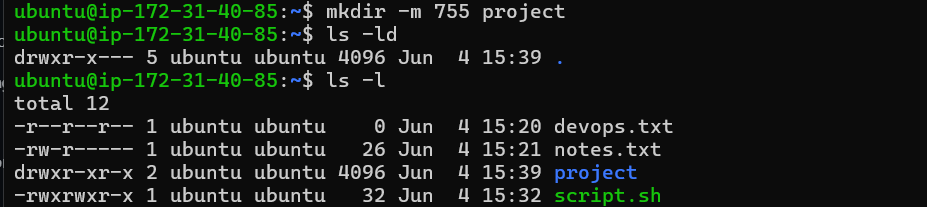

---

# Permission Testing

## Test 1: Write to a Read-Only File

```bash
echo "New Text" > readonly.txt
chmod 444 readonly.txt
echo "New Text" > readonly.txt
```

### Result

```text
Permission denied
```

### Screenshot

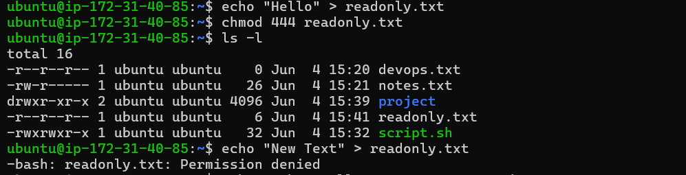

---

## Test 2: Execute File Without Execute Permission

```bash
echo 'echo "Hello DevOps"' > test.sh
chmod 644 test.sh
./test.sh
```

### Result

```text
Permission denied
```

After adding execute permission:

```bash
chmod +x test.sh
./test.sh
```

Output:

```text
Hello DevOps
```

### Screenshot

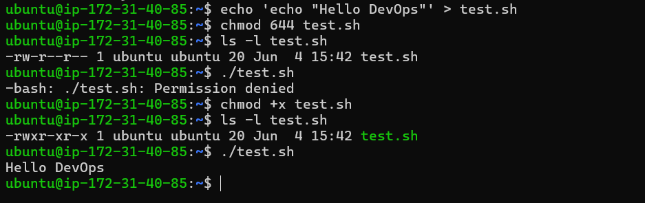

---

# What I Learned

- Linux permissions are controlled using `chmod`.
- Execute permission (`x`) is required to run shell scripts directly.
- Read-only files prevent modifications by normal users.
- `head` and `tail` help inspect large files quickly.
- Directory permissions can be assigned during creation using `mkdir -m`.
- `vim -R` opens files safely in read-only mode.
