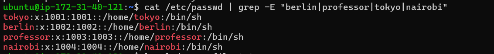
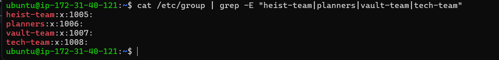
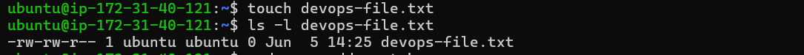
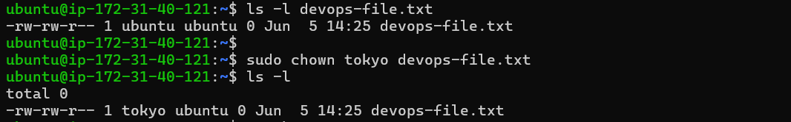
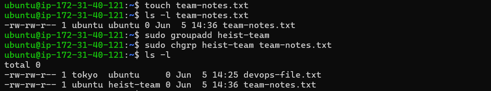
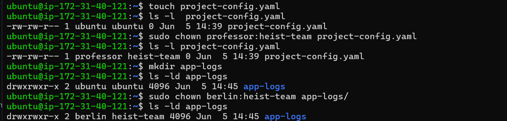
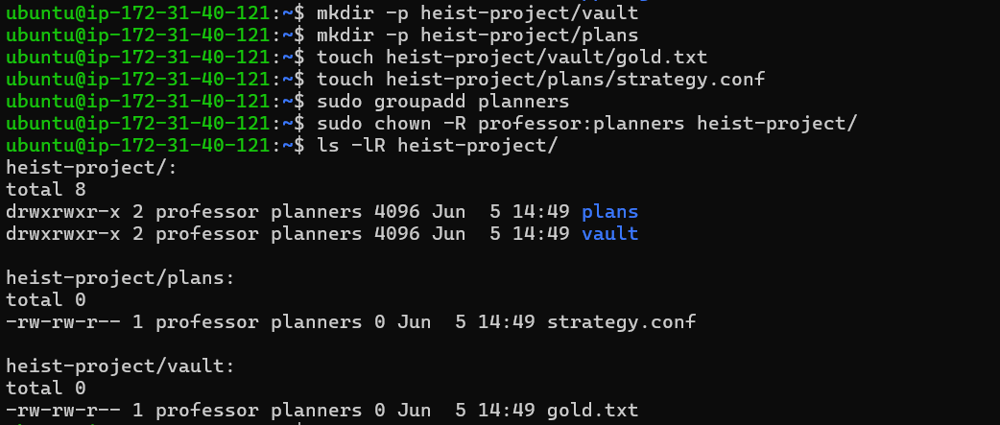
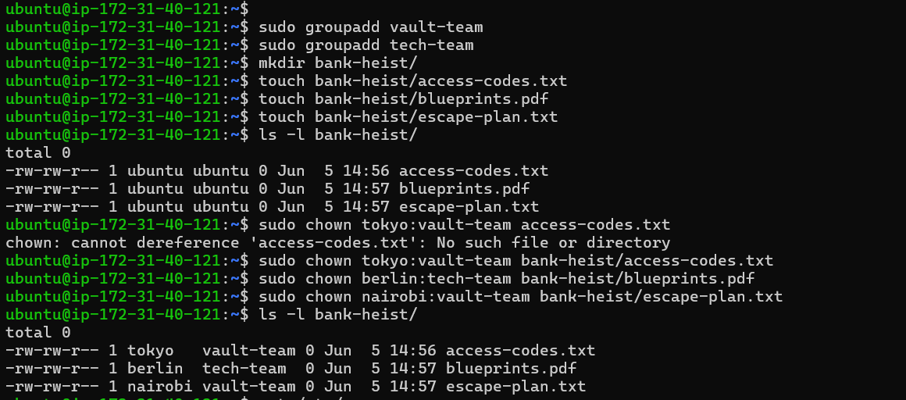

# File Ownership Challenge (chown & chgrp)

## Users Created

- tokyo
- berlin
- professor
- nairobi



---

## Groups Created

- heist-team
- planners
- vault-team
- tech-team



---

## Files & Directories Created

- devops-file.txt
- app-logs/
- bank-heist/access-codes.txt
- bank-heist/blueprints.pdf
- bank-heist/escape-plan.txt
- heist-project/plans/strategy.conf
- heist-project/vault/gold.txt
- project-config.yml
- team-notes.txt

---

## Understanding Ownership

- Run `ls -l` in your working directory.
- The first username is the **Owner**.
- The second name is the **Group**.
- Ownership controls who can manage files and directories.



### Notes

- **Owner:** Usually the user who created the file.
- **Group:** Collection of users who share access to the file.

---

## Basic chown Operations

- Create file devops-file.txt
- Check current owner: ls -l devops-file.txt
- Change owner to tokyo
- Verify the changes



---

## Basic chgrp Operations

- Create file team-notes.txt
- Check current group: ls -l team-notes.txt
- Create group: sudo groupadd heist-team
- Change file group to heist-team
- Verify the change



---

## Combined Owner & Group Change

Using `chown`, we can change both owner and group in a single command.

- Create file project-config.yml
- Change owner to professor AND group to heist-team (one command)
- Create directory app-logs/
- Change its owner to berlin and group to heist-team



---

## Recursive Ownership

1. Create directory structure:

```bash
mkdir -p heist-project/vault
mkdir -p heist-project/plans
touch heist-project/vault/gold.txt
touch heist-project/plans/strategy.conf
```

2. Create group `planners`: `sudo groupadd planners`

3. Change ownership of entire `heist-project/` directory:

   - Owner: `professor`
   - Group: `planners`
   - Use recursive flag (`-R`)

4. Verify all files and subdirectories changed:

```bash
ls -lR heist-project/
```



---
## Task 6: Practice Challenge

1. Create users: `tokyo`, `berlin`, `nairobi` (if not already created)

2. Create groups: `vault-team`, `tech-team`

3. Create directory: `bank-heist/`

4. Create 3 files inside:

```bash
touch bank-heist/access-codes.txt
touch bank-heist/blueprints.pdf
touch bank-heist/escape-plan.txt
```

5. Set different ownership:

   - `access-codes.txt` → owner: `tokyo`, group: `vault-team`

   - `blueprints.pdf` → owner: `berlin`, group: `tech-team`

   - `escape-plan.txt` → owner: `nairobi`, group: `vault-team`

Verify: `ls -l bank-heist/`



---

## Commands Used

- View ownership : `ls -l filename`

- Change owner only : `sudo chown newowner filename`

- Change group only : `sudo chgrp newgroup filename`

- Change both owner and group : `sudo chown owner:group filename`

- Recursive change (directories) : `sudo chown -R owner:group directory/`

- Change only group with chown : `sudo chown :groupname filename`

---

## What I Learned

- Managing Linux users and groups
- Understanding file ownership concepts
- Using `chown` to change owners
- Using `chgrp` to change groups
- Assigning owner and group together
- Recursive ownership management using `-R`
- Verifying ownership using `ls -l`
- Managing directory ownership in Linux
