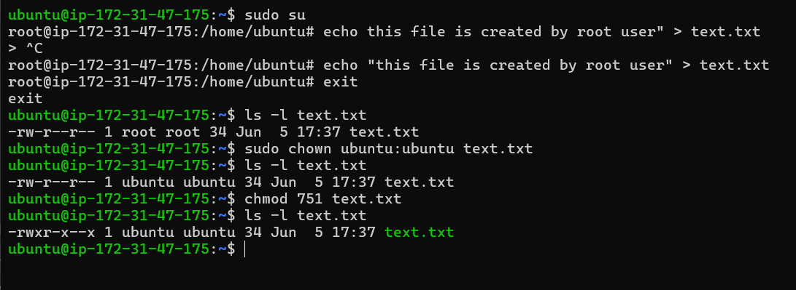

# Revision (Days 01–11)

- In the first 11 days of my #90DaysOfDevOps journey, I focused on building strong Linux fundamentals through hands-on practice. From managing users and permissions to troubleshooting services, every task has helped me understand how real systems work.

## Processes & services

When my system hangs or slows down, I use the following commands to troubleshoot and check service health:

`ps aux` → Lists all running processes on the system.

`top` → Display sorted information about processes.

`systemctl status <service>` → Displays the status of a specific service (whether it's active, failed, or inactive).

`journalctl -u <service>` → Displays logs for a specific service, useful for debugging issues.

## File skills

I have practiced creating/modifying/permission of Linux file/folder. Here is how to safely change ownership and permissions:

- Check current ownership and permissions

`ls -l /path/to/file`

- Change ownership (user and group)

`sudo chown user:group /path/to/file`

- Change permissions (least privilege principle)

`chmod 751 /path/to/file`

- Example :

## Cheat sheet refresh

Top commands I'd use in an incident:

- `ps aux` - Lists all running processes with CPU/memory usage

- `mpstat` - Monitors CPU utilization across cores, highlighting bottlenecks or unusual load.

- `systemctl status service` - Verifies if a critical service is active, failed, or restarting.

- `cat /var/log/nginx/error.log` - Reads raw logs for web server errors (replace with relevant service log path).

- `journalctl -u service` - Retrieves detailed logs for a given service, useful for debugging failures.

- `free -m` - Displays memory usage in MB to check for exhaustion or leaks.

## What will I focus on improving in the next 3 days?

- I want to strengthen my Linux networking fundamentals and understand how systems communicate over a network.
- I will complete Linux Volume Management (Partitions, LVM, Mount Points, and Storage Management).
- I will continue practicing Linux administration tasks including users, groups, permissions, and troubleshooting.
- I plan to spend time on Git and GitHub workflows to improve version control skills.
- I will also revise AWS fundamentals and explore more EC2 hands-on exercises.
- Also I will practice users & group management.

- And if time allows I will also watch AWS videos.
