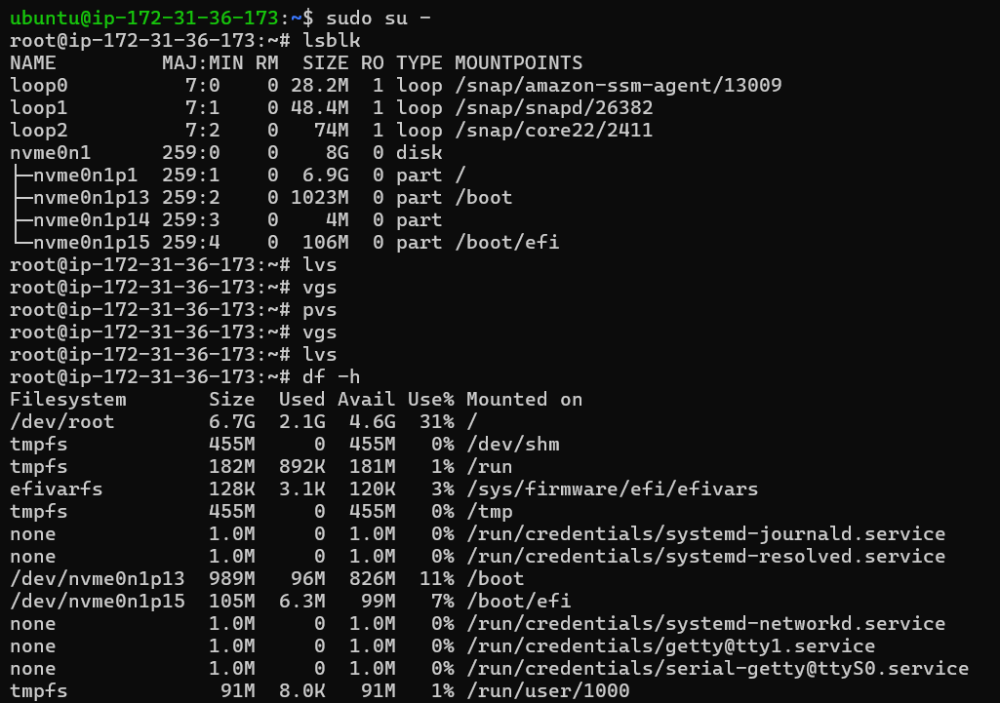
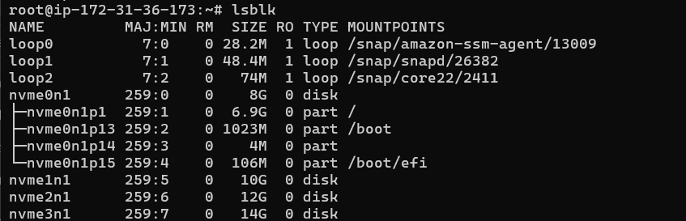
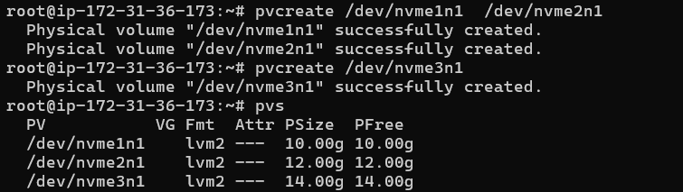
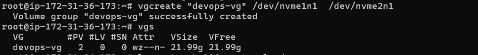
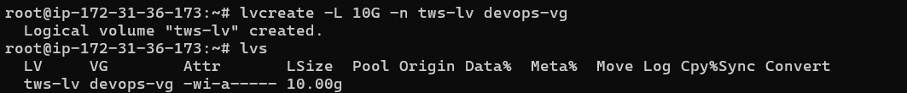
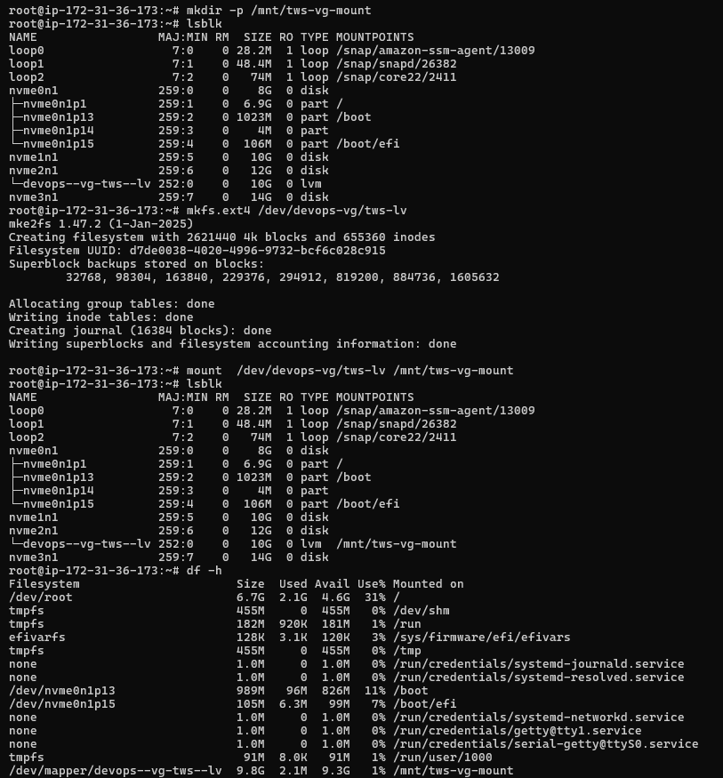
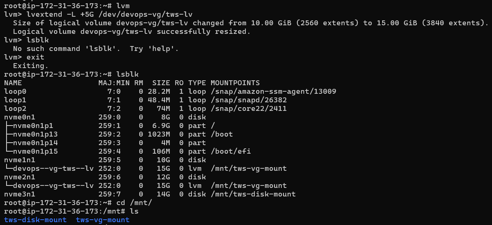
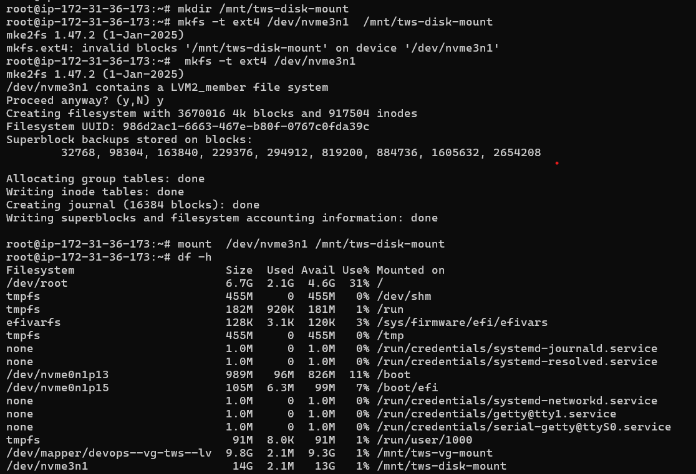
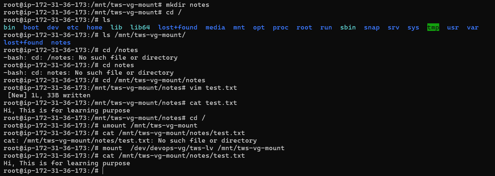

# Day 13 - Linux Logical Volume Manager (LVM)

## Task

Learn LVM to manage storage flexibly by creating, mounting, and extending volumes.

---

## Task 1: Check Current Storage

Run: `lsblk`, `pvs`, `vgs`, `lvs`, `df -h`

### Screenshot



---

## Task 2: Verify Attached Volumes

Run: `lsblk`

### Screenshot



---

## Task 3: Create Physical Volume

Run:

```
pvcreate /dev/nvme1n1
pvcreate /dev/nvme2n1
pvcreate /dev/nvme3n1
pvs
```

### Screenshot



---

## Task 4: Create Volume Group

Run:

```
vgcreate devops-vg /dev/nvme1n1 /dev/nvme2n1
vgs
```

### Screenshot



---

## Task 5: Create Logical Volume

Run:

```
lvcreate -L 10G -n tws-lv devops-vg
lvs
```

### Screenshot



---

## Task 6: Format and Mount

Run:

```
mkfs.ext4 /dev/devops-vg/tws-lv
mkdir -p /mnt/tws-vg-mount
mount /dev/devops-vg/tws-lv /mnt/tws-vg-mount
df -h
```

### Screenshot



---

## Task 7: Extend the Volume

Run:

```
lvextend -L +5G /dev/devops-vg/tws-lv
resize2fs /dev/devops-vg/tws-lv
df -h /mnt/tws-vg-mount
```

### Screenshot



---

## Task 8: Mounting Disk Directly

Run:

```
mkfs -t ext4 /dev/nvme3n1
mkdir /mnt/tws-disk-mount
mount /dev/nvme3n1 /mnt/tws-disk-mount
df -h
```

### Screenshot



---

## Task 9: Verify Data Persistence

Run:

```
mkdir /mnt/tws-vg-mount/notes
vim test.txt
cat /mnt/tws-vg-mount/notes/test.txt
```

### Screenshot



---

## Additional LVM Inspection Commands

Run:

```
pvdisplay
vgdisplay
lvdisplay
```

### Purpose

- `pvdisplay` - Shows detailed information about Physical Volumes (PV)
- `vgdisplay` - Shows detailed information about Volume Groups (VG)
- `lvdisplay` - Shows detailed information about Logical Volumes (LV)

These commands help verify LVM configuration, inspect storage allocation, and troubleshoot storage-related issues.

---

## Commands Used

- `lsblk` - List block devices and mount points
- `df -h` - Display filesystem usage
- `pvcreate` - Initialize disks as Physical Volumes
- `pvs` - Display Physical Volumes
- `pvdisplay` - Show detailed Physical Volume information
- `vgcreate` - Create a Volume Group
- `vgs` - Display Volume Groups
- `vgdisplay` - Show detailed Volume Group information
- `lvcreate` - Create a Logical Volume
- `lvs` - Display Logical Volumes
- `lvdisplay` - Show detailed Logical Volume information
- `mkfs.ext4` - Create ext4 filesystem
- `mount` - Mount filesystem
- `lvextend` - Extend Logical Volume size
- `resize2fs` - Resize ext filesystem

---

## What I Learned

- Understood the LVM hierarchy: Physical Volume (PV) → Volume Group (VG) → Logical Volume (LV).
- Learned how to create and manage Physical Volumes, Volume Groups, and Logical Volumes.
- Learned how to format and mount storage volumes in Linux.
- Learned how to extend a Logical Volume dynamically without recreating storage.
- Learned how to inspect detailed LVM metadata using `pvdisplay`, `vgdisplay`, and `lvdisplay`.
- Learned the difference between using LVM-managed storage and mounting a disk directly.

---
