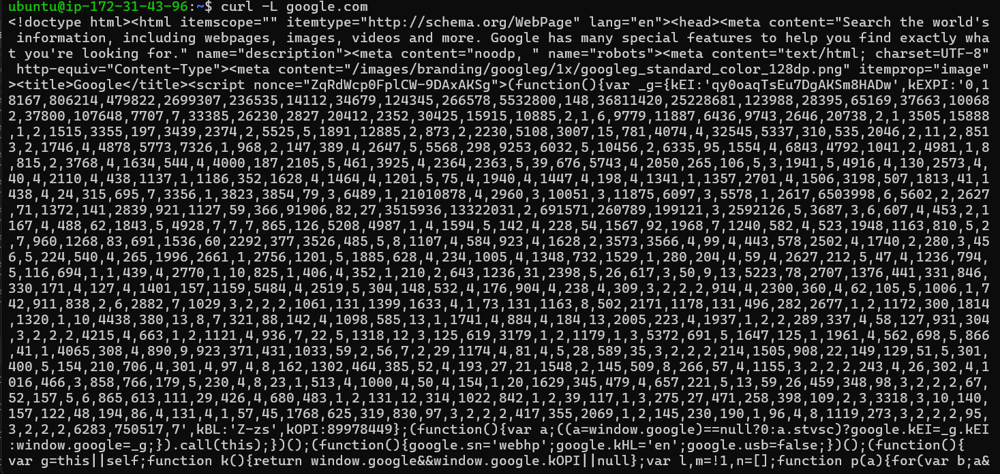
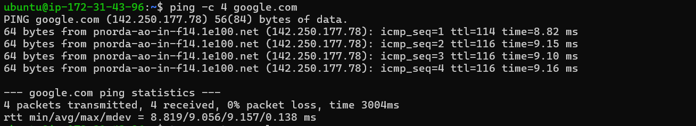
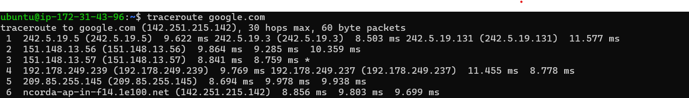
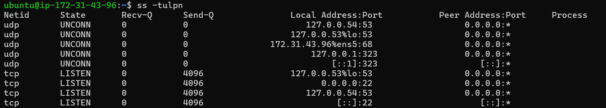
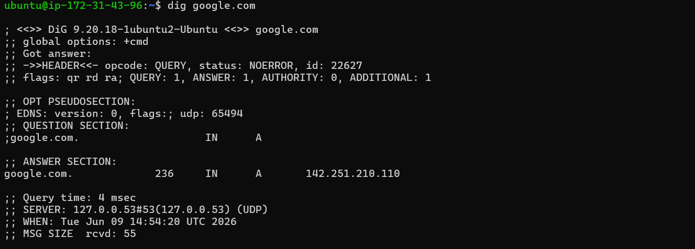
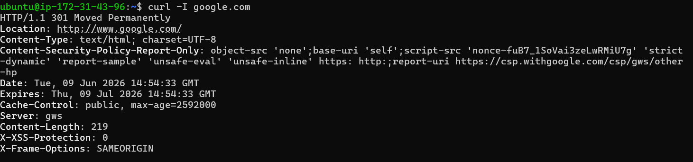
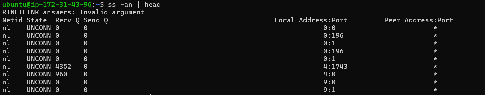
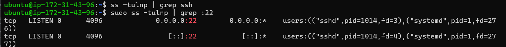
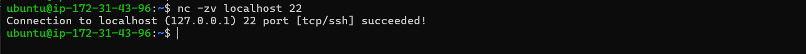

# Networking Fundamentals & Hands-on Checks

## OSI and TCP/IP Model

### OSI Model -

The OSI model is a 7-layer framework used to understand how network communication works.

- **L7 Application** – User-facing network services.
- **L6 Presentation** – Data format and encryption.
- **L5 Session** – Connection management.
- **L4 Transport** – TCP/UDP communication.
- **L3 Network** – IP addressing and routing.
- **L2 Data Link** – Device-to-device communication.
- **L1 Physical** – Cables, signals, and hardware.

### TCP/IP Model -

TCP/IP is a 4-layer networking model used for communication across the internet.

- **Application Layer** – User-facing network services.
- **Transport Layer** – TCP/UDP communication.
- **Internet Layer** – IP addressing and routing.
- **Network Access Layer** – Physical network connectivity.

### Protocol Placement -

- **Application Layer** – HTTP, HTTPS, DNS, DHCP, SSH
- **Transport Layer** – TCP, UDP
- **Internet Layer** – IP, ICMP, ARP
- **Network Access Layer** – Ethernet, Wi-Fi

## Real Example

```bash
curl -L google.com
```

This command fetches the webpage content.

→ HTTP (Application) over TCP (Transport) over IP (Internet)



---

# Hands-on Checklist

- ## Identity: `hostname -I`

### Observation

Successfully identified the EC2 instance's private IP address: **172.31.43.96**


---

- ## Reachability: `ping <target>`

### Observation

Successfully verified connectivity to Google. All packets were received with **0% packet loss** and an average latency of **9.056 ms**.

```bash
ping -c 4 google.com
```



---

- ## Path: `traceroute <target>`

### Observation:

The route to Google was traced successfully through multiple network hops. Response times remained low, indicating a stable network path.

```bash
traceroute google.com
```



---

- ## Ports: `ss -tulnp`

### Observation:

Active listening ports and network services were displayed successfully. SSH service was found listening on port 22.

```bash
ss -tulnp
```



---

- ## Name resolution: `dig <domain>` or `nslookup <domain>`

### Observation:

The DNS query resolved google.com successfully to the IP address 142.251.210.110, confirming proper DNS functionality.

```bash
dig google.com
```



---

- ## HTTP check: `curl -I <http/https-url>`

### Observation:

Received HTTP/1.1 301 Moved Permanently. The server responded successfully and redirected the request to www.google.com.

```bash
curl -I google.com
```



---

- ## Connections snapshot: `ss -an | head`

### Observation:

Displayed active socket and network connection information, including local and peer addresses.

```bash
ss -an | head
```



---

# Mini Task: Port Probe & Interpret

- SSH service on port 22

### Observation:

SSH daemon (**sshd**) is listening on port **22**.

```bash
sudo ss -tulnp | grep :22
```



---

- Connection succeeded

```bash
nc -zv localhost 22
```



If not reachable:

- Check service status - `systemctl status ssh`
- Check logs - `journalctl -u ssh`
- Check firewall - `sudo ufw status`

---

# Reflection

- Ping command gives the fastest indication of basic network connectivity and latency issues.

- DNS resolution is the first thing to verify when a domain is unreachable.

  -> `dig`, `nslookup`, `ping`

- Traceroute helps identify the network path and locate potential delays between hops.

  -> `traceroute`

- HTTP status checks confirm whether a web server is reachable and responding correctly.

  -> `curl -I <url>`

- Port probing verifies whether a service is listening and accepting connections.

  -> `ss -tulnp`, `nc -zv`

- Follow up checks in real incidents :

  ○ Check firewall (`sudo ufw status`)

  ○ Service health check (`systemctl status <service>`)

  ○ Review logs (`journalctl -u <service>`)

  ○ Connectivity test (`ping`, `traceroute`, `nc`)
