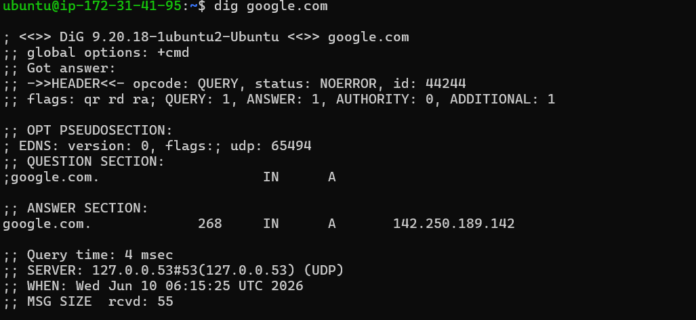
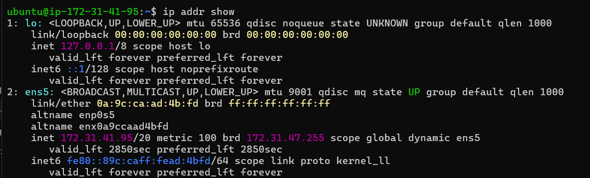

# Networking Concepts: DNS, IP, Subnets & Ports

## Task 1: DNS – How Names Become IPs

### 1. What happens when you type `google.com` in a browser?

**Answer**
```text
1. The browser checks its cache to see if it already knows the IP address of google.com.

2. If the IP address is not found, it sends a DNS request to resolve the domain name.

3. DNS returns the corresponding IP address, and the browser connects to that server.

4. The server processes the request and sends the webpage back to the browser.
```

### 2. What are these record types? Write one line each:

- **A** – Points a domain name to an IPv4 address.
- **AAAA** – Points a domain name to an IPv6 address.
- **CNAME** – Creates an alias for another domain name.
- **MX** – Specifies which mail server receives emails for a domain.
- **NS** – Identifies the DNS servers responsible for a domain.

### 3. Run: `dig google.com`



- **A Record** – Returns the IPv4 address: `142.250.189.142`
- **TTL (Time To Live)** – `268 seconds`

---

## Task 2: IP Addressing

### 1. What is an IPv4 address? How is it structured?

### Answer

An IPv4 address is a unique number used to identify a device on a network.

It consists of two parts:

- **Network Portion** – Identifies the network.
- **Host Portion** – Identifies the device on that network.

**Example:** `192.168.1.10`

- Network Portion: `192.168.1`
- Host Portion: `10`

### 2. Difference between public and private IPs

| Public IP | Private IP |
|-----------|-----------|
| Used for communication over the internet. | Used within a local network. |
| Assigned by an ISP. | Assigned by a router or network administrator. |
| Accessible from the internet. | Not directly accessible from the internet. |
| Example: `18.224.212.253` | Example: `172.31.41.95` |

### 3. What are the private IP ranges?

- `10.0.0.0 - 10.255.255.255` - Typically used in large enterprise networks.
- `172.16.0.0 - 172.31.255.255` - Commonly used in medium-sized networks.
- `192.168.0.0 - 192.168.255.255` - Commonly used in home and small office networks.

### 4. Run: `ip addr show` — Identify Private and Special IP Addresses



- `127.0.0.1/8` - Loopback address for local communication.
- `172.31.41.95/20` - Private IP address of this EC2 instance.
- `172.31.47.255` - Broadcast address of the subnet.
  
---

## Task 3: CIDR & Subnetting

### 1. What does `/24` mean in `192.168.1.0/24`?

**Answer** - `/24` means the first 24 bits are used for the network portion, leaving 8 bits for hosts.

- Network: `192.168.1.0`
- IP Range: `192.168.1.0 - 192.168.1.255`
- Total IPs: `256`
- Usable Hosts: `254`

### 2. How many usable hosts in:

- `/24` : `254`
- `/16` : `65,534`
- `/28` : `14`

### 3. Why do we subnet?

**Answer** - Subnetting divides a large network into smaller networks to improve management, performance, and security.

- Reduces network traffic.
- Improves security.
- Makes troubleshooting easier.

### 4. Quick exercise — fill in:

| CIDR | Subnet Mask | Total IPs | Usable Hosts |
|------|------------|------------|-------------|
| /24 | 255.255.255.0 | 256 | 254 |
| /16 | 255.255.0.0 | 65,536 | 65,534 |
| /28 | 255.255.255.240 | 16 | 14 |

---

## Task 4: Ports – The Doors to Services

### 1. What is a port? Why do we need them?

**Answer**

- Port is a logical endpoint in networking.
- IP address identifies the device on a network and port number specifies which service...
- Port is needed to differentiate between services...

### 2. Document these common ports:

| Port | Service |
|------|---------|
| 22 | SSH |
| 80 | HTTP |
| 443 | HTTPS |
| 53 | DNS |
| 3306 | MySQL |
| 6379 | Redis |
| 27017 | MongoDB |

### 3. Run `ss -tulpn` — match at least 2 listening ports to their services

- Port 22 : Service SSH

```bash
sudo ss -tulpn | grep 22
```

Output:

```text
tcp LISTEN 0 4096 0.0.0.0:22
tcp LISTEN 0 4096 [::]:22
```

**Observation:**
- Port `22` is in the **LISTEN** state.
- The service associated with this port is **SSH (sshd)**.
- The output shows SSH is listening on both **IPv4 (`0.0.0.0:22`)** and **IPv6 (`[::]:22`)** addresses.

```bash
nc -zv localhost 22
```

Output:

```text
Connection to localhost (127.0.0.1) 22 port [tcp/ssh] succeeded!
```

---

## Task 5: Putting It Together

## Task 5: Putting It Together

### 1. When you run `curl http://localhost:80`

- **Protocol:** HTTP
- **Hostname:** `localhost` resolves to `127.0.0.1` (loopback IP)
- **Port:** `80` identifies the web service.
- **Service:** Apache/Nginx processes the request and returns a response.

### 2. Your app can't reach a database at `10.0.1.50:3306` — what would you check first?

- `ss -tulpn | grep 3306` - Check if MySQL is listening on port 3306.
- `systemctl status mysql` - Verify the MySQL service is running.
- `nc -zv 10.0.1.50 3306` - Test connectivity to the database server.
- `journalctl -u mysql` - Review MySQL logs for errors.

## What I Learned

- DNS translates domain names into IP addresses.
- Public and private IPs help identify devices on different networks.
- CIDR and subnetting help organize and manage networks efficiently.
- Ports allow multiple services to communicate on the same device.
- Networking concepts work together to enable communication between clients, servers, and applications.
