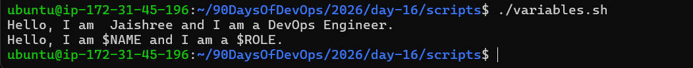
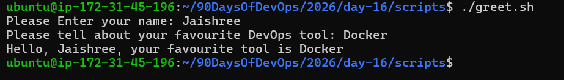
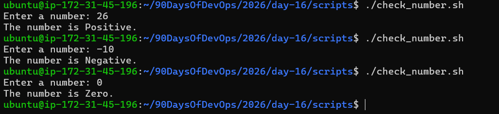
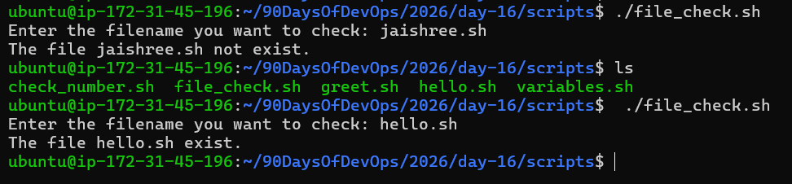
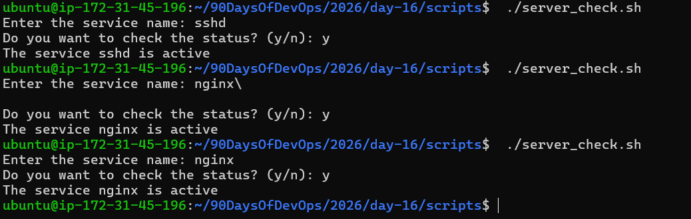

# Shell Scripting Basics

## Task 1: First Script

1. Create a file `hello.sh`
2. Add the shebang line `#!/bin/bash` at the top
3. Print `Hello, DevOps!` using `echo`
4. Make it executable and run it

Here is the script hello.sh

[Script](scripts/hello.sh)

- What happens if you remove the shebang line?

- The script runs after removing shebang line :
  - `./hello.sh` - Kernel looks for a shebang. If not found it will use current shell to interpret the file.
  - `bash hello.sh` - The shell explicitly uses bash.
  - `sh hello.sh` - It uses sh.

---

## Task 2: Variables

1. Create `variables.sh` with:
   - A variable for your NAME
   - A variable for your ROLE (e.g. "DevOps Engineer")
   - Print: `Hello, I am <NAME> and I am a <ROLE>`

2. Try using single quotes vs double quotes — what's the difference?

- Using double quote `" "` - The variables and commands are evaluated.

- Using single quote `' '` - Everything inside is taken literally, no evaluation happens.

Here is the script variables.sh

[Script](scripts/variables.sh)

---

## Task 3: User Input with read

1. Create `greet.sh` that:
   - Asks the user for their name using `read`
   - Asks for their favourite tool
   - Prints: `Hello <name>, your favourite tool is <tool>`

Here is the script greet.sh

[Script](scripts/greet.sh)

---

## Task 4: If-Else Conditions

1. Create `check_number.sh` that:
   - Takes a number using `read`
   - Prints whether it is positive, negative, or zero

Here is the script check_number.sh

[Script](scripts/check_number.sh)

2. Create `file_check.sh` that:
   - Asks for a filename
   - Checks if the file exists using `-f`
   - Prints appropriate message

Here is the script file_check.sh

[Script](scripts/file_check.sh)

---

## Task 5: Combine It All

Create `server_check.sh` that:

1. Stores a service name in a variable (e.g., `nginx`, `sshd`)
2. Asks the user: "Do you want to check the status? (y/n)"
3. If `y` — runs `systemctl status <service>` and prints whether it's active or not
4. If `n` — prints "Skipped."

Here is the script server_check.sh

[Script](scripts/server_check.sh)

---

# What I learned -

- How to write and run shell scripts with shebangs, variables, and user input using read.
- The difference between single vs double quotes, and how quoting affects variable expansion.
- Using conditional logic (if, elif, else) and test operators (-f, -gt, -lt) to handle files and numbers.
- Checking Linux service status using systemctl.
