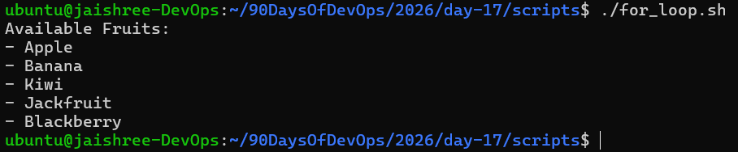
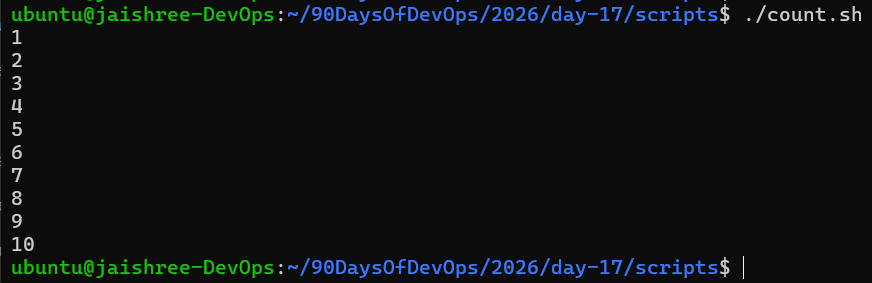
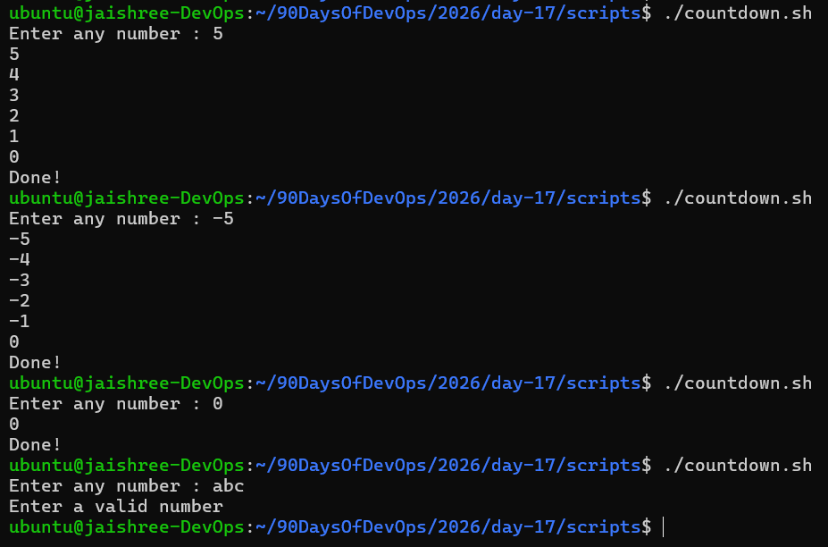
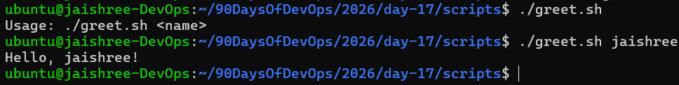
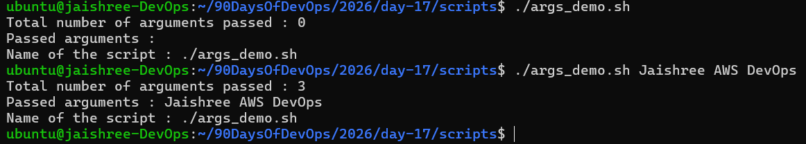
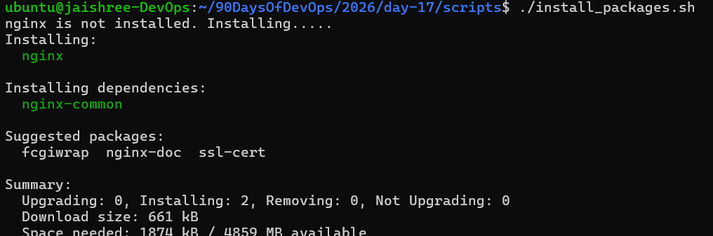
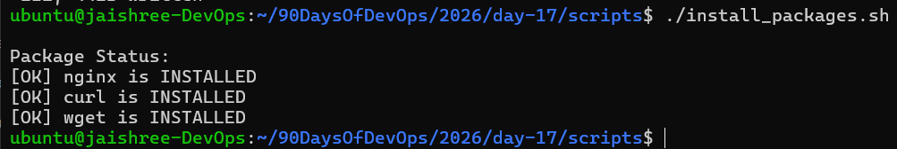
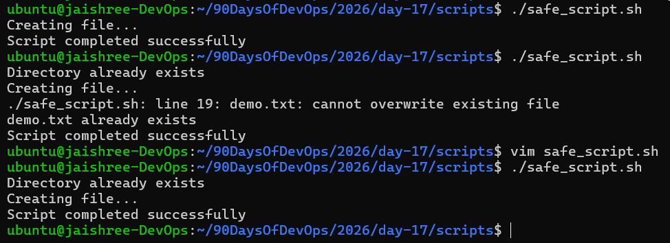
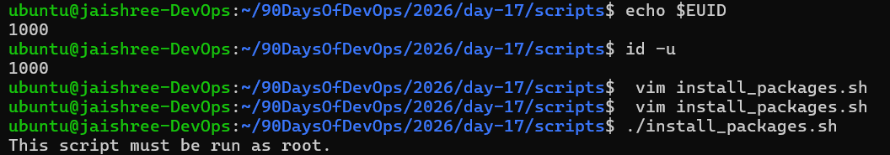
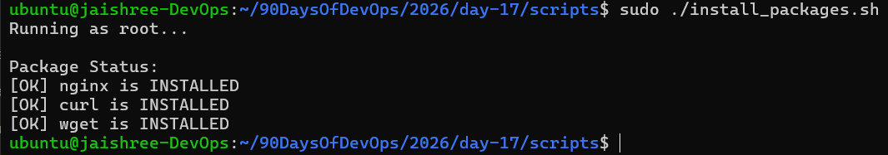

# Day 17 – Shell Scripting: Loops, Arguments & Error Handling

## Task 1: For Loop

### 1. Create `for_loop.sh` that:

- Loops through a list of fruits
- Prints each fruit using a for loop

[Here is the script for_loop.sh](scripts/for_loop.sh)

### Output

---

### 2. Create `count.sh` that:

- Prints numbers 1 to 10 using a for loop

[Here is the script count.sh](scripts/count.sh)

### Output

---

## Task 2: While Loop

### Create `countdown.sh` that:

- Takes a number from the user
- Counts down to 0 if positive
- Counts up to 0 if negative
- Prints "Done!" at the end
- Validates user input

[Here is the script countdown.sh](scripts/countdown.sh)

### Output

---

## Task 3: Command-Line Arguments

### 1. Create `greet.sh` that:

- Accepts a name as `$1`
- Prints `Hello, <name>!`
- Shows usage message if no argument is passed

[Here is the script greet.sh](scripts/greet.sh)

### Output

---

### 2. Create `args_demo.sh` that:

- Prints total number of arguments (`$#`)
- Prints all arguments (`$@`)
- Prints script name (`$0`)

[Here is the script args_demo.sh](scripts/args_demo.sh)

### Output

---

## Task 4: Install Packages via Script

### Create `install_packages.sh` that:

- Defines a package list (`nginx`, `curl`, `wget`)
- Checks whether packages are installed
- Installs missing packages
- Displays package status

[Here is the script install_packages.sh](scripts/install_packages.sh)

### Output (Installation)

### Output (Package Status)

---

## Task 5: Error Handling

### 1. Create `safe_script.sh` that:

- Creates a directory
- Creates a file inside it
- Handles existing files/directories gracefully

[Here is the script safe_script.sh](scripts/safe_script.sh)

### Output

---

### 2. Modify `install_packages.sh` to check whether the script is run as root

[Here is the script modified_install_packages.sh](scripts/modified_install_packages.sh)

### Root User Verification

### Running as Root

---

## Key Learnings

- Learned `for` and `while` loops in Bash
- Practiced command-line arguments (`$1`, `$#`, `$@`, `$0`)
- Automated package installation
- Checked package status using `dpkg -s`
- Implemented root-user validation using `$EUID`
- Applied error handling techniques in shell scripts
- Improved Bash scripting and troubleshooting skills
