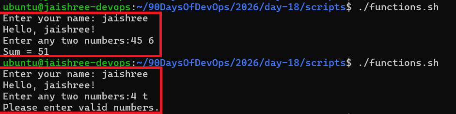
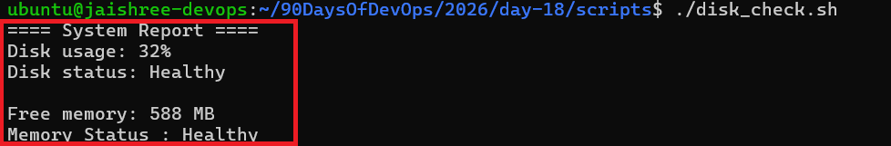
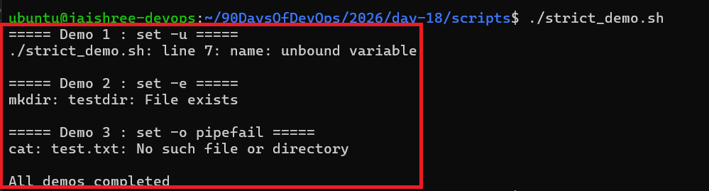
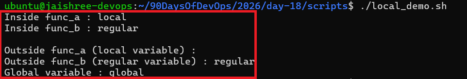
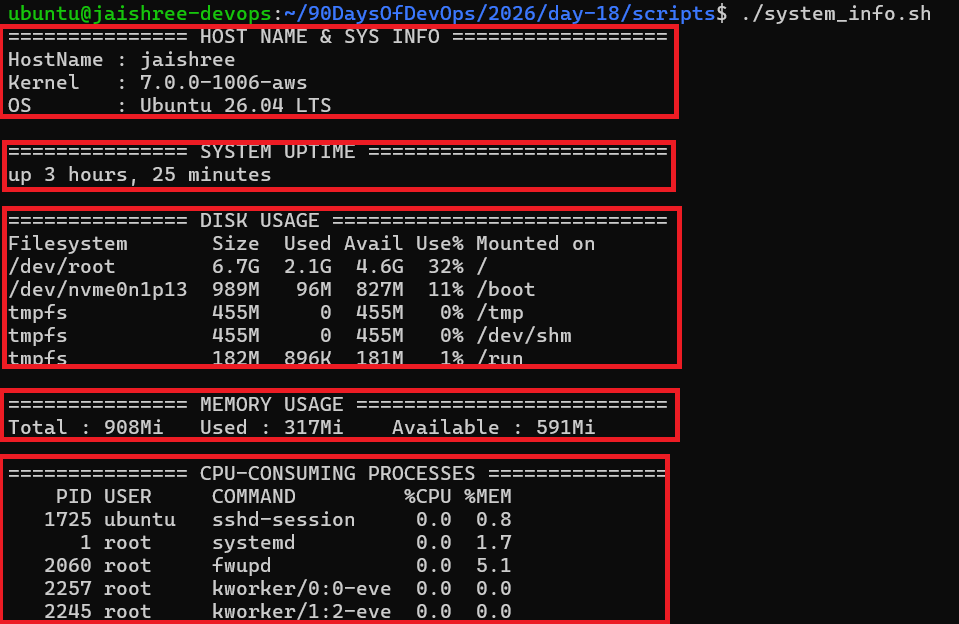

# Day 18 – Shell Scripting: Functions & Slightly Advanced Concepts

---

## Task 1: Basic Functions

1. Create `functions.sh` with:

   - A function `greet` that takes a name as argument and prints `Hello, <name>!`
   - A function `add` that takes two numbers and prints their sum
   - Call both functions from the script
     
[Here is the script functions.sh](scripts/functions.sh)

---

## Task 2: Functions with Return Values

1. Create `disk_check.sh` with:

   - A function `check_disk` that checks disk usage of `/`
   - A function `check_memory` that checks available memory
   - A main section that calls both functions and prints the results

[Here is the script disk_check.sh](scripts/disk_check.sh)

---

## Task 3: Strict Mode — `set -euo pipefail`

1. Create `strict_demo.sh` with `set -euo pipefail` at the top

2. Demonstrate:

   - Undefined variable using `set -u`
   - Failed command using `set -e`
   - Failed pipeline using `set -o pipefail`

### What does each flag do?

- `set -e` → Exit immediately if a command fails.
- `set -u` → Exit if an undefined variable is used.
- `set -o pipefail` → Makes a pipeline fail if any command in the pipeline fails.

[Here is the script strict_demo.sh](scripts/strict_demo.sh)

---

## Task 4: Local Variables

1. Create `local_demo.sh` with:

   - A function that uses the `local` keyword for variables
   - Show that local variables do not leak outside the function
   - Compare local variables with regular variables

[Here is the script local_demo.sh](scripts/local_demo.sh)

---

## Task 5: Build a Script — System Info Reporter

Create `system_info.sh` that uses functions for everything:

1. A function to print hostname and OS information

2. A function to print system uptime

3. A function to print disk usage

4. A function to print memory usage

5. A function to print top CPU-consuming processes

6. A main function that calls all the above functions

7. Use `set -euo pipefail` at the top

[Here is the script system_info.sh](scripts/system_info.sh)

---

## What I Learned

### Functions
Functions help organize scripts into reusable and maintainable blocks of code.

### Strict Mode
Using `set -euo pipefail` makes shell scripts more reliable by detecting errors early.

### Local Variables
The `local` keyword limits a variable's scope to a function and prevents variable leakage.

---

