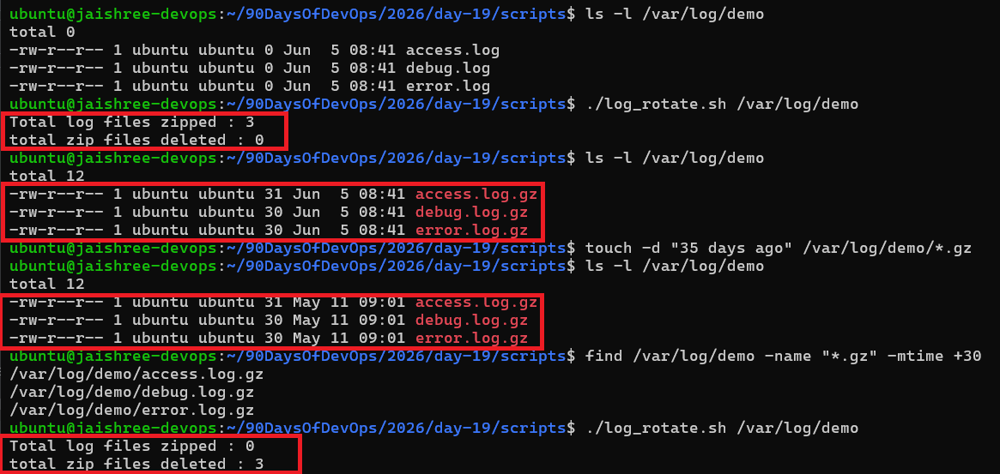
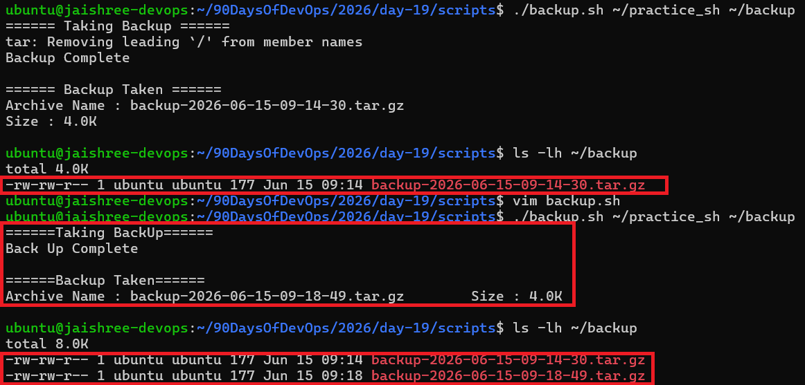
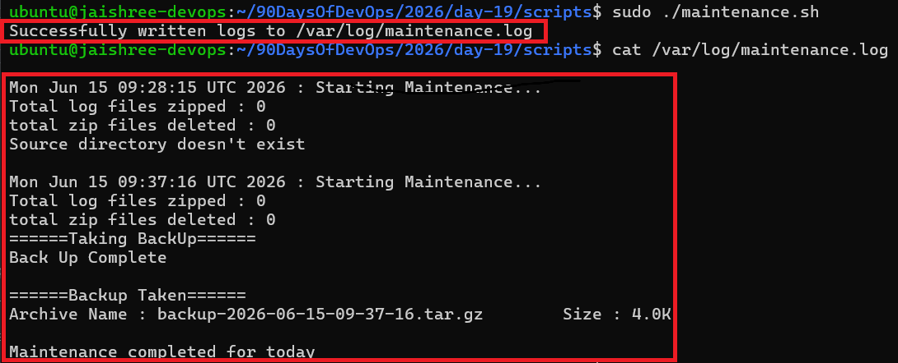

# Day 19 – Shell Scripting Project: Log Rotation, Backup & Crontab

## Task 1: Log Rotation Script

Create `log_rotate.sh` that:

1. Takes a log directory as an argument (e.g., `/var/log/myapp`)
2. Compresses `.log` files older than 7 days using `gzip`
3. Deletes `.gz` files older than 30 days
4. Prints how many files were compressed and deleted
5. Exits with an error if the directory doesn't exist

Here is the script [log_rotate.sh](./scripts/log_rotate.sh)



---

## Task 2: Server Backup Script

Create `backup.sh` that:

1. Takes a source directory and backup destination as arguments
2. Creates a timestamped `.tar.gz` archive (e.g., `backup-2026-06-15.tar.gz`)
3. Verifies the archive was created successfully
4. Prints archive name and size
5. Deletes backups older than 14 days from the destination
6. Handles errors — exit if source doesn't exist

Here is the script [backup.sh](./scripts/backup.sh)



---

## Task 3: Crontab

1. Read: `crontab -l` — what's currently scheduled?

2. Understand cron syntax:

```text
* * * * *  command
| | | | |
| | | | +---- Day of week (0-7)
| | | +------ Month (1-12)
| | +-------- Day of month (1-31)
| +---------- Hour (0-23)
+------------ Minute (0-59)
```

3. Cron entries for:

- Run `log_rotate.sh` every day at 2 AM

```bash
0 2 * * *
```

- Run `backup.sh` every Sunday at 3 AM

```bash
0 3 * * 0
```

- Run a health check script every 5 minutes

```bash
*/5 * * * *
```

---

## Task 4: Combine — Scheduled Maintenance Script

Create `maintenance.sh` that:

1. Calls your log rotation function
2. Calls your backup function
3. Logs all output to `/var/log/maintenance.log` with timestamps
4. Write the cron entry to run it daily at 1 AM:

```bash
0 1 * * *
```

Here is the script [maintenance.sh](./scripts/maintenance.sh)



---

## What I learned

- Learned how to automate log rotation using Shell Scripting.
- Used `find` with `-mtime` to identify old files.
- Compressed log files using `gzip`.
- Created timestamp-based backups using `tar`.
- Removed old backup archives automatically.
- Learned cron scheduling and cron syntax.
- Combined multiple scripts into a maintenance workflow.
- Logged script output to a maintenance log file.
- Improved Shell Scripting and Linux automation skills.
