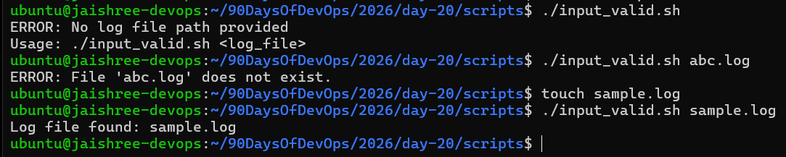
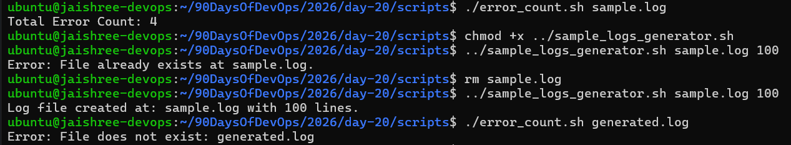
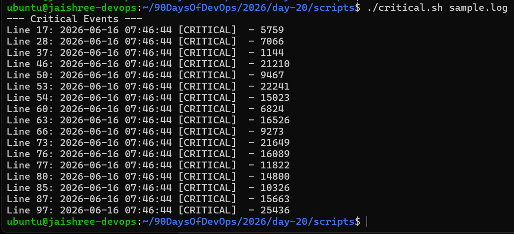
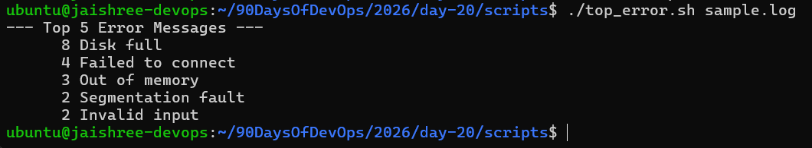
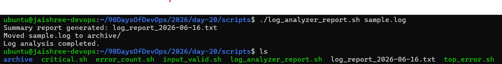
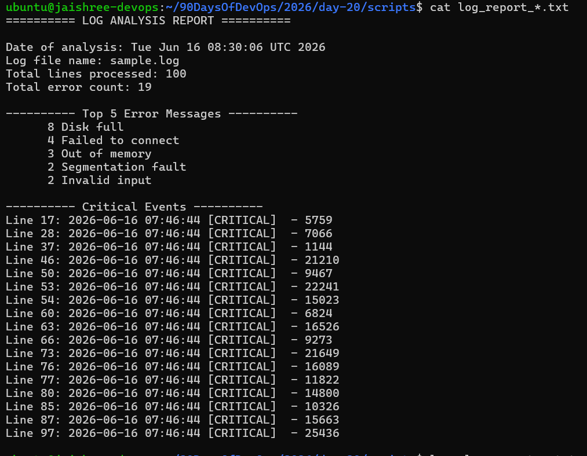

# Day 20 – Bash Scripting Challenge: Log Analyzer and Report Generator

## Challenge Tasks

### Task 1: Input and Validation

Your script should:

1. Accept the path to a log file as a command-line argument
2. Exit with a clear error message if no argument is provided
3. Exit with a clear error message if the file doesn't exist

[Here is the script input_valid.sh](scripts/input_valid.sh)

---

### Task 2: Error Count

1. Count the total number of lines containing the keyword `ERROR` or `Failed`
2. Print the total error count to the console

[Here is the script error_count.sh](scripts/error_count.sh)

---

### Task 3: Critical Events

1. Search for lines containing the keyword `CRITICAL`
2. Print those lines along with their line number

[Here is the script critical.sh](scripts/critical.sh)

---

### Task 4: Top Error Messages

1. Extract all lines containing `ERROR`
2. Identify the top 5 most common error messages
3. Display them with their occurrence count sorted in descending order

[Here is the script top_error.sh](scripts/top_error.sh)

---

### Task 5: Summary Report

Generate a summary report containing:

1. Date of analysis
2. Log file name
3. Total lines processed
4. Total error count
5. Top 5 error messages
6. Critical events with line numbers

[Here is the script log_analyzer_report.sh](scripts/log_analyzer_report.sh)

---

## What I Learned

- How to validate user input in Bash scripts.
- How to search and filter log files using `grep`.
- How to count occurrences using `wc`, `sort`, and `uniq`.
- How to extract and analyze log data using `awk`.
- How to generate structured reports automatically.
- How to archive processed log files for better organization.
- How to combine multiple Bash scripts into a complete log analysis workflow.

---

## Commands Used

- `grep` – Locate ERROR and CRITICAL events in log files.
- `awk` – Parse log entries and extract meaningful information.
- `sort` – Organize data for accurate counting and reporting.
- `uniq` – Identify and count repeated error messages.
- `wc` – Calculate total lines and event counts.
- `head` – Limit output to the top 5 error messages.
- `mkdir` – Create the archive directory when needed.
- `mv` – Archive processed log files after analysis.
- `date` – Record analysis time and generate report names.
