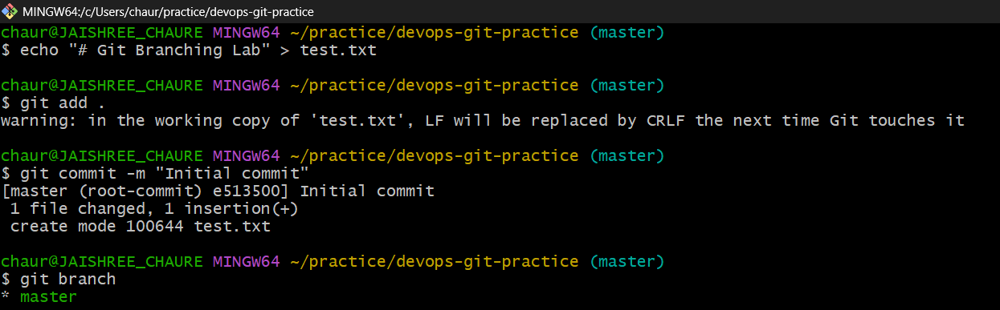
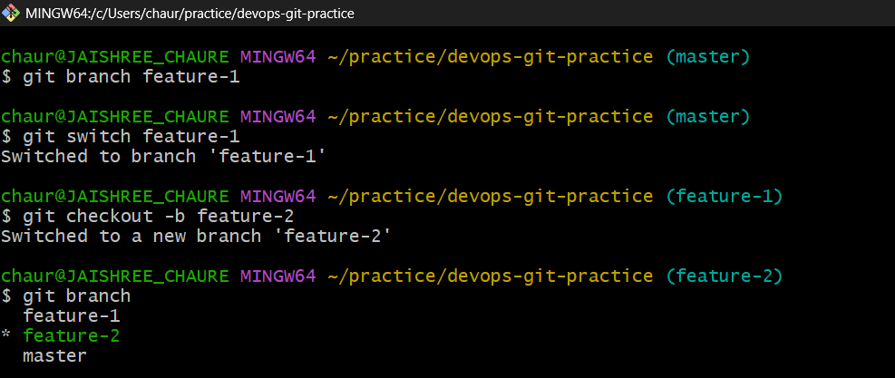
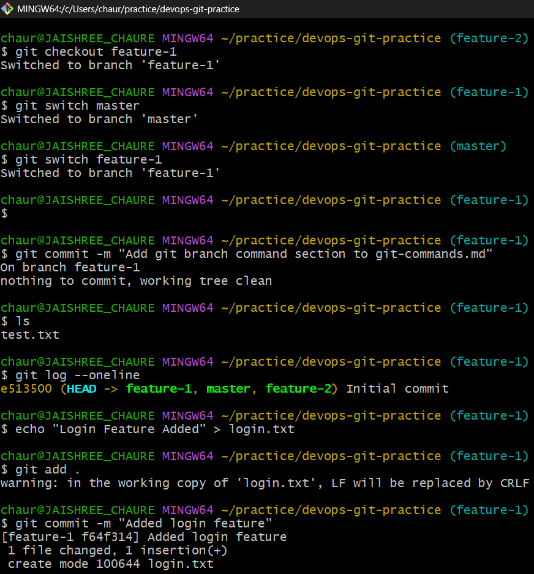
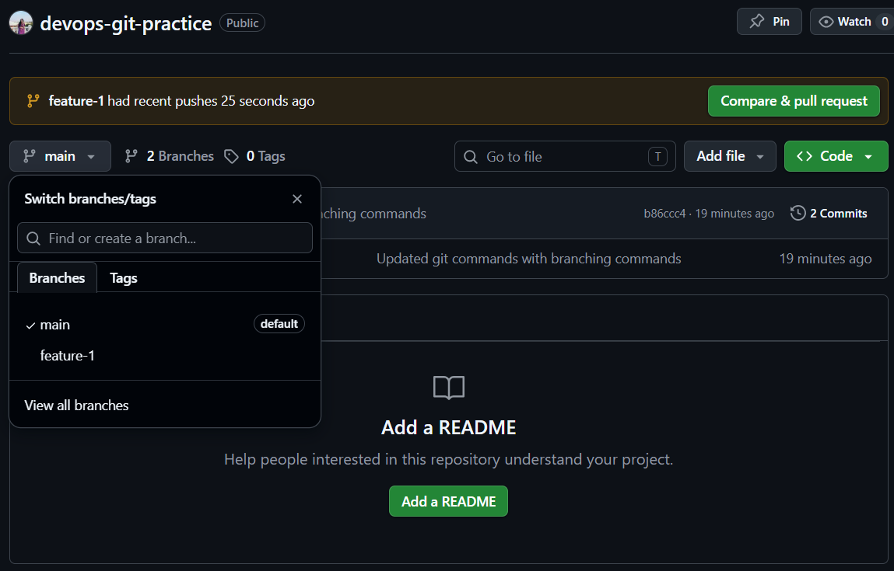
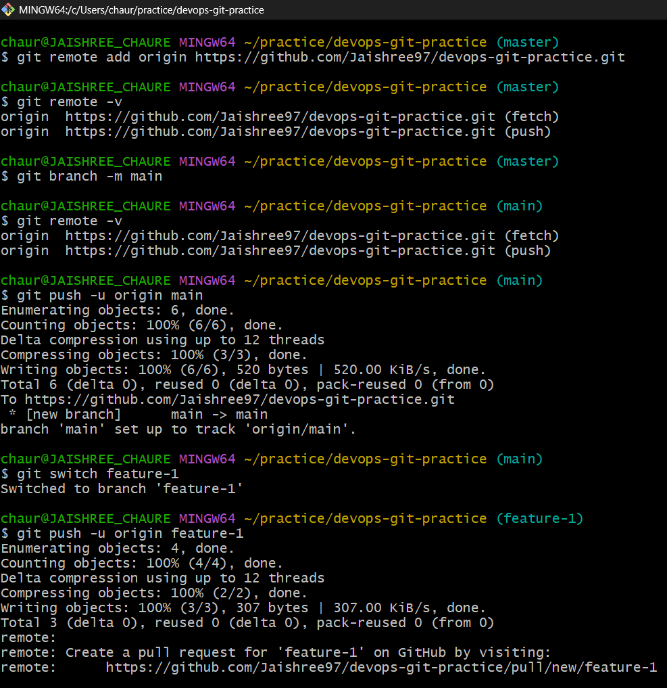

# Day 23 – Git Branching & Working with GitHub

## Task 1: Understanding Branches

### 1. What is a branch in Git?

- A branch is a separate workspace used to make changes without affecting the main project.
- A branch points to a commit in Git history.

### 2. Why do we use branches instead of committing everything to main?

- If we commit everything directly to main, it may break the project.
- We use branches to test and develop features safely before merging.

### 3. What is HEAD in Git?

- HEAD points to the latest commit in the current branch.

### 4. What happens to your files when you switch branches?

- Git updates your working directory to match the selected branch.
  - Untracked files remain unchanged.
  - Tracked files change according to the branch.
  - Uncommitted changes may block switching.

---

## Task 2: Branching Commands — Hands-On

1. List all branches in your repo

2. Create a new branch called `feature-1`

3. Switch to `feature-1`

4. Create a new branch and switch to it in a single command — call it `feature-2`

5. Try using `git switch` to move between branches — how is it different from `git checkout`?

6. Make a commit on `feature-1` that does not exist on `main`

7. Switch back to `main` — verify that the commit from `feature-1` is not there

8. Delete a branch you no longer need

9. Add all branching commands to your `git-commands.md`

---

## Task 3: Push to GitHub

1. Create a new repository on GitHub (do NOT initialize it with a README)

2. Connect your local `devops-git-practice` repo to the GitHub remote

3. Push your `main` branch to GitHub

4. Push `feature-1` branch to GitHub

5. Verify both branches are visible on GitHub

6. Answer in your notes: What is the difference between `origin` and `upstream`?

- `Origin` - Points to your remote repository.

- `Upstream` - Points to the repository you forked from.

  - If not forked then no need of upstream.

---

## Task 4: Pull from GitHub

1. Make a change to a file directly on GitHub (use the GitHub editor)

2. Pull that change to your local repo

3. Answer in your notes: What is the difference between `git fetch` and `git pull`?

- `fetch` - Only downloads changes from the remote. It does not merge them into your local branch.

- `pull` - Downloads the changes and merges them into your local branch.

---

## Task 5: Clone vs Fork

1. Clone any public repository from GitHub to your local machine

2. Fork the same repository on GitHub, then clone your fork

3. Answer in your notes:

### What is the difference between clone and fork?

- `Clone` - Clone means copying repository to your local computer. It is connected with remote.

- `Fork` - Copying someone else's repository into your own GitHub account.

### When would you clone vs fork?

- I will fork a repository from publicly available repos into my GitHub account and use it.

- I will clone if I want a local copy of a repository. I can work on it freely.

### After forking, how do you keep your fork in sync with the original repo?

- There is an option available on GitHub, **Sync Fork**.
- You can update a fork using that option.
