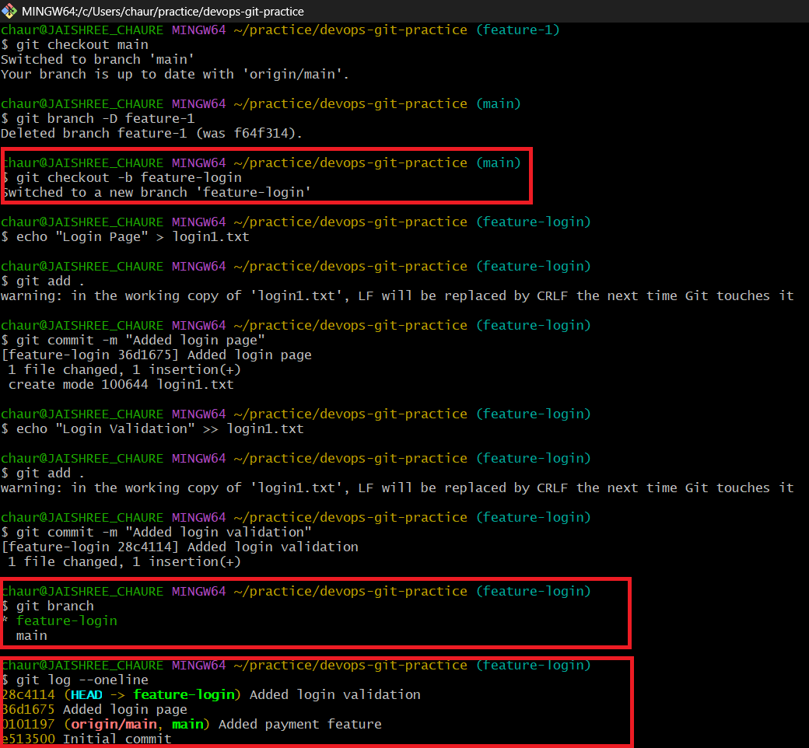
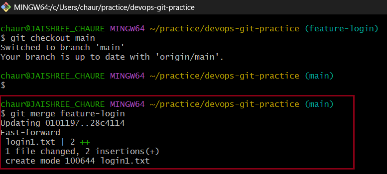
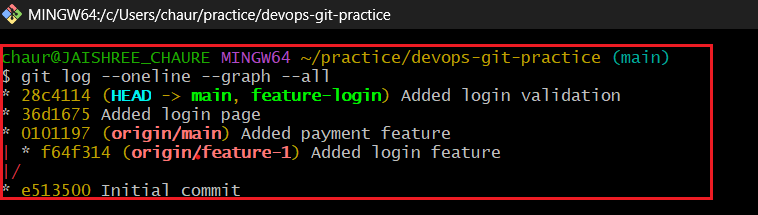
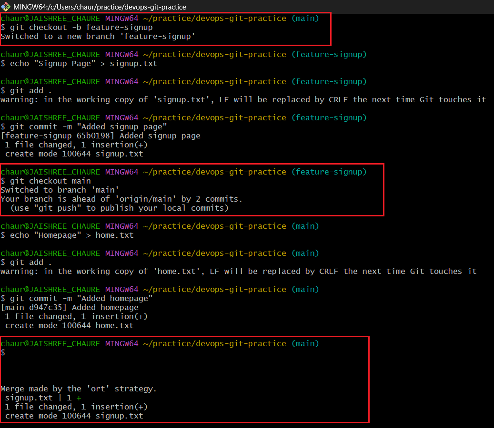
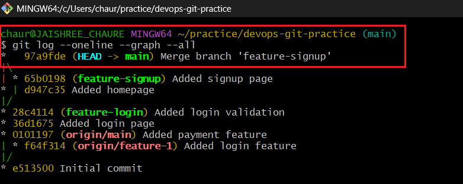
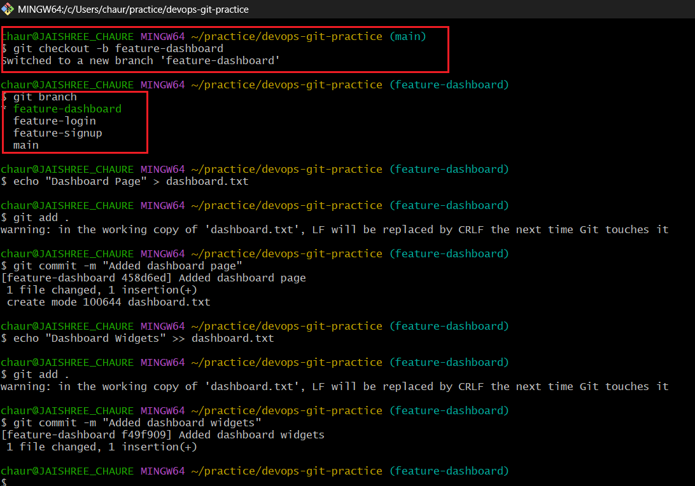
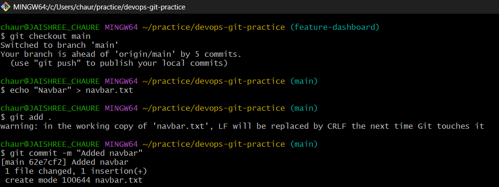
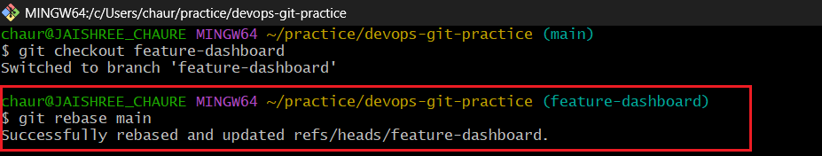
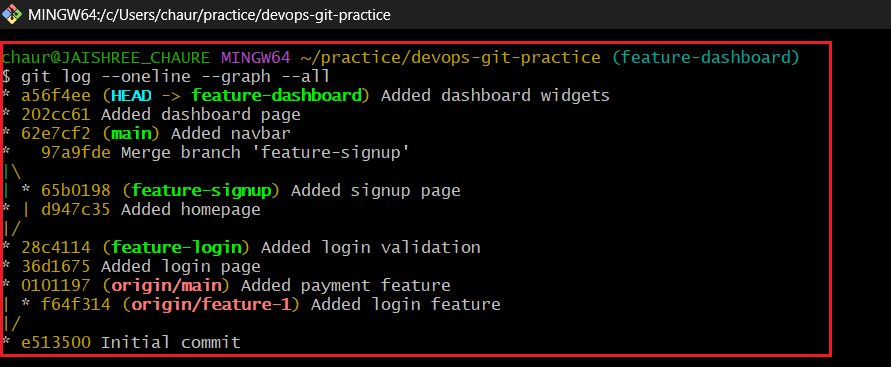

## Task 1: Git Merge — Hands-On

### 1. Create a new branch `feature-login` from `main` and add a couple of commits

### 2. Switch back to `main` and merge `feature-login` into `main`

### 3. Observe the merge

- Git performed a **fast-forward merge**.
- No merge commit was created because `main` had no new commits.

### 4. Create another branch `feature-signup`, add commits, and add a commit to `main`

### 5. Merge `feature-signup` into `main`

- Git created a **merge commit** because both branches had different commits.

### 6. Answer in your notes

#### What is a fast-forward merge?

A fast-forward merge happens when the target branch has no new commits. Git simply moves the branch pointer forward without creating a merge commit.

#### When does Git create a merge commit?

Git creates a merge commit when both branches contain different commits and their histories have diverged.

#### What is a merge conflict?

A merge conflict occurs when the same file is modified differently in multiple branches and Git cannot automatically decide which version to keep.

## Task 2: Git Rebase — Hands-On

### 1. Create a branch `feature-dashboard` from `main` and add 2 commits

- Created a new branch named `feature-dashboard`.
- Added a dashboard page.
- Added dashboard widgets in a second commit.

### 2. While on `main`, add a new commit

- Switched back to the `main` branch.
- Added a new file representing a navigation bar.
- Committed the changes to move `main` ahead of the feature branch.

### 3. Switch to `feature-dashboard` and rebase it onto `main`

- Switched back to the `feature-dashboard` branch.
- Rebasing replayed the feature branch commits on top of the latest commit from `main`.
- The rebase completed successfully.

### 4. Observe the history after rebase

- The feature branch commits now appear after the latest commit from `main`.
- The commit history is linear and easier to follow.
- No merge commit was created during the rebase process.

### 5. Answer in your notes

#### What does rebase actually do to your commits?

- Rebase takes the commits from a feature branch and reapplies them on top of another branch.
- It creates a cleaner and more linear commit history.
- New commit IDs are generated during the rebase process.

#### How is the history different from a merge?

- **Merge** combines branches and creates a merge commit.
- **Rebase** moves feature branch commits on top of the target branch.
- Rebase keeps the history linear and easier to read.

#### Why should you never rebase commits that have been pushed and shared with others?

- Rebase rewrites commit history by creating new commit IDs.
- Team members working on the same branch may face conflicts and synchronization issues.
- For shared branches, merge is usually the safer option.

#### When would you use rebase vs merge?

- **Rebase:** When you want a clean and linear project history before merging.
- **Merge:** When you want to preserve the complete history of branch integration.
