# Day 24 – Advanced Git: Merge, Rebase, Stash & Cherry Pick

## Overview

In this hands-on lab, I explored advanced Git workflows including merge strategies, rebasing branches, stash management, squash merging, and cherry-picking commits. These operations are commonly used in collaborative software development to manage code changes and maintain a clean commit history.

---

## Task 1: Git Merge — Hands-On

### 1. Create a new branch `feature-login` from `main` and add a couple of commits

- Created the `feature-login` branch from `main`.
- Added login page functionality and login validation changes through multiple commits.

### 2. Switch back to `main` and merge `feature-login` into `main`

- Merged the `feature-login` branch into `main`.

### 3. Observe the merge

- Git performed a **fast-forward merge**.
- No merge commit was created because `main` had not diverged from `feature-login`.

### 4. Create another branch `feature-signup`, add commits, and add a commit to `main`

- Created the `feature-signup` branch and added signup-related changes.
- Added an additional commit directly to `main`.

### 5. Merge `feature-signup` into `main`

- Git created a **merge commit** because both branches contained unique commits.

### 6. Key Learnings

- **What is a fast-forward merge?**

  - Occurs when the target branch has no new commits.
  - Git moves the branch pointer forward to the latest commit.
  - No merge commit is created.

- **When does Git create a merge commit?**

  - When both branches contain unique commits.
  - When branch histories have diverged.
  - Git creates a new commit to combine both histories.

- **What is a merge conflict?**

  - Occurs when the same part of a file is modified in different branches.
  - Git cannot automatically determine which change to keep.
  - Manual conflict resolution is required before completing the merge.

---

## Task 2: Git Rebase — Hands-On

### 1. Create a branch `feature-dashboard` from `main` and add 2 commits

- Created the `feature-dashboard` branch.
- Added dashboard functionality through two separate commits.

### 2. While on `main`, add a new commit

- Added a new commit on `main`, causing it to move ahead of the feature branch.

### 3. Switch to `feature-dashboard` and rebase it onto `main`

- Rebasing replayed the feature branch commits on top of the latest commit from `main`.
- The branch was successfully updated with the latest changes.

### 4. Observe the history after rebase

- The feature branch commits now appear after the latest commit on `main`.
- The commit history is linear and easier to understand.
- No merge commit was created.

### 5. Key Learnings

- **What does rebase actually do to your commits?**

  - Reapplies commits from one branch on top of another branch.
  - Creates a cleaner and more linear commit history.
  - Generates new commit IDs during the rebase process.

- **How is the history different from a merge?**

  - **Merge:**
    - Preserves complete branch history.
    - Creates a merge commit.

  - **Rebase:**
    - Rewrites commit history.
    - Places feature branch commits on top of the target branch.
    - Produces a linear history without a merge commit.

- **Why should you never rebase commits that have been pushed and shared with others?**

  - Rebase changes commit IDs and rewrites history.
  - Other collaborators may already have the original commits.
  - This can lead to synchronization issues and merge conflicts.

- **When would you use rebase vs merge?**

  - **Rebase:**
    - When you want a clean and linear commit history.
    - Before merging a feature branch into the main branch.

  - **Merge:**
    - When you want to preserve complete branch history.
    - When working on shared branches with a team.

---

## Task 3: Squash Commit vs Merge Commit

### 1. Create a branch `feature-profile` and add multiple commits

- Added profile feature changes through multiple commits.

### 2. Merge `feature-profile` into `main` using `--squash`

- Combined all feature branch commits into a single commit before merging.

### 3. Check the commit history

- Only one commit was added to `main`, representing the entire profile feature.

### 4. Create another branch `feature-settings` and add commits

- Added settings feature changes through multiple commits.

### 5. Merge `feature-settings` into `main` without `--squash`

- Performed a regular merge while preserving the branch commit history.

### 6. Compare the history

- Squash merge added a single commit to `main`.
- Regular merge preserved all feature branch commits.
- Squash merge provides a cleaner history, while regular merge preserves detailed commit records.

### 7. Key Learnings

- **What does squash merging do?**

  - Combines multiple commits from a feature branch into a single commit.
  - Creates a cleaner and more concise commit history.
  - Does not preserve individual commit details.

- **When would you use squash merge vs regular merge?**

  - **Squash Merge:**
    - When a feature branch contains many small or intermediate commits.
    - When you want a clean and easy-to-read `main` branch history.

  - **Regular Merge:**
    - When you want to preserve the complete commit history.
    - When individual commits are important for tracking development changes.

- **What is the trade-off of squashing?**

  - Keeps the project history clean and linear.
  - Reduces clutter from multiple small commits.
  - Removes the detailed history of individual feature branch commits.

  ---

## Task 4: Git Stash — Hands-On

### 1. Start making changes to a file without committing

- Made temporary changes and checked the working directory status.

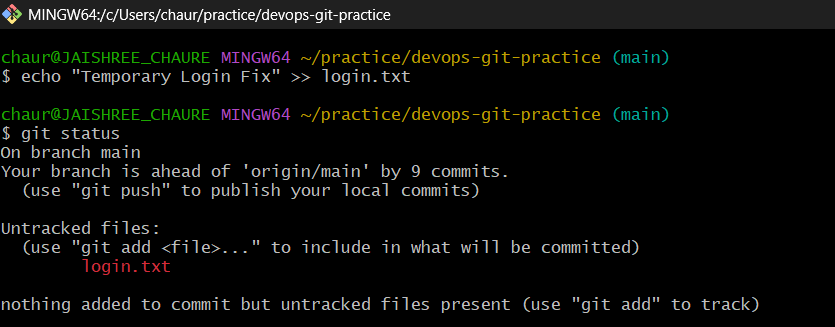

### 2. Save work-in-progress using Git Stash

- Stashed uncommitted changes using Git Stash.
- Verified the stash entry using the stash list.

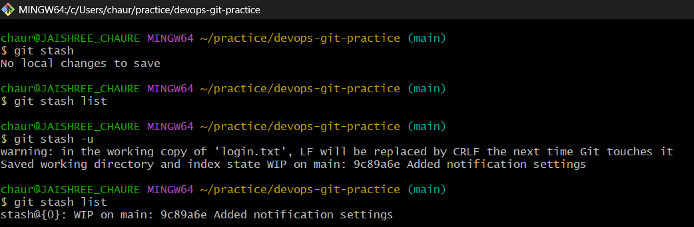

### 3. Create another stash and list all stashes

- Created an additional stash with a custom message.
- Listed all available stash entries.

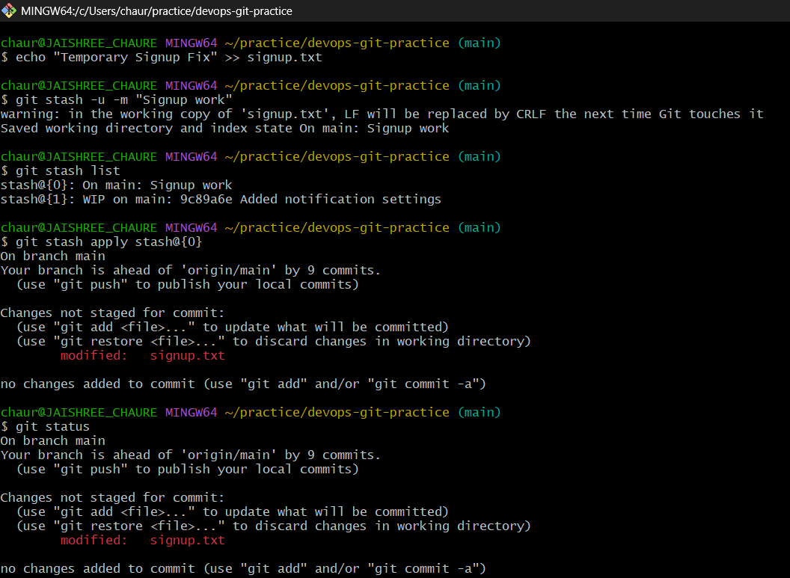

### 4. Apply a specific stash

- Applied a selected stash from the stash list.
- Verified that the changes were restored successfully.

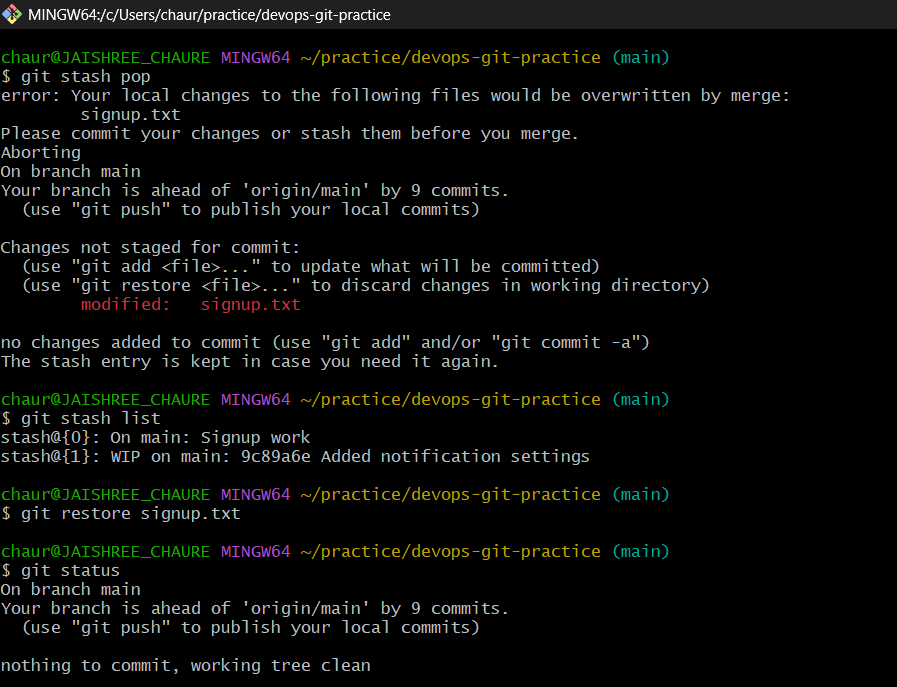

### 5. Restore stashed changes using `git stash pop`

- Restored stashed changes and removed the stash entry.
- Confirmed the updated stash list and working directory status.

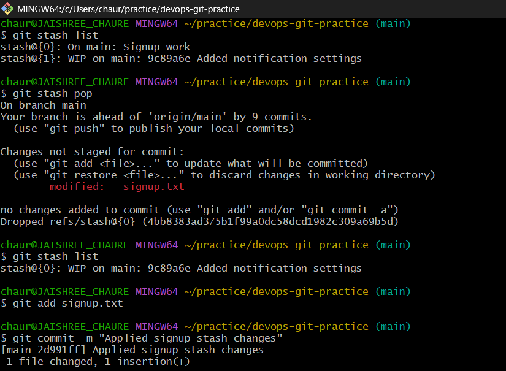

### 6. Key Learnings

- **What is the difference between `git stash pop` and `git stash apply`?**

  - **git stash apply**
    - Restores stashed changes.
    - Keeps the stash entry for future use.

  - **git stash pop**
    - Restores stashed changes.
    - Removes the stash entry after a successful restore.

- **When would you use stash in a real-world workflow?**

  - When switching branches with unfinished work.
  - When handling urgent bug fixes.
  - When temporarily saving experimental changes.
  - When pulling or merging updates without losing work in progress.

  ---

  ## Task 5: Cherry Picking — Hands-On

### 1. Create a branch `feature-hotfix` and add multiple commits

- Created the `feature-hotfix` branch.
- Added three separate hotfix commits to simulate incremental changes.

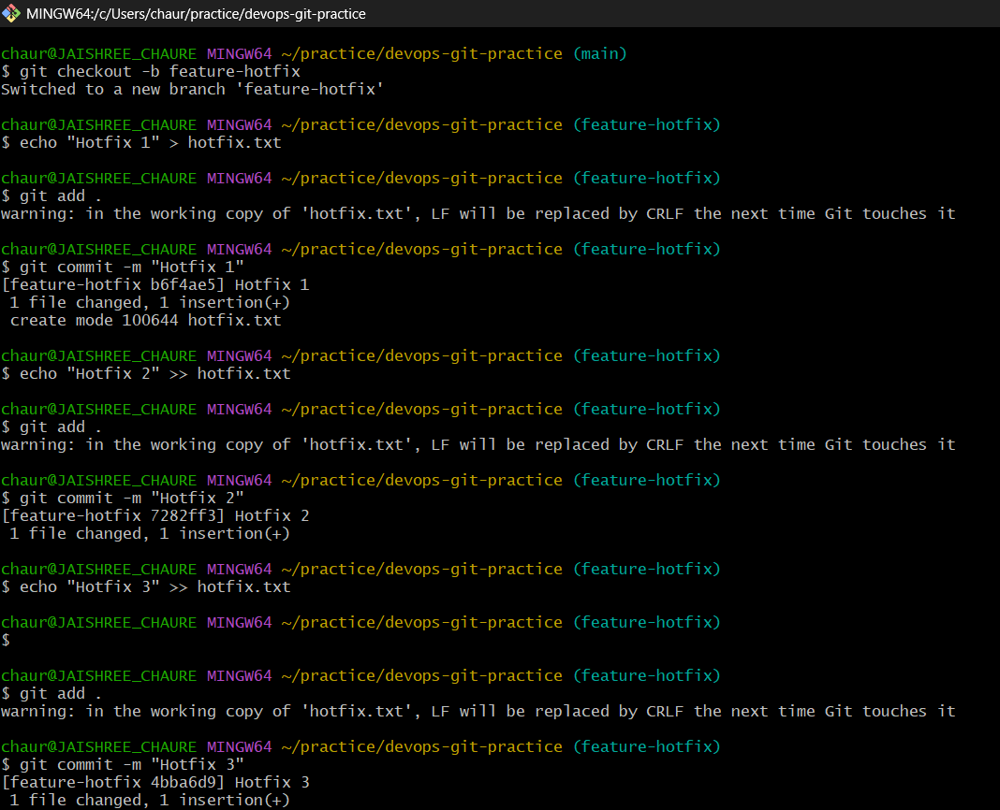

### 2. Review commit history and switch back to `main`

- Verified the commit history to identify the commit to be cherry-picked.
- Switched back to the `main` branch.

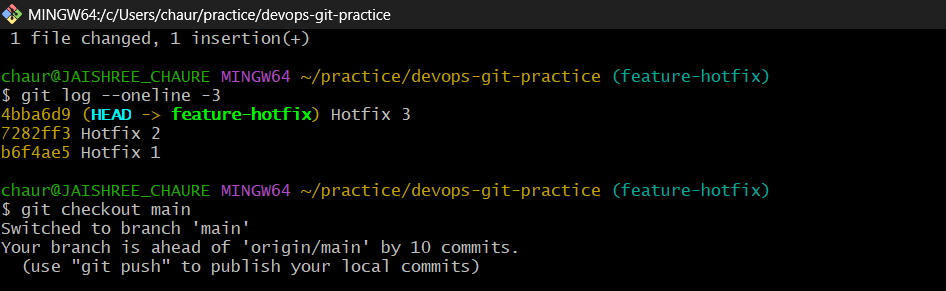

### 3. Cherry-pick a specific commit onto `main`

- Cherry-picked only the second hotfix commit from `feature-hotfix`.
- A conflict occurred because the target file did not exist on `main`.

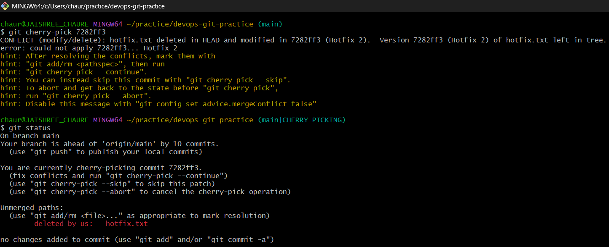

### 4. Resolve the conflict and continue cherry-picking

- Resolved the conflict by staging the affected file.
- Continued the cherry-pick process and completed the operation successfully.

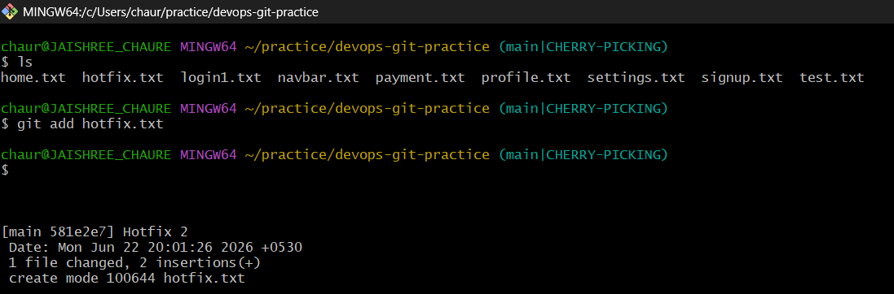

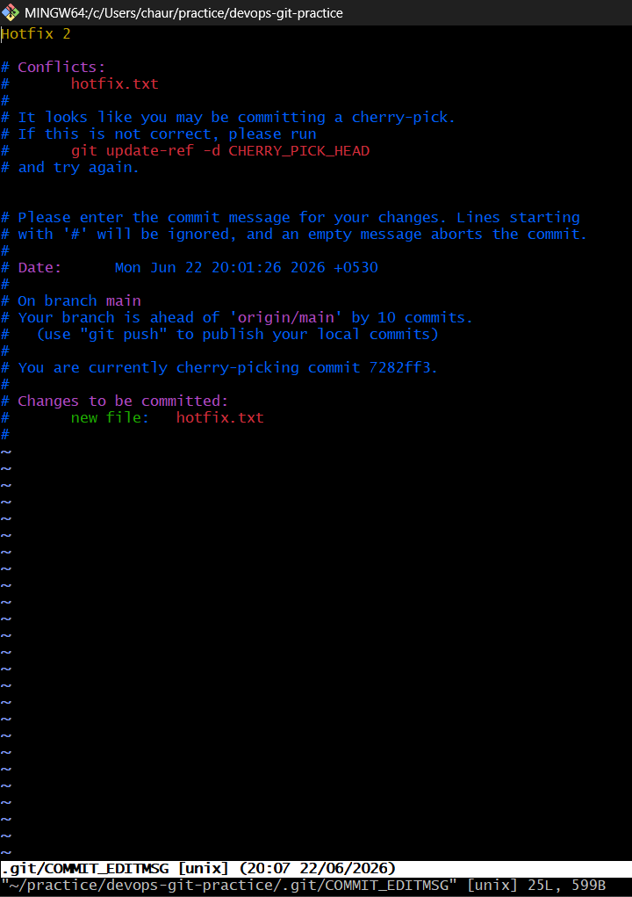

### 5. Verify the commit history

- Confirmed that only the selected commit was applied to `main`.
- Other commits from `feature-hotfix` remained on the feature branch.

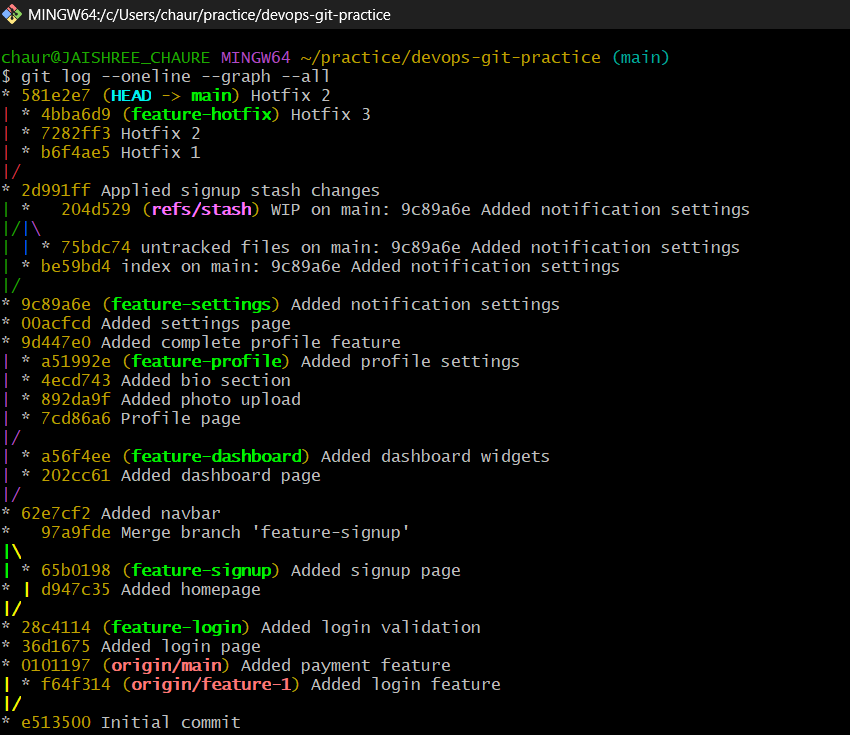

### 6. Key Learnings

- **What does cherry-pick do?**

  - Applies a specific commit from one branch onto another branch.
  - Copies only the selected commit instead of merging the entire branch.
  - Creates a new commit on the target branch with the same changes.

- **When would you use cherry-pick in a real project?**

  - To move a bug fix from a feature branch to production.
  - To apply a specific change without merging unrelated work.
  - To backport important fixes to older release branches.

- **What can go wrong with cherry-picking?**

  - Conflicts may occur if the required files or code differ between branches.
  - Dependencies from earlier commits may be missing.
  - Excessive cherry-picking can create duplicate or difficult-to-track history.
 
---

## Summary

In this lab, I practiced:

- Fast-forward and merge commits
- Branch rebasing and history rewriting
- Squash merge vs regular merge
- Stashing and restoring work-in-progress changes
- Cherry-picking specific commits across branches
- Resolving merge and cherry-pick conflicts

These concepts are essential for maintaining clean Git history and collaborating effectively in real-world DevOps and software development projects.
