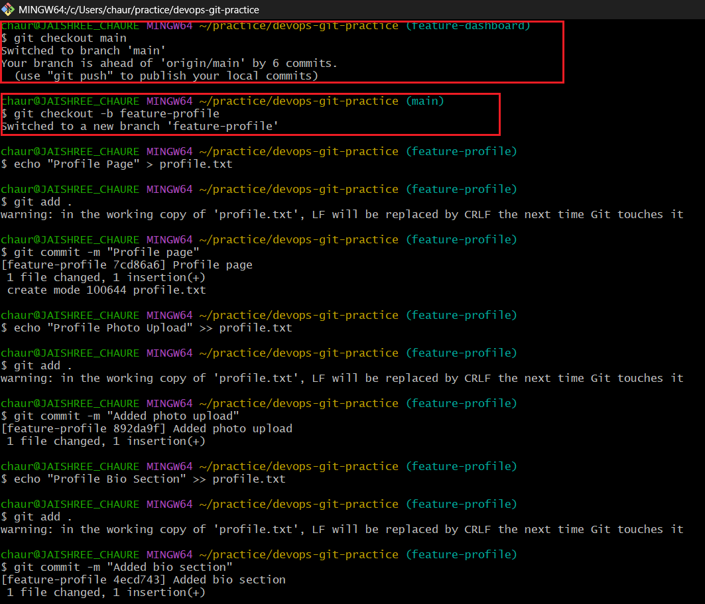
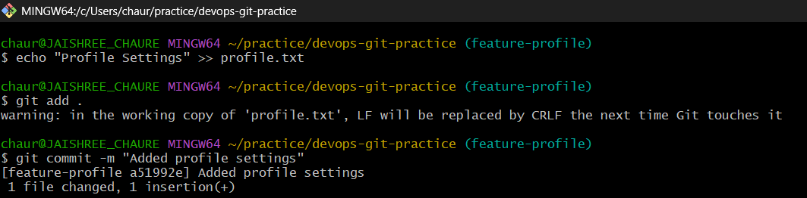
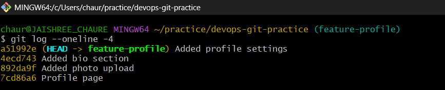
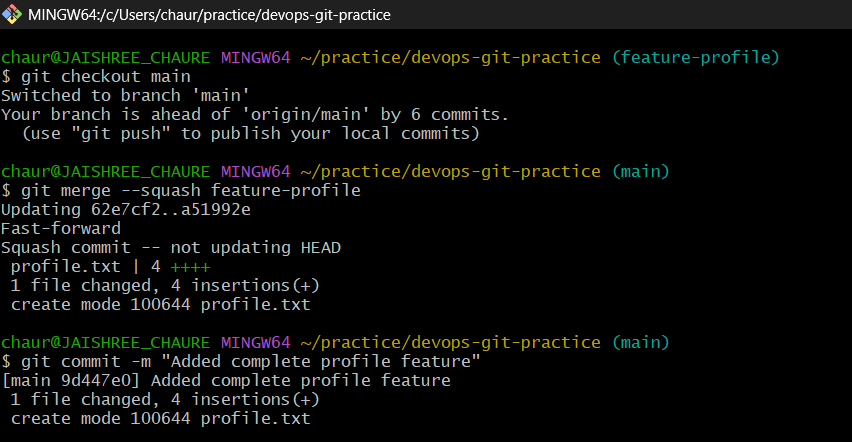
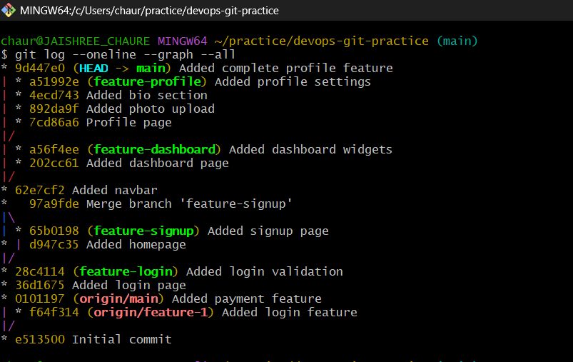
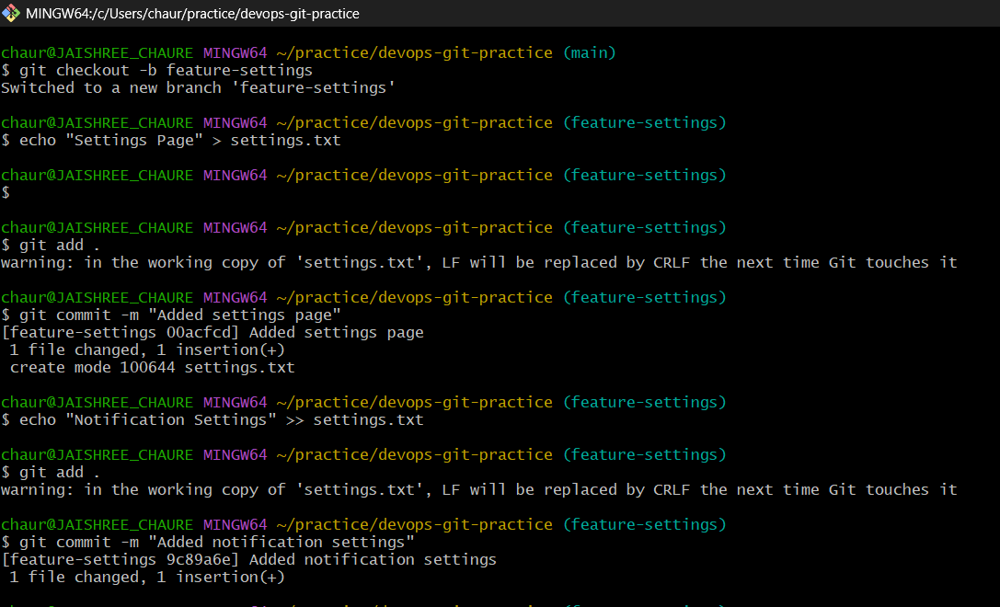
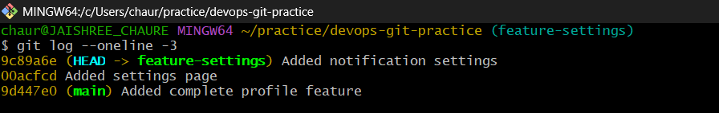
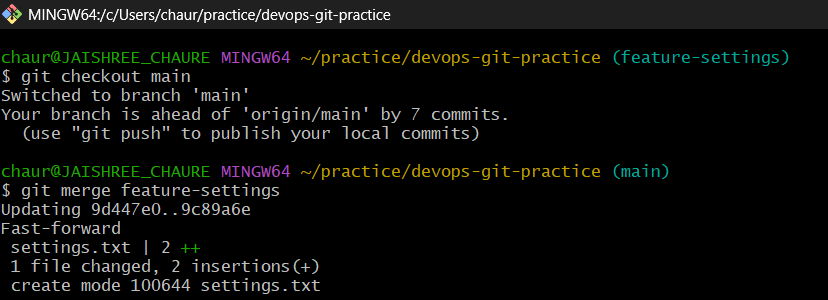
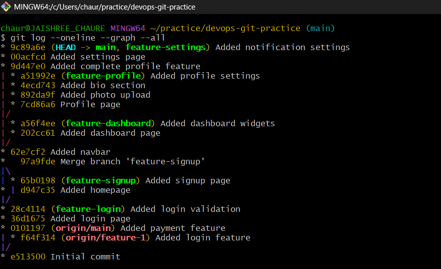

# Day 24 – Advanced Git: Merge, Rebase & Squash Merge

This lab covers Git merge strategies, rebasing branches, and squash merging to understand how Git manages commit history and branch integration.

---

## Task 1: Git Merge — Hands-On

### 1. Create a new branch `feature-login` from `main` and add a couple of commits

- Created the `feature-login` branch from `main`.
- Added login page functionality and login validation changes through multiple commits.

### 2. Switch back to `main` and merge `feature-login` into `main`

- Merged the `feature-login` branch into `main`.

### 3. Observe the merge

- Git performed a **fast-forward merge**.
- No merge commit was created because `main` had not diverged from `feature-login`.

### 4. Create another branch `feature-signup`, add commits, and add a commit to `main`

- Created the `feature-signup` branch and added signup-related changes.
- Added an additional commit directly to `main`.

### 5. Merge `feature-signup` into `main`

- Git created a **merge commit** because both branches contained unique commits.

### 6. Key Learnings

#### What is a fast-forward merge?

A fast-forward merge occurs when the target branch has no new commits. Git simply moves the branch pointer forward without creating a merge commit.

#### When does Git create a merge commit?

Git creates a merge commit when the histories of two branches have diverged and both contain unique commits.

#### What is a merge conflict?

A merge conflict occurs when changes made in different branches affect the same section of a file, preventing Git from automatically merging them.

---

## Task 2: Git Rebase — Hands-On

### 1. Create a branch `feature-dashboard` from `main` and add 2 commits

- Created the `feature-dashboard` branch.
- Added dashboard functionality through two separate commits.

### 2. While on `main`, add a new commit

- Added a new commit on `main`, causing it to move ahead of the feature branch.

### 3. Switch to `feature-dashboard` and rebase it onto `main`

- Rebasing replayed the feature branch commits on top of the latest commit from `main`.
- The branch was successfully updated with the latest changes.

### 4. Observe the history after rebase

- The feature branch commits now appear after the latest commit on `main`.
- The commit history is linear and easier to understand.
- No merge commit was created.

### 5. Key Learnings

#### What does rebase actually do to your commits?

- Rebase takes commits from one branch and reapplies them on top of another branch.
- It creates a cleaner and more linear commit history.
- New commit IDs are generated during the process.

#### How is the history different from a merge?

- **Merge** preserves branch history and creates a merge commit.
- **Rebase** rewrites commit history by placing feature branch commits on top of the target branch.
- Rebase produces a cleaner, linear history.

#### Why should you never rebase commits that have been pushed and shared with others?

- Rebase changes commit IDs and rewrites history.
- This can create synchronization issues for collaborators who already pulled the original commits.

#### When would you use rebase vs merge?

- **Rebase:** To maintain a clean and linear project history.
- **Merge:** To preserve the complete history of branch integration and collaboration.

---

## Task 3: Squash Commit vs Merge Commit

### 1. Create a branch `feature-profile` and add multiple commits

- Added profile feature changes through multiple commits.

### 2. Merge `feature-profile` into `main` using `--squash`

- Combined all feature branch commits into a single commit before merging.

### 3. Check the commit history

- Only one commit was added to `main`, representing the entire profile feature.

### 4. Create another branch `feature-settings` and add commits

- Added settings feature changes through multiple commits.

### 5. Merge `feature-settings` into `main` without `--squash`

- Performed a regular merge while preserving the branch commit history.

### 6. Compare the history

- Squash merge added a single commit to `main`.
- Regular merge preserved all feature branch commits.
- Squash merge provides a cleaner history, while regular merge preserves detailed commit records.

### 7. Key Learnings

#### What does squash merging do?

- Squash merging combines multiple commits from a feature branch into a single commit before merging.
- It helps maintain a clean and concise commit history.

#### When would you use squash merge vs regular merge?

- **Squash Merge:** When a feature branch contains many small or intermediate commits.
- **Regular Merge:** When you want to preserve the complete development history.

#### What is the trade-off of squashing?

- Squashing creates a cleaner commit history.
- However, the history of individual commits is lost after the merge.
