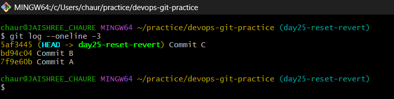
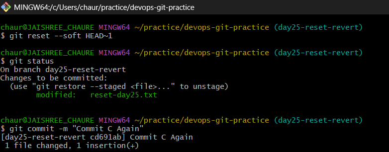
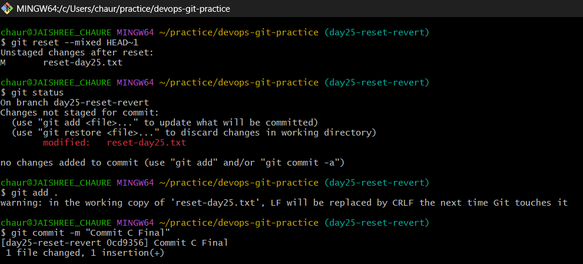
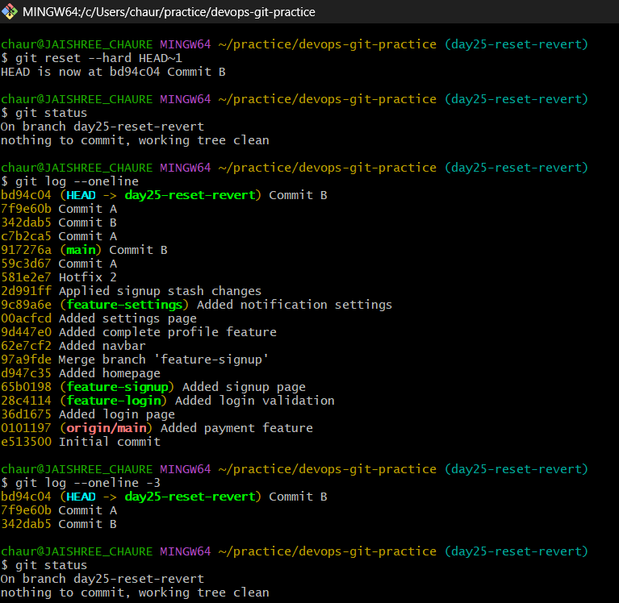
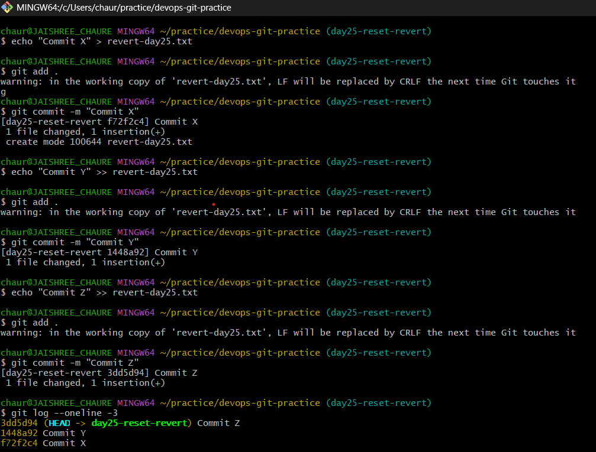
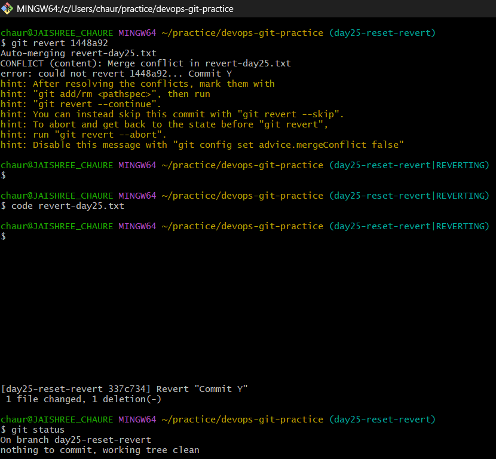
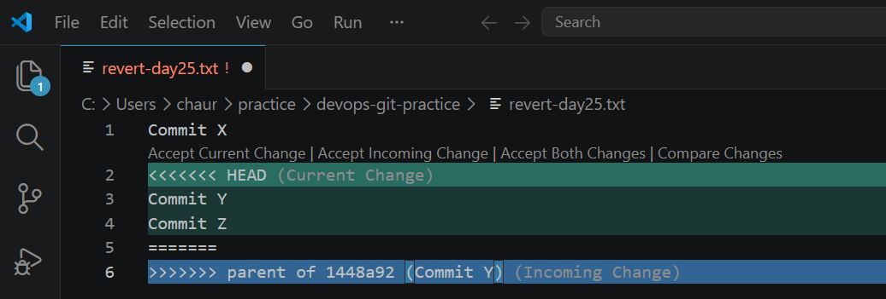
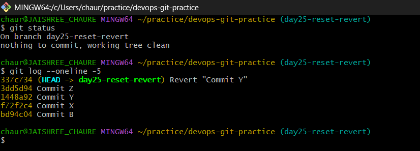

# Day 25 – Git Reset vs Revert & Branching Strategies

## Task 1: Git Reset — Hands-On

### 1. Create 3 commits in your practice repository (Commit A, B, C)

- Created three commits in the repository to understand how Git Reset affects commit history and file changes.



### 2. Use `git reset --soft` to go back one commit — what happens to the changes?

- Commit C was removed from the commit history.
- The changes from Commit C were preserved.
- The changes remained in the staging area and were ready to be committed again.



### 3. Re-commit, then use `git reset --mixed` to go back one commit — what happens now?

- Commit C was removed from the commit history.
- The changes were preserved in the working directory.
- The changes became unstaged and required staging before committing again.



### 4. Re-commit, then use `git reset --hard` to go back one commit — what happens this time?

- Commit C was removed from the commit history.
- All changes associated with Commit C were discarded.
- The repository returned to the previous commit state.
- The working tree became clean.



### Key Takeaways

#### What is the difference between `--soft`, `--mixed`, and `--hard`?

| Reset Mode | Commit Removed | Changes Kept | Staged |
|------------|----------------|-------------|---------|
| `--soft` | Yes | Yes | Yes |
| `--mixed` | Yes | Yes | No |
| `--hard` | Yes | No | No |

#### Which one is destructive and why?

- `git reset --hard` is destructive because it permanently removes both the commit and its associated changes.

#### When would you use each one?

- **Soft Reset** → When you want to undo a commit but keep changes staged.
- **Mixed Reset** → When you want to undo a commit and review changes before recommitting.
- **Hard Reset** → When you want to completely discard unwanted changes.

#### Should you ever use Git Reset on commits that are already pushed?

- Generally, no.
- `git reset` rewrites commit history and may cause issues for collaborators who have already pulled those commits.
- For shared branches, `git revert` is usually the safer choice.

---

## Task 2: Git Revert — Hands-On

### 1. Create 3 commits in the practice repository (Commit X, Y, Z)

- Created three sequential commits to understand how Git Revert works on existing commit history.
- Verified the commit order as Commit X → Commit Y → Commit Z.



### 2. Revert Commit Y (the middle commit)

- Attempted to revert Commit Y while Commit Z existed on top of it.
- Git detected a merge conflict because the changes from Commit Y were also referenced by later commits.
- Resolved the conflict manually and completed the revert operation.





### 3. Check the commit history

- Git created a new commit named **Revert "Commit Y"**.
- The original Commit Y was not removed from history.
- Revert preserved the commit history while undoing the changes introduced by Commit Y.



### Key Takeaways

#### How is `git revert` different from `git reset`?

| Git Revert | Git Reset |
|------------|-----------|
| Creates a new commit that undoes previous changes | Moves the branch pointer to an earlier commit |
| Preserves commit history | Can rewrite commit history |
| Safe for shared repositories | Better suited for local history cleanup |

#### Why is revert considered safer for shared branches?

- `git revert` does not remove or rewrite existing commits.
- Team members can continue working without history conflicts.
- It maintains a complete audit trail of changes.

#### When would you use revert vs reset?

- **Git Revert** → When undoing changes that are already pushed or shared with a team.
- **Git Reset** → When cleaning up local commits before sharing them with others.

---

## Task 3: Reset vs Revert — Summary

| Feature | `git reset` | `git revert` |
|----------|-------------|--------------|
| **What it does** | Moves the branch pointer to an earlier commit | Creates a new commit that reverses changes from a previous commit |
| **Removes commit from history?** | Yes | No |
| **Rewrites history?** | Yes | No |
| **Safe for shared/pushed branches?** | No | Yes |
| **Best use case** | Cleaning up local commits before pushing | Undoing changes that are already shared |

### Key Takeaways

- `git reset` modifies commit history and is best used on local branches.
- `git revert` preserves history and safely undoes changes through a new commit.
- For collaborative projects, `git revert` is the preferred approach.

---

## Task 4: Branching Strategies

### 1. GitFlow

#### How it works

- Uses separate branches for development, releases, and hotfixes.
- Features are developed in feature branches and merged into `develop`.
- Release branches are used to prepare production-ready versions before merging into `main`.

#### Workflow

```text
main
 └── develop
      ├── feature/login
      ├── feature/signup
      ├── release/v1.0
      └── hotfix/v1.0.1
```

#### When to Use

- Large development teams
- Enterprise applications
- Projects with planned release schedules

#### Pros

- Clear separation of development and production code
- Well-structured release management
- Easier maintenance of multiple versions

#### Cons

- More complex branching model
- Higher merge overhead
- Slower release process compared to modern workflows

---

### 2. GitHub Flow

#### How it works

- Developers create a feature branch from `main`.
- Changes are reviewed through Pull Requests.
- Approved changes are merged back into `main`.
- Production deployments happen frequently.

#### Workflow

```text
main
 ├── feature/login ──┐
 ├── feature/cart ───┤── Merge → main
 └── feature/ui ─────┘
```

#### When to Use

- Web applications
- Small to medium-sized teams
- Continuous Deployment environments

#### Pros

- Simple and easy to follow
- Faster reviews and releases
- Encourages collaboration through Pull Requests

#### Cons

- Less control over formal release management
- Can become difficult with large release cycles

---

### 3. Trunk-Based Development

#### How it works

- Developers integrate changes into a single main branch frequently.
- Feature branches are short-lived.
- Small and frequent commits reduce integration issues.

#### Workflow

```text
main (trunk)
 ├── bug fix
 ├── feature update
 ├── small improvement
 └── release
```

#### When to Use

- DevOps and Platform teams
- CI/CD-driven environments
- SaaS products with frequent deployments

#### Pros

- Fastest delivery cycle
- Fewer long-running branches
- Reduces merge conflicts
- Supports Continuous Integration

#### Cons

- Requires strong automated testing
- Risky without a mature CI/CD pipeline

---

### Comparison

| Strategy | Best For | Complexity | Release Speed |
|-----------|-----------|------------|---------------|
| GitFlow | Large teams & scheduled releases | High | Medium |
| GitHub Flow | Small/medium teams | Low | High |
| Trunk-Based Development | DevOps & CI/CD teams | Medium | Very High |

---

### Answers

#### Which strategy would you use for a startup shipping fast?

- **Trunk-Based Development**
- Supports rapid development and continuous integration.
- Enables frequent deployments with minimal overhead.

#### Which strategy would you use for a large team with scheduled releases?

- **GitFlow**
- Provides structured release management.
- Offers clear branch separation and better release control.

#### Which strategy does your favorite open-source project use?

- **GitHub Flow**
- Commonly used by modern open-source projects on GitHub.
- Contributors work on feature branches, submit Pull Requests, and merge approved changes into `main`.

---

### Key Takeaways

Different teams require different branching strategies. **GitFlow** is ideal for structured release management, **GitHub Flow** simplifies collaboration and deployment, and **Trunk-Based Development** enables rapid delivery through continuous integration. Selecting the right strategy depends on team size, release frequency, and deployment requirements.

---

## Task 5: Git Commands Reference

### Related Documentation

- [Git Commands Reference](git-commands.md)

---

## Day 25 Summary

In this lab, I explored Git Reset, Git Revert, and common branching strategies used in modern software development. I learned when to rewrite history, when to preserve it, and how different branching models support various team workflows. These concepts are essential for managing source code safely and collaborating effectively in DevOps environments.
