# Day 26 – GitHub CLI: Manage GitHub from Your Terminal

Learned how to manage repositories, issues, pull requests, workflows, releases, and GitHub API directly from the terminal using GitHub CLI (`gh`).

---

## Task 1: Install & Authenticate

- Installed GitHub CLI
- Authenticated GitHub account
- Verified active login session

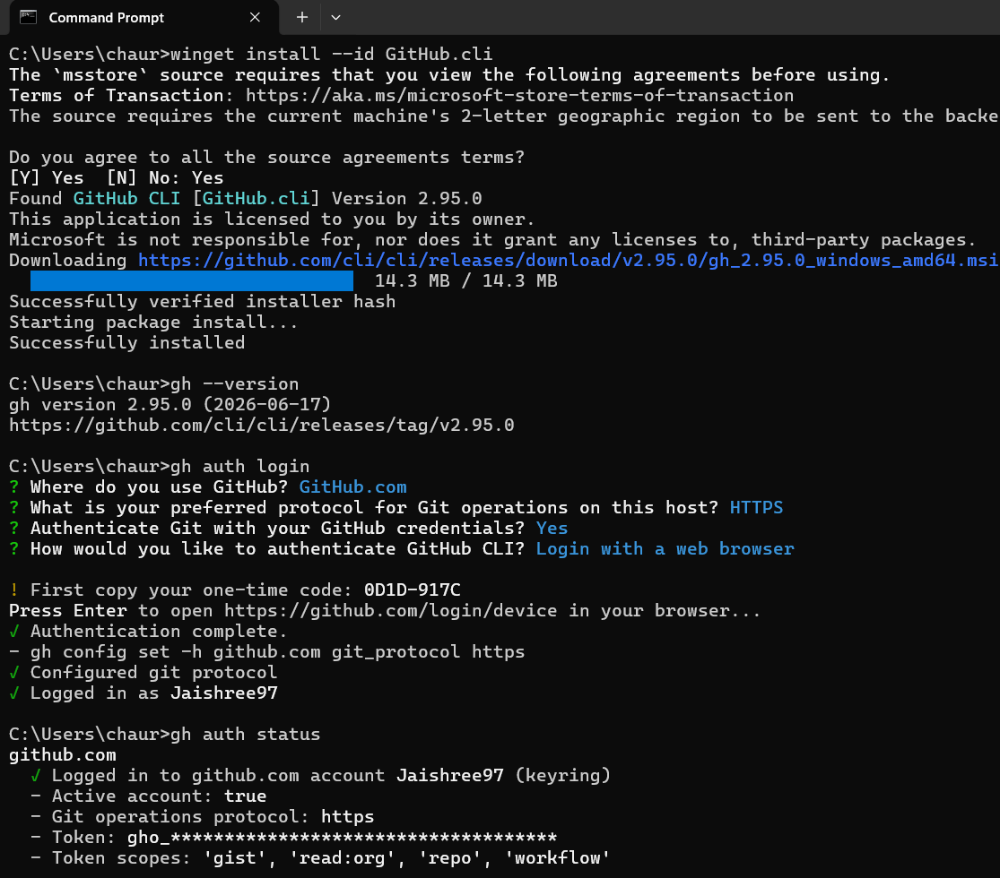

### Authentication Methods Supported

- Browser-based OAuth
- Personal Access Token (PAT)
- SSH Key Authentication

---

## Task 2: Repository Management

- Created a new repository
- Viewed repository details
- Listed repositories under the account

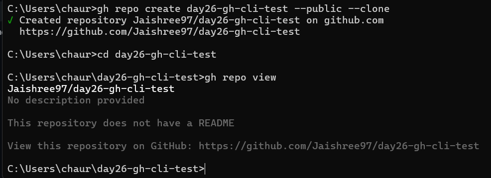

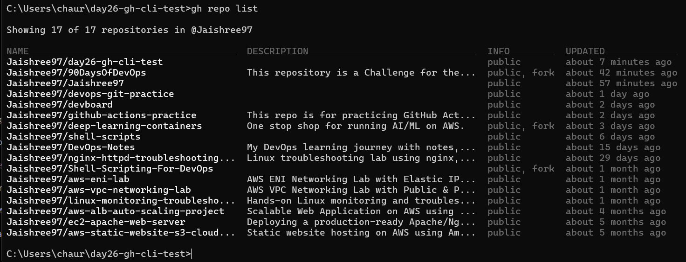

---

## Task 3: Issue Management

- Created a GitHub Issue
- Listed open issues
- Viewed issue details
- Closed the issue successfully

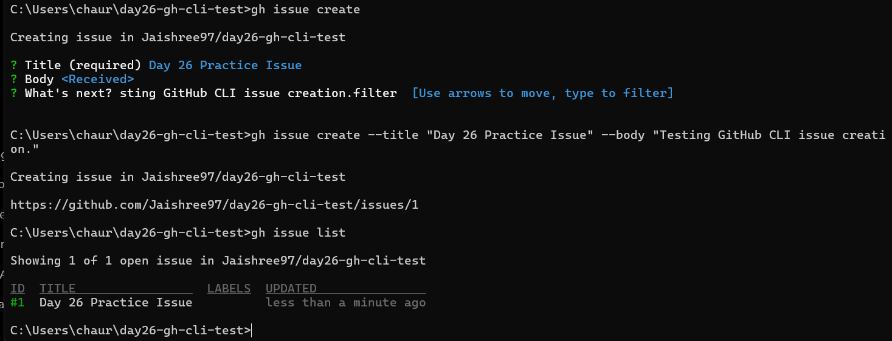

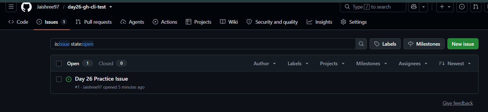

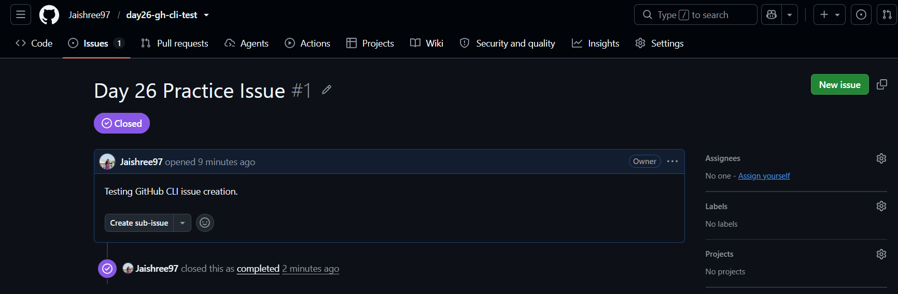

### Use Case

GitHub Issues can be used to track bugs, tasks, feature requests, and automate project workflows.

---

## Task 4: Pull Requests

- Created a feature branch
- Opened a Pull Request
- Reviewed Pull Request details
- Merged Pull Request successfully

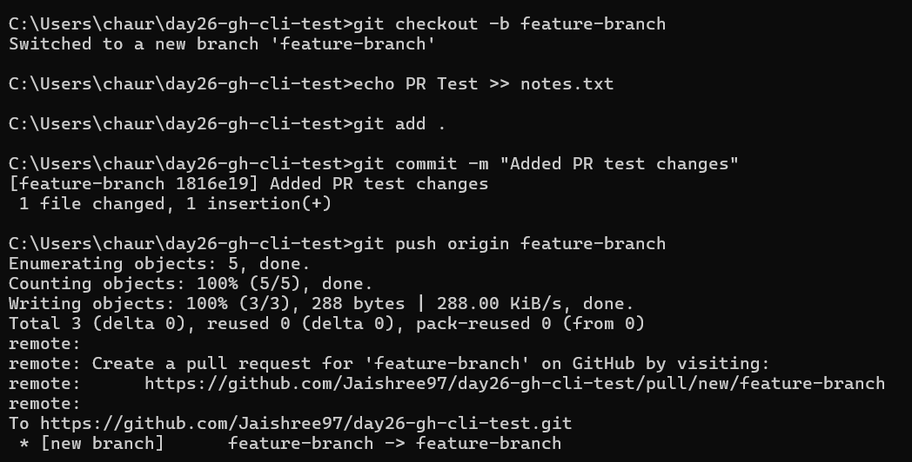

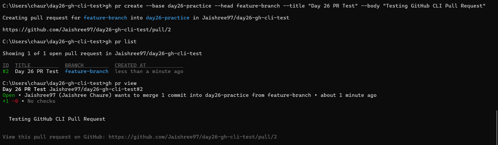

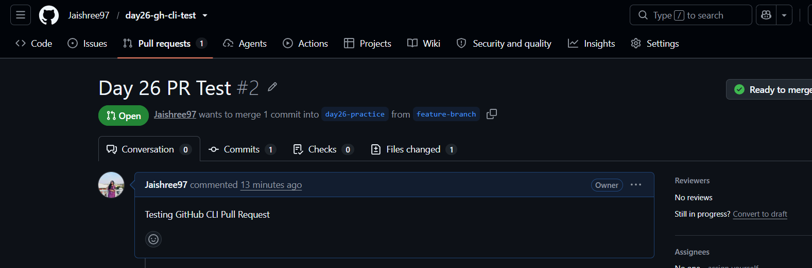

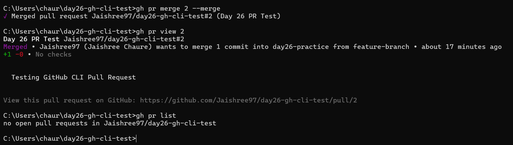

### Merge Strategies

- Merge Commit
- Squash Merge
- Rebase Merge

### PR Review Using GitHub CLI

GitHub CLI allows developers to view pull request details, review changes, inspect commits, and collaborate directly from the terminal.

---

## Task 5: GitHub Actions & Workflows

- Listed workflow runs from a public repository
- Viewed workflow execution details
- Explored workflow monitoring capabilities

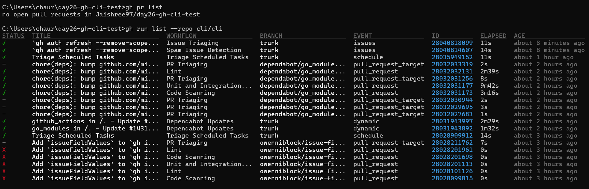

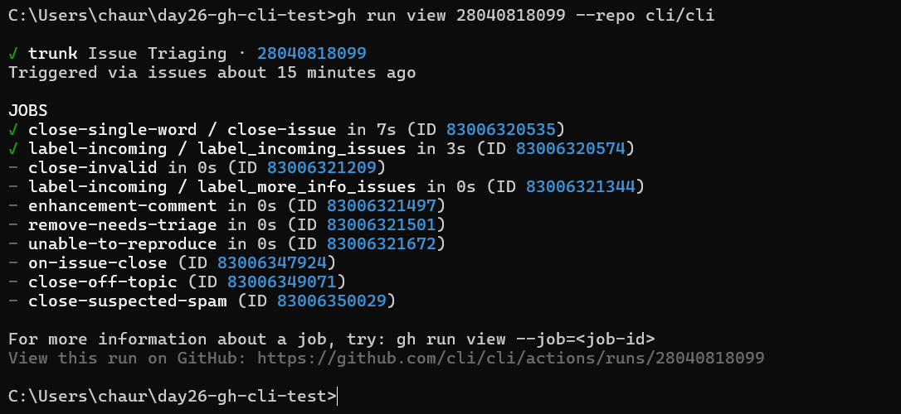

### CI/CD Relevance

GitHub Actions helps automate testing, validation, deployment, and workflow execution within CI/CD pipelines.

---

## Task 6: Useful GitHub CLI Features

### GitHub API

Retrieved GitHub user information directly through the GitHub API.

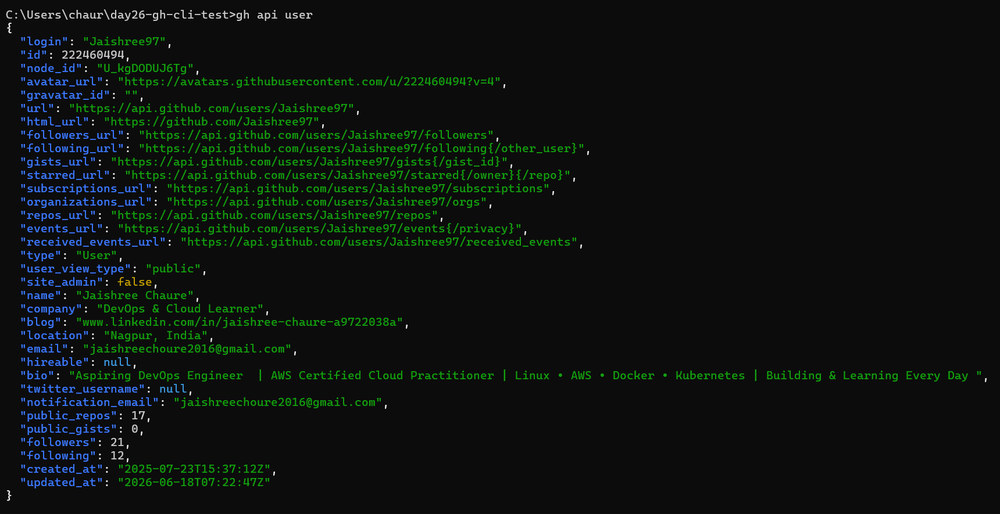

### GitHub Gist

Created and managed a GitHub Gist from the terminal.

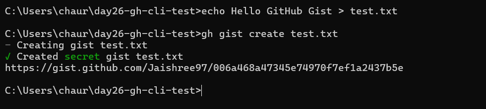

### GitHub Release

Created a release and version tag using GitHub CLI.

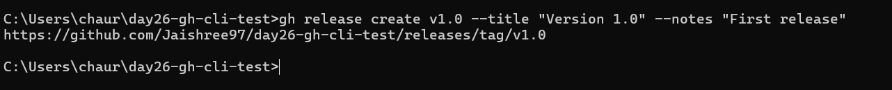

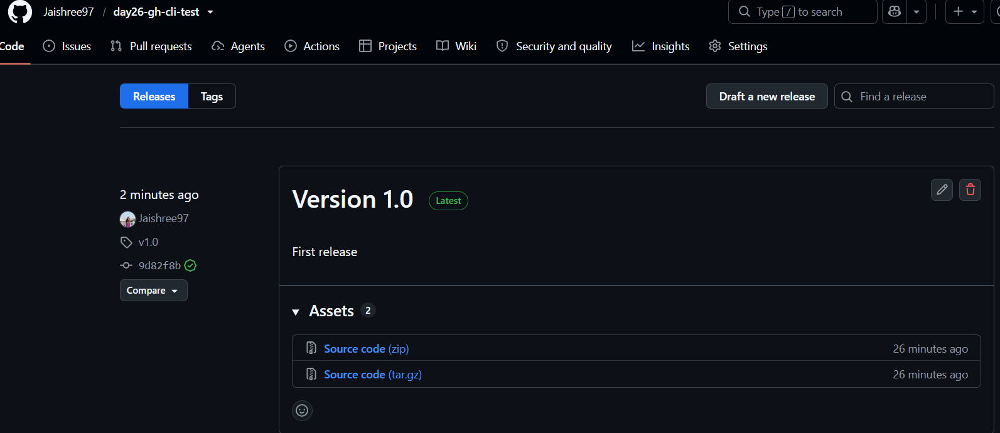

### GitHub Alias

Created a custom alias to simplify frequently used commands.

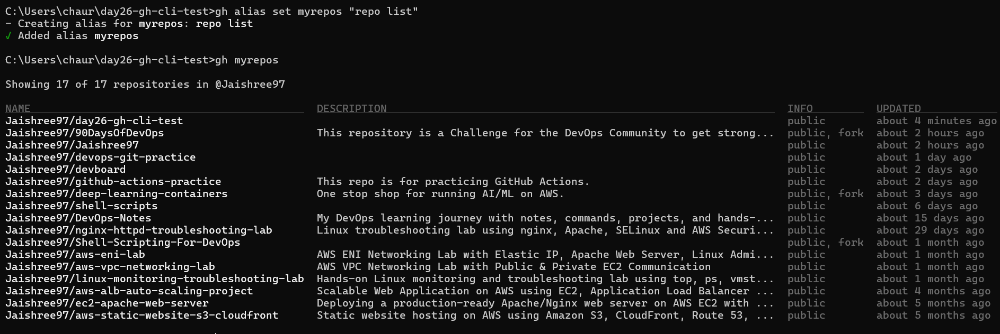

### Repository Search

Searched GitHub repositories directly from the terminal.

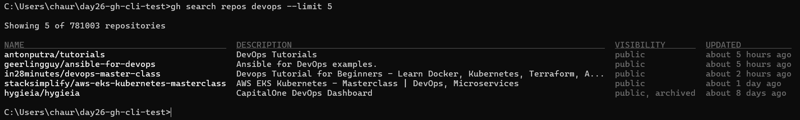

---

## Key Learnings

- Installed and configured GitHub CLI.
- Managed repositories directly from the terminal.
- Worked with Issues and Pull Requests using GitHub CLI.
- Explored GitHub Actions workflow monitoring.
- Used GitHub API, Gists, Releases, Aliases, and Repository Search.
- Understood how GitHub CLI improves developer productivity and supports DevOps automation workflows.

---

## Outcome

Successfully completed Day 26 by managing core GitHub operations entirely from the terminal using GitHub CLI and gaining hands-on exposure to automation-oriented workflows commonly used in DevOps environments.
