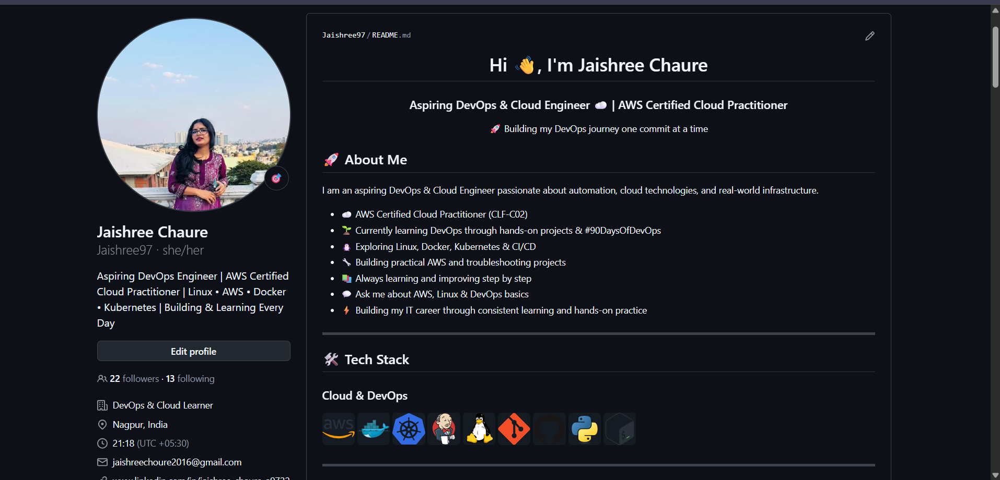

# Day 27 – GitHub Profile Makeover

---

## Task 1: Audit Your Current GitHub Profile

Before making changes, assess where you stand.

1. Visit your GitHub profile as if you were a recruiter.

2. Answer these questions:

- Is your profile picture professional?
  - Yes

- Is your bio filled in? Does it explain what you do?
  - Yes

- Are your pinned repositories relevant?
  - Yes

- Do your repositories have descriptions?
  - Some repositories were improved.

- Would a recruiter understand your work?
  - Yes, after adding a Profile README.

---

## Task 2: Create Your Profile README

README includes

- Introduction — Jaishree Chaure, Aspiring DevOps & Cloud Engineer passionate about Cloud, Linux and Automation.

- What I'm working on — 90 Days of DevOps Challenge

- Skills & Tools — AWS, Linux, Docker, Kubernetes, Jenkins, Git, GitHub, Python & Shell Scripting

- Tech Stack section

- Current Learning section

- Certifications section

- Contact section — Email & LinkedIn

---

## Task 3: Organize Your Repositories

| Repo | Status |
|------|--------|
| 90DaysOfDevOps | Updated |
| aws-vpc-networking-lab | Updated |
| nginx-httpd-troubleshooting-lab | Updated |
| Shell-Scripting-For-DevOps | Updated |
| devboard | Updated |

All repositories have:

- Descriptive repository names
- One-line GitHub descriptions
- README.md explaining contents

---

## Task 4: Pin Your Best Repositories

Selected pinned repositories

- 90DaysOfDevOps
- aws-vpc-networking-lab
- nginx-httpd-troubleshooting-lab
- Shell-Scripting-For-DevOps
- devboard

---

## Task 5: Before & After

### 2. GitHub profile after

### 3. Things improved

**Added a Professional Introduction**

Added a Profile README with a clear introduction so visitors immediately know who I am and what I do.

**Organized Profile Layout**

Structured the profile into sections such as About Me, Tech Stack, Current Learning, Certifications, and Contact.

**Highlighted Skills Clearly**

Listed my AWS, Linux, Docker, Kubernetes, Git, GitHub, Python and Shell Scripting skills for better visibility.

**Pinned Relevant Projects**

Pinned my best DevOps projects to showcase practical learning.

**Improved Repository Documentation**

Updated repository descriptions and README files to make projects easier to understand.

---

## Learning Outcome

GitHub is more than just a place to store code.

A well-organized GitHub profile acts as a technical portfolio that showcases your projects, skills, documentation, and consistency.
