# Day 29 - Docker Fundamentals & Container Basics

## 🎯 Objective

Learn Docker fundamentals, understand containerization, install Docker, and perform hands-on container operations using Docker CLI.

---

# Task 1: Docker Fundamentals

## What is a Container?

A **container** is a lightweight, isolated runtime environment that packages an application along with its dependencies, libraries, and configuration files, ensuring consistent execution across different environments.

### Why Containers?

- Eliminates **"Works on my machine"** issues.
- Provides consistent Development, Testing, and Production environments.
- Starts in seconds.
- Uses fewer resources than Virtual Machines.
- Simplifies deployment and scalability.

---

## Containers vs Virtual Machines

| Feature | Containers | Virtual Machines |
|----------|------------|------------------|
| Virtualization | OS-level | Hardware-level |
| Operating System | Shared Host Kernel | Separate Guest OS |
| Startup Time | Seconds | Minutes |
| Size | MBs | GBs |
| Performance | Faster | Slower |
| Resource Usage | Low | High |
| Isolation | Process-level | Full OS |
| Portability | High | Moderate |
| Best Use Case | Microservices, CI/CD | Multiple OS Environments |

---

## Docker Architecture

Docker follows a Client-Server architecture consisting of five major components.

### Docker Client

The **Docker Client** is the command-line interface (CLI) used to communicate with Docker.

**Common Commands**

```bash
docker build
docker run
docker pull
docker push
docker ps
```

---

### Docker Daemon

The **Docker Daemon (`dockerd`)** is the background service responsible for managing Docker resources.

**Responsibilities**

- Build images
- Create and manage containers
- Manage networks
- Manage volumes

---

### Docker Image

A **Docker Image** is a read-only template containing the application, dependencies, libraries, and configuration required to create containers.

---

### Docker Container

A **Docker Container** is a running instance of a Docker Image that executes an application in an isolated environment.

---

### Docker Registry

A **Docker Registry** stores Docker Images.

**Types**

- Public → Docker Hub
- Private → Enterprise Registry

**Operations**

- Pull Images
- Push Images

---

## Docker Architecture Diagram

```text
                +----------------------+
                |    Docker Client     |
                +----------+-----------+
                           |
                      Docker API
                           |
                           ▼
                +----------------------+
                |    Docker Daemon     |
                |      (dockerd)       |
                +----------+-----------+
                           |
          +----------------+----------------+
          |                                 |
          ▼                                 ▼
 +-------------------+            +--------------------+
 | Docker Images     |            | Docker Containers  |
 +-------------------+            +--------------------+
                           |
                           ▼
                +----------------------+
                | Docker Registry      |
                | (Docker Hub)         |
                +----------------------+
```

---

# Task 2: Install Docker

Installed Docker on an Ubuntu EC2 instance, configured Docker for non-root usage, verified the installation, and executed the first container.

## Verify Docker Installation

Docker initially returned a permission error because the current user wasn't part of the Docker group.

### Commands

```bash
sudo usermod -aG docker $USER
newgrp docker
docker -v
docker ps
```

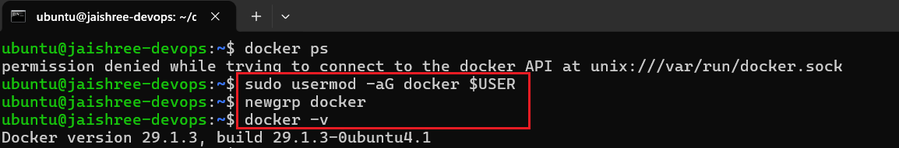

---

## Run Hello World Container

### Command

```bash
docker run hello-world
```

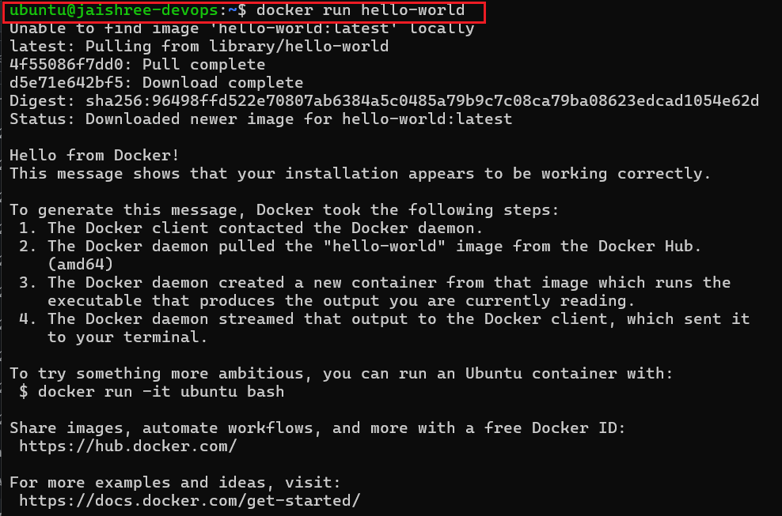

### What Happened?

1. Docker searched for the image locally.
2. Pulled the image from Docker Hub.
3. Created a container.
4. Started the container.
5. Executed the application.
6. Displayed the success message and exited.

---

# Task 3: Run Real Containers

## 1. Run an Nginx Container

Started an Nginx container, exposed **Port 80**, and verified it through the EC2 Public IP.

### Container

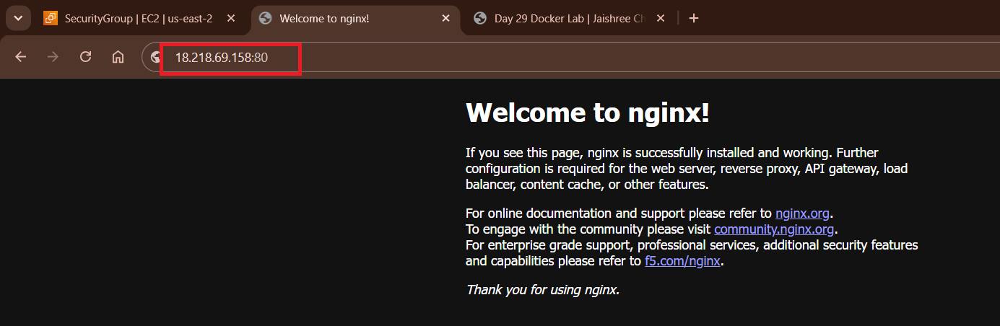

### Browser Output

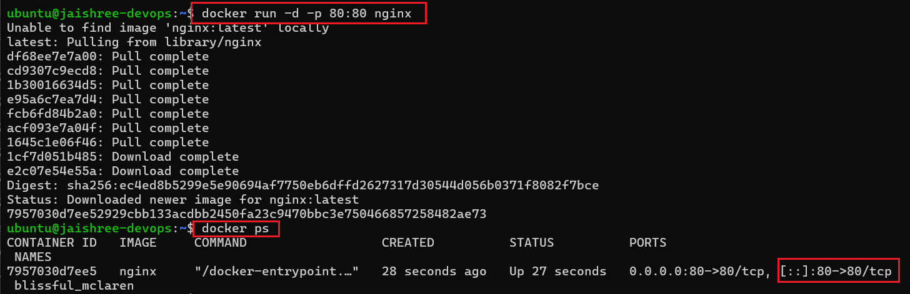

---

## 2. Run an Ubuntu Container in Interactive Mode

Explored an Ubuntu container as a lightweight Linux environment.

Verified:

- Package update
- Current user
- Directory structure
- Shell environment
- Exit operation

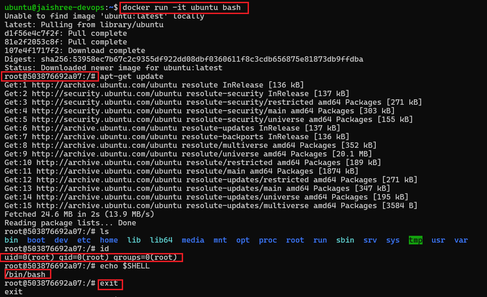

---

## 3. List Running Containers

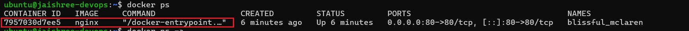

---

## 4. List All Containers

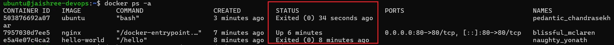

---

## 5. Stop & Remove a Container

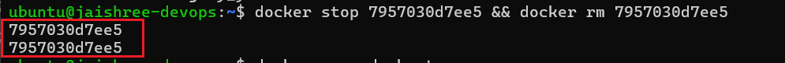

---

# Task 4: Explore

## 1. Run a Container in Detached Mode

**Command**

```bash
docker run -d ubuntu
```

Runs the container in the background while keeping the terminal available.

---

## 2. Assign a Custom Container Name

**Command**

```bash
docker run -d --name nginx -p 81:80 nginx
```

Assigns a meaningful name instead of Docker's random container name.

---

## 3. Map a Host Port to a Container Port

**Command**

```bash
docker run -d --name nginx -p 81:80 nginx
```

**Syntax**

```text
<host_port>:<container_port>
```

**Example**

```text
81:80
```

Requests sent to **EC2_Public_IP:81** are forwarded to **Port 80** inside the container.

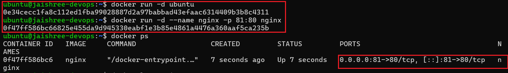

---

## 4. View Container Logs

**Command**

```bash
docker logs nginx
```

Displays runtime logs for monitoring and troubleshooting.

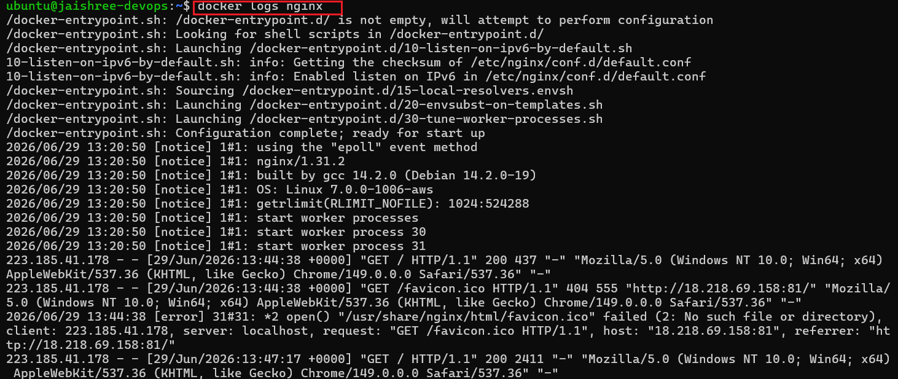

---

## 5. Execute Commands Inside a Running Container

**Commands**

```bash
docker cp index.html nginx:/usr/share/nginx/html/index.html
docker exec -it nginx bash
```

- Copied a custom HTML page into the container.
- Verified the file inside the Nginx web root.
- Accessed the container interactively.

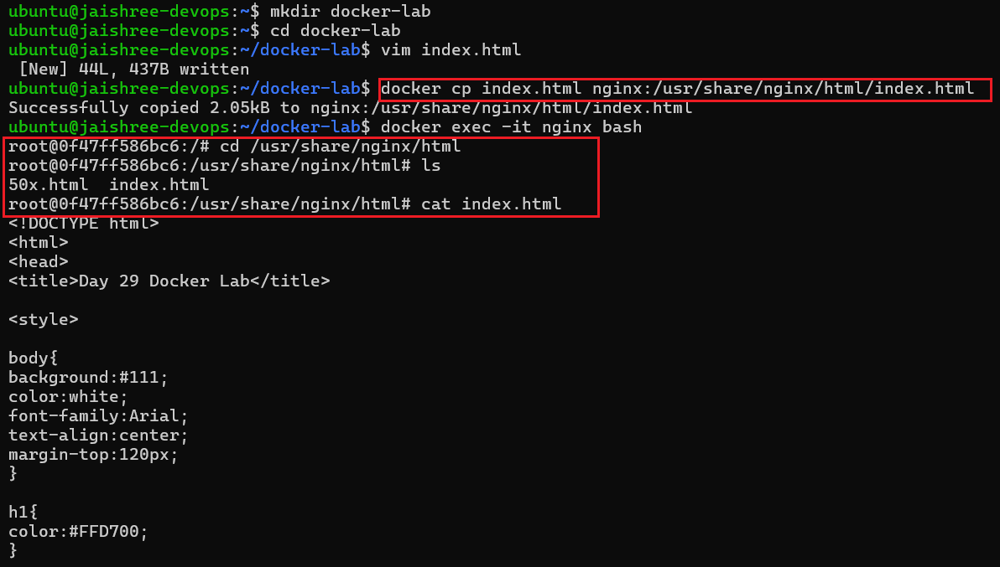

---

## Final Output

Successfully hosted a custom HTML page inside the Nginx container and verified it through the browser.

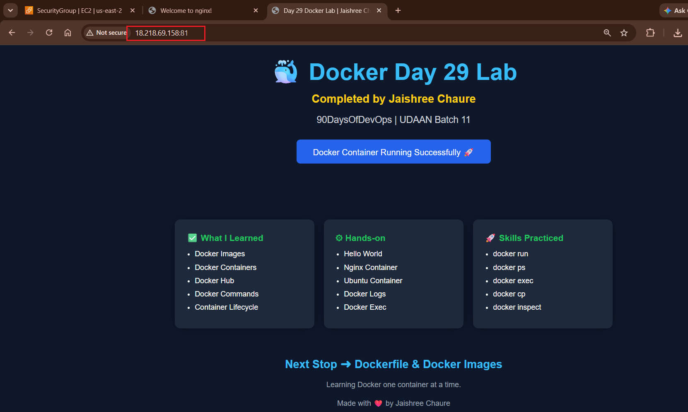

---

# Interview Takeaways

- Docker Image is a blueprint; Container is its running instance.
- Docker Client communicates with the Docker Daemon.
- Docker Hub is a public Docker Registry.
- Containers share the host OS kernel, unlike Virtual Machines.
- Detached mode (`-d`) runs containers in the background.
- Port mapping (`-p`) exposes container services to the host.
- `docker logs` is used for troubleshooting.
- `docker exec` opens an interactive shell inside a running container.
- `docker cp` copies files between the host and a container.
