# Day 30 - Docker Images & Container Lifecycle

## Objective

Learn Docker image management, understand image layers, practice the complete container lifecycle, work with running containers, and perform Docker cleanup.

---

# Task 1: Docker Images

### 1. Pull Required Docker Images

Downloaded the `nginx`, `ubuntu`, and `alpine` images from Docker Hub.

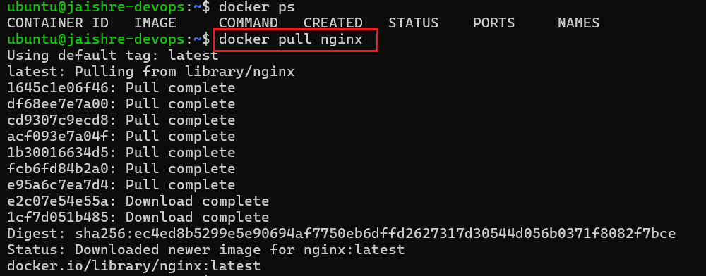

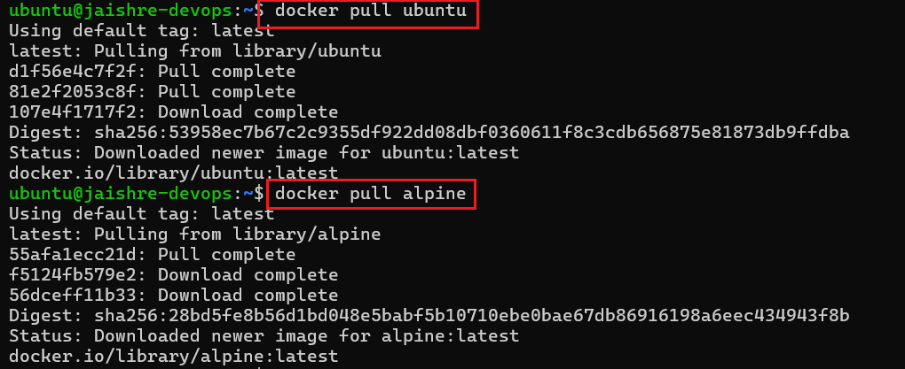

---

### 2. List Available Images

Verified downloaded Docker images and compared their sizes.

| Image | Observation |
|--------|-------------|
| Alpine | Lightweight base image |
| Ubuntu | General-purpose Linux image |
| Nginx | Web server image |

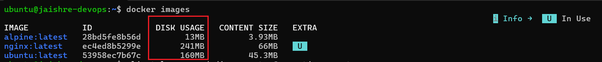

---

### 3. Inspect Docker Image

Verified image metadata including repository, entrypoint, exposed ports, environment variables, and image layers.

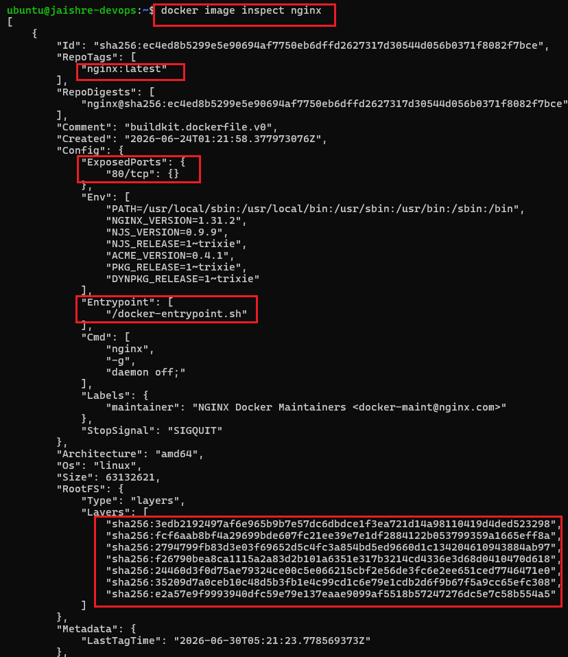

---

### 4. Remove an Unused Image

Removed the Ubuntu image from the local Docker repository.

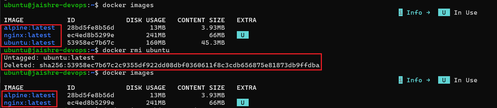

---

# Task 2: Image Layers

### 1. View Image History

Analyzed Docker image layers and observed how Docker caches build layers.

**Key Observations**

- Every Dockerfile instruction creates a new layer.
- Metadata instructions create `0B` layers.
- Cached layers improve build performance.

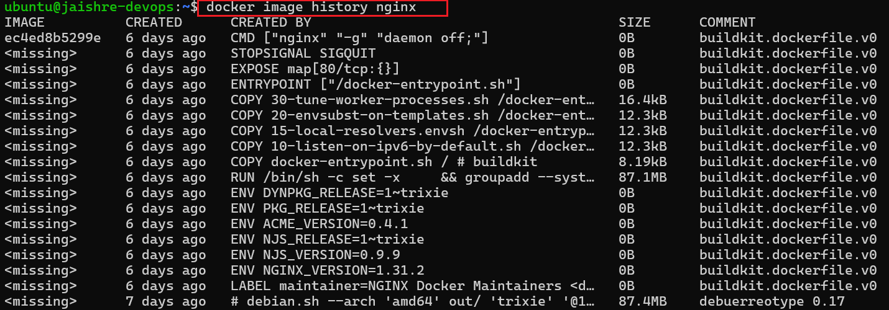

---

# Task 3: Container Lifecycle

Practiced the complete Docker container lifecycle.

1. Create Container
2. Start Container
3. Pause Container
4. Unpause Container
5. Stop Container
6. Restart Container
7. Kill Container
8. Remove Container

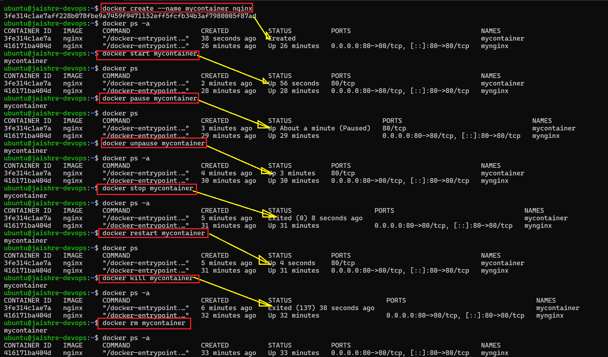

---

# Task 4: Working with Running Containers

### 1. Run Nginx Container

Started an Nginx container in detached mode and exposed port **80**.

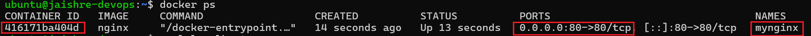

---

### 2. View Container Logs

Viewed application logs generated by the running container.

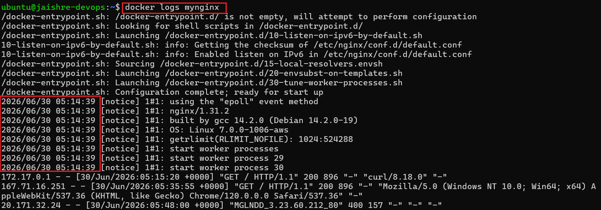

---

### 3. Monitor Logs in Real Time

Monitored container logs continuously using follow mode.

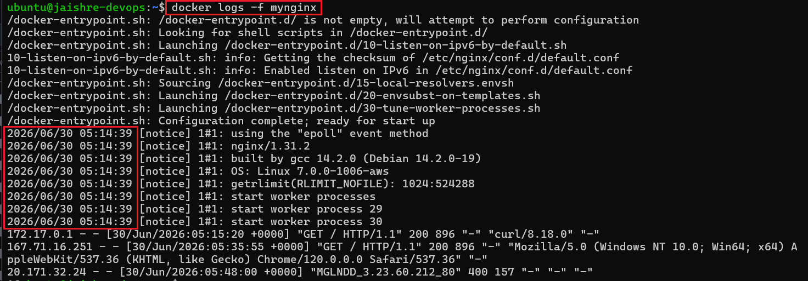

---

### 4. Access the Running Container

Accessed the running container and explored its filesystem.

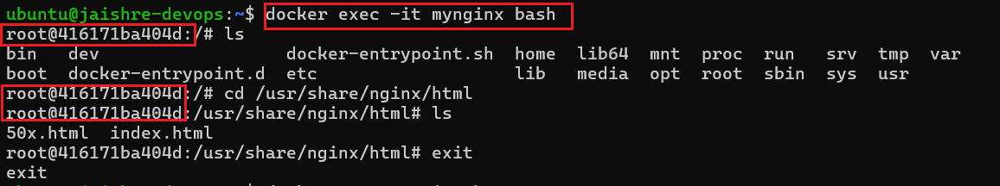

---

### 5. Execute Commands Without Entering the Container

Executed commands directly inside the running container.

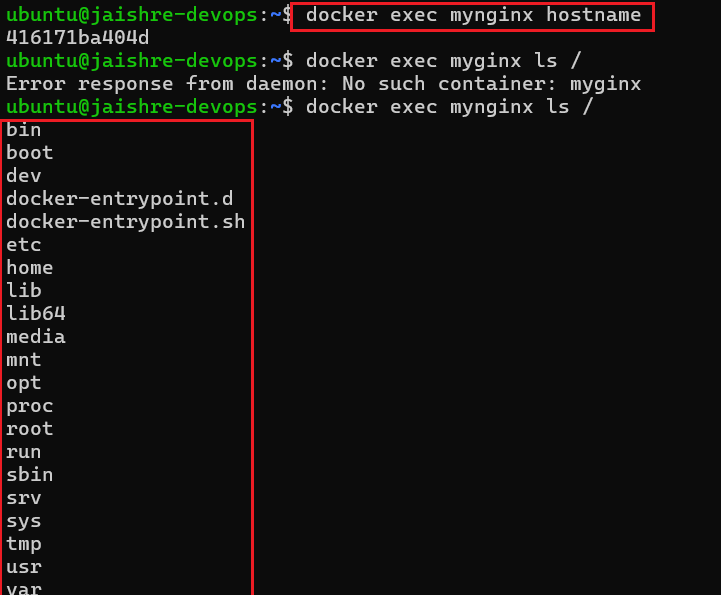

---

### 6. Inspect Running Container

#### IP Address

Verified the container's internal IP address.

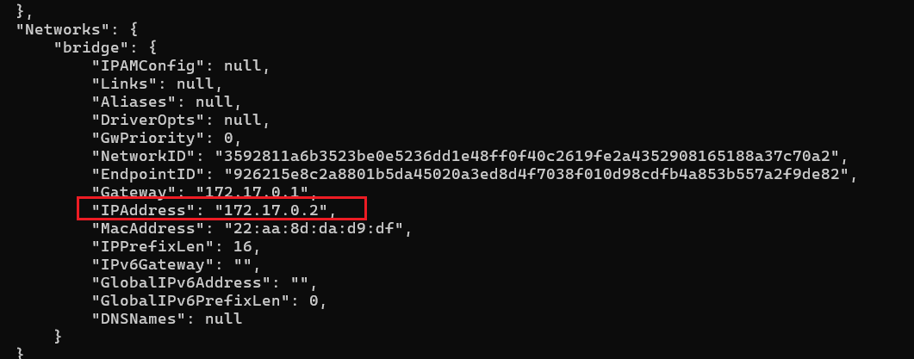

#### Port Mapping

Verified host-to-container port mapping.

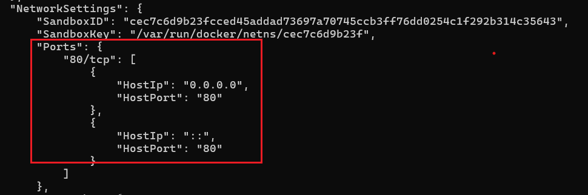

#### Mount Information

Verified attached mounts and volumes.

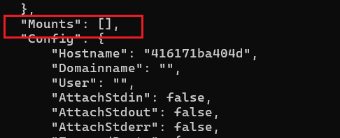

---

# Task 5: Cleanup

Performed Docker resource cleanup.

1. Stopped all running containers.
2. Removed all containers.
3. Removed unused images.
4. Checked Docker disk usage.

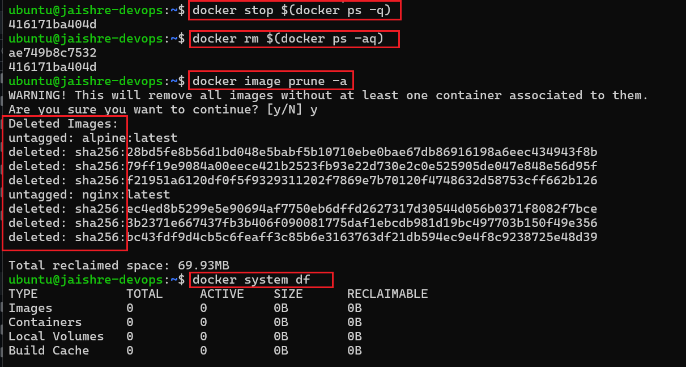

---

# 🚀 Key Learnings

- Docker image management
- Docker image layers and build cache
- Docker image inspection
- Complete container lifecycle
- Container logs and debugging
- Executing commands inside containers
- Container networking and inspection
- Docker cleanup and disk space management

---
