# Day 31 – Dockerfile: Build Your Own Images

## Objective

In this hands-on lab, I learned how to create custom Docker images using Dockerfiles, explored commonly used Dockerfile instructions, compared **CMD** and **ENTRYPOINT**, deployed a static website using **Nginx**, optimized Docker build context with **.dockerignore**, and improved build performance using **Docker layer caching**.

---

# Task 1: Your First Dockerfile

## Objective

Create and run a custom Docker image using Ubuntu as the base image.

### Source File

- **Dockerfile:** [my-first-image/Dockerfile](./my-first-image/Dockerfile)

### Steps Performed

1. Created the **my-first-image** project directory.
2. Wrote a Dockerfile using **Ubuntu** as the base image.
3. Installed **curl** using the `RUN` instruction.
4. Configured a default command using `CMD`.
5. Built the Docker image with the tag **my-ubuntu:v1**.
6. Ran the container and verified the output.

### Verification

- Docker image built successfully.
- Container started successfully.
- Default message printed as expected.

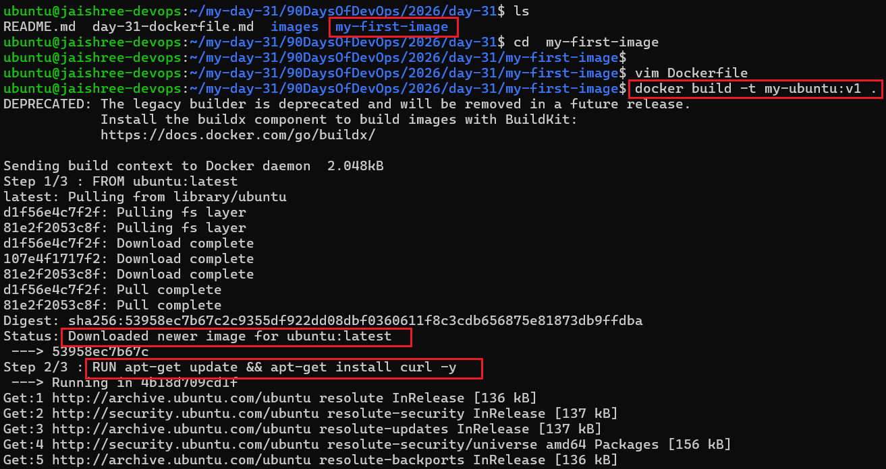

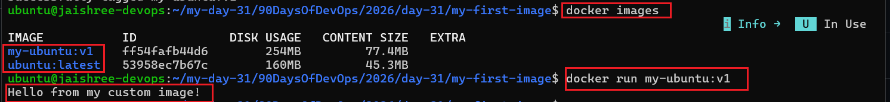

---

# Task 2: Dockerfile Instructions

## Objective

Understand the purpose of commonly used Dockerfile instructions by building and running a custom Docker image.

### Source Files

- **Dockerfile:** [dockerfile-demo/Dockerfile](./dockerfile-demo/Dockerfile)
- **HTML File:** [dockerfile-demo/index.html](./dockerfile-demo/index.html)

### Instructions Used

| Instruction | Purpose |
|-------------|---------|
| `FROM` | Defines the base image |
| `RUN` | Executes commands during image build |
| `COPY` | Copies files into the image |
| `WORKDIR` | Sets the working directory |
| `EXPOSE` | Documents the application port |
| `CMD` | Defines the default startup command |

### Steps Performed

1. Created a custom HTML page.
2. Wrote a Dockerfile using the above instructions.
3. Built the Docker image.
4. Started the Nginx container.
5. Verified the application in the browser.

### Verification

- Docker image built successfully.
- Nginx container started successfully.
- Application served correctly in the browser.

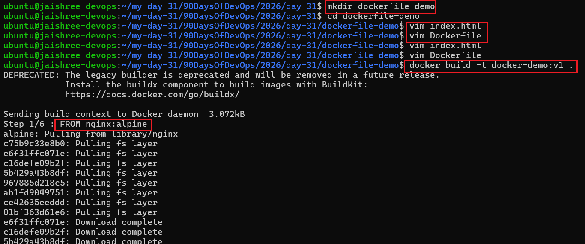

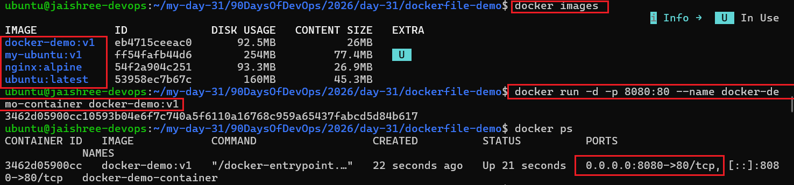

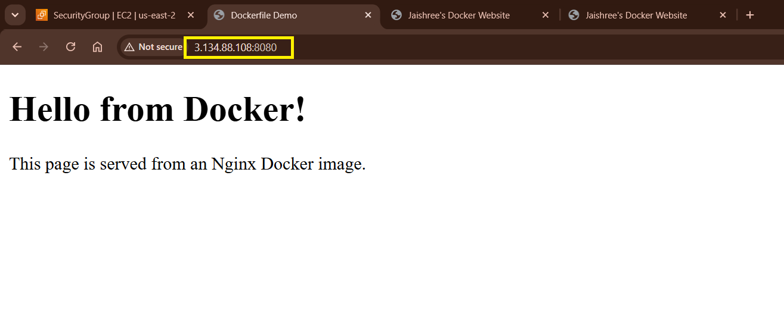

---

# Task 3: CMD vs ENTRYPOINT

## Objective

Compare the runtime behavior of **CMD** and **ENTRYPOINT** instructions.

### Source Files

- **CMD Dockerfile:** [cmd-vs-entrypoint/Dockerfile.cmd](./cmd-vs-entrypoint/Dockerfile.cmd)
- **ENTRYPOINT Dockerfile:** [cmd-vs-entrypoint/Dockerfile.entrypoint](./cmd-vs-entrypoint/Dockerfile.entrypoint)

### Comparison

| CMD | ENTRYPOINT |
|------|------------|
| Provides the default command | Defines the main executable |
| Can be overridden | Always executes |
| Suitable for optional runtime commands | Suitable for fixed application startup |

### Steps Performed

1. Built a Docker image using **CMD**.
2. Built another image using **ENTRYPOINT**.
3. Executed both containers.
4. Passed runtime arguments.
5. Compared the behavior.

### Verification

- Successfully verified the behavior of **CMD**.
- Successfully verified the behavior of **ENTRYPOINT**.

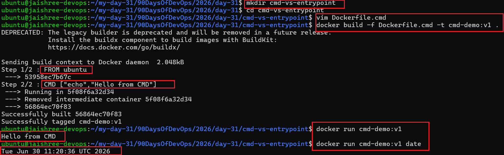

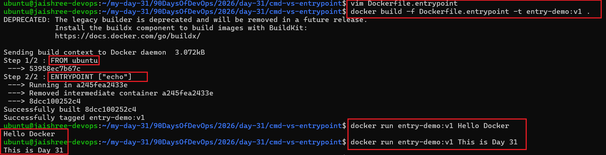

---

# Task 4: Build a Simple Web Application

## Objective

Deploy a static HTML website using an Nginx Docker container.

### Source Files

- **Dockerfile:** [nginx-demo/Dockerfile](./nginx-demo/Dockerfile)
- **HTML File:** [nginx-demo/index.html](./nginx-demo/index.html)

### Steps Performed

1. Created a static HTML webpage.
2. Wrote the Dockerfile.
3. Built the Docker image.
4. Started the Nginx container.
5. Accessed the application through the browser.

### Verification

- Docker image built successfully.
- Website deployed successfully.
- Browser output verified.

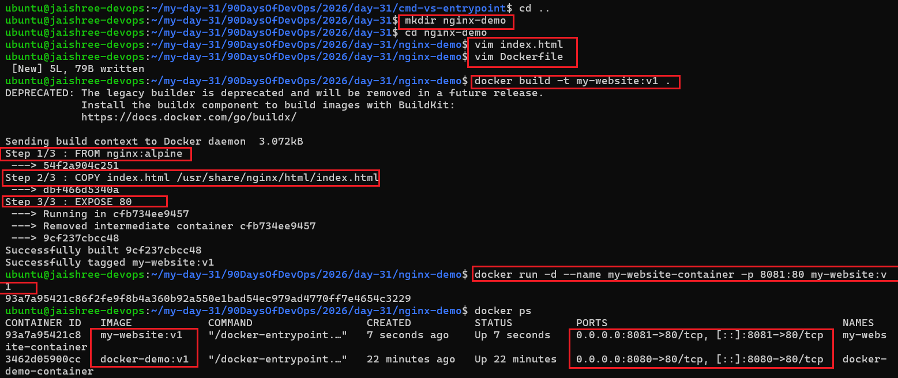

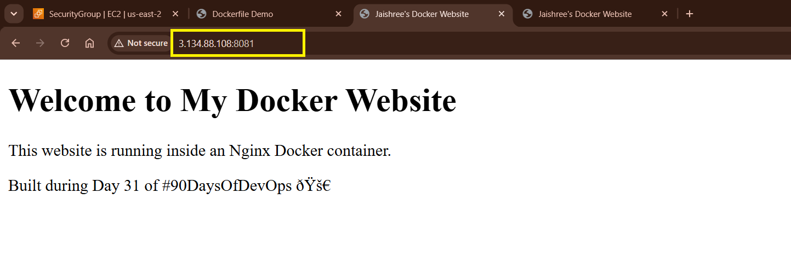

---

# Task 5: Using .dockerignore

## Objective

Reduce the Docker build context by excluding unnecessary files.

### Source File

- **.dockerignore:** [nginx-demo/.dockerignore](./nginx-demo/.dockerignore)

### Ignored Files

- `node_modules`
- `.git`
- `.env`
- `*.md`

### Steps Performed

1. Created a `.dockerignore` file.
2. Added ignore rules.
3. Rebuilt the Docker image.
4. Verified ignored files were excluded from the build context.

### Verification

- Docker build context optimized successfully.
- Unnecessary files were excluded.

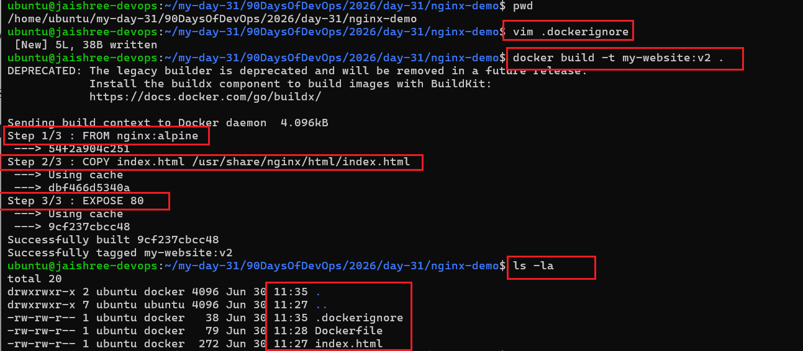

---

# Task 6: Docker Layer Caching

## Objective

Understand Docker layer caching and its impact on build performance.

### Steps Performed

1. Built the Docker image.
2. Modified the application.
3. Rebuilt the image.
4. Observed Docker cache behavior.

### Key Observations

- Docker creates images layer by layer.
- Every Dockerfile instruction creates a separate layer.
- Unchanged layers are reused from cache.
- Only modified layers and subsequent layers are rebuilt.
- Proper instruction ordering improves build performance.

### Verification

- Successfully observed Docker layer caching.
- Verified faster image rebuilds.

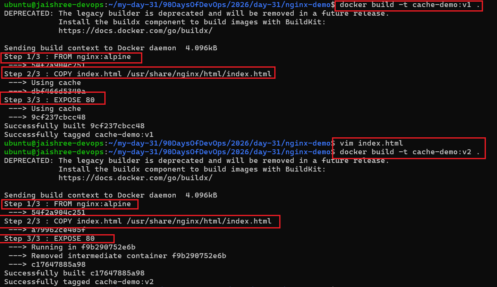

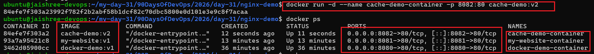

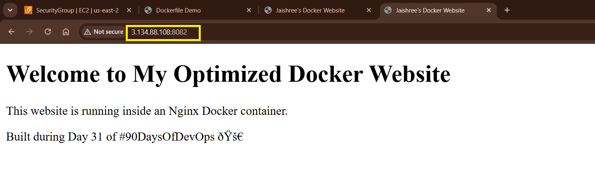

---

# Key Takeaways

- Built custom Docker images using Dockerfiles.
- Learned the purpose of commonly used Dockerfile instructions.
- Compared **CMD** and **ENTRYPOINT** with practical examples.
- Containerized and deployed a static website using **Nginx**.
- Optimized Docker build context using **.dockerignore**.
- Improved image build performance using **Docker layer caching**.
- Successfully built, tested, and verified Docker applications on an **AWS EC2** instance.
