# Day 32 - Docker Volumes & Networking

## Objective

Learn how Docker manages persistent data using Named Volumes and Bind Mounts, understand Docker networking concepts, enable container-to-container communication, and build a multi-container application using custom networks and persistent storage.

---

# Task 1: The Problem (Container Data Loss)

### 1. Run a MySQL Container

Started a MySQL container and created a sample database with employee records.

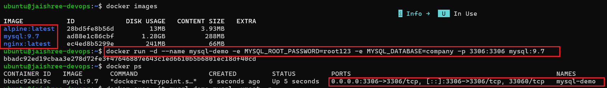

---

### 2. Create Sample Data

Created a table, inserted sample records, and verified the stored data.

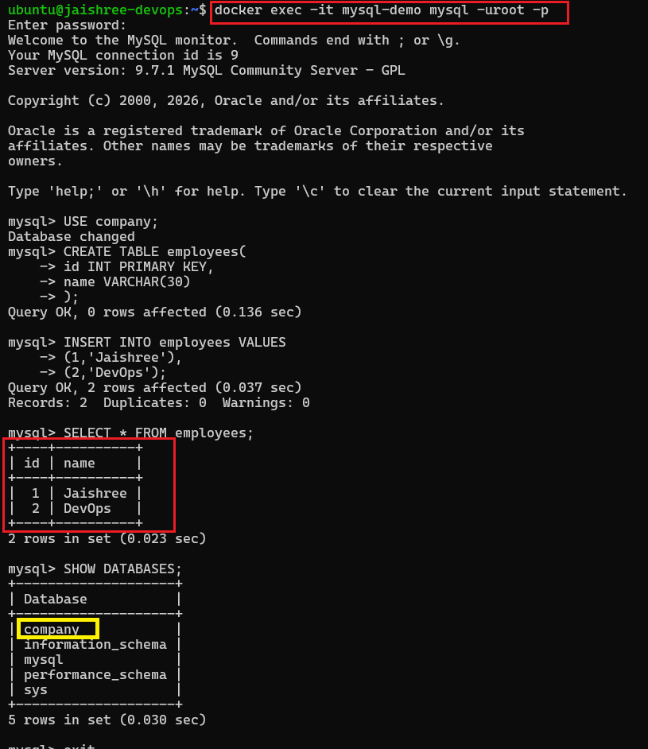

---

### 3. Remove the Container

Stopped and removed the MySQL container.

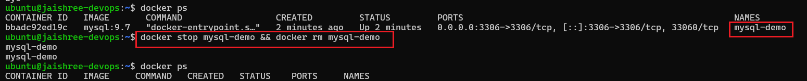

---

### 4. Create a New Container

Started a new MySQL container using the same image and verified whether the previous data still existed.

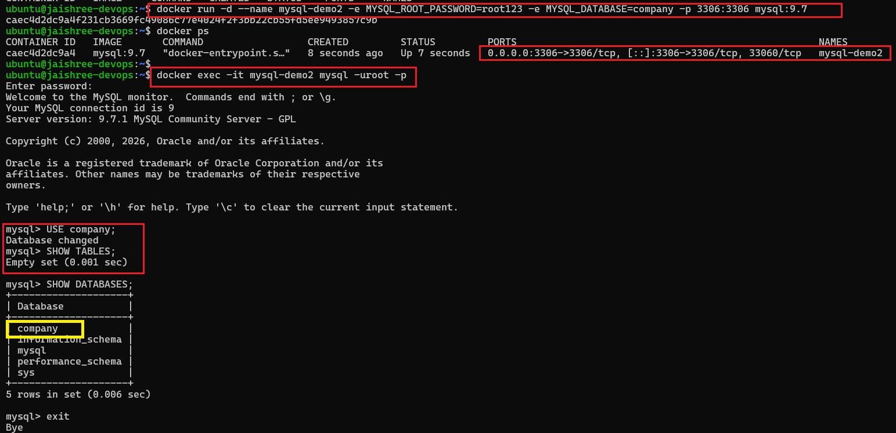

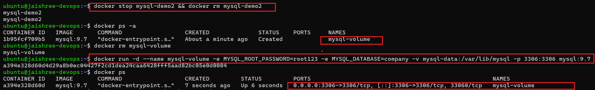

**Key Observation**

- User-created tables and records were lost.
- Containers do not preserve data after removal.
- Docker containers are **ephemeral** by default.

---

# Task 2: Named Volumes

### 1. Create a Docker Named Volume

Created a persistent Docker volume and verified it.

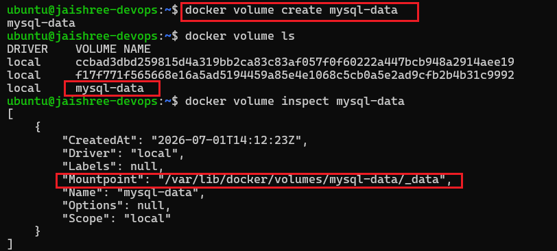

---

### 2. Run MySQL with the Volume

Started a MySQL container using the named volume.

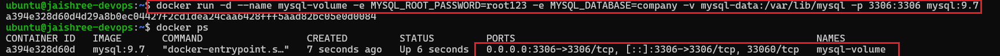

---

### 3. Store Database Records

Created the employee table, inserted records, and verified the data.

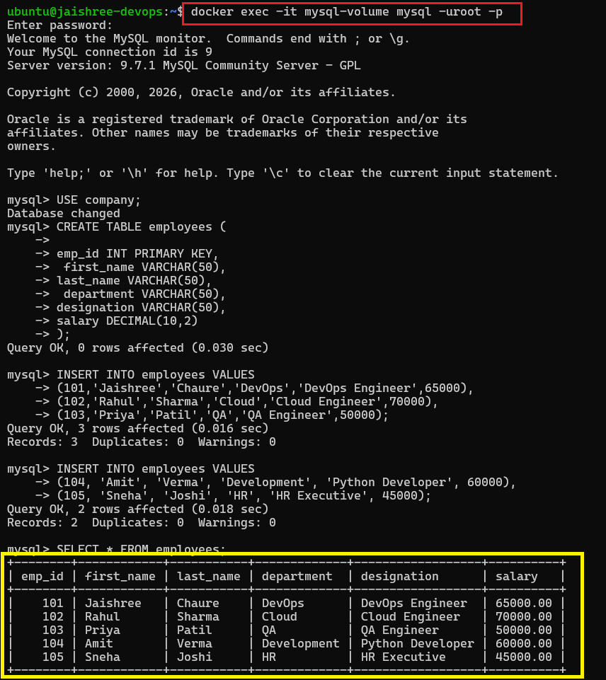

---

### 4. Remove the Container

Stopped and removed the database container while keeping the volume.

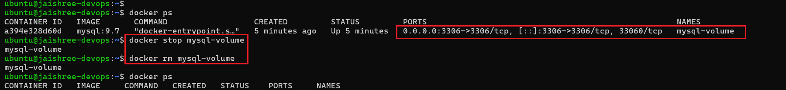

---

### 5. Reuse the Same Volume

Started a new MySQL container using the existing named volume and verified the stored data.

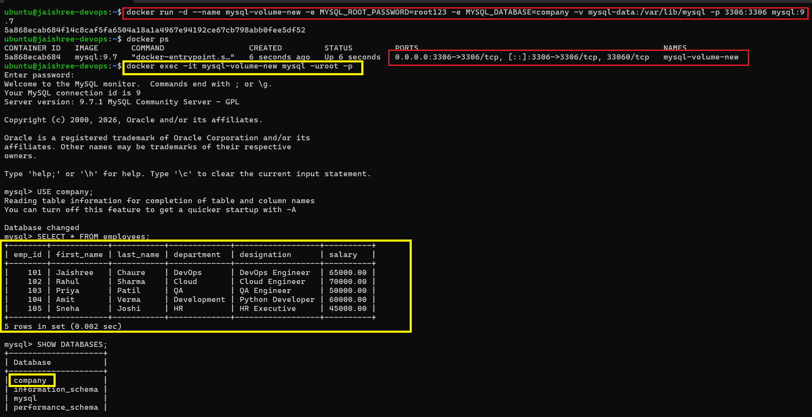

**Key Observation**

- Docker volume remained after container removal.
- Database records persisted successfully.
- Named volumes provide persistent storage independent of containers.

---

# Task 3: Bind Mounts

### 1. Create a Website Directory

Created a local website directory and added an HTML page.

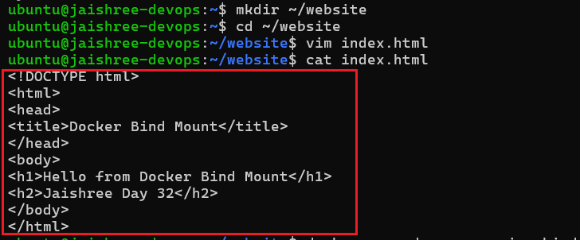

---

### 2. Run an Nginx Container with a Bind Mount

Mounted the local website directory inside the Nginx container.

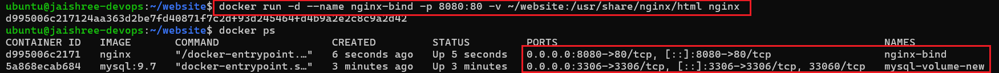

---

### 3. Access the Website

Verified that the website was served successfully through the browser.

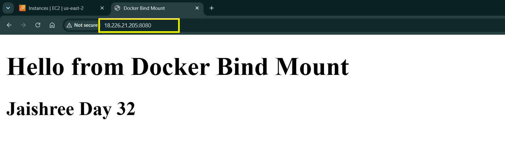

---

### 4. Update the Website

Modified the HTML file on the host machine and refreshed the browser.

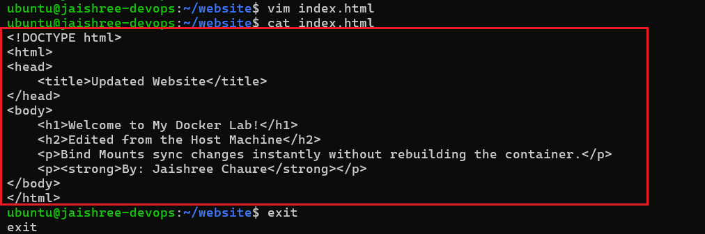

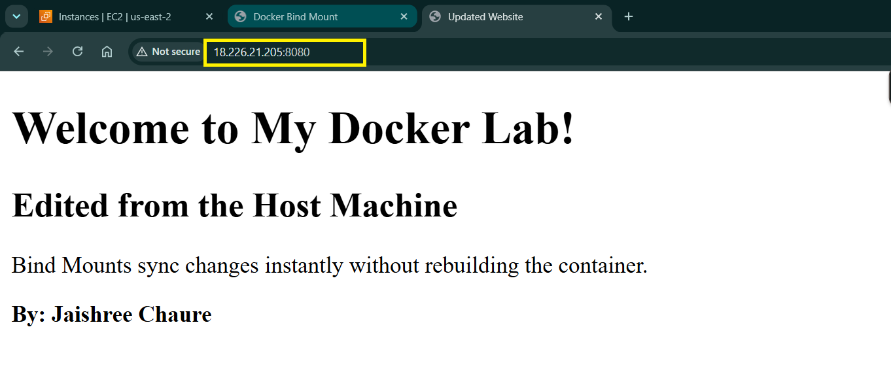

**Key Observation**

- Host files were synchronized instantly.
- No container rebuild or restart was required.
- Bind mounts are ideal for development environments.

---

# Task 4: Docker Networking Basics

### 1. List Docker Networks

Listed all available Docker networks.

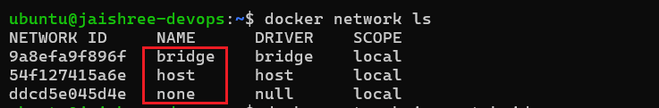

---

### 2. Inspect the Default Bridge Network

Verified containers attached to the default bridge network.

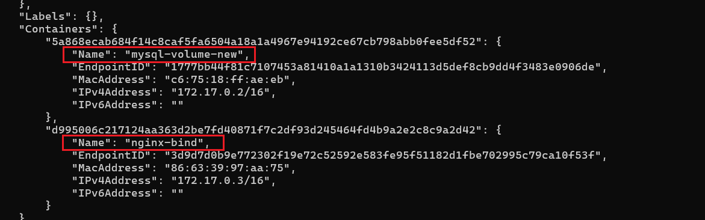

---

### 3. Test Communication Using IP Address

Retrieved the container IP address and successfully pinged it.

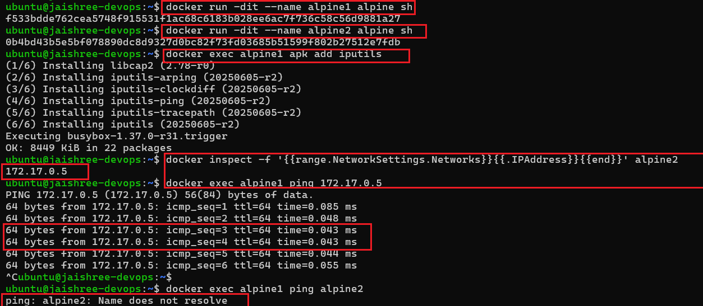

---

### 4. Test Communication Using Container Name

Attempted to ping another container using its container name on the default bridge network. Docker could not resolve the container name because the default bridge network does not provide automatic DNS-based name resolution.

---

# Task 5: Custom Networks

### 1. Create a Custom Bridge Network

Created a custom Docker bridge network named **my-app-net**.

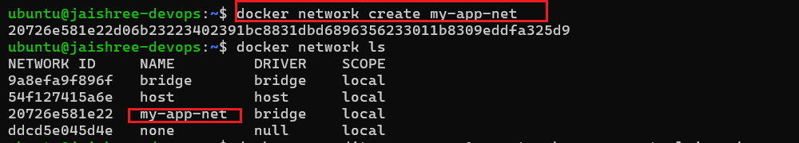

---

### 2. Run Containers on the Custom Network

Started two Alpine containers connected to the custom network.

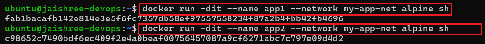

---

### 3. Test Name-Based Communication

Verified communication between containers using container names.

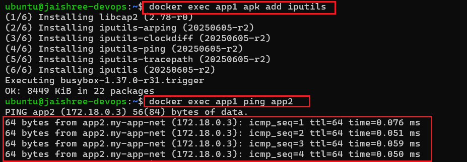

**Key Observation**

- Docker automatically resolved container names.
- Containers communicated successfully without using IP addresses.
- User-defined bridge networks include Docker's embedded DNS service.

---

# Task 6: Build a Multi-Container Application

### 1. Create a Project Network and Volume

Created a custom network (**project-net**) and a named volume (**project-data**).

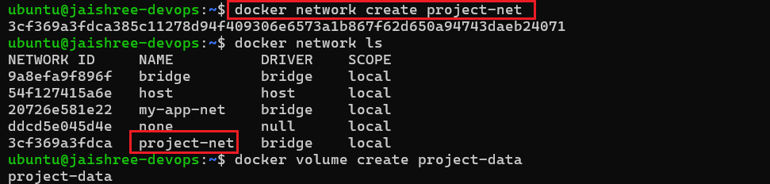

---

### 2. Run the Database Container

Started a MySQL database container attached to the custom network and persistent volume.

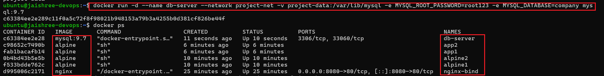

---

### 3. Run the Application Container

Started an Alpine application container on the same network and verified network configuration.

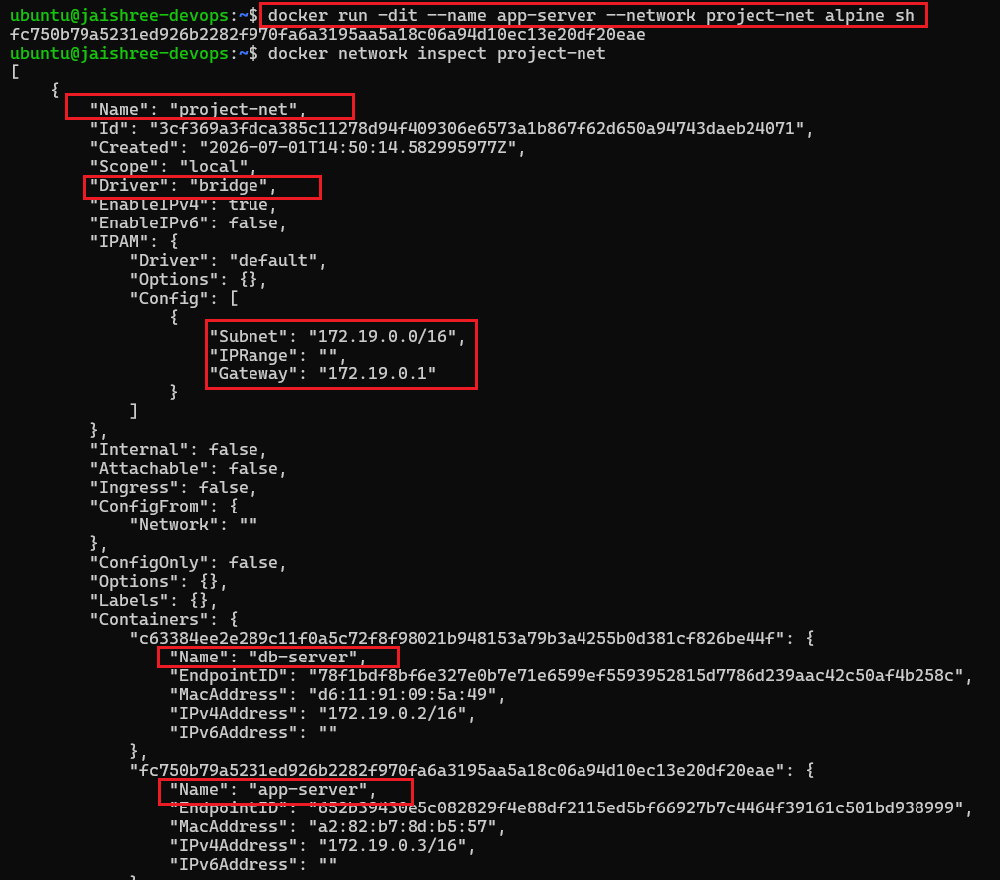

---

### 4. Verify Container Communication

Confirmed that the application container successfully communicated with the database container using its container name.

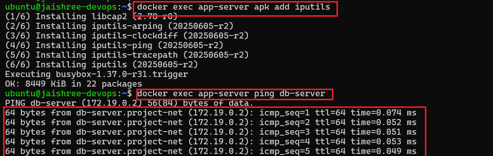

---

### 5. Cleanup

Removed all containers, custom networks, and Docker volumes created during the lab.

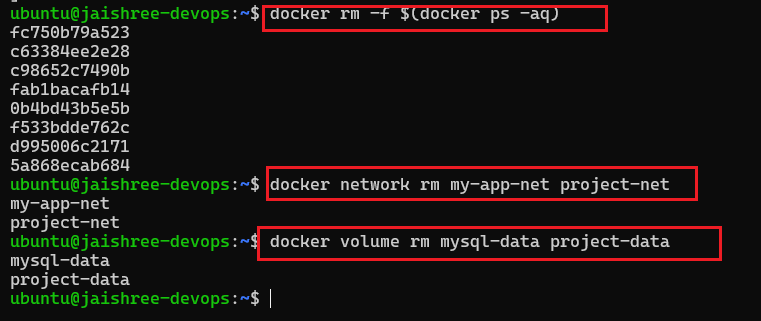

---

# Key Learnings

- Containers are ephemeral and lose data when removed.
- Docker Named Volumes provide persistent storage independent of containers.
- Bind Mounts synchronize host files directly with containers.
- Docker Bridge Networks enable container communication using IP addresses.
- User-defined Bridge Networks provide automatic DNS-based name resolution.
- Container names can be used instead of IP addresses on custom networks.
- Volumes and custom networks simplify multi-container application deployment.
- Cleaning up unused Docker resources helps maintain a healthy Docker environment.
