# Day 33 - Docker Compose: Multi-Container Applications

## Objective

Learn how Docker Compose simplifies the deployment and management of multi-container applications using a single YAML configuration file. Build and manage a WordPress and MySQL application, understand automatic networking, persistent storage, environment variables, and common Docker Compose operations.

---

## Prerequisites

- Docker Engine installed
- Docker Compose v2 installed
- Ubuntu EC2 Instance
- Basic Docker knowledge

---

## Technologies Used

- Docker
- Docker Compose
- WordPress
- MySQL 8.0
- Ubuntu EC2

---

## Project Structure

```text
day-33/
├── compose-basics/
│   └── docker-compose.yml
├── wordpress-mysql/
│   └── docker-compose.yml
├── wordpress-mysql-env/
│   ├── docker-compose.yml
│   └── .env
├── images/
└── README.md
```

---

## Project Files

- 📄 [Compose Basics Configuration](compose-basics/docker-compose.yml)
- 📄 [WordPress + MySQL Configuration](wordpress-mysql/docker-compose.yml)
- 📄 [WordPress + MySQL with Environment Variables](wordpress-mysql-env/docker-compose.yml)
- 
---

# Task 1: Install & Verify Docker Compose

### 1. Install Docker Compose

Installed Docker Compose v2 on the Ubuntu EC2 instance.

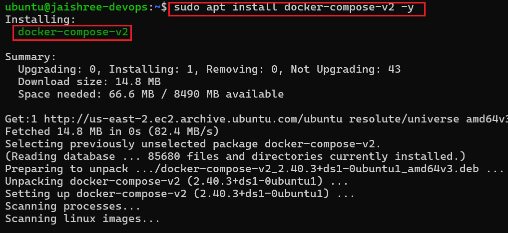

---

### 2. Verify Docker Compose Installation

Verified that both Docker Engine and Docker Compose were installed successfully.

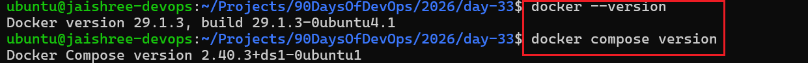

### Key Observation

- Docker Compose was installed successfully.
- Docker Engine and Docker Compose are ready for deploying multi-container applications.

---

# Task 2: Create Your First Docker Compose Application

### 1. Create the Compose Project

Created a project directory named **compose-basics** and added a Docker Compose configuration to deploy an Nginx web server.

**Docker Compose File**

[compose-basics/docker-compose.yml](compose-basics/docker-compose.yml)

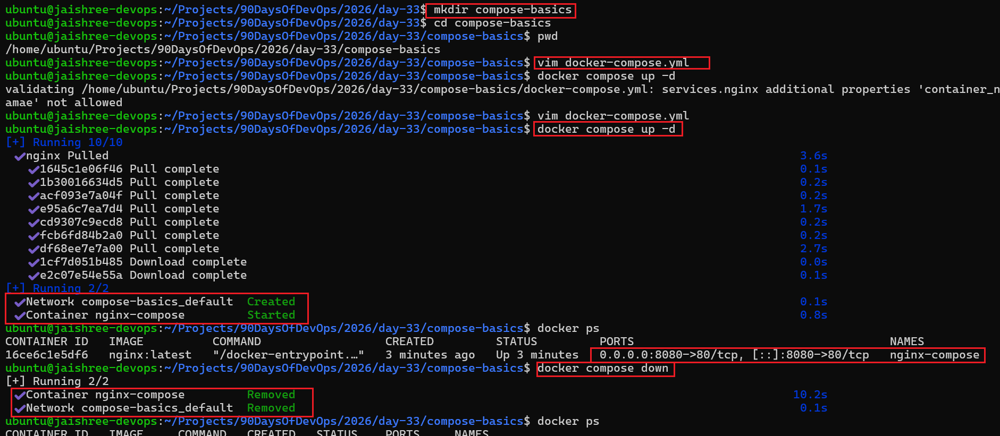

---

### 2. Deploy the Application

Deployed the Nginx application using Docker Compose.

Docker Compose automatically:

- Pulled the required image
- Created a dedicated project network
- Created the container
- Started the application

---

### 3. Verify Browser Output

Confirmed that the Nginx welcome page was accessible through the browser.

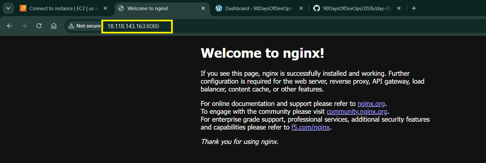

### Key Observation

- A complete application was deployed using a single Docker Compose configuration.
- Docker Compose automatically created the required network.
- The Nginx service became accessible through the configured port.

---

# Task 3: Build a WordPress & MySQL Multi-Container Application

### 1. Create the WordPress Compose Project

Created a Docker Compose project containing two services:

- WordPress
- MySQL

Configured a named volume for persistent database storage and allowed both services to communicate over the default Docker Compose network.

**Docker Compose File**

[wordpress-mysql/docker-compose.yml](wordpress-mysql/docker-compose.yml)

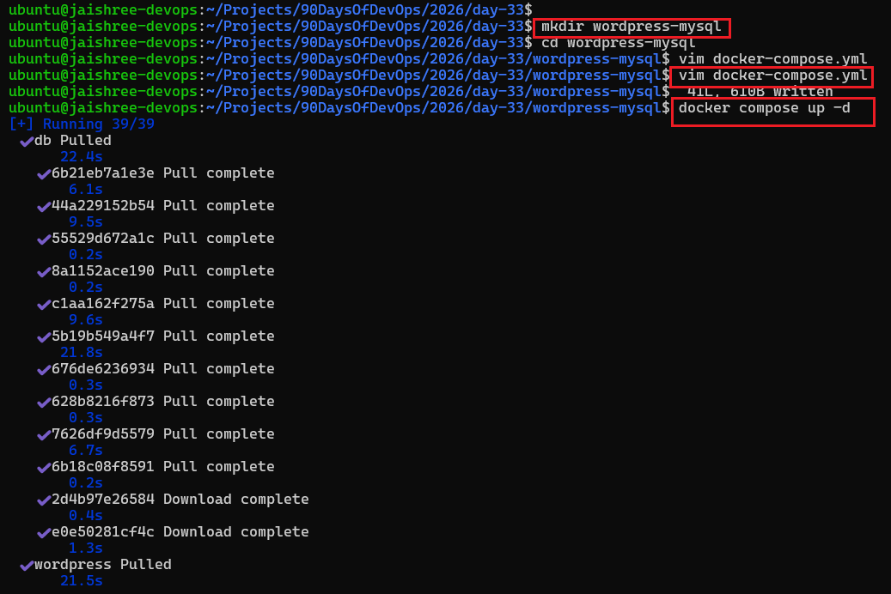

---

### 2. Verify Running Containers

Verified that both WordPress and MySQL containers were created and running successfully.

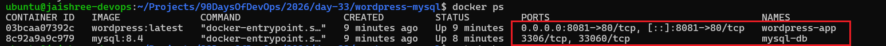

---

### 3. Deploy the Multi-Container Application

Started the complete application using a single Docker Compose configuration.

Docker Compose automatically:

- Pulled the required images
- Created the project network
- Created the named volume
- Started both containers

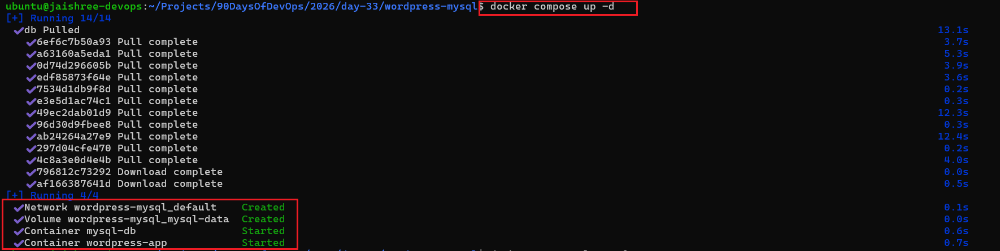

---

### 4. Verify Docker Network

Confirmed that Docker Compose automatically created a dedicated bridge network for the project.

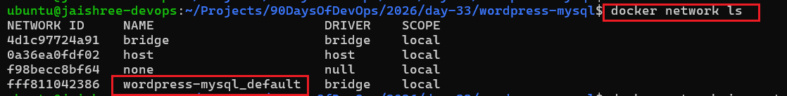

---

### 5. Inspect the Compose Network

Inspected the network configuration and verified that both containers were attached to the same network.

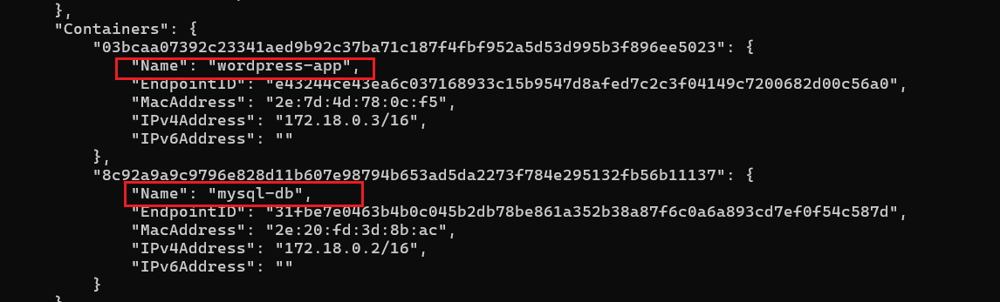

---

### 6. Verify Persistent Storage

Verified that Docker Compose automatically created a named volume for MySQL data persistence.

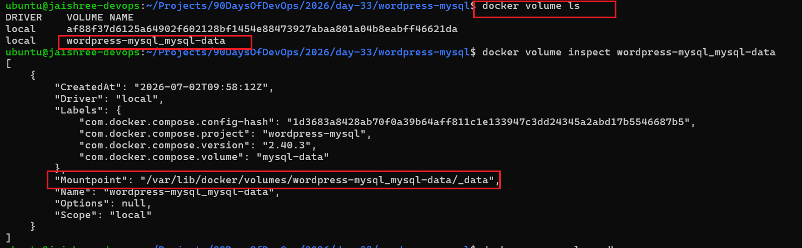

---

### 7. Validate Data Persistence

Recreated the application and confirmed that the database data remained available because of the named volume.

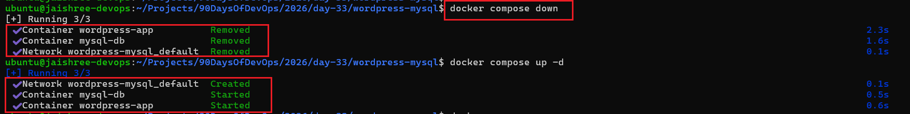

---

### 8. Configure WordPress

Completed the initial WordPress installation from the browser.

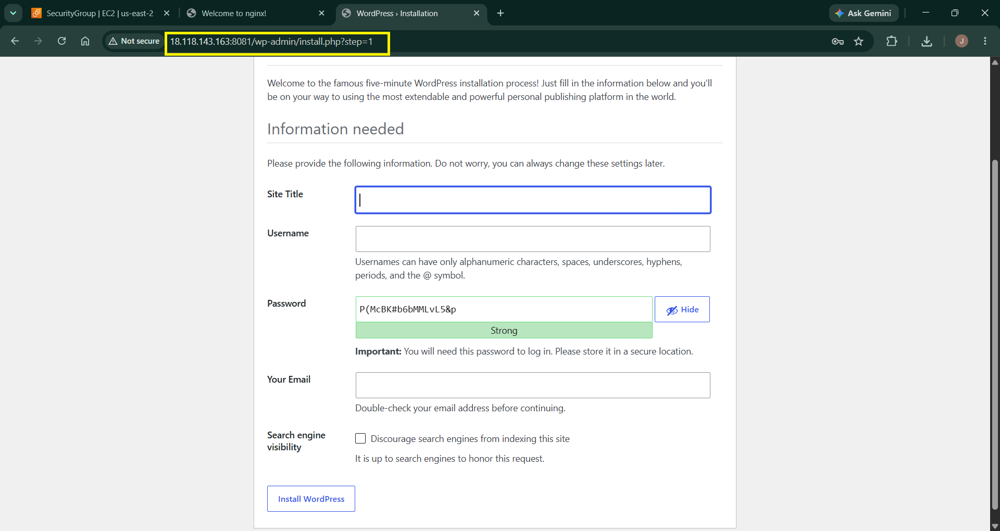

---

### 9. Verify WordPress Dashboard

Successfully logged in to the WordPress Admin Dashboard and confirmed that the application was working correctly.

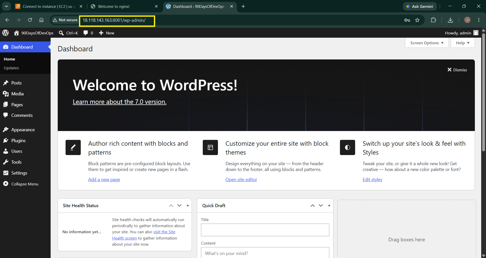

### Key Observation

- Docker Compose automatically created the required network and named volume.
- WordPress connected to MySQL using the service name instead of an IP address.
- Database data persisted even after recreating the containers.
- A complete multi-container application was deployed using a single Docker Compose file.

---

# Task 4: Practice Docker Compose Commands

### 1. Start Services in Detached Mode

Started all application services in detached mode and verified that the containers were running successfully in the background.

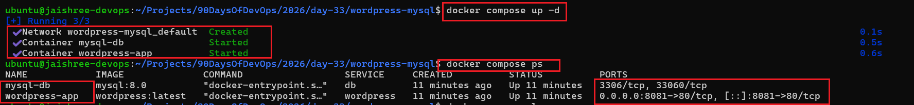

---

### 2. View Application Logs

Viewed logs from all running services to monitor container activity and verify successful startup.

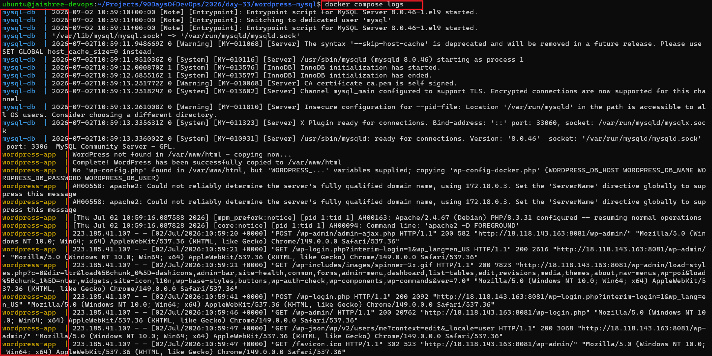

---

### 3. View Logs for a Specific Service

Filtered logs for the WordPress service to troubleshoot and monitor a single container.

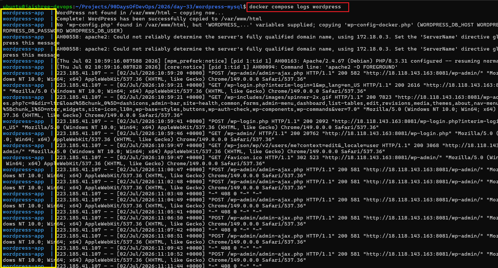

---

### 4. Manage the Application Lifecycle

Successfully performed service lifecycle operations including stopping, starting, restarting, and removing the application.

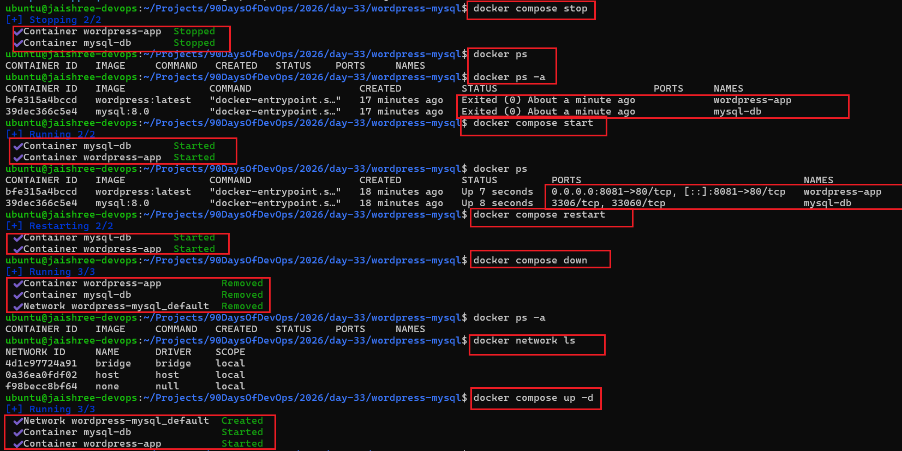

---

### 5. Verify Application Availability

Confirmed that the WordPress application remained accessible after restarting the services.

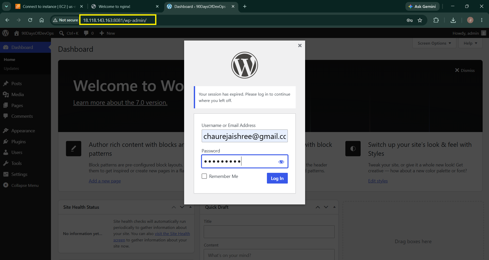

### Key Observation

- Docker Compose provides a simple way to manage the complete application lifecycle.
- Individual services can be monitored and managed independently.
- Application data remained intact because the MySQL database was stored in a named volume.
- Restarting containers did not affect the application configuration or database.

---

# Task 5: Manage Environment Variables

### 1. Create a Dedicated Environment File

Created a `.env` file to store database credentials separately from the Docker Compose configuration.

> **Note:** The `.env` file contains sensitive credentials and is excluded from the repository in production environments.

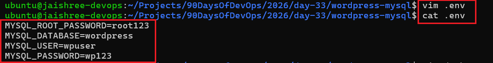

---

### 2. Update the Docker Compose Configuration

Modified the Compose configuration to load database credentials from the `.env` file instead of hardcoding them.

**Docker Compose File**

📄 [wordpress-mysql-env/docker-compose.yml](wordpress-mysql-env/docker-compose.yml)

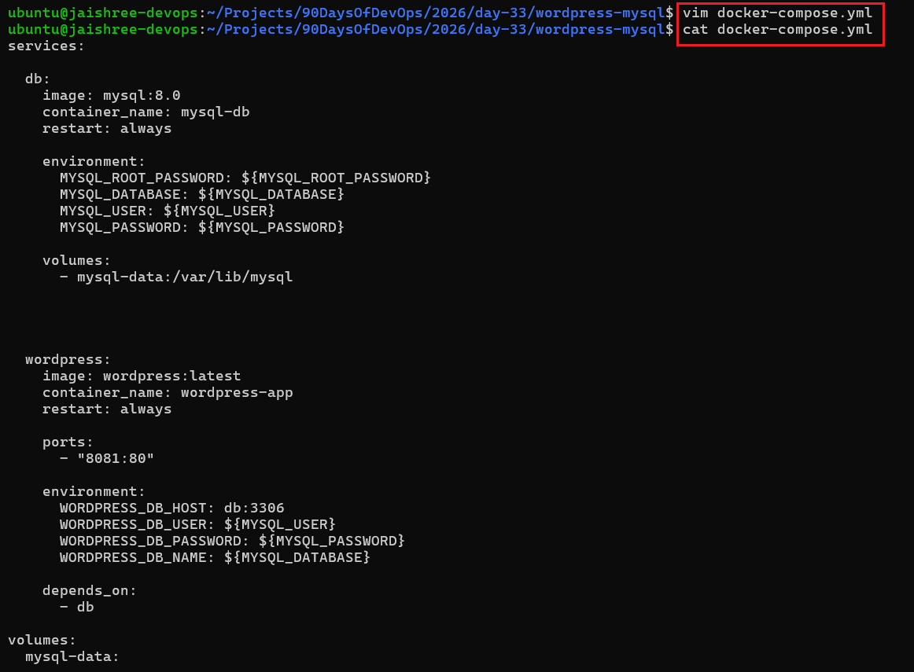

---

### 3. Validate Environment Variables

Verified that Docker Compose successfully loaded all variables from the `.env` file and generated the expected configuration.

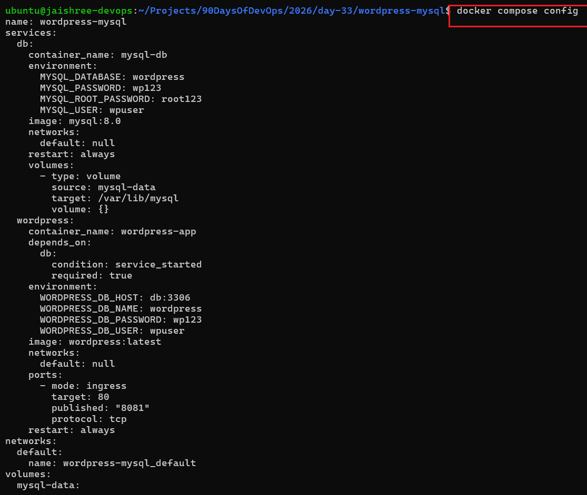

---

### 4. Deploy the Application

Successfully deployed the application using the externalized configuration and confirmed that both services started correctly.

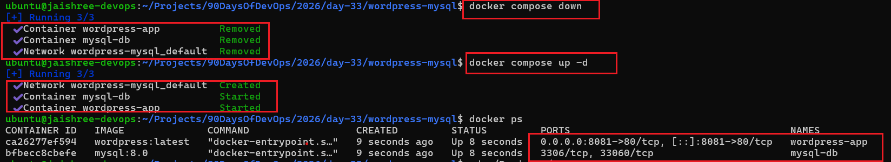

### Key Observation

- Environment variables separated sensitive configuration from the Compose file.
- Docker Compose automatically loaded variables from the `.env` file.
- The configuration became cleaner, reusable, and easier to maintain across environments.

---

# Final Outcome

Successfully deployed a production-style multi-container WordPress application using Docker Compose. Configured automatic networking, persistent storage with named volumes, centralized application configuration using environment variables, and managed the complete application lifecycle through Docker Compose.

---

# Key Learnings

- Learned how Docker Compose simplifies multi-container deployments using a declarative YAML configuration.
- Built and deployed a complete WordPress and MySQL application from a single Compose file.
- Understood Docker Compose networking and service discovery using service names.
- Implemented persistent database storage using Docker Named Volumes.
- Practiced Docker Compose lifecycle commands for deploying and managing applications.
- Improved configuration management by externalizing sensitive values into a `.env` file.
- Learned how Docker Compose enables repeatable, scalable, and maintainable containerized deployments.
