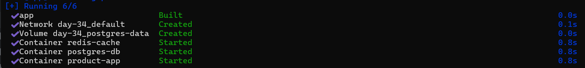
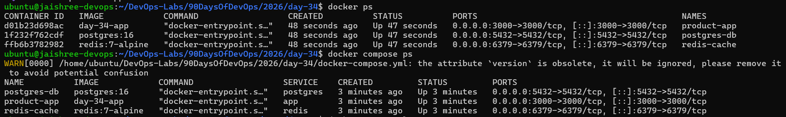
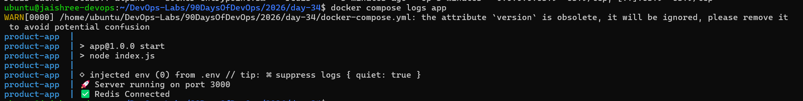
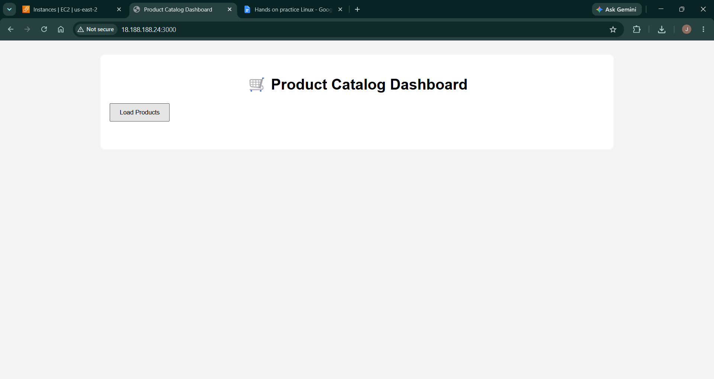
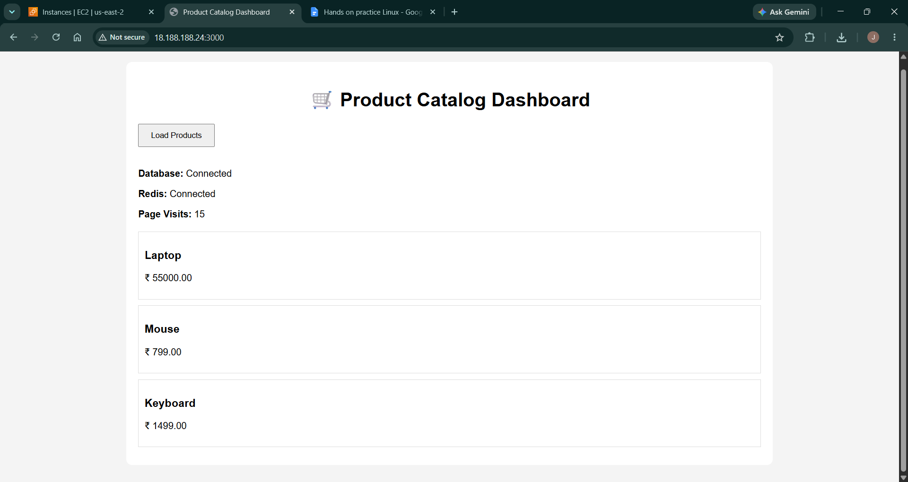
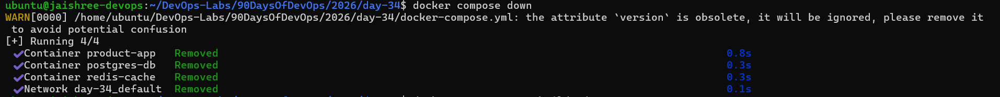
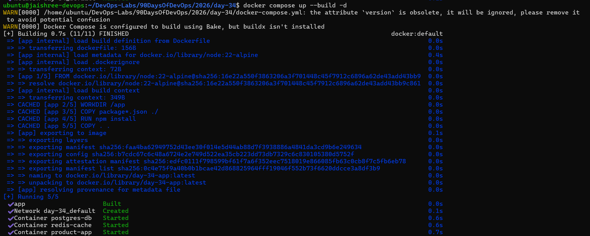
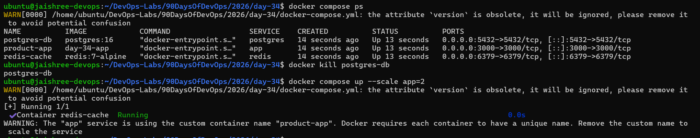

# Day 34 - Docker Compose Advanced: Build a 3-Tier Product Catalog Application

## Objective

Learn how Docker Compose can be used to build and manage a production-style multi-container application. Deploy a custom Node.js application integrated with PostgreSQL and Redis, understand Docker networking, persistent storage, container lifecycle management, rebuilding containers, troubleshooting, and Docker Compose scaling concepts.

---

## Prerequisites

- Docker Engine installed
- Docker Compose v2 installed
- Ubuntu EC2 Instance
- Git & GitHub configured
- Basic Docker knowledge

---

## Technologies Used

- Docker
- Docker Compose
- Node.js
- Express.js
- PostgreSQL 16
- Redis 7
- Ubuntu EC2
- AWS EC2

---

## Project Files

- [Docker Compose Configuration](docker-compose.yml)
- [Application Dockerfile](app/Dockerfile)
- [Database Initialization Script](database/init.sql)
- [Application Source Code](app/)
- [Project Documentation](README.md)

---

# Task 1: Build the Product Catalog Application

### 1. Create the Project Structure

Created a structured project containing:

- Node.js Application
- PostgreSQL Database
- Redis Cache
- Docker Compose Configuration

---

### 2. Develop the Node.js Application

Built a Product Catalog application using Express.js.

Created:

- index.js
- db.js
- redis.js
- package.json

---

### 3. Create the Frontend

Developed the frontend using HTML, CSS, and JavaScript.

Created:

- index.html
- style.css
- script.js

---

### 4. Initialize the Database

Created an SQL initialization script to automatically populate PostgreSQL with sample product data.

**Database Script**

[database/init.sql](database/init.sql)

### Key Observation

- Database initialization became fully automated.
- Sample product data was loaded during container creation.

---

# Task 2: Containerize the Application

### 1. Create the Dockerfile

Created a custom Dockerfile to build the Node.js application image.

**Dockerfile**

[app/Dockerfile](app/Dockerfile)

---

### 2. Configure .dockerignore

Created a `.dockerignore` file to exclude unnecessary files from the Docker build context.

Ignored:

- node_modules
- npm log files

### Key Observation

- Reduced Docker image size.
- Improved build performance.
- Optimized build context.

---

# Task 3: Configure Docker Compose

### 1. Create the Docker Compose Configuration

Configured a multi-container application consisting of:

- Product Catalog Application
- PostgreSQL Database
- Redis Cache

Configured:

- Named Volume
- Environment Variables
- Port Mapping
- Service Dependencies

**Compose File**

[docker-compose.yml](docker-compose.yml)

---

### 2. Build and Deploy the Application

Built and started all services using Docker Compose.

```bash
docker compose up --build -d
```

Docker Compose automatically:

- Built the application image
- Created the Docker network
- Created the persistent volume
- Started PostgreSQL
- Started Redis
- Started the Node.js application



### Key Observation

- Docker Compose deployed the complete application using a single command.
- All services communicated through the default Compose network.

---

# Task 4: Verify the Deployment

### 1. Verify Running Containers

Verified that all application containers were running successfully.

Commands used:

```bash
docker ps

docker compose ps
```



---

### 2. Verify Application Logs

Checked application logs to confirm successful startup.

```bash
docker compose logs app
```



---

### 3. Verify Browser Output

Accessed the application using the EC2 Public IP.

```text
http://<EC2-Public-IP>:3000
```

Verified:

- Product Catalog Dashboard loaded successfully.
- PostgreSQL connection established.
- Redis connection established.
- Products loaded successfully.
- Page visit counter updated through Redis.





### Key Observation

- The frontend successfully communicated with the backend.
- PostgreSQL stored application data.
- Redis cached page visit information.

---

# Task 5: Manage the Docker Compose Lifecycle

### 1. Stop the Application

Stopped all running services.

```bash
docker compose down
```



---

### 2. Rebuild the Application

Rebuilt and restarted the complete application.

```bash
docker compose up --build -d
```



### Key Observation

- Docker Compose rebuilt the application image successfully.
- Named volumes preserved the PostgreSQL database.

---

# Task 6: Test Container Recovery

### 1. Simulate Database Failure

Stopped the PostgreSQL container unexpectedly.

```bash
docker kill postgres-db
```

---

### 2. Observe Container Behavior

Verified the application behavior after the database container stopped.

### Key Observation

- Database connectivity was interrupted.
- Demonstrated the importance of restart policies for production workloads.

---

# Task 7: Test Docker Compose Scaling

### 1. Attempt to Scale the Application

Executed the following command:

```bash
docker compose up --scale app=2
```



### Key Observation

Scaling failed because the application service used a fixed container name:

```yaml
container_name: product-app
```

Docker Compose cannot create multiple containers with identical container names.

### Lesson Learned

To enable service scaling:

- Remove the `container_name` property.
- Allow Docker Compose to generate unique container names automatically.

---

# Final Outcome

Successfully built and deployed a production-style **3-tier Product Catalog Application** using Docker Compose on an AWS EC2 Ubuntu instance. Integrated a custom Node.js application with PostgreSQL and Redis, managed the complete application lifecycle, validated service communication, rebuilt the application, tested container recovery, and explored Docker Compose scaling limitations.

---

# Key Learnings

- Built a custom Docker image using a Dockerfile.
- Deployed a complete multi-container application using Docker Compose.
- Integrated PostgreSQL with a Node.js application.
- Used Redis for caching and page visit tracking.
- Connected services through Docker Compose networking.
- Implemented persistent storage using Docker Volumes.
- Practiced Docker Compose lifecycle management.
- Used Docker Compose logs for troubleshooting.
- Learned how rebuilding affects containers and volumes.
- Understood Docker Compose scaling limitations when using fixed container names.
- Gained hands-on experience deploying a real-world 3-tier application on AWS EC2.
