# Day 35 - Docker Image Optimization with Multi-Stage Builds

## Objective

The objective of this hands-on exercise was to understand how Docker multi-stage builds help create lightweight, secure, and production-ready container images.

---

## Prerequisites

- Docker Engine
- Docker Hub Account
- Ubuntu (WSL)
- Git & GitHub
- Basic understanding of Docker Images and Containers

---

## Technologies Used

- Docker
- Docker Hub
- Node.js 22
- Node.js Alpine
- Linux (WSL Ubuntu)

---

## Project Files

| File | Description |
|------|-------------|
| [`app/Dockerfile`](app/Dockerfile) | Single-stage Docker build |
| [`app/Dockerfile.multistage`](app/Dockerfile.multistage) | Multi-stage Docker build |
| [`app/Dockerfile.final`](app/Dockerfile.final) | Production-ready Dockerfile with Docker best practices |
| [`app/app.js`](app/app.js) | Node.js application |
| [`app/package.json`](app/package.json) | Project dependencies |
| [`README.md`](README.md) | Project documentation |
---

## Project Structure

```text
day-35/
│
├── app/
│   ├── Dockerfile
│   ├── Dockerfile.final
│   ├── Dockerfile.multistage
│   ├── app.js
│   └── package.json
│
├── images/
│
├── README.md
│
└── day-35-multistage-hub.md
```

---

## Task 1 - Build a Single-Stage Docker Image

Created a traditional Docker image using a single-stage Dockerfile for the Node.js application.

## Activities Performed

- Built the Docker image.
- Verified the generated image.
- Checked the image size.
- Ran the application inside a Docker container.

## Observation

The single-stage image included the entire build environment, source code, dependencies, and runtime components, resulting in a much larger image than required for production deployments.

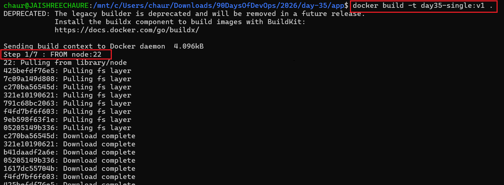

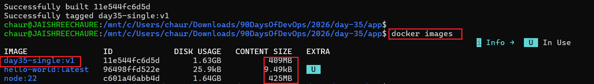

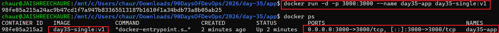

---

## Task 2 - Optimize the Image Using Multi-Stage Builds

Created a multi-stage Dockerfile to separate the build environment from the runtime environment.

## Activities Performed

- Created a dedicated builder stage.
- Used a lightweight runtime image.
- Built the optimized image.
- Compared image sizes.
- Verified application functionality.

## Observation

The multi-stage build copied only the required application files into the final image, significantly reducing the image size while   maintaining identical functionality.

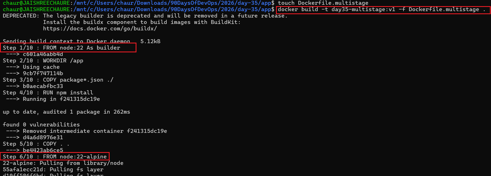

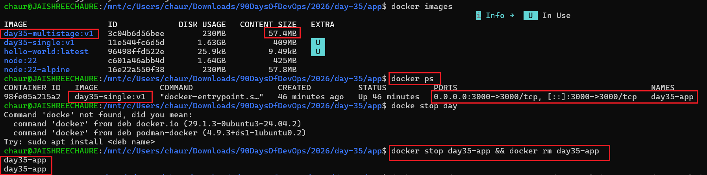

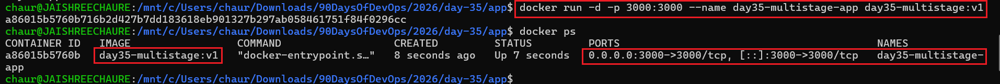

---

## Task 3 - Publish the Image to Docker Hub

Published the optimized Docker image to Docker Hub for centralized image storage and distribution.

## Activities Performed

- Logged in to Docker Hub.
- Tagged the optimized image.
- Pushed the image to Docker Hub.
- Verified successful upload.
- Pulled the image from Docker Hub.
- Validated image portability.

## Observation

The optimized image was successfully stored in Docker Hub and could be downloaded and executed on any Docker-enabled environment without rebuilding the application.

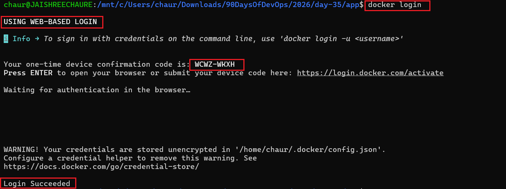

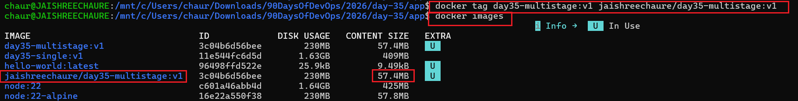

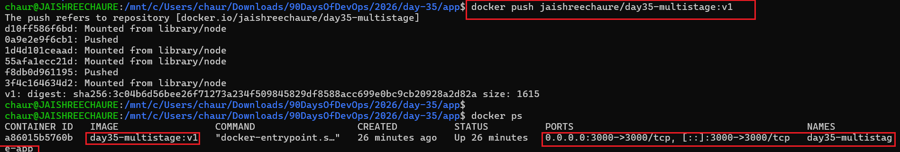

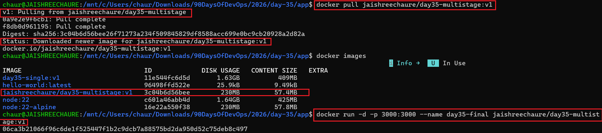

---

## Task 4 - Repository Management

Configured the Docker Hub repository for better version management.

## Activities Performed

- Verified repository creation.
- Added a repository description.
- Published version tags.
- Created the `latest` image tag.

## Observation

Using version tags simplifies release management and enables consistent deployments across different environments.

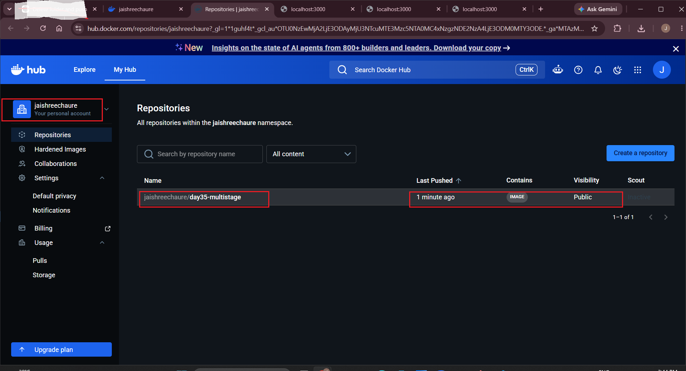

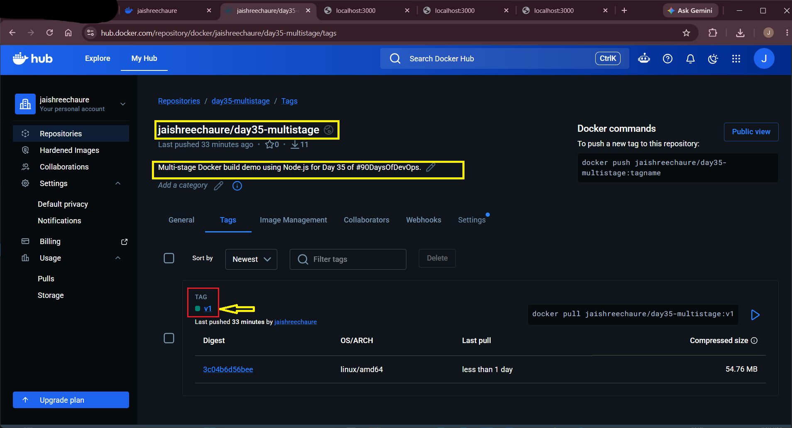

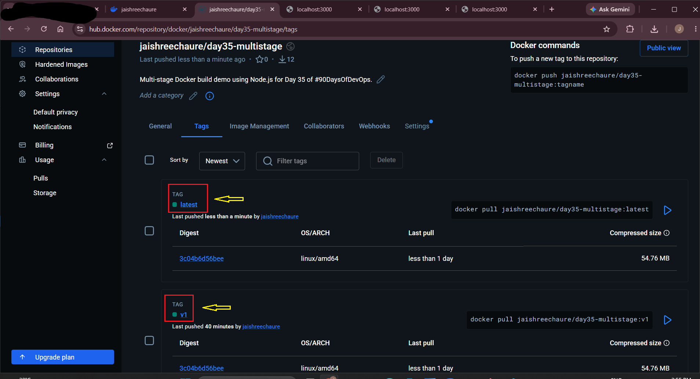

---

## Task 5 - Dockerfile Best Practices

Created a production-ready Dockerfile by applying Docker best practices.

## Improvements Implemented

- Multi-stage build architecture
- Lightweight Alpine runtime image
- Non-root application user
- Reduced attack surface
- Optimized image layers
- Production-ready image structure

## Observation

These best practices improve security, reduce image size, increase maintainability, and make the image suitable for production deployments.

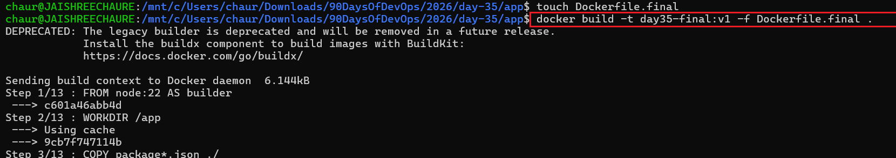

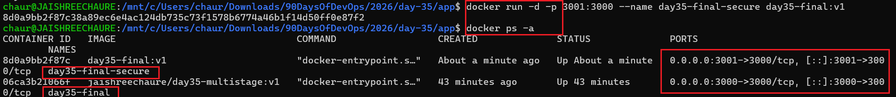

---

## Application Verification

Verified that both optimized Docker images successfully served the Node.js application.

## Browser Output

### Port 3000

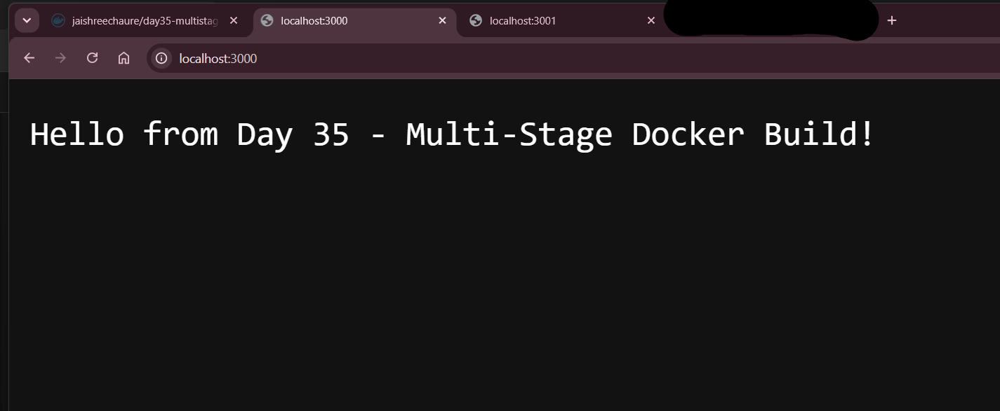

### Port 3001

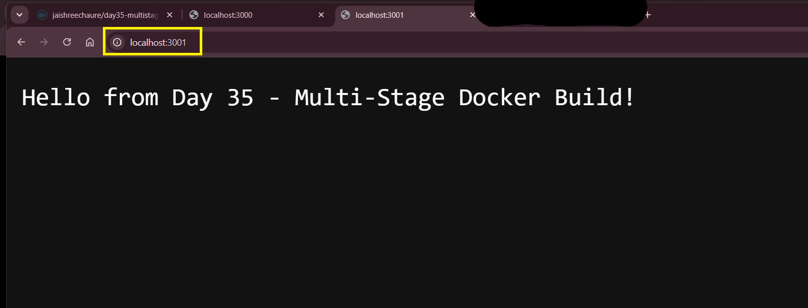

---

## Image Size Comparison

| Build Type | Image Size |
|------------|-----------:|
| Single-Stage Build | **409 MB** |
| Multi-Stage Build | **57.4 MB** |

## Result

The multi-stage Docker build reduced the image size by approximately **86%**, making the image faster to download and deploy while reducing storage requirements and network bandwidth consumption.

---

## Docker Hub Repository

The optimized Docker image has been successfully published to Docker Hub.

**Repository:** <https://hub.docker.com/repository/docker/jaishreechaure/day35-multistage/tags>

## Available Tags

| Tag | Description |
|------|-------------|
| `latest` | Latest production-ready image |
| `v1.0` | Initial release |

## Pull the Image

`docker pull jaishreechaure/day35-multistage:latest`

## Run the Image

`docker run -d -p 3000:3000 --name day35-app jaishreechaure/day35-multistage:latest`

---

## Cleanup

After completing the lab, remove unnecessary Docker resources to free disk space and keep your environment clean.

| Task | Command |
|------|---------|
| Stop running container | `docker stop day35-app` |
| Remove container | `docker rm day35-app` |
| Remove Docker Hub images | `docker rmi jaishreechaure/day35-multistage:latest jaishreechaure/day35-multistage:v1.0` |
| Remove local images | `docker rmi single-stage-app multistage-app production-app` |
| Remove unused images | `docker image prune -a` |
| Remove unused volumes | `docker volume prune` |
| Remove unused networks | `docker network prune` |
| Remove unused Docker resources | `docker system prune -a` |
| Remove all unused resources (including volumes) | `docker system prune -a --volumes` |

> **Note:** `docker system prune -a --volumes` permanently removes all unused containers, images, networks, build cache, and volumes.


---

## Challenges Faced

- Understanding the difference between build and runtime stages.
- Managing Docker image tagging and versioning.
- Publishing images to Docker Hub.
- Applying Dockerfile best practices for production deployments.

---

## Key Learnings

- Learned how Docker Multi-Stage Builds optimize container images.
- Compared single-stage and multi-stage Docker images.
- Reduced Docker image size significantly.
- Published and managed Docker images using Docker Hub.
- Implemented image versioning using tags.
- Applied Dockerfile best practices for production-ready containers.
- Improved container security by running the application as a non-root user.
- Built lightweight, secure, and portable Docker images.

---

## Final Outcome

Successfully optimized a Node.js application using Docker multi-stage builds by reducing the Docker image size from **409 MB** to **57.4 MB** (approximately **86% smaller**) while preserving application functionality. The optimized image was published to Docker Hub with version tags, verified through image pull and execution, and built using Docker best practices such as multi-stage builds, a lightweight Alpine runtime image, and a non-root application user. This hands-on lab provided practical experience in creating lightweight, secure, portable, and production-ready Docker images.