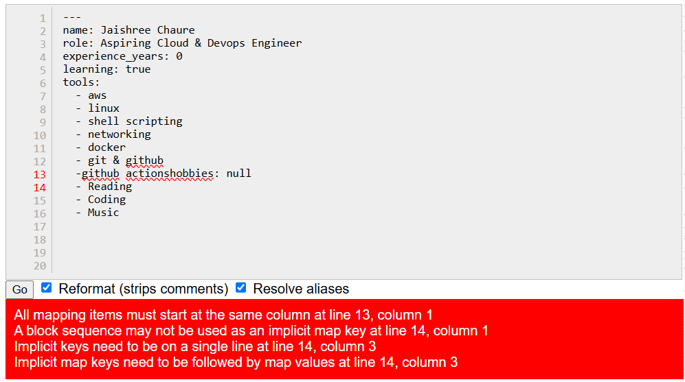
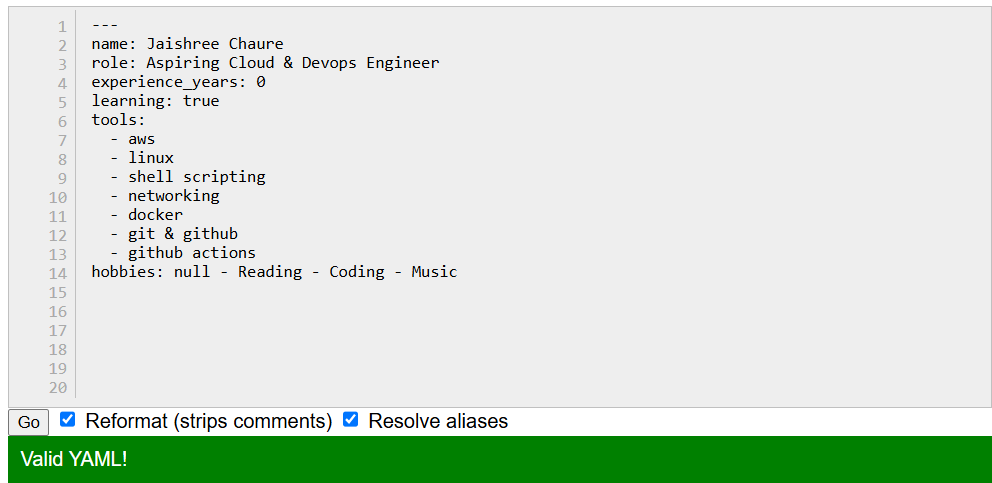
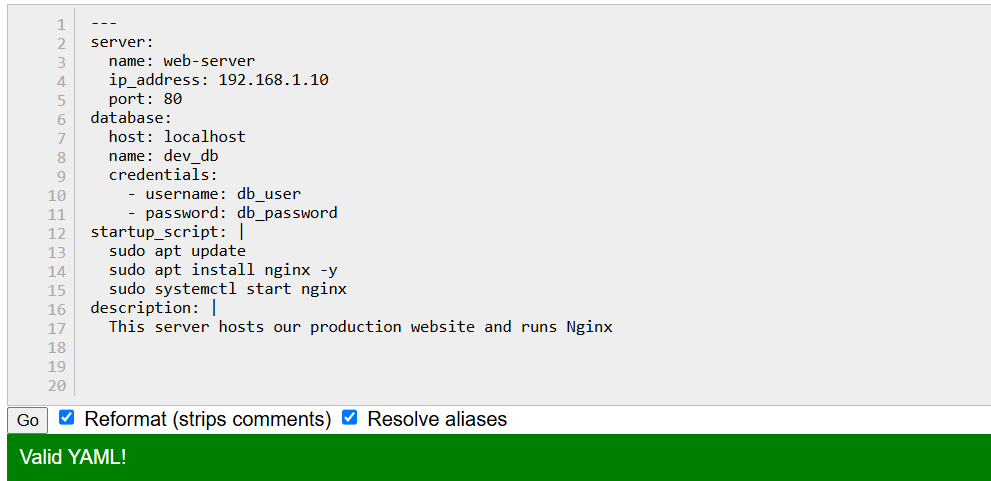

# Day 38 – YAML Basics

## Overview

Today I explored the fundamentals of **YAML (YAML Ain't Markup Language)**, a human-readable configuration language widely used in **GitHub Actions, Docker Compose, Kubernetes, Ansible, and CI/CD pipelines**.

---

## YAML Files

| File | Description |
|------|-------------|
| [`person.yml`](./yaml-files/person.yml) | Demonstrates key-value pairs, lists, and boolean values |
| [`server.yml`](./yaml-files/server.yml) | Demonstrates nested objects and multi-line strings |

---

### Task 1: Key-Value Pairs
Create `person.yml` that describes yourself with:
- `name`
- `role`
- `experience_years`
- `learning` (a boolean)

**Verify:** Run `cat person.yml` — does it look clean? No tabs?

**File:** [`person.yml`](./yaml-files/person.yml)

---

### Task 2: Lists
Add to `person.yml`:
- `tools` — a list of 5 DevOps tools you know or are learning
- `hobbies` — a list using the inline format `[item1, item2]`

Write in your notes: What are the two ways to write a list in YAML?

### Two Ways to Write Lists in YAML

**1. Block Style**

```yaml
tools:
  - aws
  - linux
  - shell scripting
  - networking
  - docker
  - git & github
  - github actions
```

**2. Inline Style**

```yaml
hobbies: [Reading, Coding, Music]
```

**File:** [`person.yml`](./yaml-files/person.yml)

---

### Task 3: Nested Objects
Create `server.yml` that describes a server:
- `server` with nested keys: `name`, `ip`, `port`
- `database` with nested keys: `host`, `name`, `credentials` (nested further: `user`, `password`)

**Verify:** Try adding a tab instead of spaces — what happens when you validate it?

**Result:** Validation failed due to incorrect indentation because YAML only supports spaces.

 **File:** [`server.yml`](./yaml-files/server.yml)

---

### Task 4: Multi-line Strings
In `server.yml`, add a `startup_script` field using:
1. The `|` block style (preserves newlines)
2. The `>` fold style (folds into one line)

Write in your notes: When would you use `|` vs `>`?

### Literal Block (`|`)

- Preserves line breaks exactly as written.
- Best for shell scripts, configuration files, and formatted text.

```yaml
startup_script: |
  echo "Starting SSH..."
  systemctl start ssh
  systemctl status ssh
  echo "Script completed."
```

### Folded Block (`>`)

- Folds multiple lines into a single line.
- Best for long descriptions or messages.

```yaml
description: >
  This server hosts the application.
  It starts the SSH service
  and verifies its status
  before deployment.
```
**File:** [`server.yml`](./yaml-files/server.yml)

---

### Task 5: Validate Your YAML
1. Install `yamllint` or use an online validator
2. Validate both your YAML files
3. Intentionally break the indentation — what error do you get?
4. Fix it and validate again

**YAML Lint:** https://www.yamllint.com/

#### person.yml

- Invalid YAML



- Valid YAML



#### server.yml

- Valid YAML



---

### Task 6: Spot the Difference
Read both blocks and write what's wrong with the second one:

```yaml
# Block 1 - correct
name: devops
tools:
  - docker
  - kubernetes
```

```yaml
# Block 2 - broken
name: devops
tools:
- docker
  - kubernetes
```
**Observation:** The second block has incorrect indentation. YAML requires consistent spacing and does not allow inconsistent indentation.

---

## What I Learned

- YAML uses **key-value pairs, lists, and nested objects**; always use **spaces**, never tabs.
- Lists can be written in **block style** (`- item`) or **inline style** (`[item1, item2]`).
- **Best Practice:** Use **2-space indentation** and validate YAML before using it in DevOps workflows.