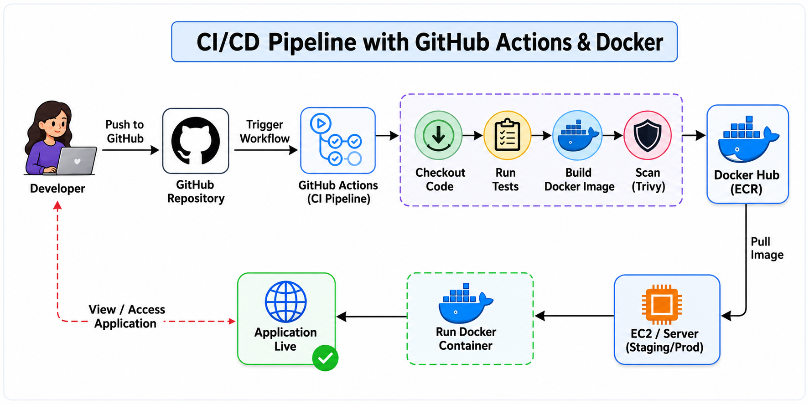

# Day 39 – What is CI/CD?

---

## Task 1: The Problem

Think about a team of 5 developers all pushing code to the same repository and manually deploying to production.

### 1. What can go wrong?

- Overwrites and conflicts when multiple developers deploy simultaneously.
- No rollback strategy if a deployment fails.
- Human errors and configuration drift during manual deployments.
- Production downtime caused by deployment issues.
- Limited audit trail to identify the source of production problems.

### 2. What does "It works on my machine" mean and why is it a real problem?

- Code works locally but fails in other environments.
- Differences in dependencies, OS versions, or configurations can cause failures.
- It leads to debugging delays and unreliable deployments.

### 3. How many times a day can a team safely deploy manually?

- Usually, only 1–2 manual deployments per day are considered safe.
- Manual deployments require human oversight and validation.
- Frequent deployments increase the risk of production issues.

---

### Task 2: CI vs CD
Research and write short definitions (2-3 lines each):
1. **Continuous Integration** — what happens, how often, what it catches

- When developers push code to a version control system (e.g., GitHub), the CI pipeline automatically:
  - Pulls the latest code.
  - Builds the application.
  - Runs automated tests.
  - Validates code quality.
  - Generates build artifacts if successful.

- **How often:**
  - Every time code is pushed, often multiple times a day.

- **What it catches:**
  - Build failures, test failures, integration issues, and configuration problems.

- **Example: Facebook**
  - Engineers commit code dozens of times per day, triggering automated builds and tests across thousands of servers.

---

2. **Continuous Delivery** — how it's different from CI, what "delivery" means

- CI stops when the code is successfully built and tested.
- Continuous Delivery ensures the application is packaged, versioned, and always ready for deployment.
- Deployments can be triggered at any time with a manual approval or a single command.

- **Example: Amazon**
  - Services are continuously tested and packaged, making them production-ready at any time.

---

3. **Continuous Deployment** — how it differs from Delivery, when teams use it

- Continuous Deployment goes one step further by automatically deploying every successful change to production.
- No manual approval is required once the pipeline passes.
- It is commonly used by teams with strong automated testing, monitoring, and rollback strategies.

- **When teams use it:**
  - Teams that release small, frequent updates and have mature CI/CD practices.

- **Example: Netflix**
  - Code that passes automated tests is automatically deployed to production, supported by robust monitoring and rollback mechanisms.

---

### Task 3: Pipeline Anatomy

A pipeline has these parts — write what each one does.

- **Trigger**
  - Starts the pipeline.
  - Examples: Push, pull request, scheduled cron job, or manual trigger.

- **Stage**
  - A logical grouping of jobs that organizes the pipeline into phases such as Build, Test, and Deploy.

- **Job**
  - A unit of work within a stage.
  - Breaks a stage into smaller, executable tasks.
  - Each job can contain multiple steps.
  - Examples: Cloning code, running tests, and building Docker images.

- **Step**
  - The smallest execution unit inside a job.
  - Represents a single command or action.
  - Examples: `npm install` and `docker build`.

- **Runner**
  - The machine or environment that executes pipeline jobs.

- **Artifact**
  - An output produced by a job and stored for later use.
  - Examples: Docker images and compiled binaries.
  - Allows sharing results between pipeline stages (Build → Test → Deploy).

---

### Task 4: Draw a Pipeline

The following diagram illustrates a CI/CD pipeline using GitHub Actions and Docker.

### Workflow

- Developer pushes code to GitHub.
- GitHub Actions workflow is triggered.
- The source code is checked out.
- Automated tests are executed.
- A Docker image is built.
- The Docker image is scanned using Trivy.
- The image is pushed to Docker Hub / ECR.
- The EC2 server pulls the Docker image.
- The Docker container is started.
- The application becomes live.

---

### Task 5: Explore in the Wild

1. Open any popular open-source repository on GitHub.
2. Find its `.github/workflows/` directory.
3. Open one workflow YAML file.
4. Write your observations.

**Repository:** Kubernetes Minikube

- Workflow file:
  - https://github.com/kubernetes/minikube/blob/master/.github/workflows/build.yml

- **What triggers it?**
  - Manual workflow dispatch.
  - Push events on the `master` branch for specific files and directories.

- **How many jobs does it have?**
  - It has 3 jobs.

- **What does it do?** (Best guess)

  - **First job: build_minikube**
    - Uses an Ubuntu 22.04 runner.
    - Checks out the source code.
    - Installs dependencies.
    - Builds Minikube binaries.
    - Uploads build artifacts.

  - **Second job: lint**
    - Checks the code for style, formatting, and common issues.
    - Helps identify problems before the code is executed.

  - **Third job: unit_test**
    - Runs automated unit tests.
    - Verifies that individual components behave as expected.

---