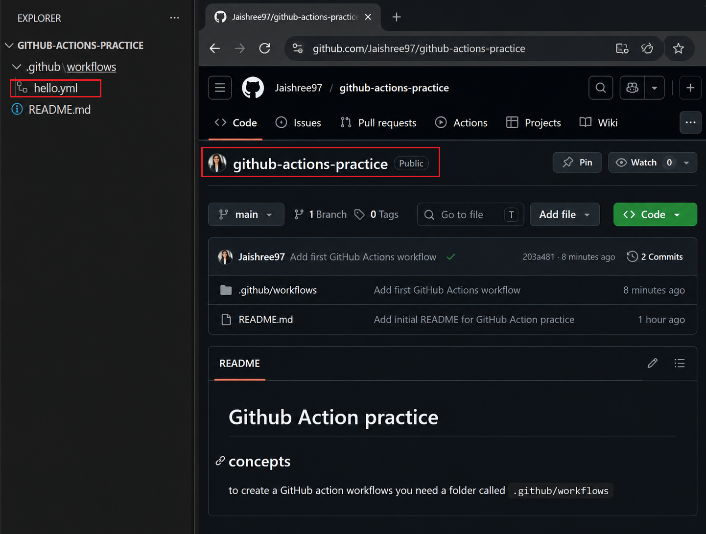
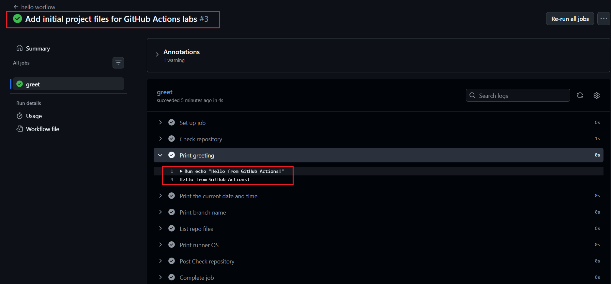
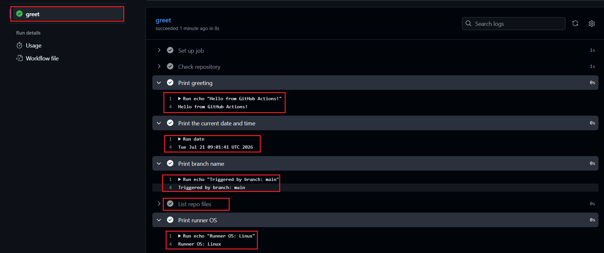
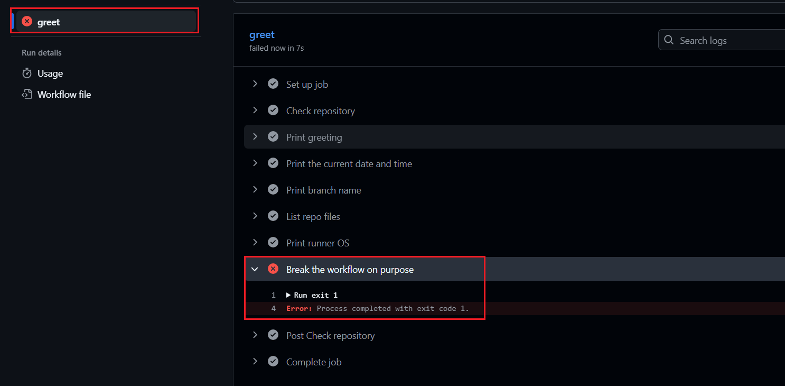
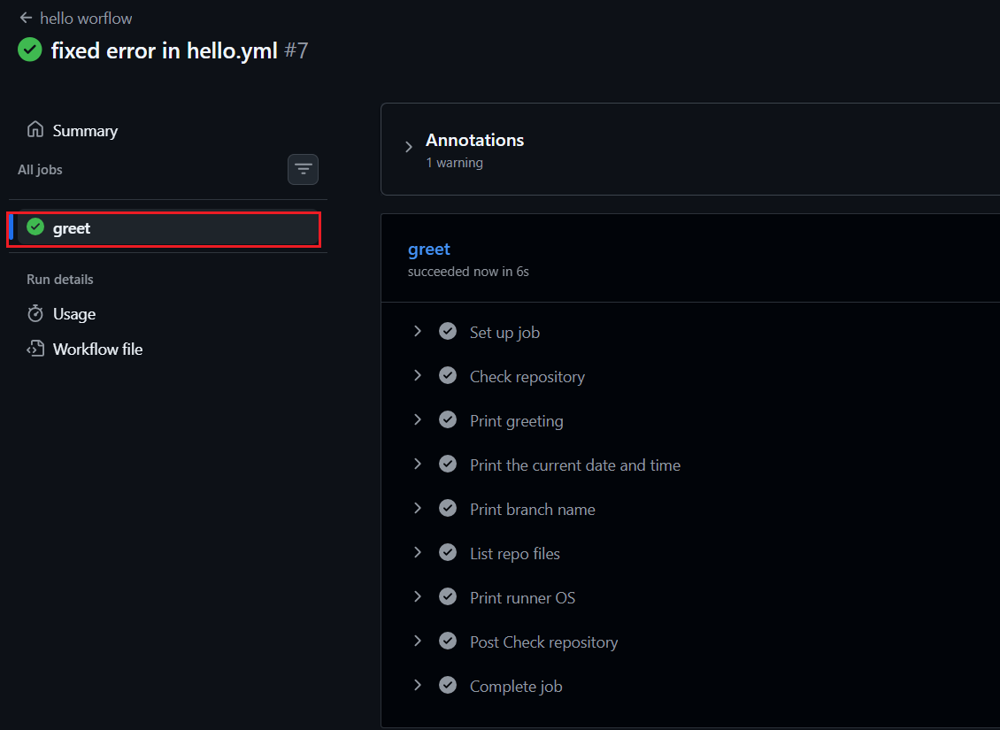

# Day 40 – Your First GitHub Actions Workflow

### Task 1: Set Up

1. Create a new **public** GitHub repository called `github-actions-practice`.
2. Clone it locally.
3. Create the folder structure: `.github/workflows/`.

> **GitHub Actions Practice Repository:**  
> [Click here to view the repository](https://github.com/Jaishree97/github-actions-practice)

---

### Task 2: Hello Workflow

Create `.github/workflows/hello.yml` with a workflow that:

1. Triggers on every `push`.
2. Has one job called `greet`.
3. Runs on `ubuntu-latest`.
4. Has two steps:
   - Step 1: Check out the code using `actions/checkout`.
   - Step 2: Print `Hello from GitHub Actions!`.

Push the changes and go to the **Actions** tab on GitHub to watch the workflow run.

**Verification:** The workflow executed successfully with a green status.

---

### Task 3: Understand the Anatomy

- `on:`
  - Defines when the workflow is triggered.
  - Listens for events such as `push`, `pull_request`, or `workflow_dispatch`.

- `jobs:`
  - Defines the jobs that the workflow will execute.
  - A workflow can have one or multiple jobs.

- `runs-on:`
  - Specifies the virtual machine (runner) environment the job will use.
  - Examples: `ubuntu-latest`, `windows-latest`, and `macos-latest`.

- `steps:`
  - Defines the sequence of actions the job will execute.
  - Steps run one after another inside a job.

- `uses:`
  - Uses a pre-built GitHub Action.
  - Example: `actions/checkout@v4`.

- `run:`
  - Executes shell commands directly on the runner.

- `name:` (on a step)
  - Gives the step a human-readable name in the GitHub Actions UI.

---

### Task 4: Add More Steps

Update `hello.yml` to:

1. Print the current date and time.
2. Print the name of the branch that triggered the run.
3. List the files in the repository.
4. Print the runner's operating system.

Push the changes and observe the new workflow run.

---

### Task 5: Break It On Purpose

1. Added a failing command (`exit 1`) to the workflow.
2. Pushed the changes and observed the failed pipeline in the Actions tab.
3. Fixed the issue and pushed the changes again.

When a workflow step fails:

- The pipeline status changes from green to red.
- GitHub stops executing the remaining steps.
- The failed step is highlighted in the Actions tab.
- Error messages and exit codes are available in the workflow logs.

**Failed Workflow Run**

After reviewing the error logs, I removed the failing command and pushed the changes again.

**Fixed Workflow Run**

#### Key Takeaways

- A failed pipeline is indicated by a red ❌ icon.
- Workflow logs help identify the exact step and reason for failure.
- Every push triggers a new workflow run.
- Fixing the error results in a successful pipeline execution.

---

## Key Learnings

- Created and executed my first GitHub Actions workflow.
- Learned the basic anatomy of a GitHub Actions workflow file.
- Used GitHub-hosted runners to execute workflow steps.
- Explored built-in GitHub context variables.
- Observed both successful and failed workflow executions.
- Learned how to read workflow logs and debug failures.