# Day 41 – Triggers & Matrix Builds

## Task 1: Trigger on Pull Request

### Steps Performed

1. Created `pr-check.yml`.
2. Added the `pull_request` trigger for the `main` branch.
3. Printed the source branch name using GitHub context.
4. Created a feature branch and pushed the changes.
5. Opened a Pull Request and observed the workflow execution.

### Verify

- The workflow appears on the Pull Request page and runs successfully.

> PR Check Workflow:
>
> [Click here to view the workflow file.](./workflows/pr-check.yml)

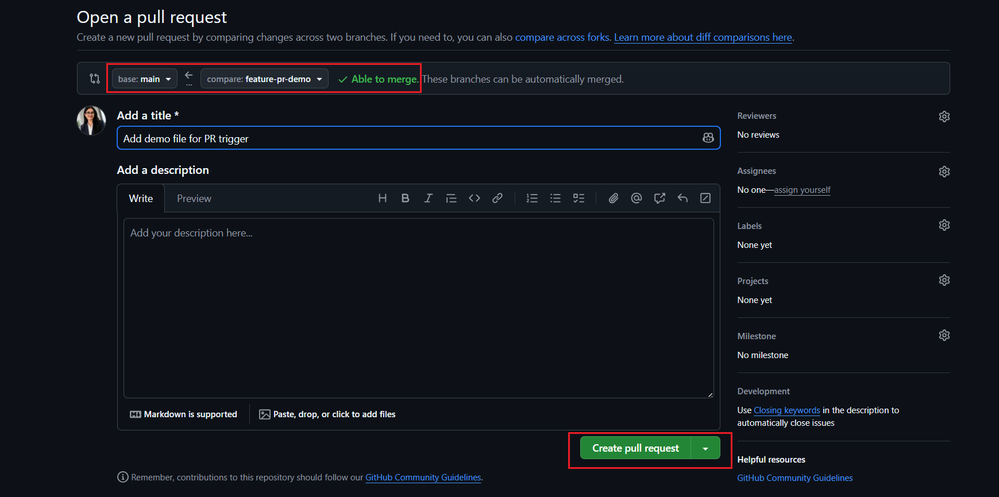

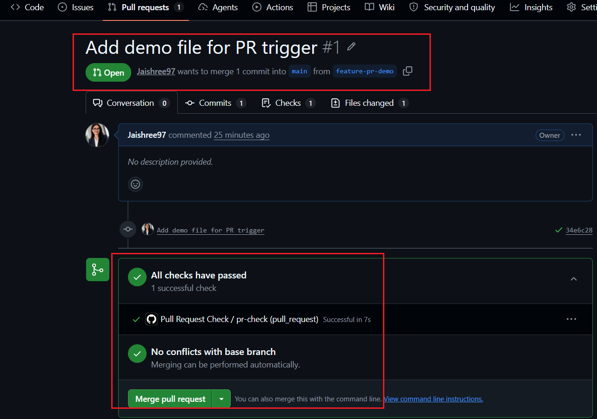

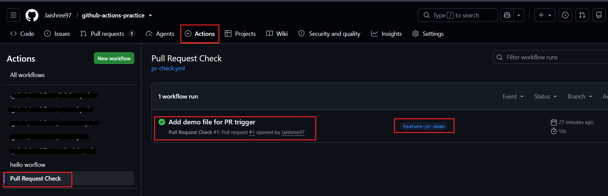

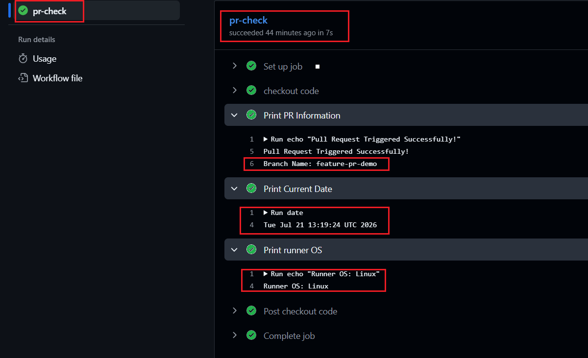

### Notes

- `pull_request` workflows are commonly used for CI checks before merging code.
- Helps validate code changes automatically during the review process.

---

## Task 2: Scheduled Trigger

### Steps Performed

1. Created `schedule.yml`.
2. Added the `schedule` trigger using cron syntax.
3. Configured it to run every day at midnight UTC (`0 0 * * *`).
4. Added `workflow_dispatch` for manual testing.
5. Verified the workflow in the GitHub Actions tab.

### Verify

- The workflow is configured successfully and visible under the GitHub Actions tab.

> Scheduled Workflow:
>
> [Click here to view the workflow file.](./workflows/schedule.yml)

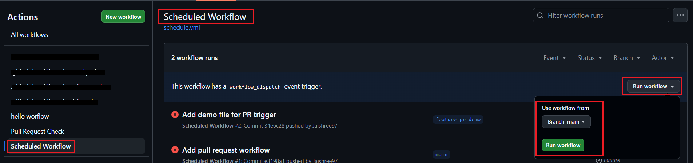

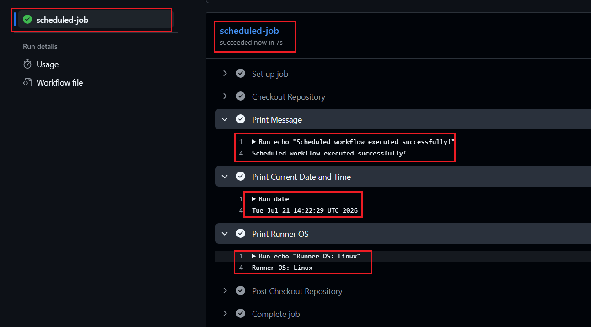

### Notes

- Cron expression for every day at midnight UTC: `0 0 * * *`
- Cron expression for every Monday at 9 AM UTC: `0 9 * * 1`
- Used for nightly builds, security scans, automated reports, cleanup tasks, and backup jobs.

---

## Task 3: Manual Trigger

### Steps Performed

1. Created `manual.yml` using the `workflow_dispatch` trigger.
2. Added an `environment` input with `staging` and `production` options.
3. Printed the selected environment in the workflow logs.
4. Triggered the workflow manually from the GitHub Actions tab.

### Verify

- Successfully triggered the workflow manually and verified the selected environment in the workflow logs.

> Manual Trigger Workflow:
>
> [Click here to view the workflow file.](./workflows/manual.yml)

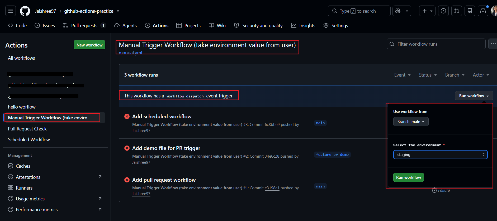

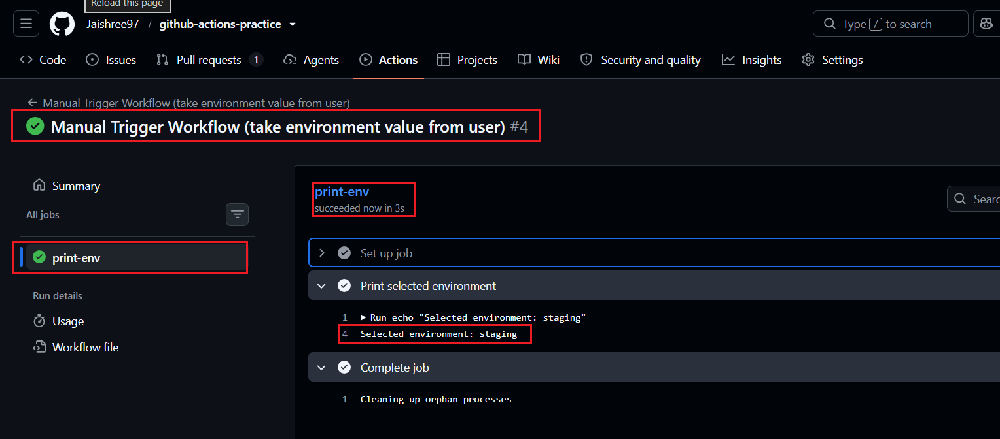

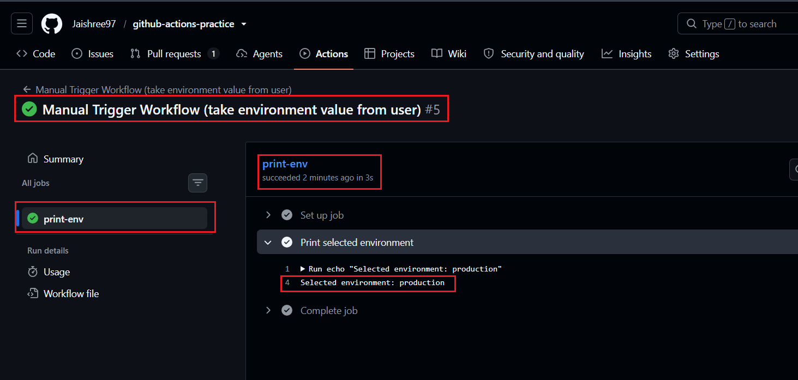

### Notes

- `workflow_dispatch` allows workflows to be triggered manually.
- Inputs can be used to accept user-defined values at runtime.
- Useful for deployments, rollbacks, and environment-specific operations.

---

## Task 4: Matrix Builds

### Steps Performed

1. Created `matrix.yml` to run jobs across multiple Python versions.
2. Configured the matrix strategy for Python `3.10`, `3.11`, and `3.12`.
3. Installed Python dynamically using `actions/setup-python`.
4. Verified that all matrix jobs ran in parallel.
5. Extended the matrix strategy to support multiple operating systems using `matrix-os.yml`.

### Verify

- The Python version matrix runs three jobs in parallel.
- After adding two operating systems, a total of **6 jobs** are executed (`3 Python versions × 2 operating systems`).

> Matrix Build Workflow:
>
> [Click here to view the workflow file.](./workflows/matrix.yml)

> Matrix OS Workflow:
>
> [Click here to view the workflow file.](./workflows/matrix-os.yml)

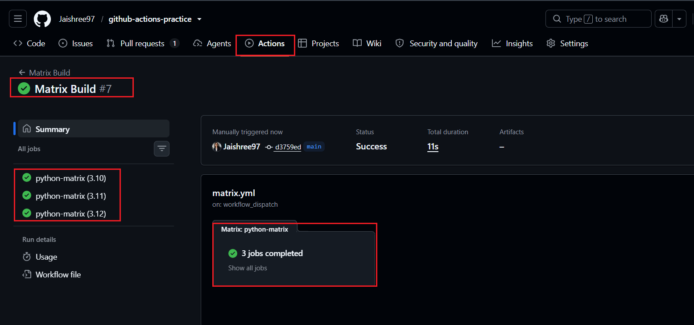

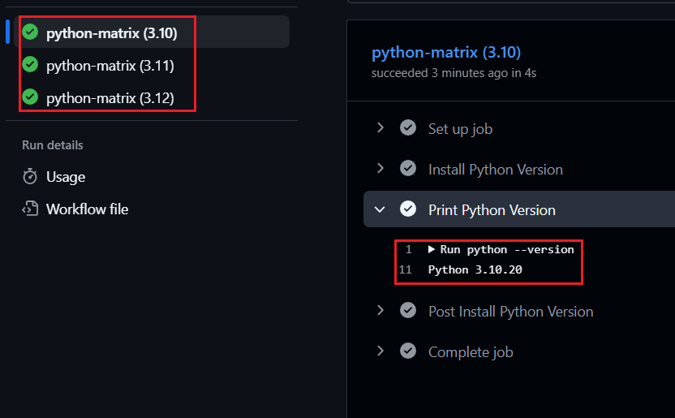

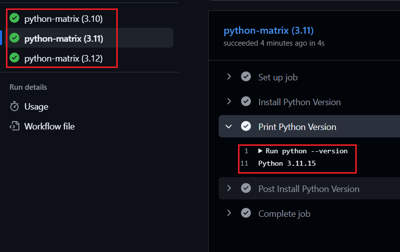

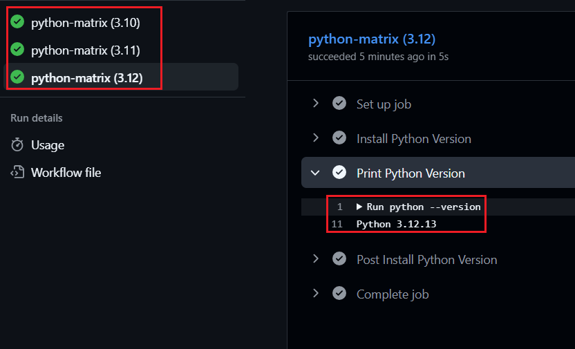

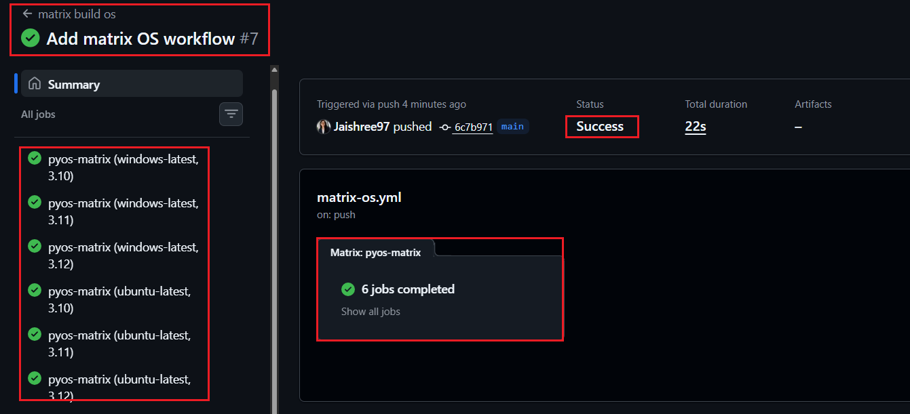

### Notes

- Matrix strategy allows the same workflow to run across multiple environments.
- Matrix jobs are executed in parallel whenever possible.
- Useful for testing applications across multiple Python versions and operating systems.
- Total matrix jobs = Number of Python versions × Number of operating systems.

---

## Task 5: Exclude & Fail-Fast

### Steps Performed

1. Excluded the unsupported matrix combination (`Python 3.10` on Windows).
2. Configured `fail-fast: false`.
3. Triggered an intentional failure in one of the matrix jobs.
4. Observed the behavior of the remaining jobs.

### Verify

- The excluded matrix combination is skipped successfully.
- Remaining matrix jobs continue running when `fail-fast` is set to `false`.

> Fail-Fast Workflow:
>
> [Click here to view the workflow file.](./workflows/fail-fast.yml)

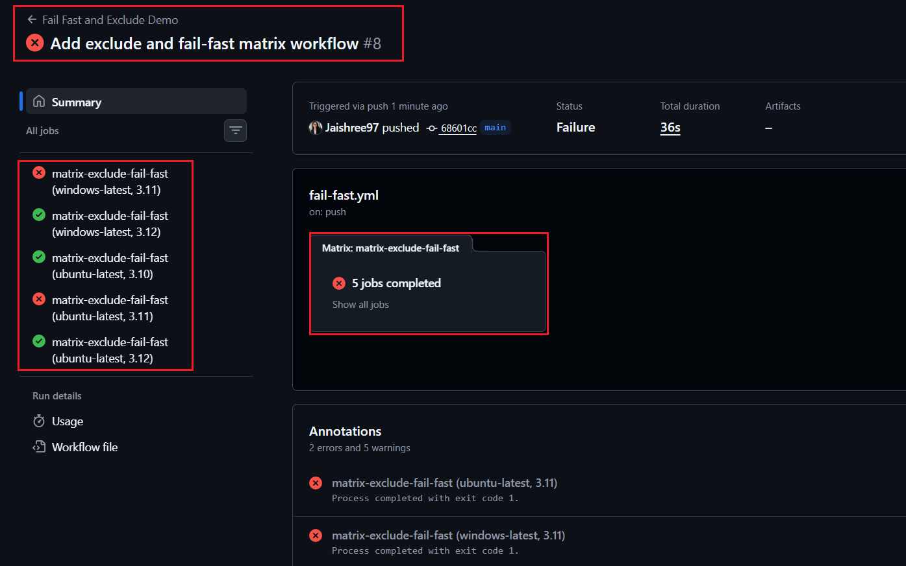

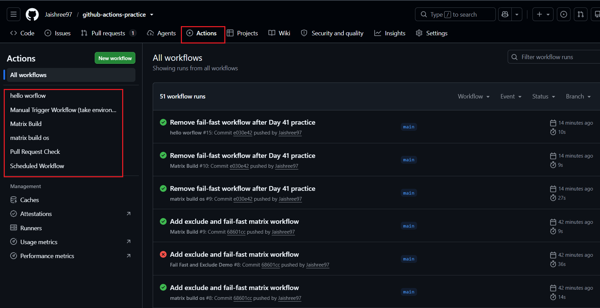

### Notes

- `exclude` removes unsupported matrix combinations from execution.
- `fail-fast: true` (default) cancels remaining matrix jobs when one job fails.
- `fail-fast: false` allows all matrix jobs to complete even if one or more jobs fail.
- Useful for identifying failures across multiple environments during CI testing.

---