# Day 42 – Runners: GitHub-Hosted & Self-Hosted

## Task 1: GitHub-Hosted Runners

1. Created a workflow with jobs running on:
   - `ubuntu-latest`
   - `windows-latest`
   - `macos-latest`

2. Printed:
   - OS name
   - Hostname
   - Current user

3. Observed that all jobs run in parallel.

> GitHub Hosted Runners & Tools Workflow:
>
> [Click here to view the workflow file.](./workflows/github-hosted-runner.yml)

### Workflow Execution

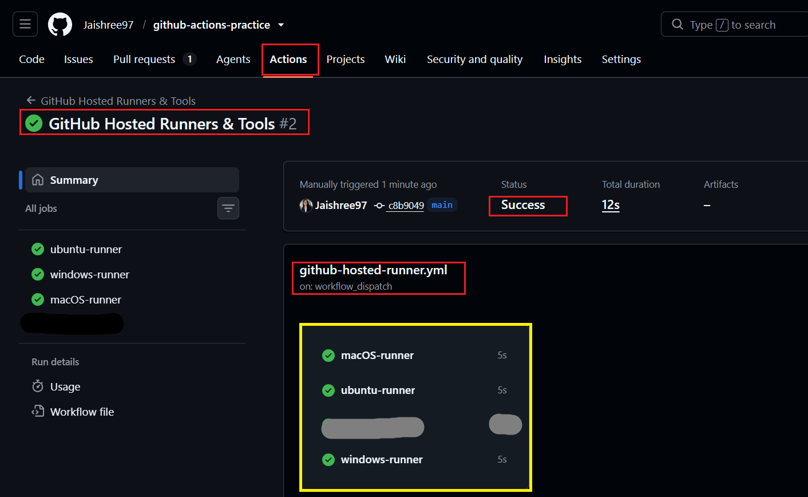

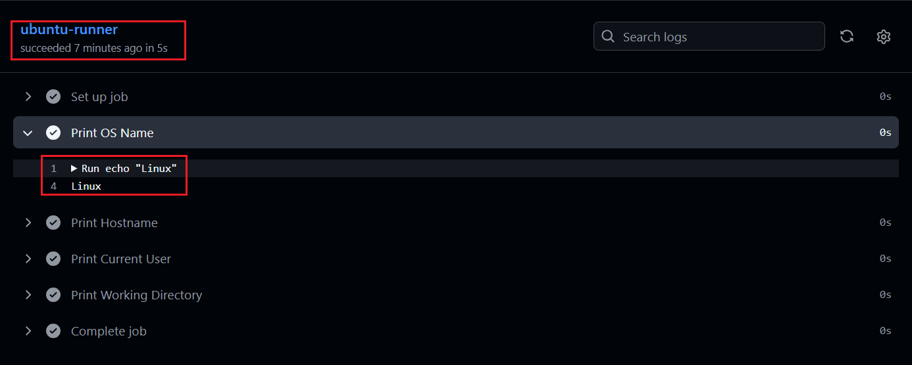

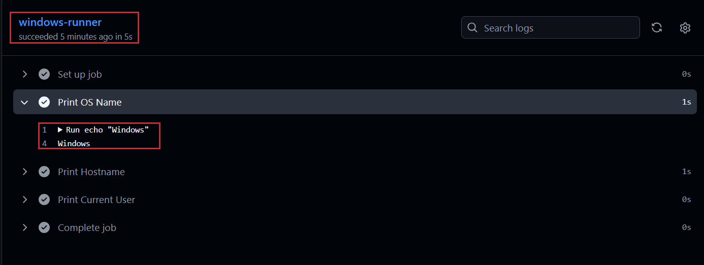

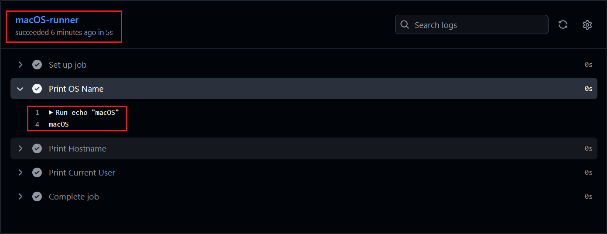

### What is a GitHub-hosted runner? Who manages it?

- `GitHub-hosted` runners are temporary virtual machines provided by GitHub to execute GitHub Actions workflows.
- GitHub-hosted runners are fully managed by GitHub.

GitHub is responsible for:

- Creating the virtual machine.
- Providing pre-installed development tools.
- Maintaining and securing the runner environment.
- Cleaning up the runner after the workflow completes.

---

## Task 2: Explore What's Pre-installed

1. Explored the pre-installed tools available on the `ubuntu-latest` runner:
   - Docker
   - Python
   - Node.js
   - Git

2. Verified the installed tool versions using GitHub Actions.

3. Learned that GitHub-hosted runners come with commonly used development tools pre-installed.

### Workflow Execution

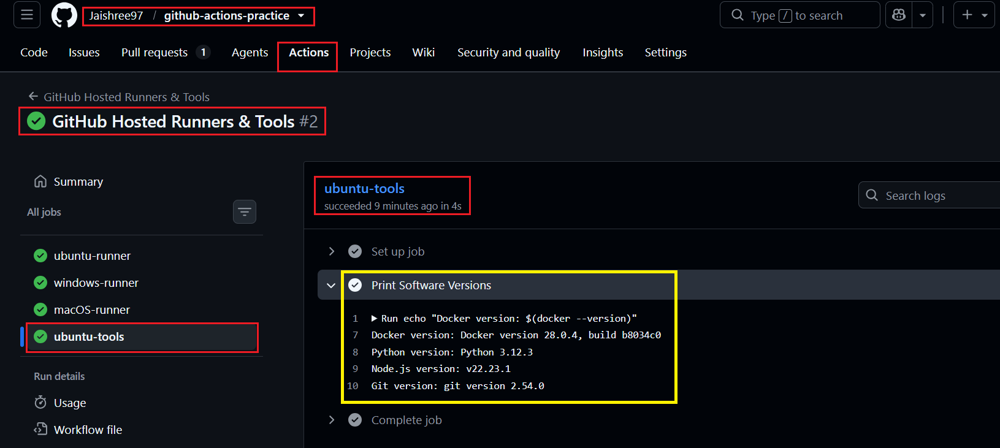

### Why do pre-installed tools matter?

- They eliminate the need to install common tools in every workflow.
- They speed up workflow execution and simplify pipeline setup.
- They provide a consistent and ready-to-use environment for CI/CD.

---

## Task 3: Set Up a Self-Hosted Runner

1. Created an EC2 Ubuntu instance and configured it as a self-hosted runner.

2. Registered the runner with the GitHub repository.

3. Started the runner and verified that it was in the `Idle` state.

> Self-Hosted Runner Setup:
>
> Configured an EC2 instance as a GitHub Actions self-hosted runner.

### Workflow Execution

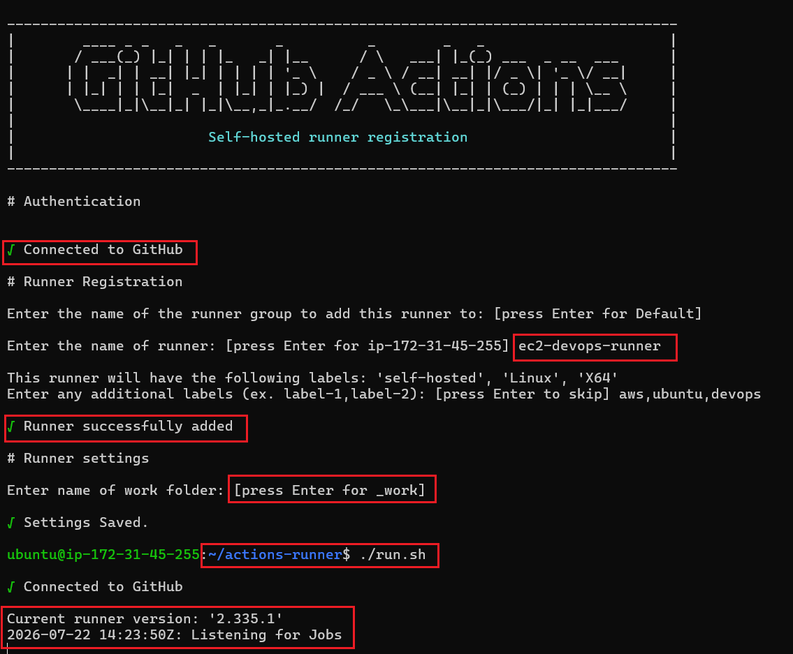

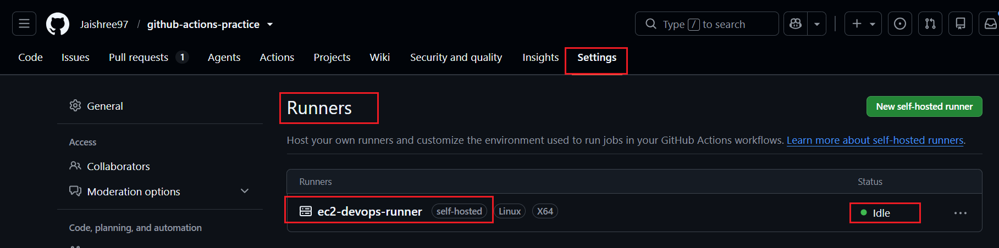

### What is a Self-Hosted Runner?

- A self-hosted runner is a machine that you own and manage to execute GitHub Actions workflows.
- It can be hosted on a local machine, virtual machine, or cloud instance such as EC2.

### Who manages it?

- You are responsible for:
  - Installing and configuring the runner.
  - Managing the operating system and software.
  - Maintaining security and updates.
  - Starting and monitoring the runner.

---

## Task 4: Use Your Self-Hosted Runner

1. Created a workflow that runs on the self-hosted runner.

2. Printed:
   - Hostname
   - Current user
   - Working directory

3. Created a file (`welcome.txt`) and verified its contents.

4. Successfully executed the workflow on the EC2 instance.

> Self-Hosted Runner Workflow:
>
> [Click here to view the workflow file.](./workflows/ec2-hosted-runner.yml)

### Workflow Execution

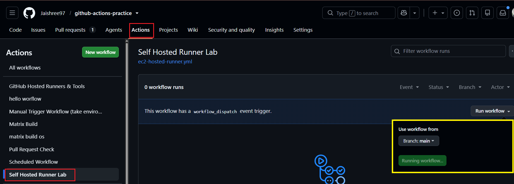

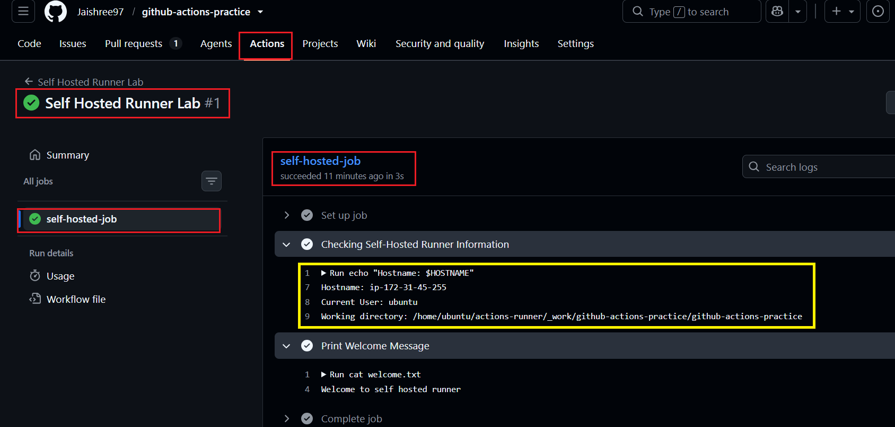

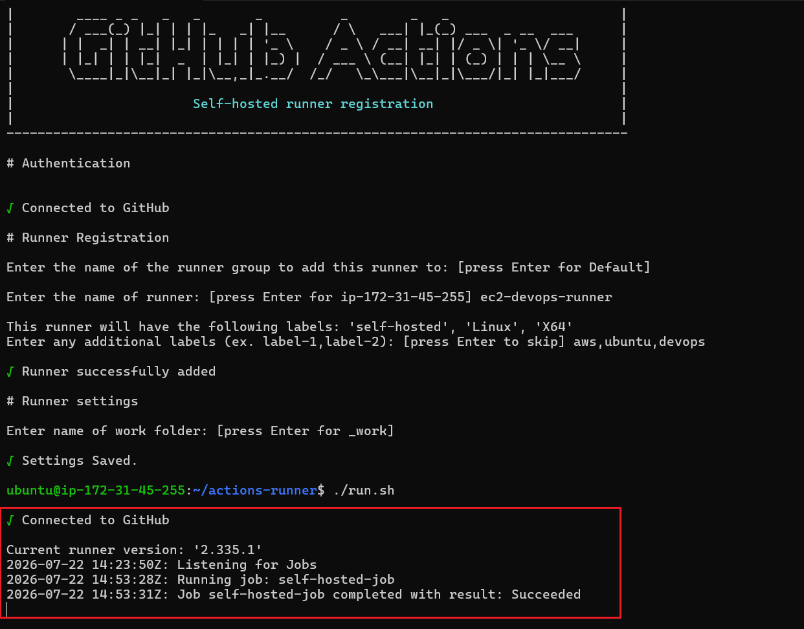

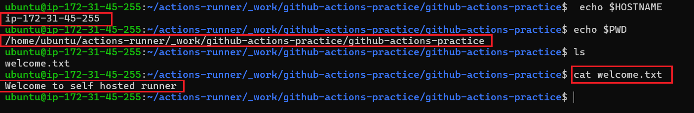

---

## Task 5: Labels

1. Added custom labels to the self-hosted runner:
   - `aws`
   - `ubuntu`
   - `devops`

2. Updated the workflow to target the runner using labels.

3. Verified that GitHub selected the correct self-hosted runner.

> Labels Workflow:
>
> [Click here to view the workflow file.](./workflows/ec2-hosted-runner.yml)

### Workflow Execution

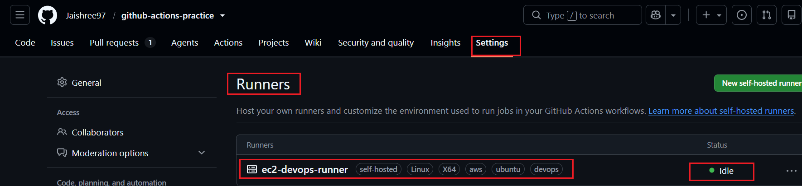

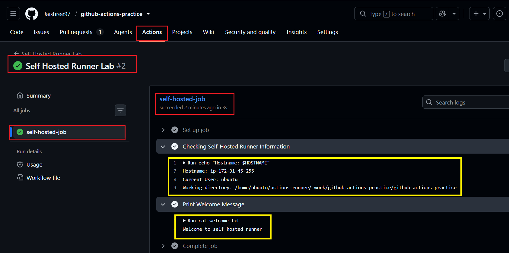

### Why are labels useful?

- Labels help target specific self-hosted runners.
- They are useful when managing multiple runners with different configurations.
- They ensure workflows are executed on the appropriate machine.

---

## Task 6: GitHub-Hosted vs Self-Hosted

| Feature | GitHub-Hosted | Self-Hosted |
|--------|--------|--------|
| Who manages it? | GitHub | You |
| Cost | Free minutes (or billed usage) | Your infrastructure cost |
| Pre-installed tools | Yes | Depends on your setup |
| Good for | Standard CI/CD workflows | Custom or dedicated workloads |
| Security concern | Managed by GitHub | Your responsibility |

---

## Key Learnings

- Understood the difference between GitHub-hosted and self-hosted runners.
- Learned how GitHub-hosted runners are provisioned and managed by GitHub.
- Explored the pre-installed tools available on GitHub-hosted runners.
- Configured an EC2 instance as a self-hosted runner.
- Executed GitHub Actions workflows on an EC2 self-hosted runner.
- Learned how labels help target specific self-hosted runners.
- Compared GitHub-hosted and self-hosted runners based on management, cost, tooling, and security.