# Day 43 – Jobs, Steps, Env Vars & Conditionals

---

### Task 1: Multi-Job Workflow

Create `.github/workflows/multi-job.yml` with 3 jobs:

- `build` — prints "Building the app"
- `test` — prints "Running tests"
- `deploy` — prints "Deploying"

- Make `test` run only after `build` succeeds.
- Make `deploy` run only after `test` succeeds.

> **`needs`**: Specifies which job must complete successfully before another job can start.

**Verify:** Check the workflow graph in the Actions tab — does it show the dependency chain?

- Yes, the workflow graph correctly shows the dependency chain using the `needs` keyword.

> Multi-Job Workflow:
>
> [Click here to view the workflow file.](./workflows/multi-job.yml)

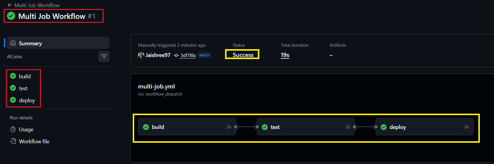

---

### Task 2: Environment Variables

In a new workflow, use environment variables at 3 levels:

1. Workflow level — `APP_NAME: myapp`
2. Job level — `ENVIRONMENT: staging`
3. Step level — `VERSION: 1.0.0`

Print all three in a single step and verify each is accessible.

Then use GitHub context variables to print the commit SHA and actor.

> **`env`**: Used to define variables at the workflow, job, or step level.
>
> **GitHub Context Variables**: Provide metadata about the workflow run, such as the commit SHA, actor, repository, and branch information.

**Verify:** Are all environment variables and GitHub context variables accessible?

- Yes, all environment variables and GitHub context variables were successfully printed during the workflow run.

> Environment Variables Workflow:
>
> [Click here to view the workflow file.](./workflows/env-vars.yml)

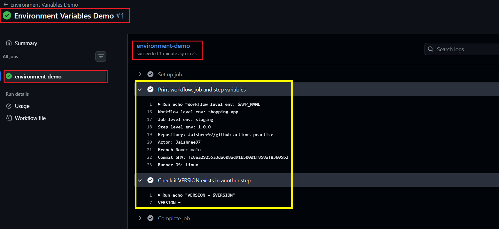

---

### Task 3: Job Outputs

1. Create a job that sets an output (e.g., today's date).
2. Create a second job that reads that output.
3. Pass the value using `outputs:` and `needs.<job>.outputs.<name>`.

> **`outputs`**: Used to share dynamically generated values from one job with another job in the same workflow.
>
> This is particularly useful for passing values such as application versions, image tags, timestamps, and deployment metadata between jobs.

**Verify:** Was the output successfully passed between jobs?

- Yes, the date output was successfully shared and printed in the dependent job.

> Job Outputs Workflow:
>
> [Click here to view the workflow file.](./workflows/job-outputs.yml)

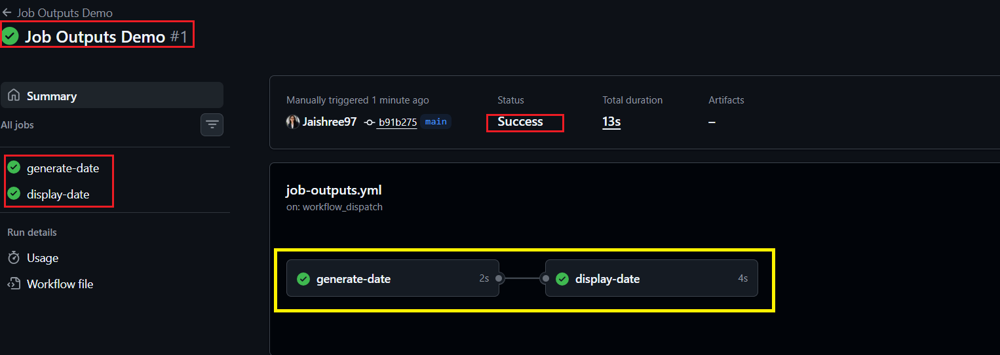

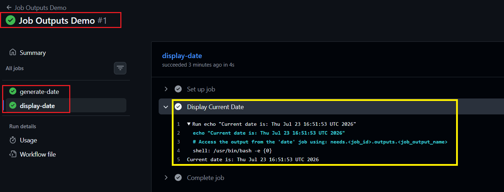

---

### Task 4: Conditionals

In a workflow, add:

1. A step that only runs when the branch is `main`.
2. A step that only runs when the previous step failed.
3. A job that only runs on push events and not on pull requests.
4. A step with `continue-on-error: true`.

> **Conditionals (`if`)**: Used to control when a job or step should execute.
>
> **`failure()`**: Runs a step only when a previous step in the job has failed.
>
> **`continue-on-error: true`**: Allows a step to fail without failing the entire job or workflow.

**Verify:** Did all conditional jobs and steps behave as expected?

- Yes, all conditional jobs and steps executed according to their configured conditions.

> Conditionals Workflow:
>
> [Click here to view the workflow file.](./workflows/conditionals.yml)

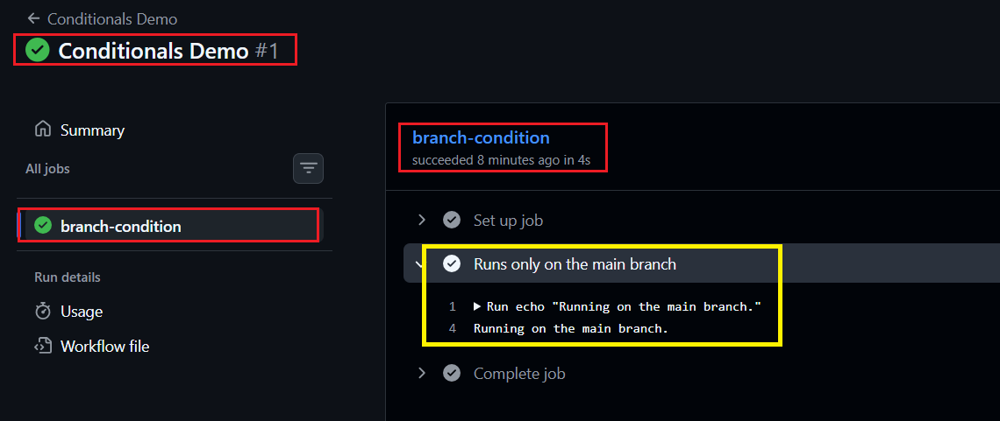

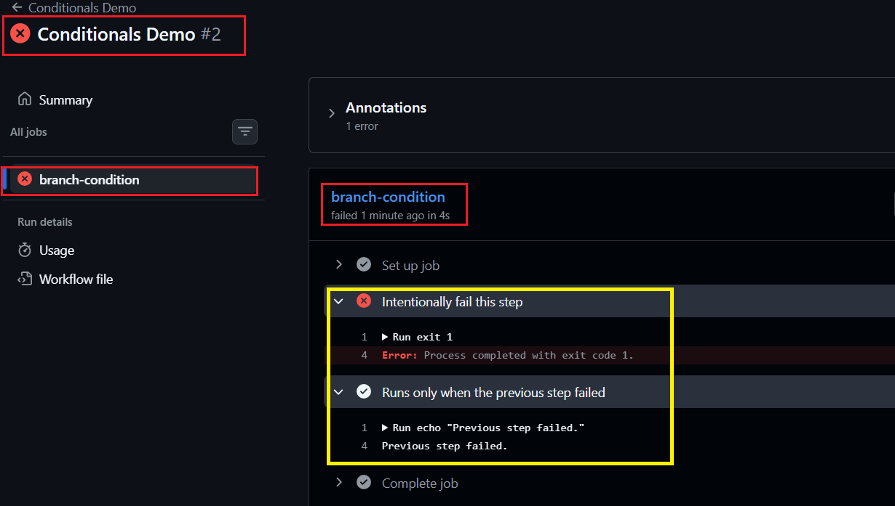

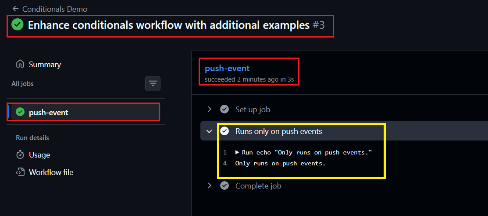

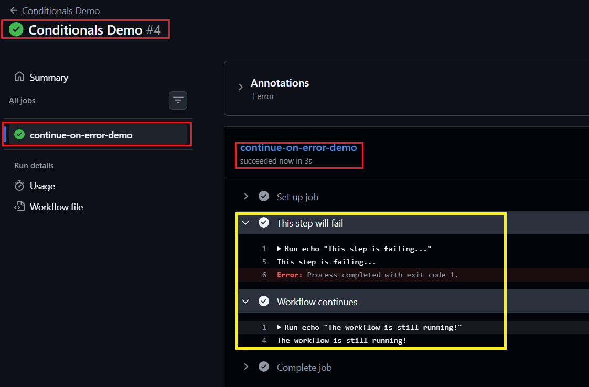

---

### Task 5: Putting It Together

Create `.github/workflows/smart-pipeline.yml` that:

1. Triggers on push to any branch.
2. Has `lint` and `test` jobs running in parallel.
3. Has a `summary` job that runs after both jobs complete successfully.
4. Prints whether the workflow was triggered from the `main` branch or a feature branch.
5. Displays useful workflow information such as the commit message, actor, branch name, commit SHA, and application version.

> **`needs`**: Used to define job dependencies and control workflow execution order.
>
> **Parallel Jobs**: Jobs without dependencies run in parallel by default in GitHub Actions.
>
> **GitHub Context Variables**: Used to access workflow information such as branch name, actor, commit SHA, commit message, and repository details.
>
> **Conditional Logic**: Used to determine whether the workflow was triggered from the `main` branch or another branch.

**Verify:** Did the Smart Pipeline execute successfully and display the expected workflow information?

- Yes, the Smart Pipeline executed successfully and displayed the expected workflow details in the summary job.

> Smart Pipeline Workflow:
>
> [Click here to view the workflow file.](./workflows/smart-pipeline.yml)

### Failed Pipeline

> The `lint` job failed intentionally, demonstrating that dependent jobs (`generate-version`, `deploy`, and `summary`) are automatically skipped when a required job fails.

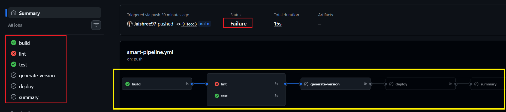

### Successful Pipeline

> All jobs completed successfully, and the workflow executed in the expected order.

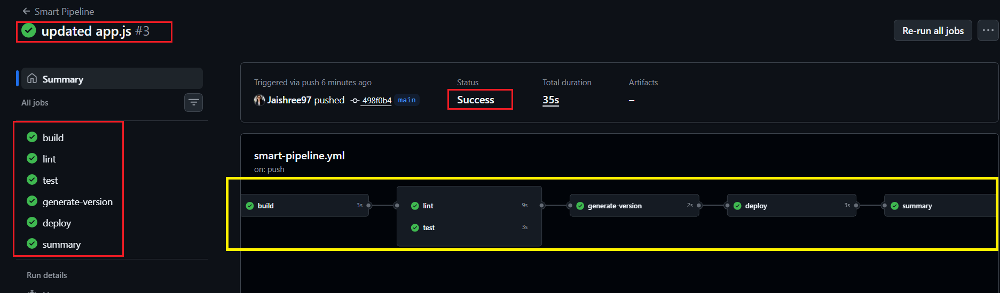

### Workflow Jobs

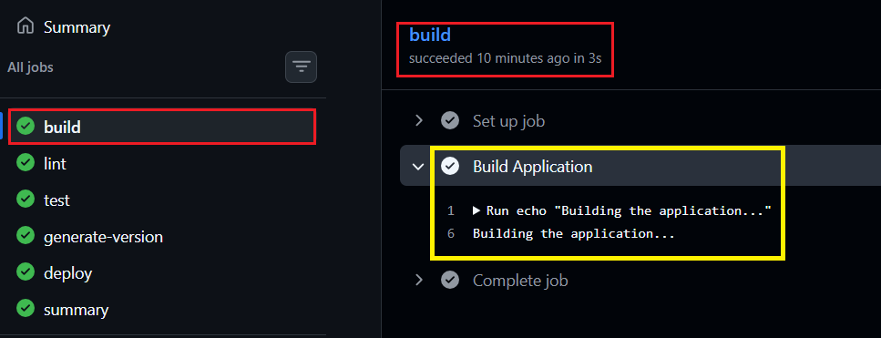

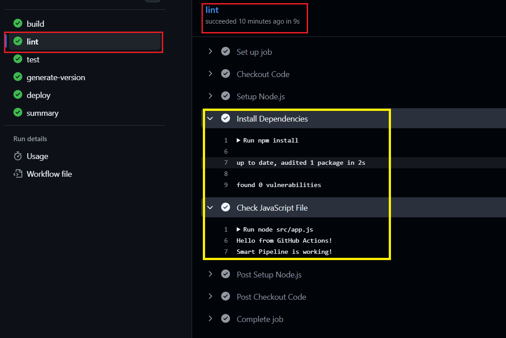

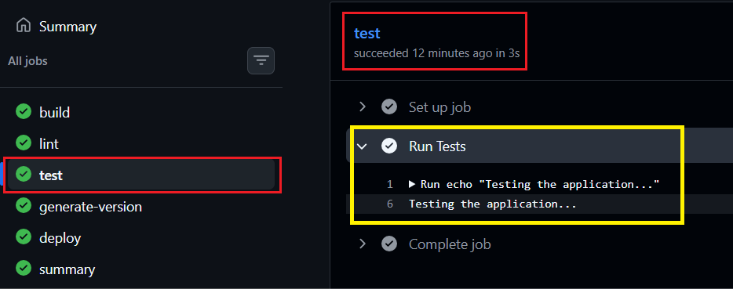

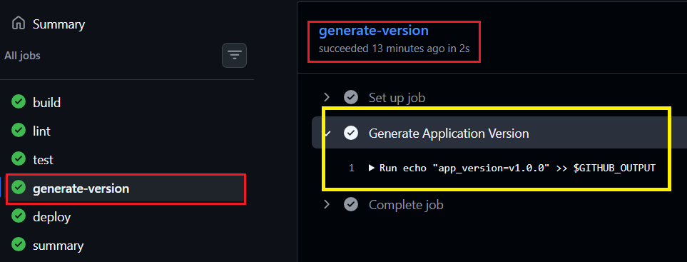

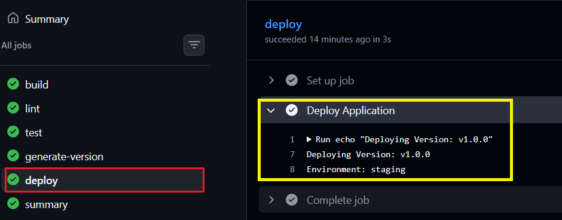

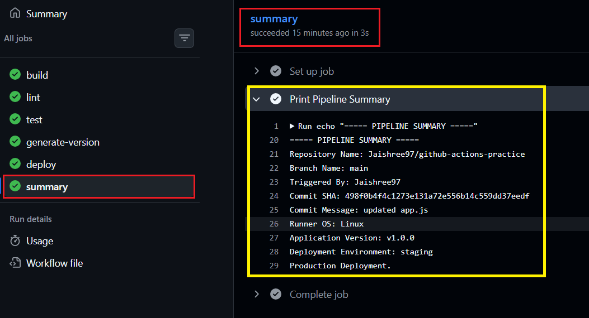

---