# Day 44 – Secrets, Artifacts & Running Real Tests in CI

### Task 1: GitHub Secrets
1. Go to your repo → Settings → Secrets and Variables → Actions
2. Create a secret called `MY_SECRET_MESSAGE`
3. Create a workflow that reads it and prints: `The secret is set: true` (never print the actual value)
4. Try to print `${{ secrets.MY_SECRET_MESSAGE }}` directly — what does GitHub show?

Write in your notes: Why should you never print secrets in CI logs?

> **Workflow File:** [secrets.yml](./workflows/secrets.yml)

### Workflow Execution

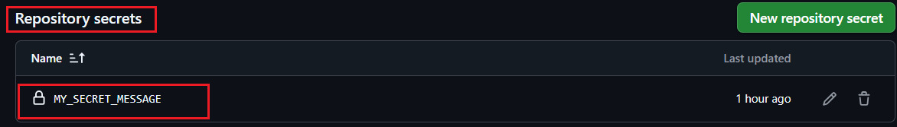

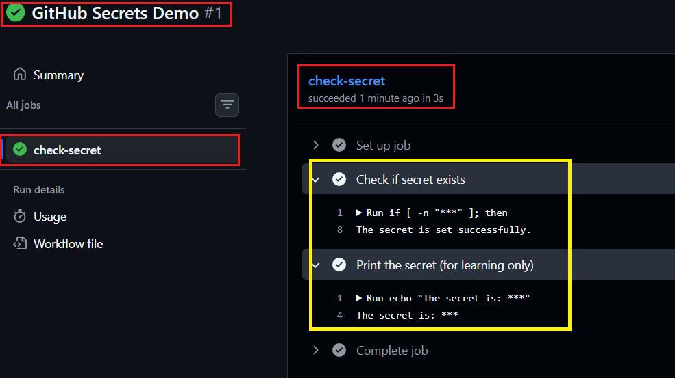

### Why should you never print secrets in CI logs?

- CI logs may be accessible to multiple team members.
- Printing secrets can expose passwords, API keys, or access tokens.
- Secrets should always be managed securely using GitHub Secrets.

---

### Task 2: Use Secrets as Environment Variables
1. Pass a secret to a step as an environment variable
2. Use it in a shell command without ever hardcoding it
3. Add `DOCKER_USERNAME` and `DOCKER_TOKEN` as secrets (you'll need these on Day 45)

> **Workflow File:** [secrets-env.yml](./workflows/secrets-env.yml)

### Workflow Execution

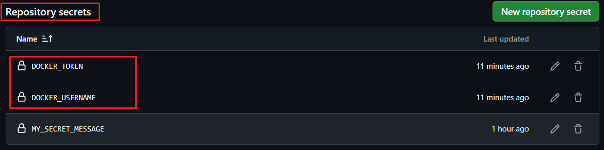

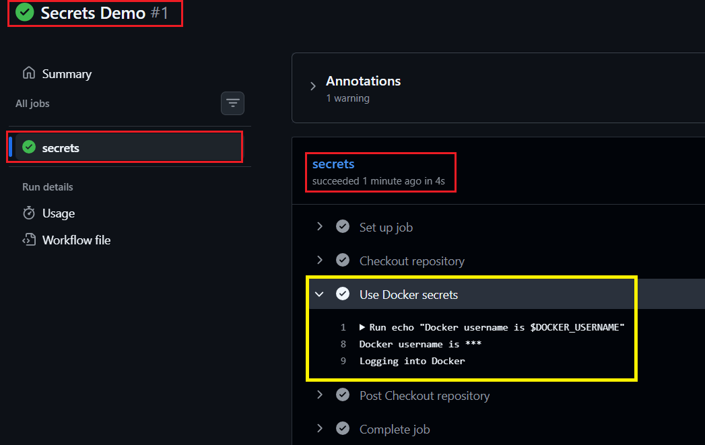

### Why use secrets as environment variables?

- They prevent hardcoding sensitive information in workflow files.
- They provide a secure and reusable way to pass credentials.
- They are commonly used in production CI/CD pipelines for authentication and configuration.

---

### Task 3: Upload Artifacts

1. Generated a report file during workflow execution.
2. Uploaded the generated file as an artifact using `actions/upload-artifact`.
3. Successfully downloaded the artifact from the GitHub Actions tab and verified its contents.

> **Workflow File:** [upload-artifact.yml](./workflows/upload-artifact.yml)

### Workflow Execution

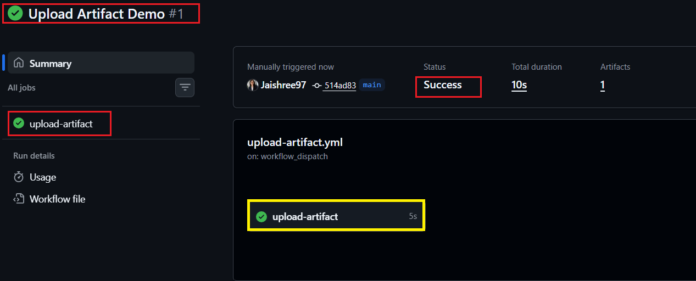

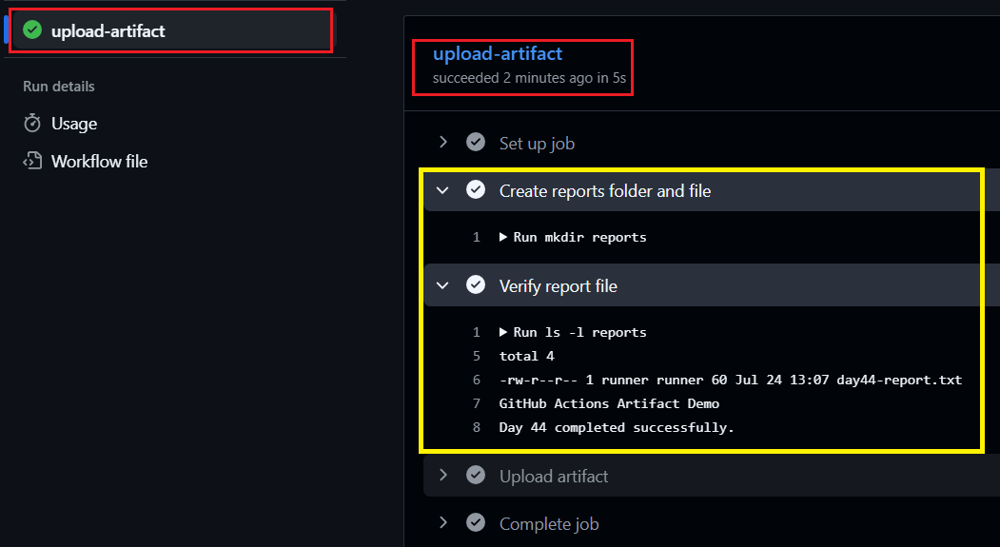

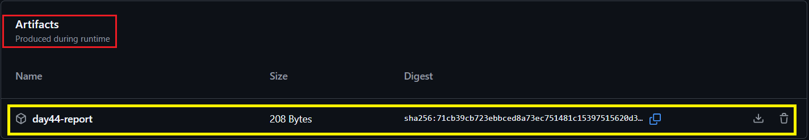

### What are artifacts used for?

- Storing test reports, logs, and build outputs generated during workflow execution.
- Preserving files after the GitHub-hosted runner is destroyed.
- Sharing files between jobs in multi-stage CI/CD pipelines.
- Making workflow outputs available for download and future use.

---

### Task 4: Download Artifacts Between Jobs

1. Created a report file in Job 1 and uploaded it as an artifact.
2. Downloaded the artifact in Job 2 using `actions/download-artifact`.
3. Successfully accessed and printed the contents of the downloaded file.

> **Workflow File:** [download-artifact.yml](./workflows/download-artifact.yml)

### Workflow Execution

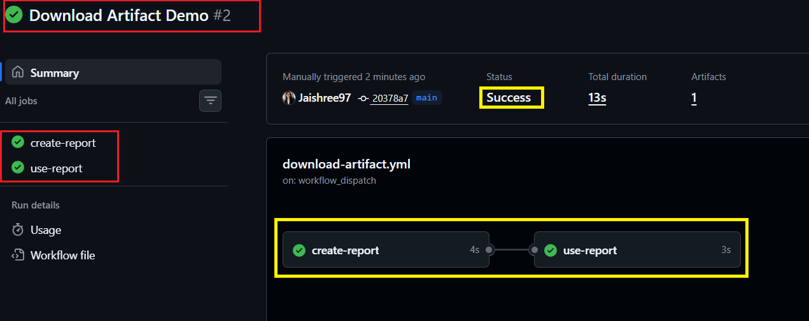

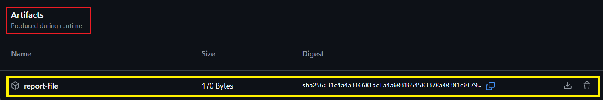

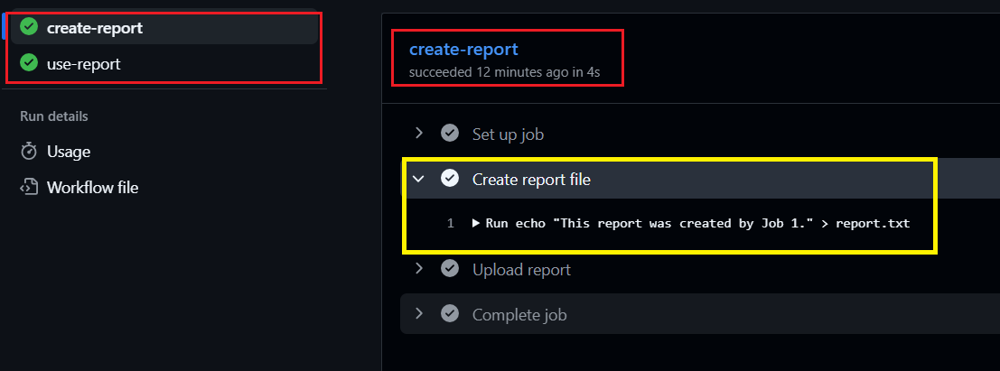

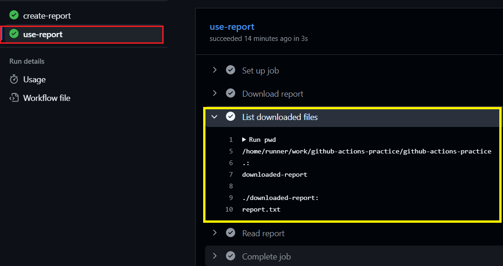

### When would you use artifacts in a real CI/CD pipeline?

- Sharing build outputs between multiple jobs.
- Passing test reports, logs, and coverage reports across pipeline stages.
- Storing deployment packages for later use in the deployment process.
- Transferring files between isolated GitHub Actions runners in multi-job workflows.

---

### Task 5: Run Real Tests in CI

1. Configured a GitHub Actions workflow to run automated tests as part of the CI pipeline.
2. Installed the required project dependencies before executing the tests.
3. Intentionally broke the test script to observe a failed workflow execution.
4. Fixed the issue and verified that the workflow completed successfully.

> **Workflow File:** [run-tests.yml](./workflows/run-tests.yml)

### Workflow Execution

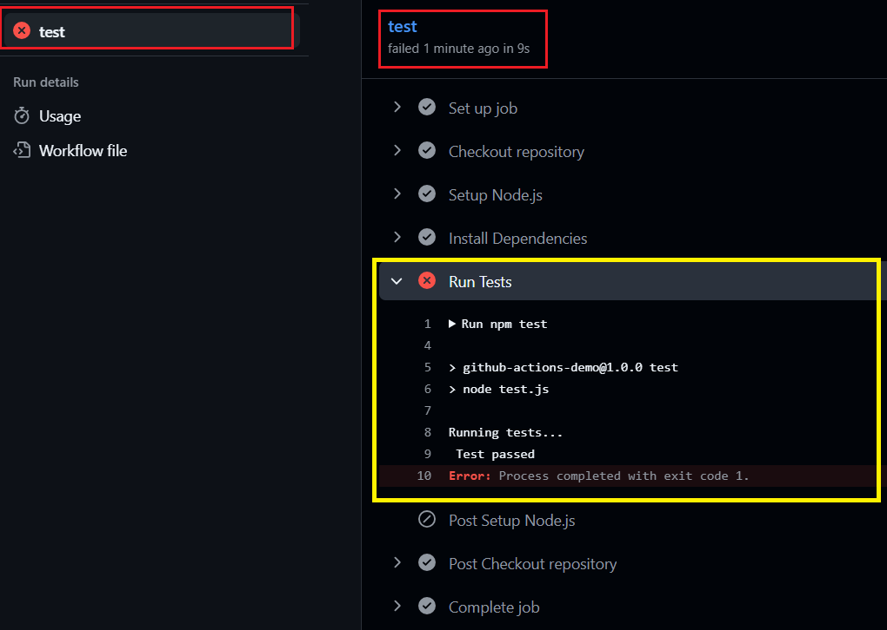

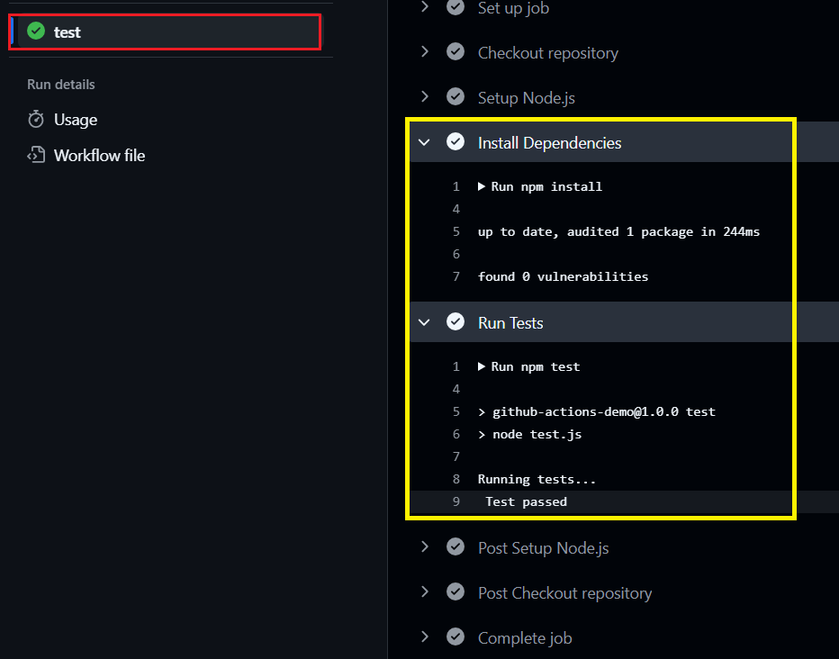

### Why are automated tests important in CI?

- They validate code changes automatically before deployment.
- They prevent broken code from being merged into the main branch.
- They improve code quality, reliability, and maintainability.
- They provide immediate feedback when changes introduce issues.

---

### Task 6: Caching

1. Implemented dependency caching using `actions/cache`.
2. Executed the workflow multiple times to observe cache creation and restoration.
3. Verified that cached dependencies improve workflow performance by reducing installation time.

> **Workflow File:** [cache-demo.yml](./workflows/cache-demo.yml)

### Workflow Execution

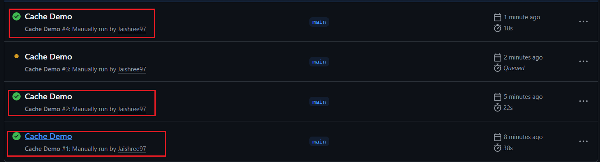

### What is being cached and where is it stored?

- The npm package cache directory (`~/.npm`) is being cached.
- GitHub Actions stores cached files using unique cache keys.
- Cached dependencies are restored in subsequent workflow runs when the cache key matches.
- Dependency caching significantly improves CI pipeline execution time.

### Key Learnings

- Securely managed sensitive information using GitHub Secrets.
- Passed credentials securely using environment variables.
- Shared files between jobs using GitHub Actions artifacts.
- Implemented automated testing within a CI pipeline.
- Improved workflow performance using dependency caching.
- Learned concepts commonly used in production-grade CI/CD pipelines.