# Day 45 – Docker Build & Push in GitHub Actions

### Task 1: Prepare

Use the Dockerized application from Day 36 (or any simple Dockerfile) and prepare the repository for the Docker CI/CD workflow.

1. Added the Dockerfile to the `github-actions-practice` repository.
2. Configured the required GitHub Secrets:
   - `DOCKER_USERNAME`
   - `DOCKER_TOKEN`
3. Verified that the Dockerfile is ready to build the application image.

Create [`Dockerfile`](./Dockerfile)

**Verify:** Is the Dockerfile added successfully and are the required GitHub Secrets configured?

**Yes, the Dockerfile was added successfully and the required GitHub Secrets (`DOCKER_USERNAME` and `DOCKER_TOKEN`) are configured.**

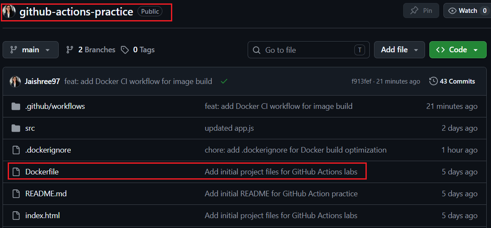

---

### Task 2: Build the Docker Image in CI

Created the GitHub Actions workflow to automatically build the Docker image whenever code is pushed to the `main` branch.

1. Trigger the workflow on push to `main`.
2. Check out the repository.
3. Set up Docker Buildx.
4. Build and tag the Docker image.

Create [`docker-publish.yml`](./workflows/docker-publish.yml)

**Verify:** Check the workflow logs — does the Docker image build successfully?

**Yes, the workflow completed successfully and the Docker image was built without any errors.**

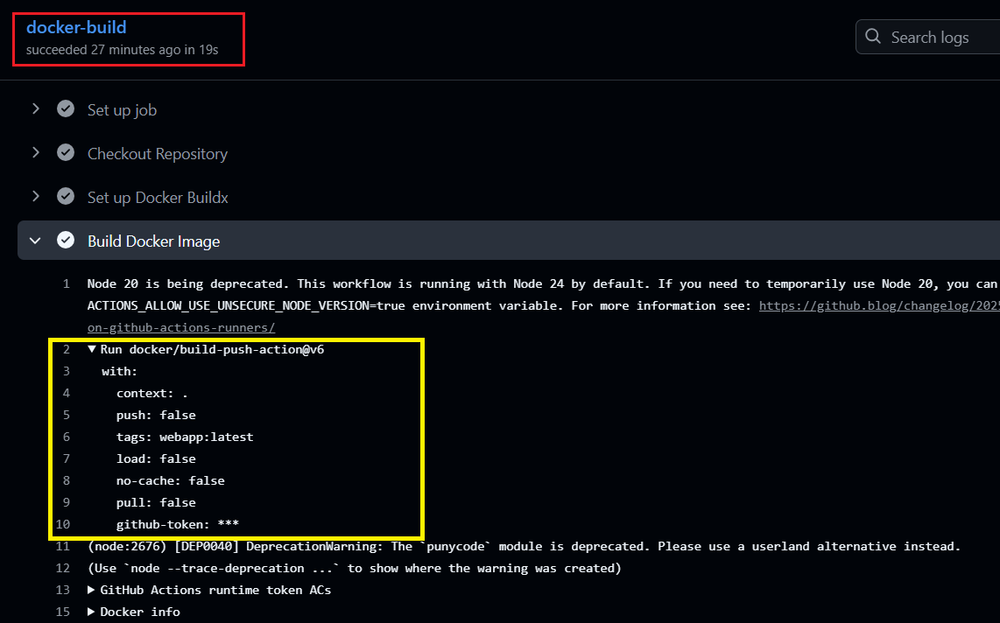

---

### Task 3: Push to Docker Hub

Extended the GitHub Actions workflow to automatically publish the Docker image to Docker Hub after a successful build.

1. Log in to Docker Hub using the `DOCKER_USERNAME` and `DOCKER_TOKEN` GitHub Secrets.
2. Tag the Docker image with:
   - `latest`
   - `sha-<short-commit-hash>`
3. Push both image tags to Docker Hub.

**Verify:** Is the Docker image available in Docker Hub with both `latest` and `sha-<short-commit-hash>` tags?

**Yes, the workflow successfully authenticated with Docker Hub and pushed both image tags. The images are available in the Docker Hub repository.**

**Docker Hub Repository:**  
[jaishreechaure/webapp](https://hub.docker.com/repository/docker/jaishreechaure/webapp/general)

### Docker Build & Push

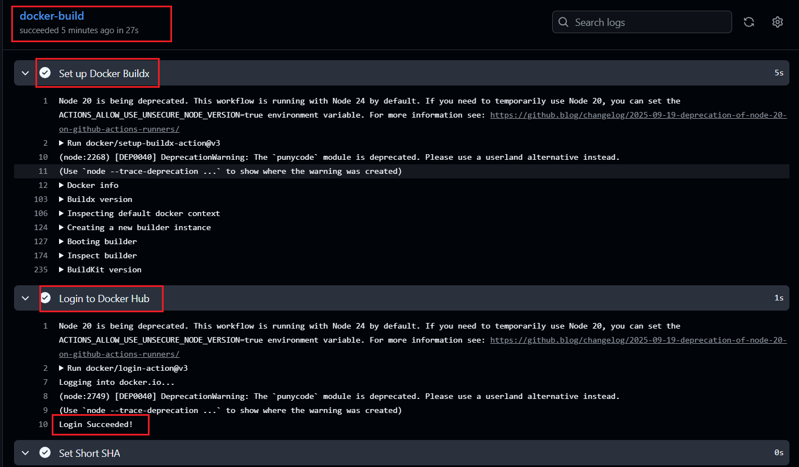

### Docker Hub Repository

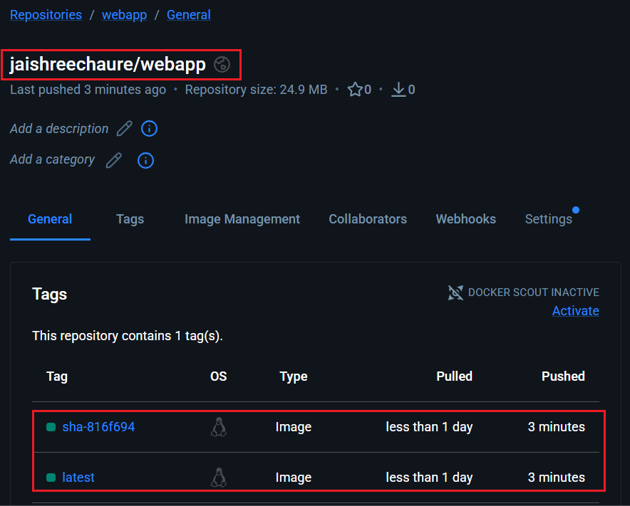

---

### Task 4: Only Push on Main

Updated the GitHub Actions workflow to publish Docker images **only** when changes are pushed to the `main` branch.

1. Added a condition to prevent image pushes from feature branches and pull requests.
2. Tested the workflow by pushing changes to a feature branch.
3. Verified that the Docker image was built but **not** pushed to Docker Hub.
4. Merged the feature branch into `main`.
5. Verified that the workflow successfully built and pushed the Docker image to Docker Hub.

**Verify:** Does the workflow build the image on feature branches but push it only from the `main` branch?

**Yes, the workflow built the Docker image on the feature branch without publishing it. After merging into the `main` branch, the image was successfully pushed to Docker Hub.**

### Feature Branch Build

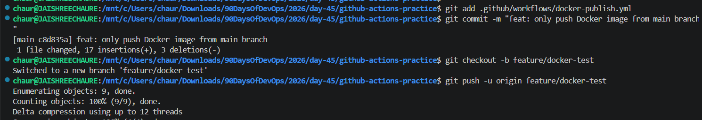

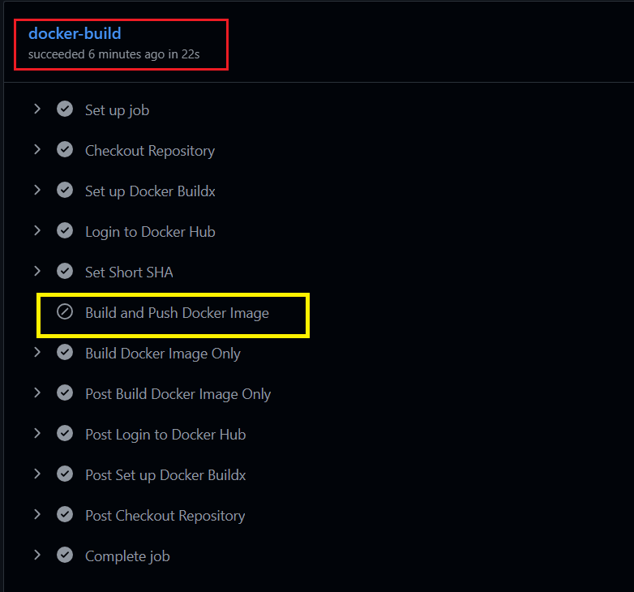

### Main Branch Push

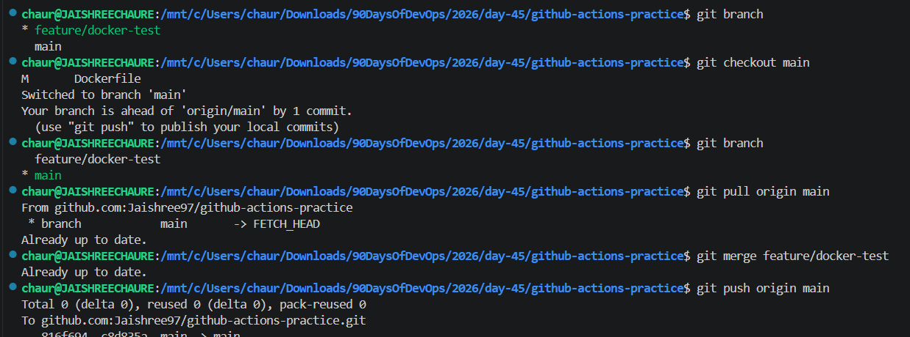

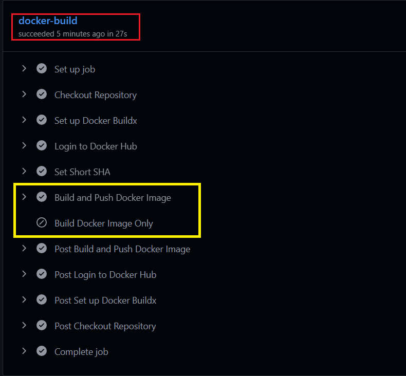

### Docker Hub Repository

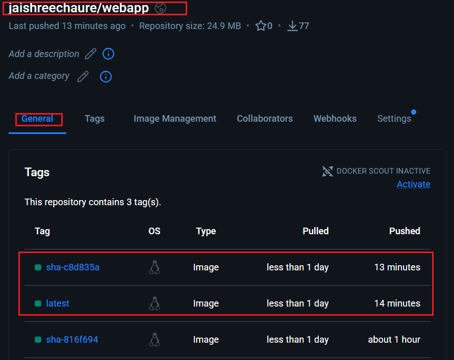

---

### Task 5: Add a Status Badge

Added a GitHub Actions workflow status badge to the project README to display the current status of the Docker CI pipeline.

1. Copied the status badge URL from the **Actions** tab.
2. Added the badge to the project `README.md`.
3. Pushed the changes to GitHub.
4. Verified that the workflow badge displays the latest build status.

**Verify:** Does the workflow status badge appear in the README and show the current workflow status?

**Yes, the GitHub Actions workflow badge was added successfully and displays the latest status of the Docker CI pipeline.**

### Workflow Status Badge

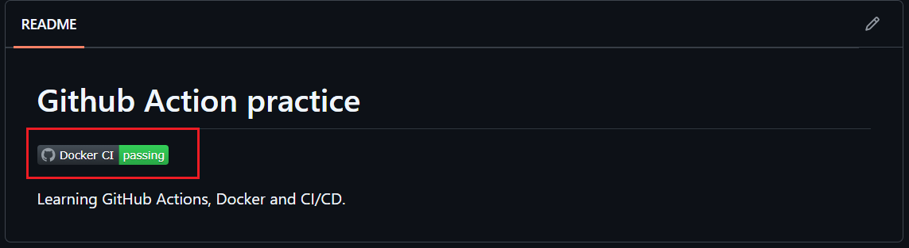

---

### Task 6: Pull and Run the Docker Image

Pulled the Docker image published to Docker Hub and ran it locally to verify that the CI/CD pipeline successfully built and published the latest version.

1. Pulled the latest Docker image from Docker Hub.
2. Started the container locally using Docker.
3. Verified that the application is accessible in the browser.
4. Documented the complete journey from `git push` to a running container.

### Resources

- 🐳 **Docker Hub Repository:** [jaishreechaure/webapp](https://hub.docker.com/repository/docker/jaishreechaure/webapp/general)
- 🌐 **Landing Page:** [`index.html`](./index.html)

**Verify:** Was the Docker image pulled successfully and did the application run correctly?

**Yes, the Docker image was pulled successfully from Docker Hub, the container started without issues, and the application is accessible at `http://localhost:8080`.**

### Docker Pull

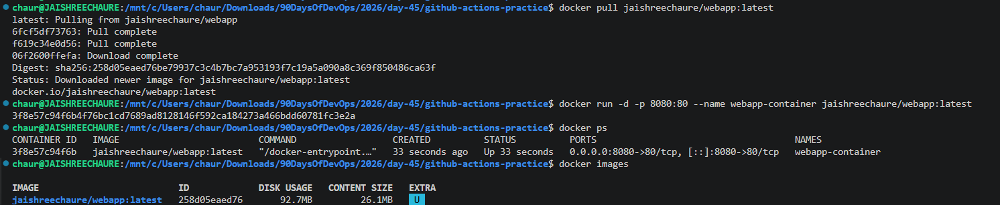

### Browser Output

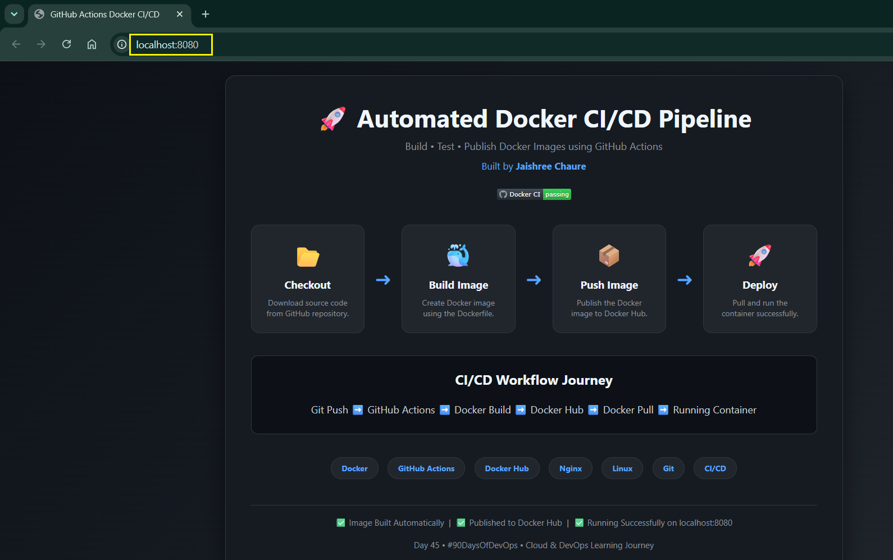

---

### Key Learnings

- Automated Docker image builds using GitHub Actions.
- Authenticated securely with Docker Hub using GitHub Secrets.
- Published Docker images with both `latest` and commit SHA tags.
- Used conditional execution to push images only from the `main` branch.
- Added a workflow status badge to monitor pipeline health.
- Validated the complete CI/CD flow by pulling and running the published image locally. 