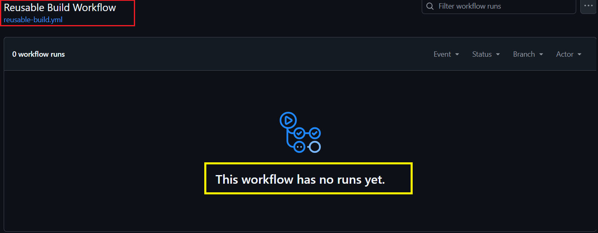
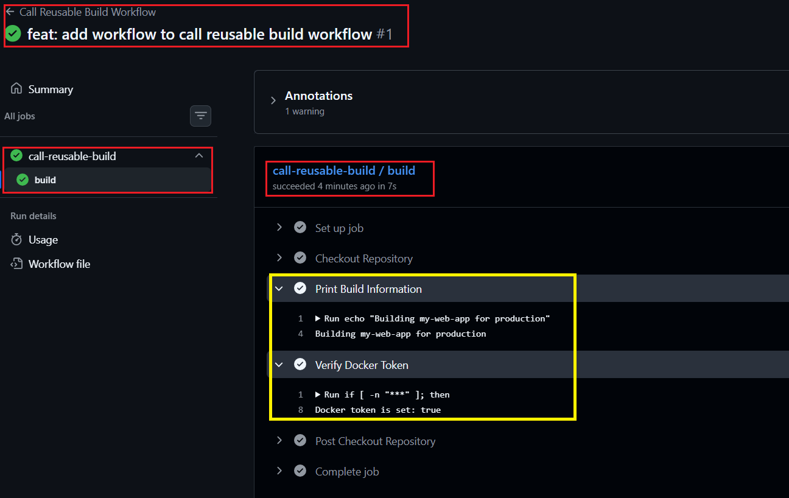
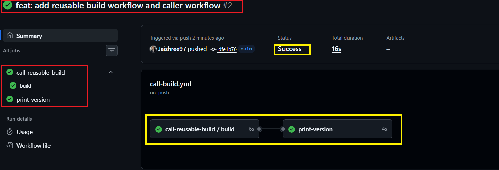
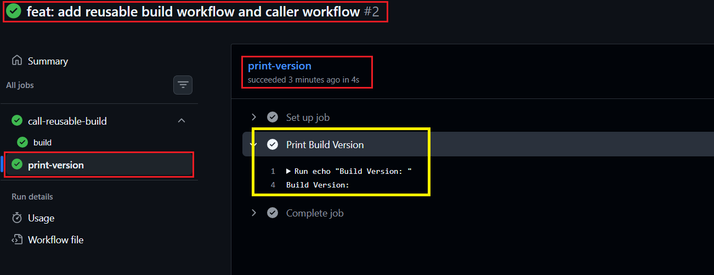
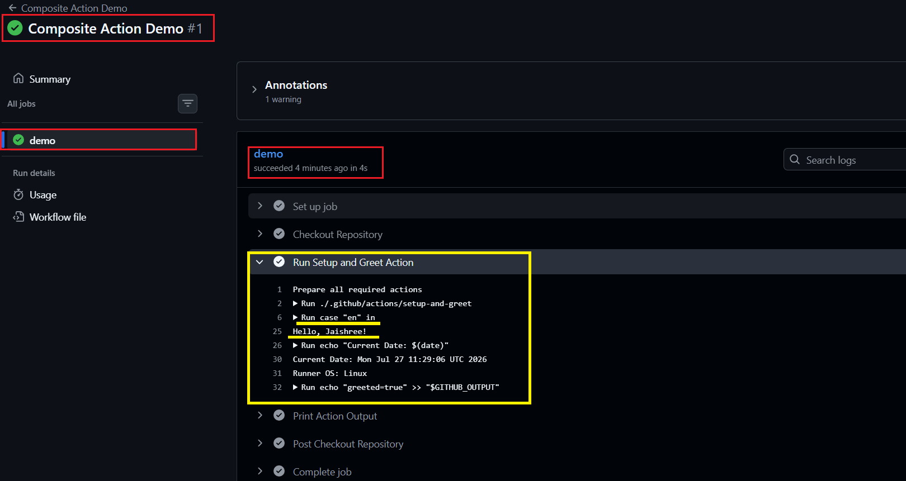

# Day 46 – Reusable Workflows & Composite Actions

## Task 1: Understand `workflow_call`

Before writing any code, research and answer the following:

### 1. What is a **Reusable Workflow**?

- A reusable workflow is a GitHub Actions workflow that can be called by another workflow using the `workflow_call` trigger, allowing the same CI/CD automation to be reused across multiple workflows or repositories.

### 2. What is the `workflow_call` trigger?

- `workflow_call` is a GitHub Actions trigger that allows one workflow to invoke another workflow instead of being triggered by events such as `push`, `pull_request`, or `workflow_dispatch`.

### 3. How is calling a reusable workflow different from using a regular action (`uses:`)?

- A **Reusable Workflow** is called at the **job level** using `jobs.<job_id>.uses` and can contain one or more jobs.
- A **Regular Action** is called at the **step level** using `steps.uses` and performs a reusable task within a single job.

### 4. Where must a reusable workflow file live?

- A reusable workflow must be stored inside the `.github/workflows/` directory.

---

## Task 2: Create Your First Reusable Workflow

Created a reusable GitHub Actions workflow that can be called by other workflows using the `workflow_call` trigger.

1. Configured the workflow with the `workflow_call` trigger.
2. Added workflow inputs:
   - `app_name` (string, required)
   - `environment` (string, required, default: `staging`)
3. Added the required secret:
   - `docker_token`
4. Created a build job that:
   - Checks out the repository.
   - Prints the application name and deployment environment.
   - Verifies that the Docker token is available without exposing the actual secret.

Create [`reusable-build.yml`](./workflows/reusable-build.yml)

**Verify:** This workflow cannot run independently because it uses the `workflow_call` trigger and must be invoked by another workflow.

**Yes, the reusable workflow was created successfully and is ready to be called by another workflow.**

---

## Task 3: Create a Caller Workflow

Created a caller workflow to invoke the reusable workflow whenever code is pushed to the `main` branch.

1. Triggered the workflow on pushes to the `main` branch.
2. Called the reusable workflow using the `uses` keyword at the job level.
3. Passed the required workflow inputs:
   - `app_name: "my-web-app"`
   - `environment: "production"`
4. Passed the `DOCKER_TOKEN` repository secret securely to the reusable workflow.

Create [`call-build.yml`](./workflows/call-build.yml)

**Verify:** Push changes to the `main` branch and confirm that the caller workflow successfully triggers the reusable workflow and prints the provided input values.

**Yes, the caller workflow successfully invoked the reusable workflow, and the input values were displayed in the workflow logs.**

---

## Task 4: Add Outputs to the Reusable Workflow

Updated the reusable workflow to generate and expose a build version, then consumed that output in the caller workflow.

1. Added a `build_version` workflow output to `reusable-build.yml`.
2. Generated a unique build version using the shortened Git commit SHA.
3. Exposed the generated version as a workflow output.
4. Updated the caller workflow to:
   - Add a second job that depends on the build job.
   - Read and print the `build_version` output from the reusable workflow.

Update [`reusable-build.yml`](./workflows/reusable-build.yml)

Update [`call-build.yml`](./workflows/call-build.yml)

**Verify:** Check the workflow logs and confirm that the second job prints the build version received from the reusable workflow.

**Yes, the second job successfully received and printed the `build_version` output from the reusable workflow.**

---

## Task 5: Create a Composite Action

Created a custom Composite Action to reuse common setup steps across GitHub Actions workflows.

1. Created a custom Composite Action at `.github/actions/setup-and-greet/action.yml`.
2. Added the following inputs:
   - `name`
   - `language` (default: `en`)
3. Configured the action to:
   - Print a greeting based on the selected language.
   - Display the current date and runner operating system.
   - Return the output `greeted=true`.
4. Created a workflow that executes the Composite Action using the local `uses` syntax.

Create [`action.yml`](./actions/setup-and-greet/action.yml)

Create [`composite-demo.yml`](./workflows/composite-demo.yml)

**Verify:** Run the workflow and confirm that the Composite Action prints the greeting, displays the runner information, and returns the expected output.

**Yes, the Composite Action executed successfully and produced the expected greeting, runner details, and output value.**

---

## Task 6: Reusable Workflow vs Composite Action

Compared Reusable Workflows and Composite Actions to understand their purpose, capabilities, and common use cases in GitHub Actions.

| Feature | Reusable Workflow | Composite Action |
|----------|-------------------|------------------|
| Triggered by | `workflow_call` | `uses:` in a workflow step |
| Can contain jobs? | Yes | No |
| Can contain multiple steps? | Yes | Yes |
| Lives where? | `.github/workflows/` | `.github/actions/` |
| Can accept secrets directly? | Yes | No |
| Best for | Reusing complete CI/CD workflows | Reusing common groups of steps |

**Key Takeaway:** Reusable Workflows are ideal for sharing complete CI/CD pipelines, while Composite Actions are best for reusing a sequence of common steps within a workflow.

---