# Day 47 – Advanced Triggers: PR Events, Cron Schedules & Event-Driven Pipelines

## Task 1: Pull Request Event Types

Created a Pull Request lifecycle workflow to understand how GitHub Actions responds to different PR activity types.

1. Configured the workflow to trigger on:
   - `opened`
   - `synchronize`
   - `reopened`
   - `closed`
2. Used GitHub event context to display:
   - Event type using `github.event.action`
   - Pull Request title
   - Pull Request author
   - Source branch
   - Target branch
3. Added conditional steps to identify:
   - Newly opened Pull Requests
   - New commits pushed to an existing Pull Request
   - Reopened Pull Requests
   - Pull Requests closed without merging
   - Successfully merged Pull Requests

Create [`pr-lifecycle.yml`](./workflows/pr-lifecycle.yml)

**Verify:** Created a Pull Request, pushed a new commit to it, closed and reopened it, and finally merged it to observe each lifecycle event.

### Test 1: Create and Open the Pull Request

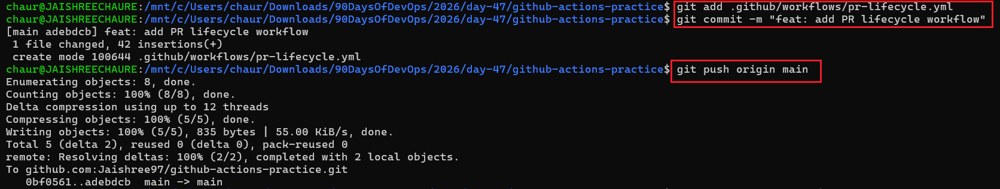

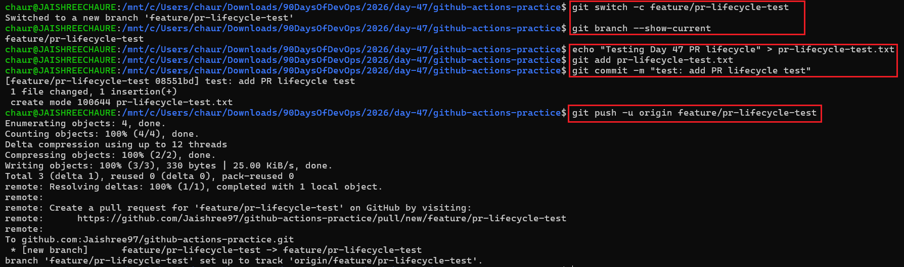

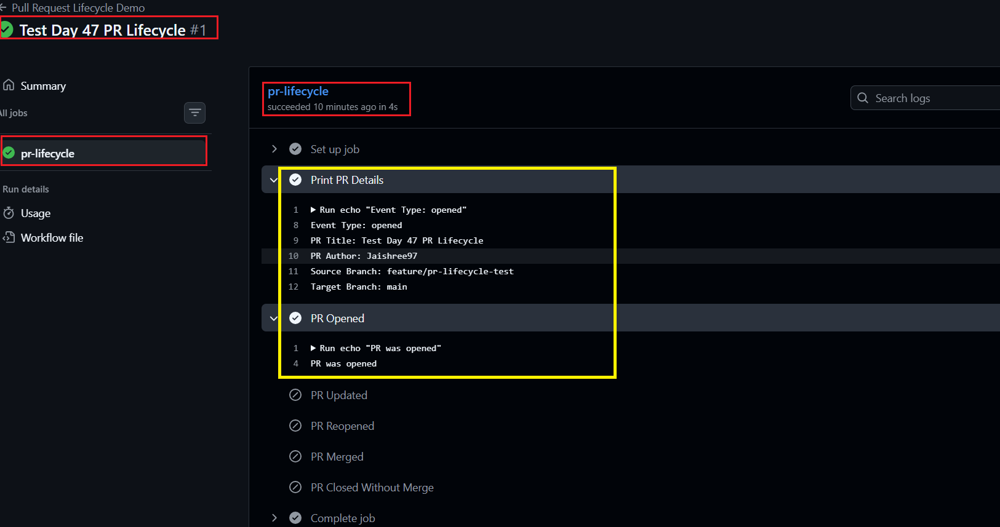

### Test 2: Update the Pull Request

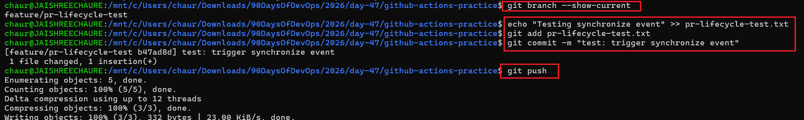

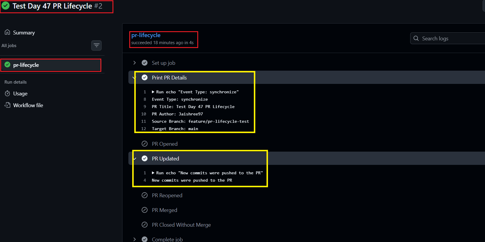

### Test 3: Close and Reopen the Pull Request

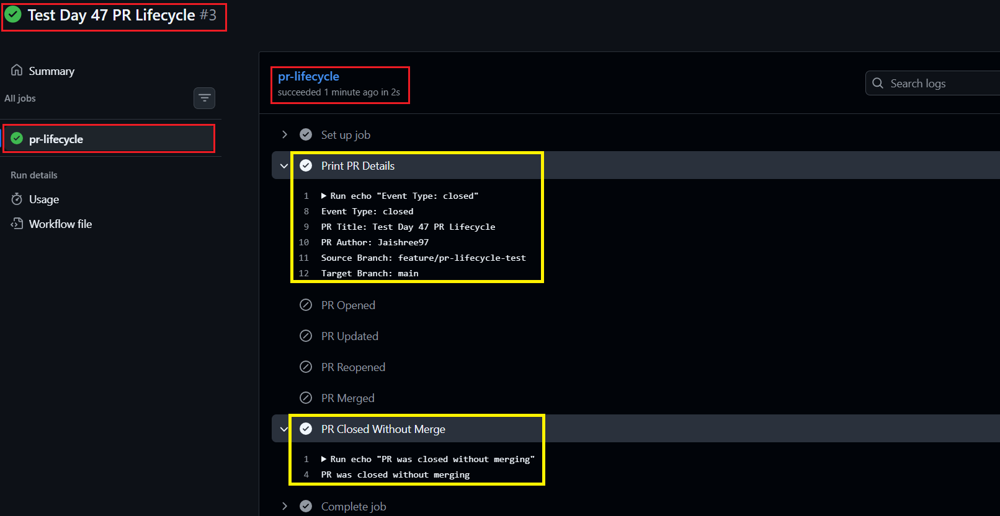

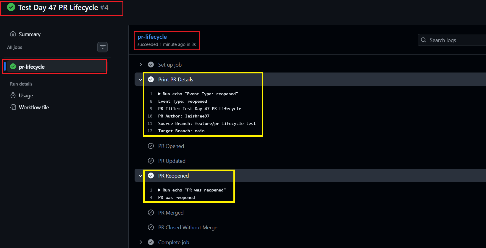

### Test 4: Merge the Pull Request

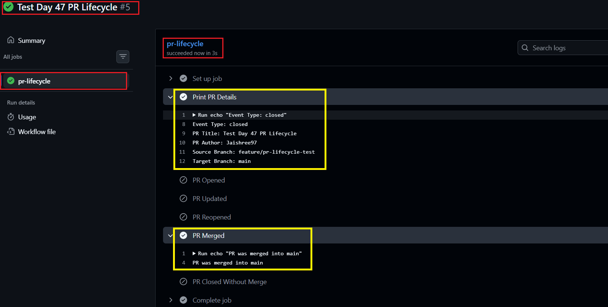

**Result:** The workflow successfully detected the `opened`, `synchronize`, `reopened`, and `closed` events and correctly distinguished between a merged Pull Request and one closed without merging.

---


## Task 2: PR Validation Workflow

Created a Pull Request validation workflow to implement automated quality gates before changes are merged into the `main` branch.

1. Configured the workflow to trigger on Pull Requests targeting `main`.
2. Added a `file-size-check` job that:
   - Checks out the repository.
   - Detects files larger than 1 MB.
   - Fails the check if an oversized file is found.
3. Added a `branch-name-check` job that:
   - Reads the source branch using `github.head_ref`.
   - Allows only `feature/*`, `fix/*`, and `docs/*` branch naming patterns.
   - Fails the validation when the branch name does not follow the required convention.
4. Added a `pr-body-check` job that:
   - Reads the Pull Request description.
   - Displays a warning when the PR description is empty without failing the workflow.

Create [`pr-checks.yml`](./workflows/pr-checks.yml)

**Verify:** Tested the workflow with both an invalid branch name and a valid `feature/*` branch to verify the failure and success scenarios.

### Test 1: Invalid Branch Name

Created a branch that did not follow the required naming convention and opened a Pull Request to `main`.

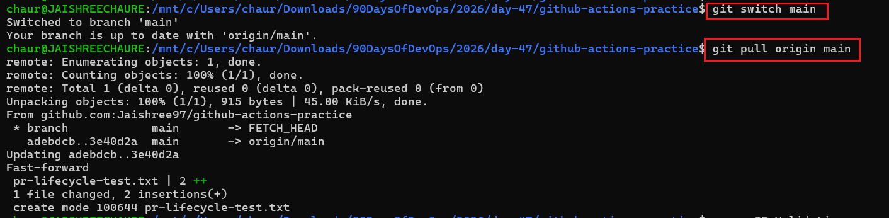

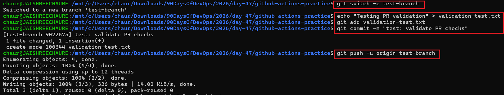

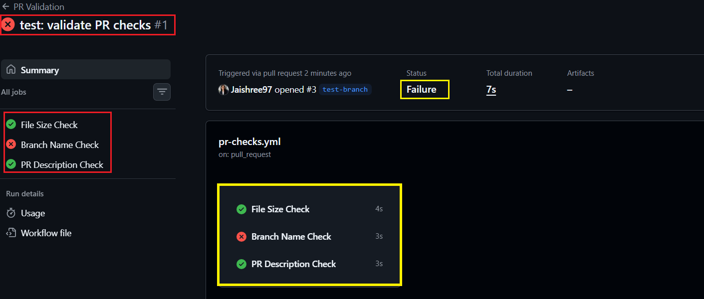

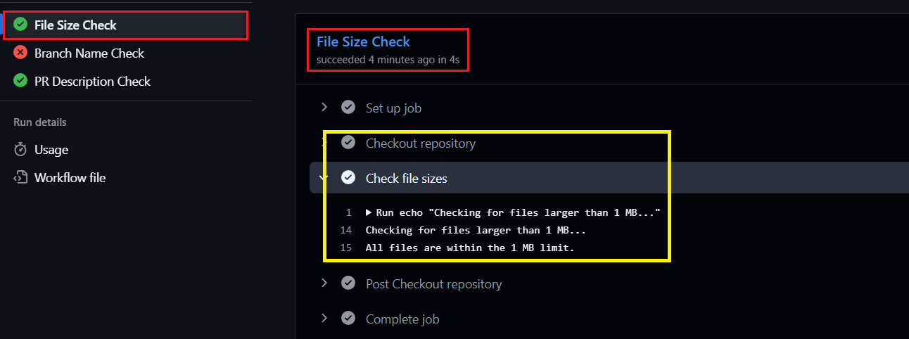

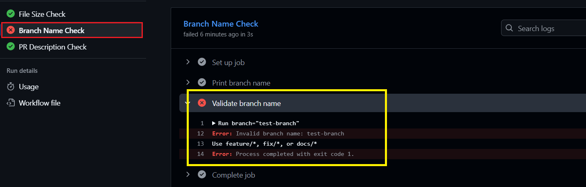

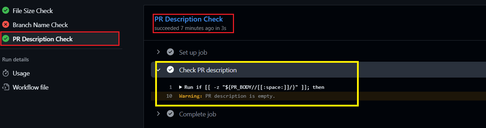

**Result:** The `branch-name-check` correctly failed because the branch did not follow the required naming convention, while the other validation jobs executed independently.

### Test 2: Valid Branch Name

Created a new branch following the `feature/*` naming convention and opened another Pull Request.

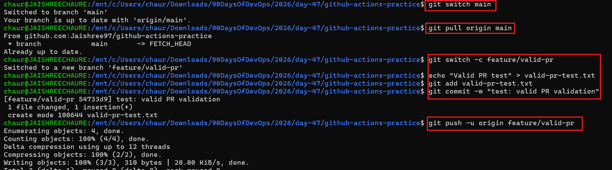

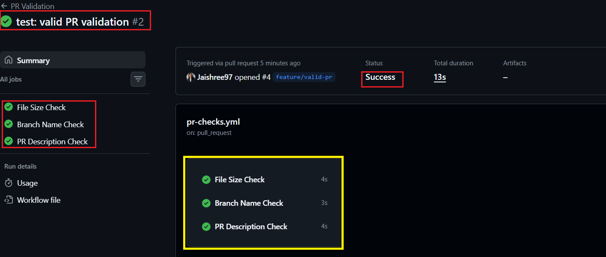

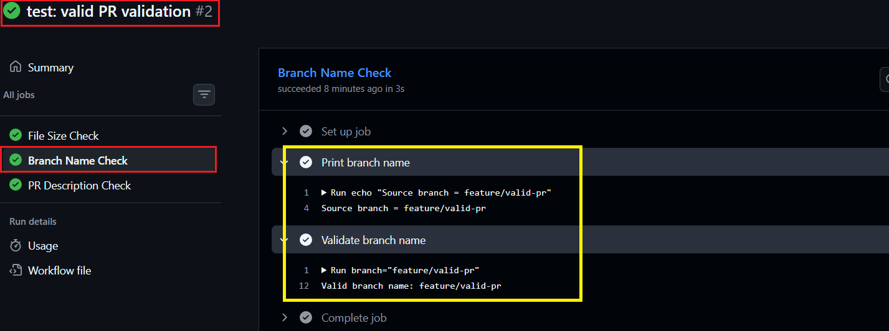

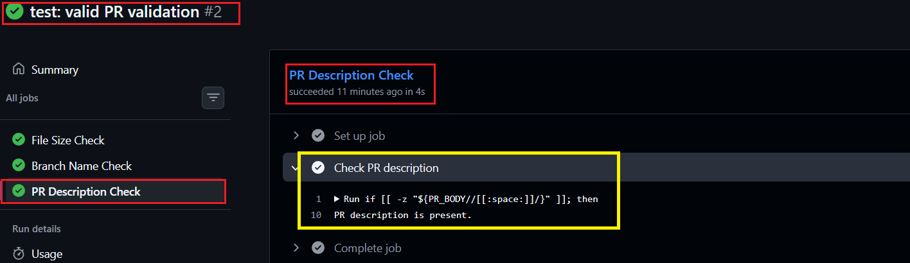

**Result:** The valid `feature/*` branch satisfied the naming convention, and all configured Pull Request validation checks passed successfully.

---

## Task 3: Scheduled Workflows (Cron Deep Dive)

Created a scheduled GitHub Actions workflow to understand cron-based automation, manual execution, and automated health checks.

1. Added a `schedule` trigger with `30 2 * * 1` to run every Monday at 2:30 AM UTC.
2. Added another schedule with `0 */6 * * *` to run every 6 hours.
3. Used `github.event.schedule` to identify which cron schedule triggered the workflow.
4. Added `workflow_dispatch` to manually test the workflow without waiting for the scheduled execution.
5. Added an HTTP health check using `curl` to verify the response status code.

Create [`scheduled-tasks.yml`](./workflows/scheduled-tasks.yml)

### Notes

1. **Every weekday at 9:00 AM IST:** GitHub Actions schedules use UTC. Since 9:00 AM IST = 3:30 AM UTC:

   ```text
   30 3 * * 1-5
   ```

2. **First day of every month at midnight UTC:**

   ```text
   0 0 1 * *
   ```

3. **Scheduled workflow behavior:** Scheduled workflows may be delayed during periods of high GitHub Actions load. Scheduled workflows in inactive public repositories may also be automatically disabled after an extended period of repository inactivity.

4. **Manual testing:** `workflow_dispatch` allows the workflow to be executed manually from the Actions tab without waiting for the cron schedule.

**Verify:** Manually triggered the workflow using `workflow_dispatch` and verified that the scheduled job and health check executed successfully.

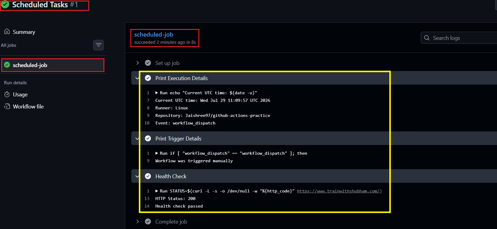

**Result:** The workflow executed successfully through manual dispatch, and the health check returned the expected HTTP response.

---

## Task 4: Path & Branch Filters

Created path and branch filtered workflows to control when GitHub Actions runs and avoid unnecessary workflow executions.

1. Configured `smart-triggers.yml` to trigger only when files inside `src/` or `app/` change.
2. Added branch filters to allow the workflow to run only on `main` and `release/*` branches.
3. Created `ignore-docs.yml` using `paths-ignore` to skip workflow execution when only Markdown or documentation files change.
4. Tested the filters using both application changes and documentation-only changes.

Create [`smart-triggers.yml`](./workflows/smart-triggers.yml)

Create [`ignore-docs.yml`](./workflows/ignore-docs.yml)

### Notes

- **`paths`:** Use when a workflow should run only when specific files or directories change. For example, application CI can run only when files under `src/**` or `app/**` are modified.
- **`paths-ignore`:** Use when a workflow should normally run but should be skipped when all changed files match ignored paths, such as `*.md` or `docs/**`.
- **Branch filters:** Restrict workflow execution to specific branches such as `main` or `release/*`.
- **Branch + path filters:** When both are configured, both conditions must be satisfied for the workflow to trigger.

**Verify:** Pushed application changes and documentation-only changes to confirm that the workflows execute only when their branch and path conditions are satisfied.

### Test 1: Path & Branch Filters

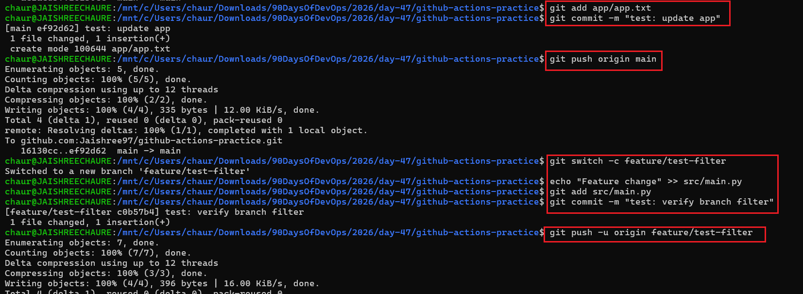

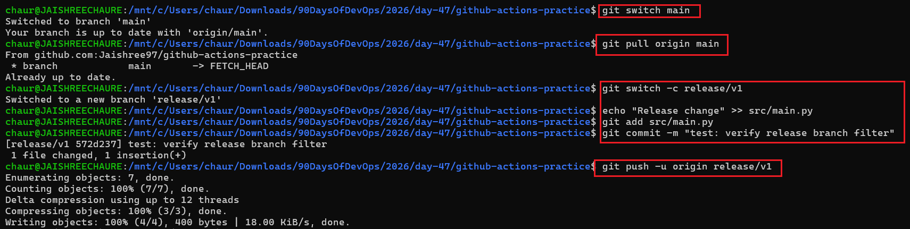

### Test 2: Workflow Trigger Results

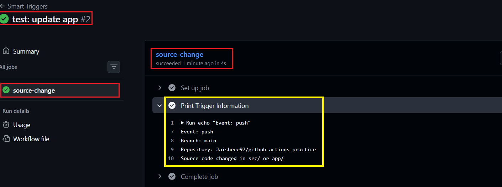

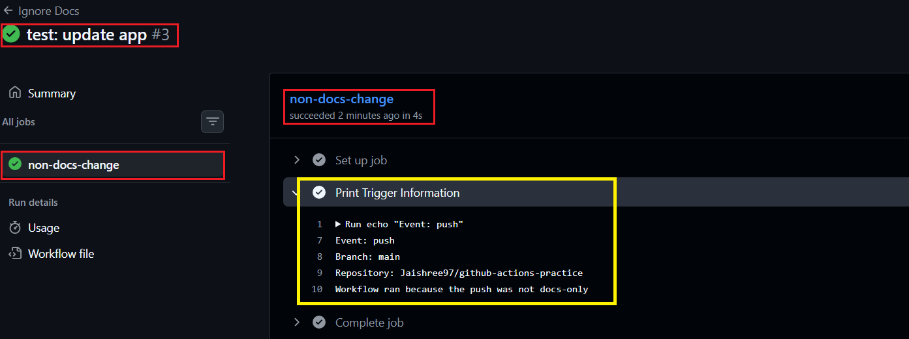

**Result:** The filters worked as expected. Relevant application changes triggered the workflows, while documentation-only changes were skipped according to the configured path rules.

---

## Task 5: `workflow_run` — Chain Workflows Together

Created two GitHub Actions workflows to understand how independent workflows can be chained using the `workflow_run` trigger.

1. Created `run-tests.yml` to execute tests on every push.
2. Created `deploy-after-tests.yml` to trigger after the `Run Tests` workflow completes.
3. Used the `workflow_run` event with the `completed` activity type to detect when the test workflow finishes.
4. Checked the result of the triggering workflow using `github.event.workflow_run.conclusion`.
5. Added conditional execution so deployment proceeds only when the test workflow succeeds.

Create [`run-tests.yml`](./workflows/run-tests.yml)

Create [`deploy-after-tests.yml`](./workflows/deploy-after-tests.yml)

### Notes

- **`workflow_run`:** Triggers one workflow based on the execution of another workflow.
- **`completed`:** Means the triggering workflow has finished; it does not automatically mean that it succeeded.
- **`conclusion`:** Provides the final result of the triggering workflow, such as `success`, `failure`, or `cancelled`.
- **`needs` vs `workflow_run`:** `needs` creates dependencies between jobs inside the same workflow, while `workflow_run` connects separate workflow files.

### Workflow Flow

```text
Push
  ↓
Run Tests
  ↓
Tests Complete
  ↓
workflow_run
  ↓
Check conclusion
  ↓
success
  ↓
Deploy After Tests
```

**Verify:** Pushed a commit and confirmed that the `Run Tests` workflow executed first. After the tests completed successfully, the `Deploy After Tests` workflow was triggered.

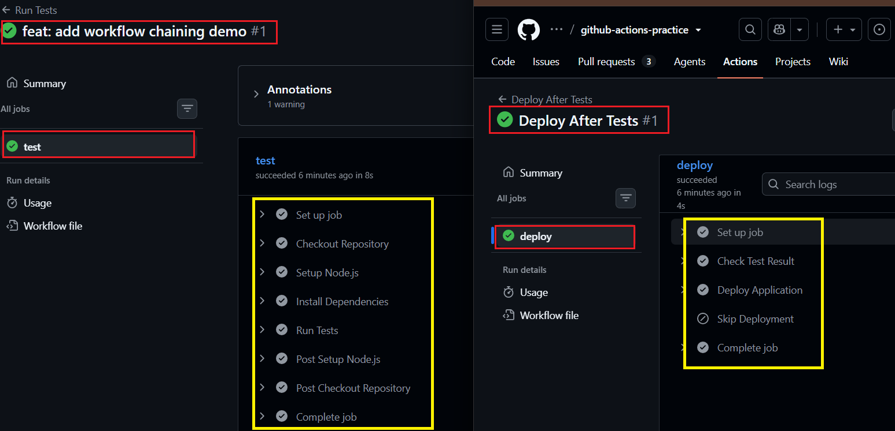

**Result:** The workflows were successfully chained, and the deployment workflow proceeded only after the test workflow completed successfully.

---

## Task 6: `repository_dispatch` — External Event Triggers

Created a GitHub Actions workflow to understand how external systems can trigger a pipeline using the `repository_dispatch` event and GitHub API.

1. Configured the workflow with the `repository_dispatch` trigger.
2. Added the custom event type `deploy-request`.
3. Used `github.event.client_payload.environment` to read data sent by the external system.
4. Used GitHub CLI (`gh`) to send a `deploy-request` event through the GitHub API.
5. Passed `production` as the environment using `client_payload`.
6. Verified that the external API request successfully triggered the GitHub Actions workflow.

Create [`external-trigger.yml`](./workflows/external-trigger.yml)

### Notes

- **`repository_dispatch`:** Allows an external system to trigger a GitHub Actions workflow through the GitHub API.
- **`event_type`:** Defines the custom event the workflow listens for, such as `deploy-request`.
- **`client_payload`:** Carries additional data from the external system into the workflow.
- **Real-world use:** Monitoring systems, deployment platforms, Slack bots, or internal automation tools can trigger pipelines when events occur outside GitHub.

### Event Flow

```text
External System
      ↓
GitHub API
      ↓
repository_dispatch
      ↓
deploy-request
      ↓
GitHub Actions
      ↓
client_payload.environment
      ↓
production
```

**Verify:** Triggered the `deploy-request` event using GitHub CLI and passed `production` through `client_payload`.

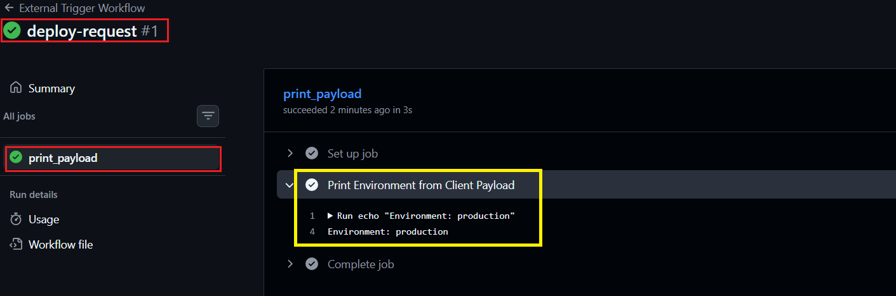

**Result:** The external event successfully triggered the workflow, and the `production` environment value was received and printed in the workflow logs.

---

## Key Learnings

| Feature | Purpose |
|---|---|
| `pull_request` | React to specific PR lifecycle events |
| `schedule` | Run workflows automatically using cron |
| `workflow_dispatch` | Trigger workflows manually |
| `paths` | Run only when specified paths change |
| `paths-ignore` | Skip runs for ignored-only changes |
| `branches` | Restrict workflows to specific branches |
| `if` | Control whether a job or step executes |
| `workflow_run` | Chain separate workflows |
| `repository_dispatch` | Trigger workflows from external systems |

