# Day 48 – GitHub Actions Project: End-to-End CI/CD Pipeline

## Task 1: Set Up the Project Repository

Instead of creating a new application, I reused my **Dockerized Task Manager API** from **Day 36** and transformed it into a production-style CI/CD project using GitHub Actions.

The project includes:

- Node.js Express Task Manager API
- MongoDB integration
- Dockerized application
- `/health` endpoint for automated health monitoring
- Automated health check test script
- Project documentation
- Reusable GitHub Actions workflows

## 📦 Project Repository

🔗 **GitHub Repository:** [github-actions-capstone](https://github.com/Jaishree97/github-actions-capstone)

🐳 **Docker Hub Repository:** [jaishreechaure/task-manager-api](https://hub.docker.com/repository/docker/jaishreechaure/task-manager-api/general)

> **Project Goal:** Build a production-style CI/CD pipeline using reusable GitHub Actions workflows, automated Docker image publishing, protected deployments, scheduled health monitoring, and DevSecOps security scanning.

> **Note:** This repository extends the Dockerized Task Manager API created during **Day 36** by implementing reusable GitHub Actions workflows, Docker image publishing, production deployment, scheduled health checks, and Trivy-based vulnerability scanning.

## Task 2: Reusable Workflow — Build & Test
Create `.github/workflows/reusable-build-test.yml`:
1. Trigger: `workflow_call`
2. Inputs: `python_version` (or `node_version`), `run_tests` (boolean, default: true)
3. Steps:
   - Check out code
   - Set up the language runtime
   - Install dependencies
   - Run tests (only if `run_tests` is true)
   - Set output: `test_result` with value `passed` or `failed`

This workflow does NOT deploy — it only builds and tests.

**Workflow:**  [`01-reusable-build-test.yml`](./workflows/01-reusable-build-test.yml)

---

## Task 3: Reusable Workflow — Docker Build & Push
Create `.github/workflows/reusable-docker.yml`:
1. Trigger: `workflow_call`
2. Inputs: `image_name` (string), `tag` (string)
3. Secrets: `docker_username`, `docker_token`
4. Steps:
   - Check out code
   - Log in to Docker Hub
   - Build and push the image with the given tag
   - Set output: `image_url` with the full image path

**Workflow:**  [`02-reusable-docker.yml`](./workflows/02-reusable-docker.yml)

---

## Task 4: PR Pipeline
Create `.github/workflows/pr-pipeline.yml`:
1. Trigger: `pull_request` to `main` (types: `opened`, `synchronize`)
2. Call the reusable build-test workflow:
   - Run tests: `true`
3. Add a standalone job `pr-comment` that:
   - Runs after the build-test job
   - Prints a summary: "PR checks passed for branch: `<branch>`"
4. Do **NOT** build or push Docker images on PRs

**Verification:** Opening a Pull Request runs **only the Build & Test workflow**, ensuring code quality without building Docker images or deploying the application.

**Workflow:**  [`03-pr-pipeline.yml`](./workflows/03-pr-pipeline.yml)

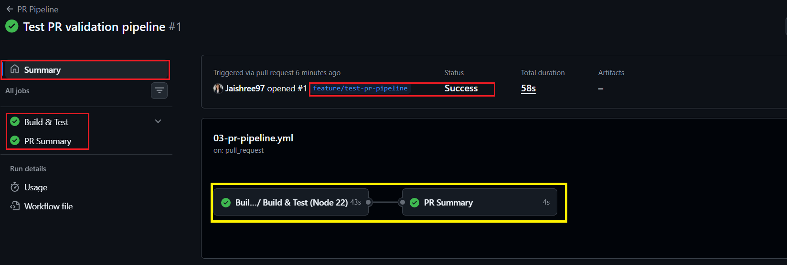

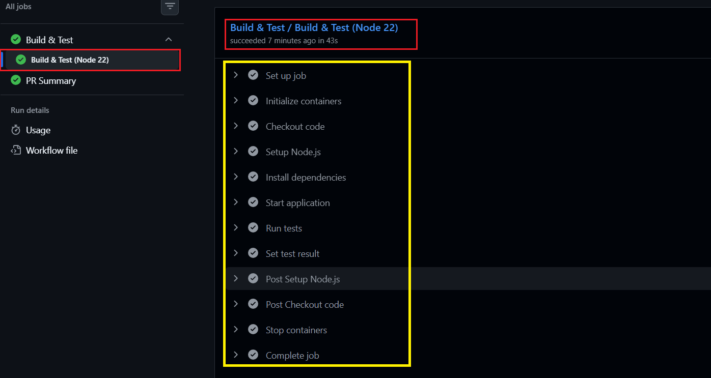

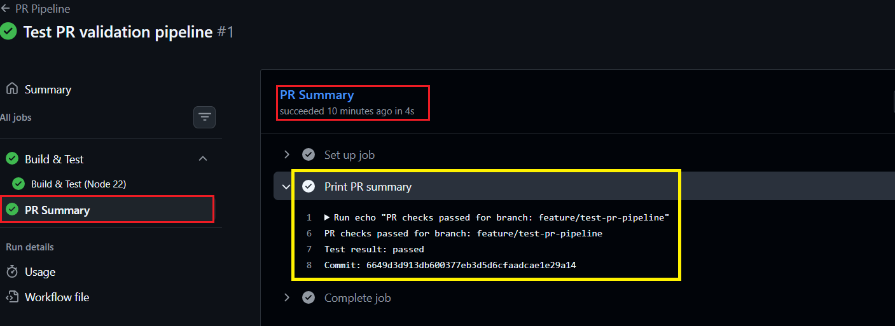

---

## Task 5: Main Branch Pipeline
Create `.github/workflows/main-pipeline.yml`:
1. Trigger: `push` to `main`
2. Job 1: Call the reusable build-test workflow
3. Job 2 (depends on Job 1): Call the reusable Docker workflow
   - Tag: `latest` and `sha-<short-commit-hash>`
4. Job 3 (depends on Job 2): `deploy` job that:
   - Prints "Deploying image: `<image_url>` to production"
   - Uses `environment: production` (set this up in repo Settings → Environments)
   - Requires manual approval if you've set up environment protection rules

**Verification:** Merging a Pull Request into `main` executes the complete CI/CD pipeline in the following order:

**Build & Test → Docker Build & Push → Trivy Security Scan → Deploy to Production**

**Workflow:**  [`04-main-pipeline.yml`](./workflows/04-main-pipeline.yml)

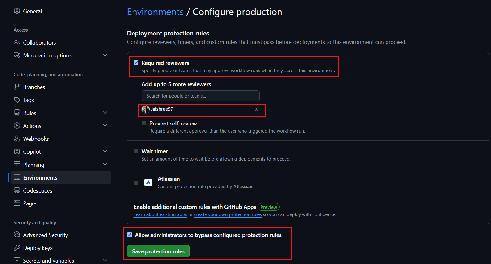

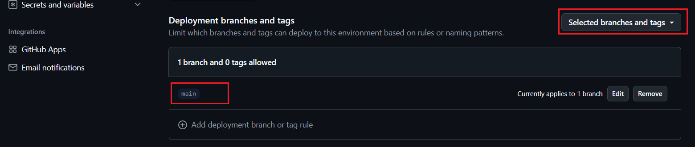

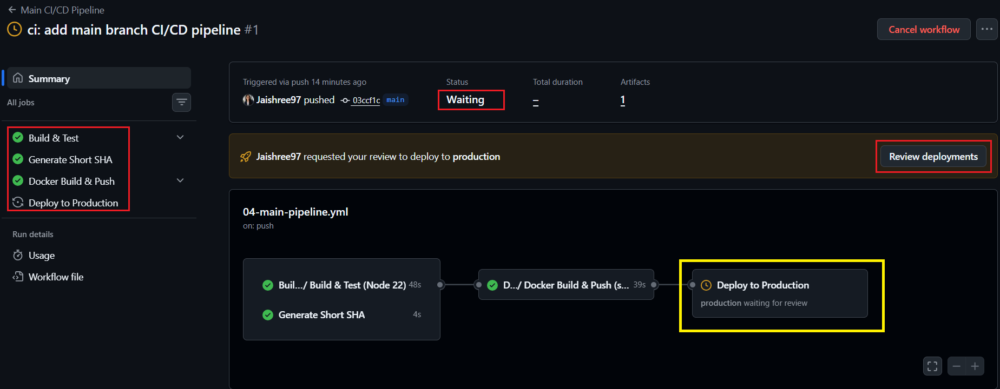

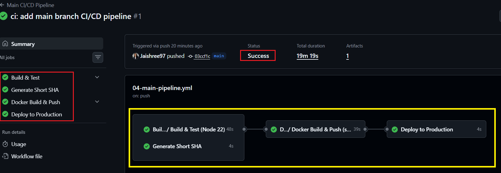

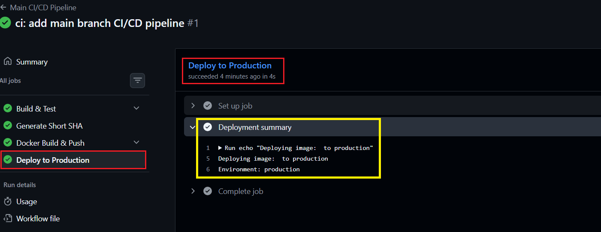

---

## Task 6: Scheduled Health Check
Create `.github/workflows/health-check.yml`:
1. Trigger: `schedule` with cron `'0 */12 * * *'` (every 12 hours) + `workflow_dispatch` for manual testing
2. Steps:
   - Pull your latest Docker image
   - Run the container in detached mode
   - Wait 5 seconds, then curl the health endpoint
   - Print pass/fail based on the response
   - Stop and remove the container
3. Add a step that creates a summary using `$GITHUB_STEP_SUMMARY`:
   ```bash
   echo "## Health Check Report" >> $GITHUB_STEP_SUMMARY
   echo "- Image: myapp:latest" >> $GITHUB_STEP_SUMMARY
   echo "- Status: PASSED" >> $GITHUB_STEP_SUMMARY
   echo "- Time: $(date)" >> $GITHUB_STEP_SUMMARY
   ```
**Workflow:**  [`05-health-check.yml`](./workflows/05-health-check.yml)

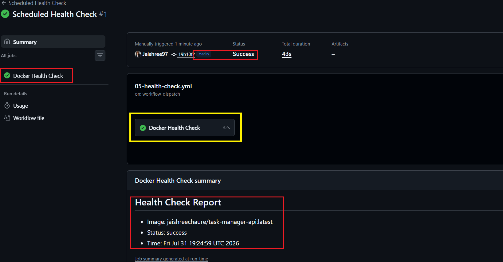

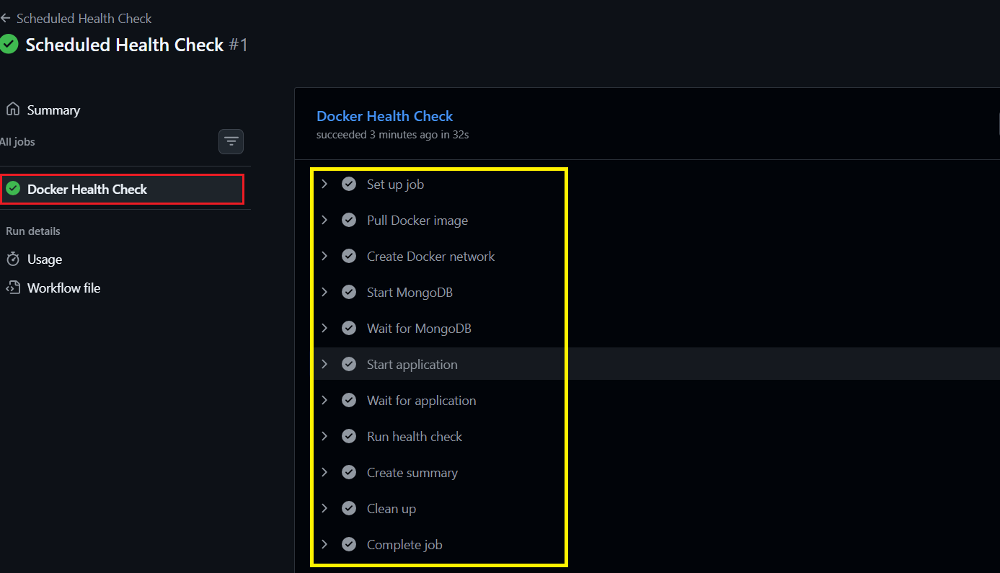

---

## Task 7: Add Badges & Documentation
1. Add status badges for all your workflows to the repo `README.md`
2. Add a **pipeline architecture diagram** in your notes — draw (or describe) the flow:
   ```
   PR opened → build & test → PR checks pass
   Merge to main → build & test → Docker build & push → deploy
   Every 12 hours → health check
   ```
3. Fill in your notes: What would you add next? (Slack notifications? Multi-environment? Rollback?)

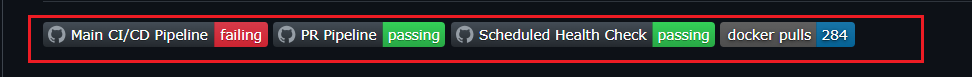

## 🏗️ CI/CD Pipeline Architecture

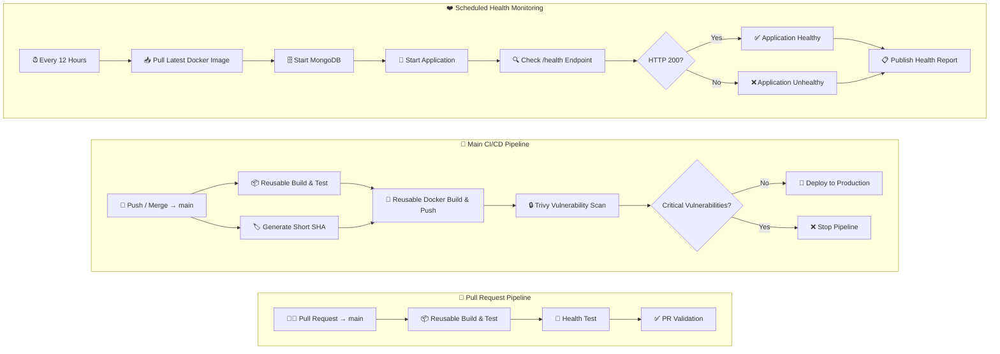
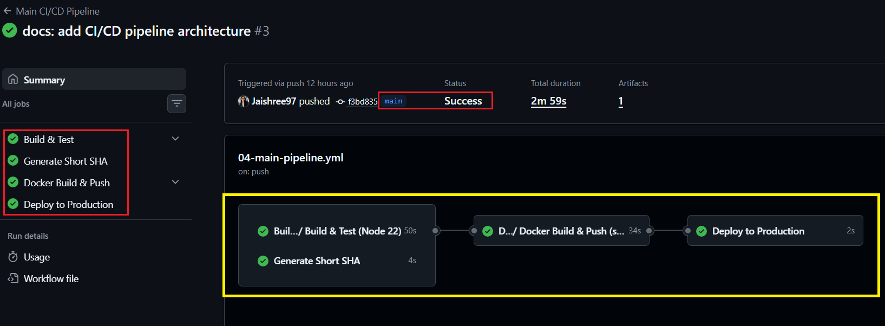


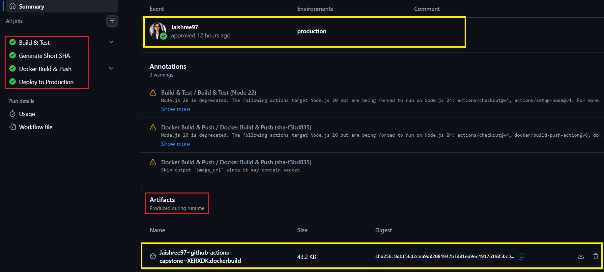

---

## ⭐ Brownie Points: Add Security to Your Pipeline

Integrated Trivy into the main CI/CD pipeline to perform automated vulnerability scanning before deployment. The security gate blocks production deployments whenever CRITICAL vulnerabilities are detected.

1. Scans the published Docker image
2. Uploads the vulnerability report as a GitHub Actions artifact
3. Blocks deployment when CRITICAL vulnerabilities are detected
4. Demonstrates a fail-fast DevSecOps security gate

**Workflow:**  [`04-main-pipeline.yml`](./workflows/04-main-pipeline.yml)

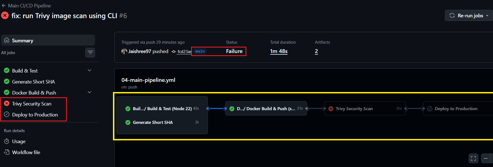

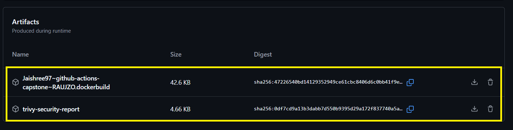

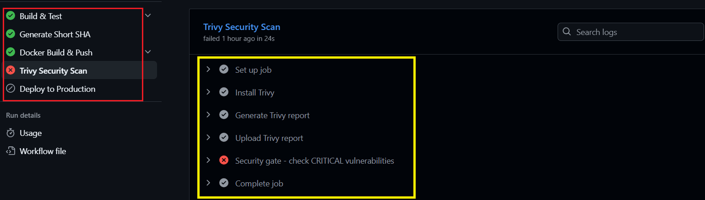

---

## 🎯 Outcome

Successfully designed and implemented a production-style CI/CD pipeline using GitHub Actions with reusable workflows, automated testing, Docker image publishing, scheduled health monitoring, protected deployments, and Trivy-based vulnerability scanning.

### Key Learnings

- Designed reusable GitHub Actions workflows using `workflow_call`
- Automated application testing before deployment
- Published versioned Docker images to Docker Hub
- Configured protected production deployments
- Implemented scheduled health monitoring
- Integrated DevSecOps practices using Trivy
- Built a modular CI/CD pipeline suitable for real-world projects
