# Day 49 – DevSecOps: Add Security to Your CI/CD Pipeline


## What is DevSecOps?

DevSecOps is the practice of integrating security into every stage of the CI/CD pipeline. Instead of catching vulnerabilities late in production, DevSecOps ensures they are identified and fixed early during development and deployment.

Think of it like this:

**Without DevSecOps:**
> You build the app → deploy it → a security team finds a vulnerability weeks later → you scramble to fix it

**With DevSecOps:**
> You open a PR → the pipeline automatically checks for vulnerabilities → you fix it before it ever gets merged

**That's it.** DevSecOps means integrating automated security checks directly into the CI/CD pipeline you already have.

---

## Key Principles (Keep These in Mind)

1. **Catch problems early** — A vulnerability found in a PR takes 5 minutes to fix. The same vulnerability found in production takes days.

2. **Automate the checks** — Don't rely on someone remembering to check. Let the pipeline do it every time.

3. **Block on critical issues** — If a scan finds a serious vulnerability, the pipeline should fail — just like a failing test.

4. **Never put secrets in code** — Use GitHub Secrets (you learned this on Day 44). No `.env` files, no hardcoded API keys.

5. **Give only the access needed** — Your workflow doesn't need write access to everything. Limit permissions.

---

## Task 1: Scan Your Docker Image for Vulnerabilities
Your Docker image might use a base image with known security issues. Let's find out.

Add this step to your main branch pipeline (after Docker build, before deploy):
```yaml
- name: Scan Docker Image for Vulnerabilities
  uses: aquasecurity/trivy-action@master
  with:
    image-ref: 'your-username/your-app:latest'
    format: 'table'
    exit-code: '1'
    severity: 'CRITICAL,HIGH'
```

What this does:
- `trivy` scans your Docker image for known CVEs (Common Vulnerabilities and Exposures)
- `format: 'table'` prints a readable table in the logs
- `exit-code: '1'` means **fail the pipeline** if CRITICAL or HIGH vulnerabilities are found
- If it passes, your image is clean — proceed to push and deploy

Push and check the Actions tab. Read the scan output.

**Verify:** Can you see the vulnerability table in the logs? Did it pass or fail?

### Notes

**Verification:** Yes, the vulnerability table appeared in the workflow logs and the pipeline failed as expected because a CRITICAL vulnerability was detected.

- The initial Trivy scan detected a **CRITICAL** vulnerability.
- Vulnerability found: **CVE-2026-59873**
- Affected package: **tar**
- Severity: **CRITICAL**
- Base image used: **node:22-alpine**

After investigating, I confirmed the vulnerability originated from the official Node.js base image rather than my application code. Trivy is now integrated into the CI/CD pipeline to automatically scan every Docker image and report HIGH and CRITICAL vulnerabilities before deployment.

### Workflow Output: Trivy Security Scan

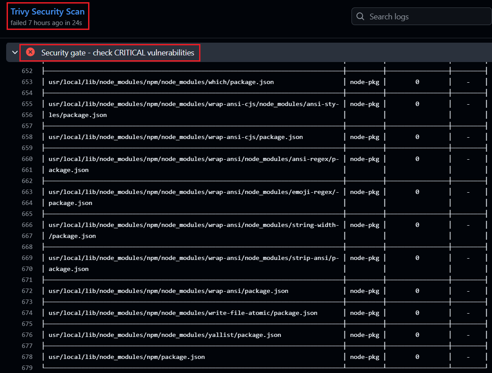

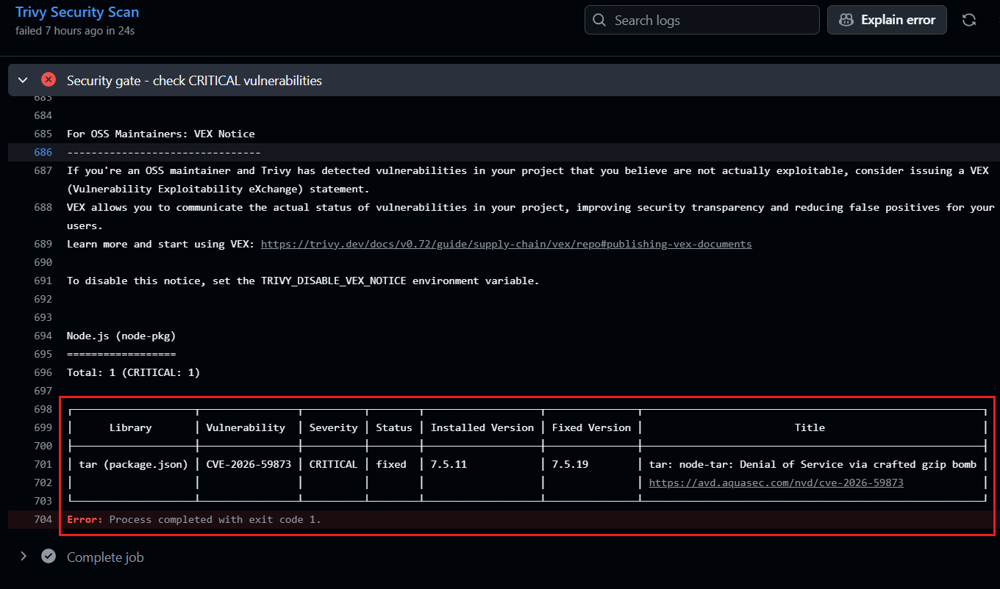

---

## Task 2: Enable GitHub's Built-in Secret Scanning
GitHub can automatically detect if someone pushes a secret (API key, token, password) to your repo.

1. Go to your repo → Settings → **Code security and analysis**
2. Enable **Secret scanning**
3. If available, also enable **Push protection** — this blocks the push entirely if a secret is detected

That's it — no workflow changes needed. GitHub does this automatically.

### Notes

**What is the difference between Secret Scanning and Push Protection?**

- **Secret Scanning** detects secrets that have already been committed to the repository.
- **Push Protection** blocks the push before the secret is committed, preventing accidental exposure.

**What happens if GitHub detects a leaked AWS access key?**

GitHub immediately alerts the repository owner and may notify AWS so the exposed credentials can be revoked or disabled to reduce the risk of unauthorized access.

### Workflow Output: Repository Security Configuration

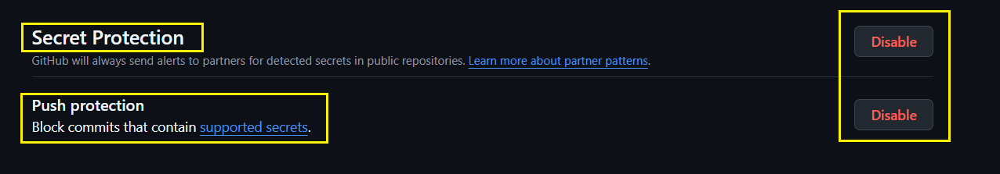

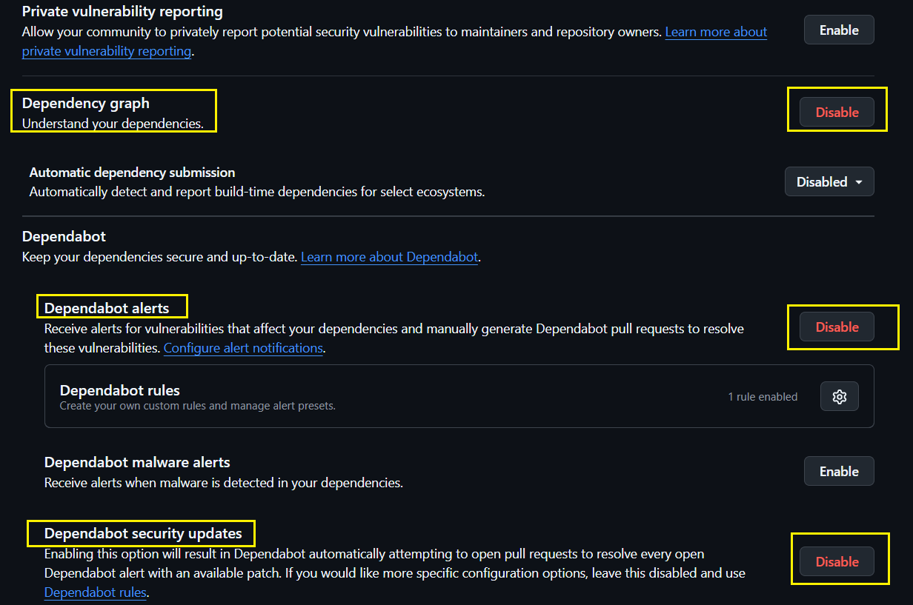

---

## Task 3: Scan Dependencies for Known Vulnerabilities
If your app uses packages (pip, npm, etc.), those packages might have known vulnerabilities.

Add this to your **PR pipeline** (not the main pipeline):
```yaml
- name: Check Dependencies for Vulnerabilities
  uses: actions/dependency-review-action@v4
  with:
    fail-on-severity: critical
```

This checks any **new** dependencies added in the PR against a vulnerability database. If a dependency has a critical CVE, the PR check fails.

Test it:
1. Open a PR that adds a package to your app
2. Check the Actions tab — did the dependency review run?

**Verify:** Does the dependency review show up as a check on your PR?

### Verification

- The Dependency Review workflow executed successfully on every Pull Request.
- New dependencies were automatically checked against GitHub's vulnerability database.
- No critical vulnerabilities were introduced in the tested Pull Request.

### Workflow Output: Dependency Review Workflow

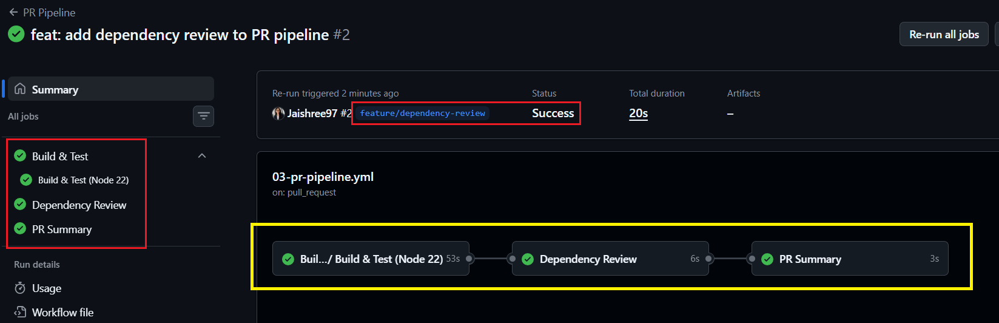

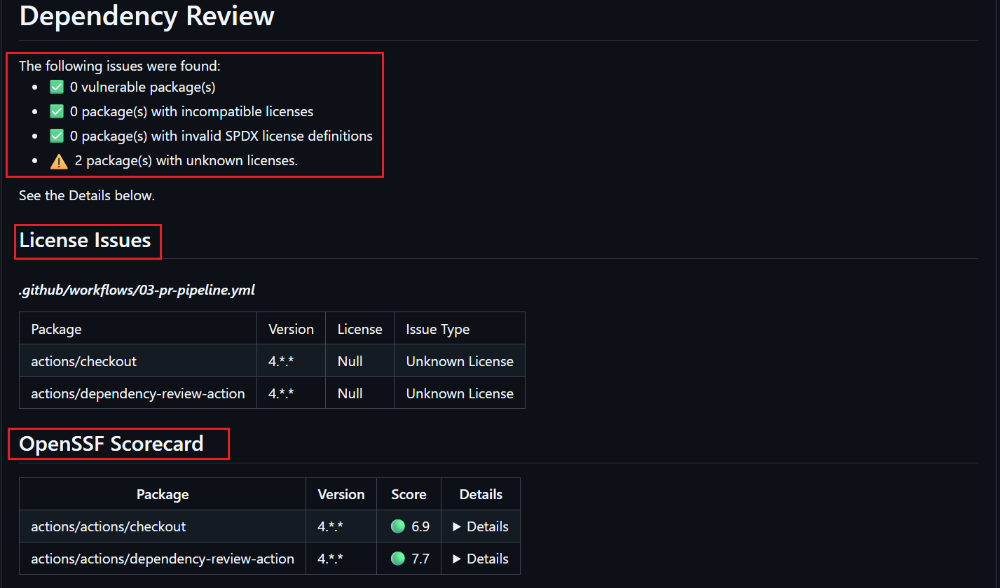

---

## Task 4: Add Permissions to Your Workflows
By default, workflows get broad permissions. Lock them down.

Add this block near the top of your workflow files (after `on:`):
```yaml
permissions:
  contents: read
```

If a workflow needs to comment on PRs, add:
```yaml
permissions:
  contents: read
  pull-requests: write
```

Update at least 2 of your existing workflow files with a `permissions` block.

Write in your notes: Why is it a good practice to limit workflow permissions? What could go wrong if a compromised action has write access to your repo?

### Notes

Limiting workflow permissions follows the **Principle of Least Privilege**.

Benefits:

- Reduces the impact of compromised GitHub Actions.
- Prevents unauthorized repository changes.
- Protects source code, releases, and pull requests.
- Improves the overall security of the CI/CD pipeline.

For this project, I configured:

```yaml
permissions:
  contents: read
```

and used additional permissions only where required.

---

## Task 5: See the Full Secure Pipeline
Look at what your pipeline does now:

```
PR opened
  → build & test
  → dependency vulnerability check     ← NEW (Day 49)
  → PR checks pass or fail

Merge to main
  → build & test
  → Docker build
  → Trivy image scan (fail on CRITICAL) ← NEW (Day 49)
  → Docker push (only if scan passes)
  → deploy

Always active
  → GitHub secret scanning              ← NEW (Day 49)
  → push protection for secrets         ← NEW (Day 49)
```

Draw this diagram in your notes. You just built a **DevSecOps pipeline** — security is now part of your automation, not an afterthought.

## 🏗️ DevSecOps Pipeline Architecture

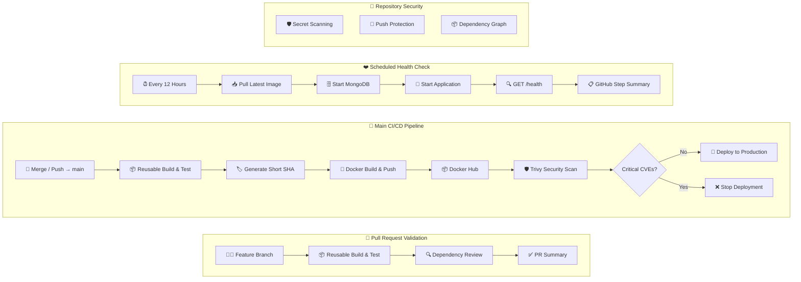
---

## Brownie Points (Optional — For the Curious)

### Pin Actions to Commit SHAs
Tags like `@v4` can be moved by the action author. For extra security, pin to the exact commit:
```yaml
# Instead of this:
uses: actions/checkout@v4

# Use this:
uses: actions/checkout@b4ffde65f46336ab88eb53be808477a3936bae11 # v4.1.1
```
This protects against supply chain attacks where a tag is silently changed.

### Upload Scan Results to GitHub Security Tab
Add SARIF output to Trivy and upload it — your scan results will appear in the repo's **Security** tab:
```yaml
- uses: aquasecurity/trivy-action@0.35.0
  with:
    image-ref: 'your-username/your-app:latest'
    format: 'sarif'
    output: 'trivy-results.sarif'
- uses: github/codeql-action/upload-sarif@v3
  with:
    sarif_file: 'trivy-results.sarif'
```
### Workflow Output: GitHub Code Scanning Results

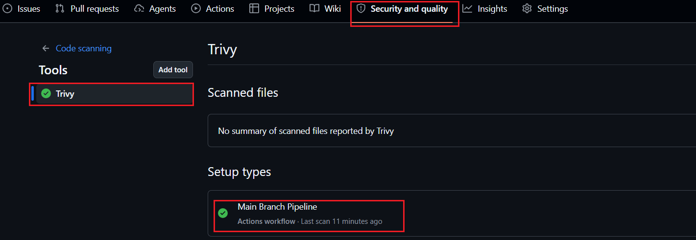

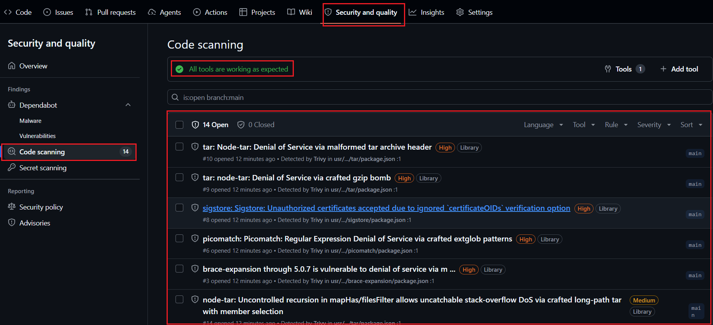

### Workflow Output: Dependency Graph

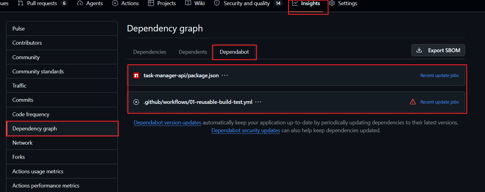

### Workflow Output: Dependabot Pull Requests


---

### Workflow Output: Final DevSecOps Pipeline

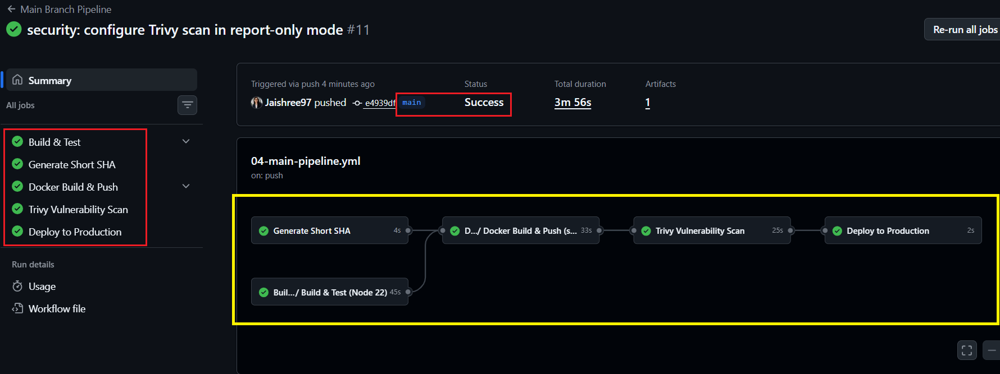


### Learn About OIDC (Keyless Authentication)
Instead of storing cloud credentials as long-lived secrets, GitHub Actions can use OIDC to get short-lived tokens automatically. 

#### What I Learned

OIDC (OpenID Connect) allows GitHub Actions to authenticate with cloud providers using short-lived tokens instead of storing long-lived access keys as GitHub Secrets. This significantly improves security and is the recommended approach for production CI/CD pipelines.

---

## Key Takeaways

Today I transformed my CI/CD pipeline into a **DevSecOps pipeline** by integrating automated security checks throughout the software delivery process.

### What I implemented

- Trivy vulnerability scanning
- GitHub Secret Scanning
- Dependabot version updates
- Dependency Review for Pull Requests
- Principle of Least Privilege using workflow permissions
- Security results in the GitHub Security tab
- Dependabot Pull Requests for dependency updates
- Dependency Graph