# Day 59 – Helm — Kubernetes Package Manager

### Task 1: Install Helm

Helm is the **package manager for Kubernetes**. It helps us install, upgrade, manage, and remove Kubernetes applications using **Helm Charts**.

1. Installed Helm using the official Helm installation script on **WSL Ubuntu**.

```bash
curl -fsSL -o get_helm.sh https://raw.githubusercontent.com/helm/helm/main/scripts/get-helm-4
chmod 700 get_helm.sh
./get_helm.sh
```
2. Verify with `helm version` and `helm env`

```bash
helm version
helm env
```
Three core concepts:
- **Chart** — A package containing Kubernetes resource templates and configuration.
- **Release** — A specific deployed instance of a Helm Chart in a Kubernetes cluster.
- **Repository** — A collection of Helm Charts that can be searched and installed.

**Verify:** What version of Helm is installed?

- Installed Helm version: `v4.2.3`
- Helm binary: `/usr/local/bin/helm`

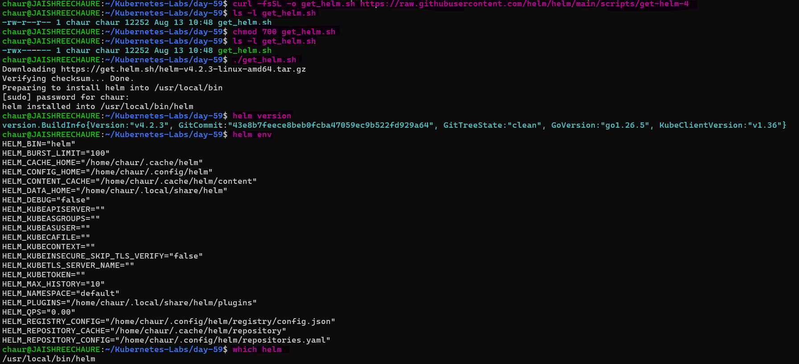

---

## Task 2: Add a Repository and Search

Helm uses **chart repositories** to discover and install Kubernetes applications.

1. Add the Bitnami repository: `helm repo add bitnami https://charts.bitnami.com/bitnami`
2. Update the repository: `helm repo update`
3. Search for charts: `helm search repo nginx` and `helm search repo bitnami`
4. Count Bitnami charts: `helm search repo bitnami | wc -l`

**Verify:** How many charts does Bitnami have?

- Number of Bitnami charts found: `145`
- Nginx chart was available as `bitnami/nginx`.

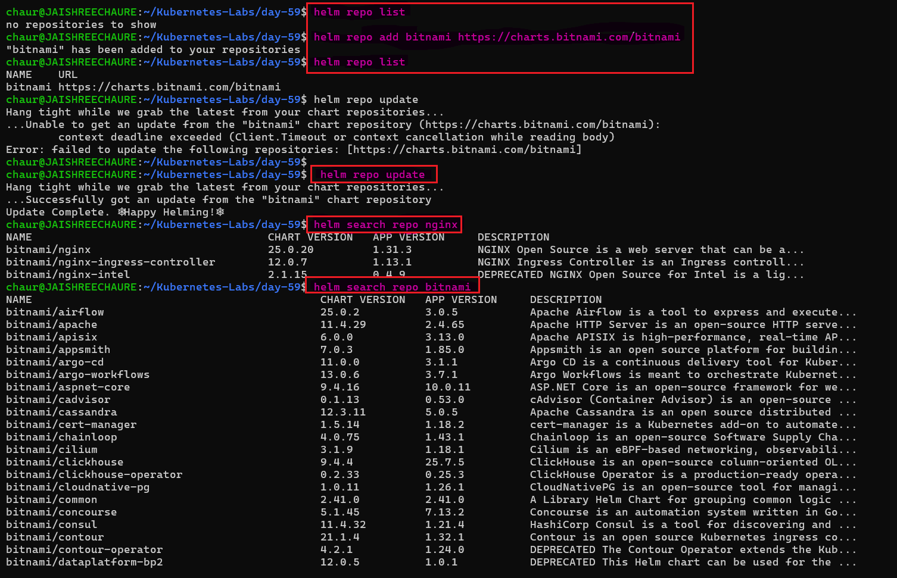

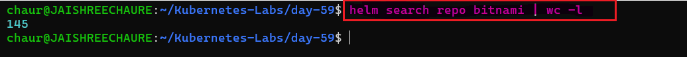
---

## Task 3: Install a Chart

Helm Charts allow us to deploy Kubernetes applications without manually writing every Kubernetes manifest.

1. Deploy Nginx: `helm install my-nginx bitnami/nginx`

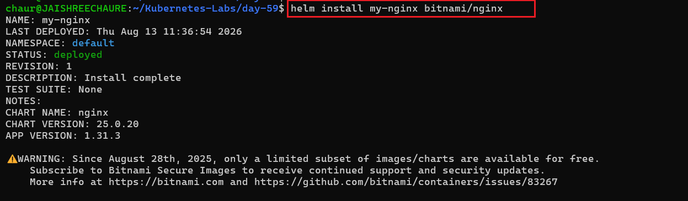

2. Check what was created: `kubectl get all`

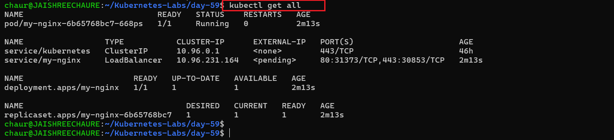

3. Inspect the release: `helm list`, `helm status my-nginx`, `helm get manifest my-nginx`

- List installed Helm releases:

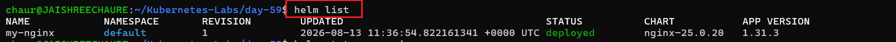

- Check the status of the `my-nginx` release:

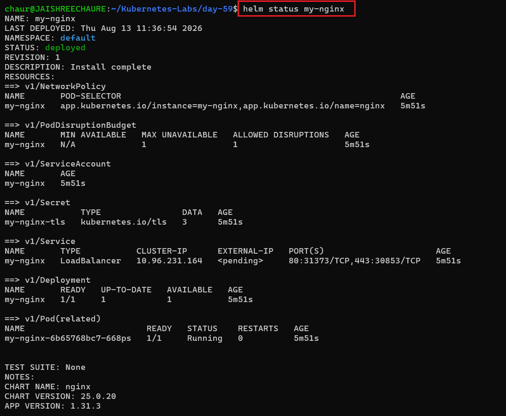

- View the Kubernetes manifests generated by the chart:

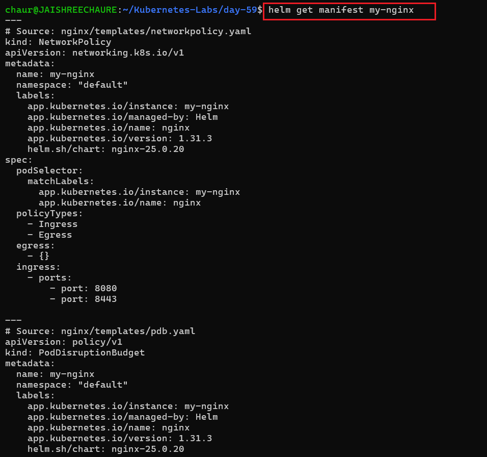

> **Note:** A single Helm command can generate and deploy multiple Kubernetes resources instead of manually creating separate Kubernetes manifests.

```bash
helm install my-nginx bitnami/nginx
```
**Verify:** How many Pods are running? What Service type was created?

- One pod is running
- A `LoadBalancer` Service was created.
- The Helm release status is `deployed`.
- Helm generated multiple Kubernetes resources from a single Chart.

---

## Task 4: Customize with Values

Helm uses a `values.yaml` file to customize a chart without modifying the chart itself. Values can also be overridden directly using `--set`.

1. View the default chart values: `helm show values bitnami/nginx`

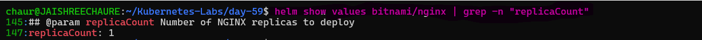

2. Install a custom release with 3 replicas and a `NodePort` Service:

```bash
helm install custom-nginx bitnami/nginx --set replicaCount=3 --set service.type=NodePort --namespace custom-ns --create-namespace
```
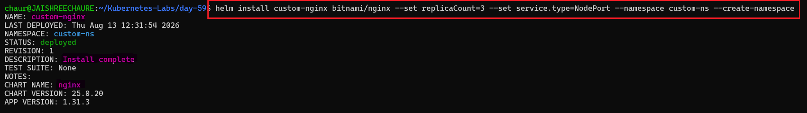 

3. Verify the resources created in the custom namespace:

```bash
kubectl get all -n custom-ns
```
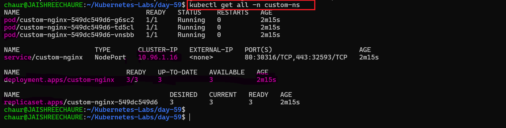 

4. Create a `custom-values.yaml` file with replicaCount, service type, and resource limits

    **manifest** [custom-values.yaml](./manifests/custom-values.yaml)

5. Install another release using `-f custom-values.yaml`

```bash
helm install nginx-values bitnami/nginx -f custom-values.yaml --namespace values-ns --create-namespace
```
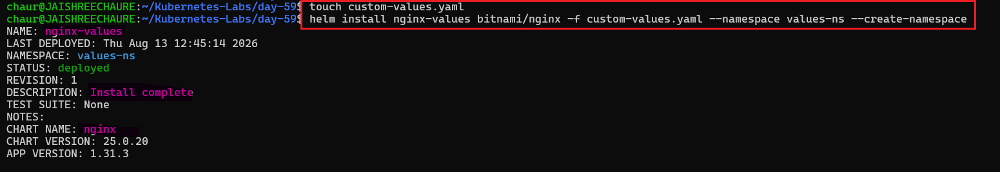

6. List all Helm releases: `helm list -A`

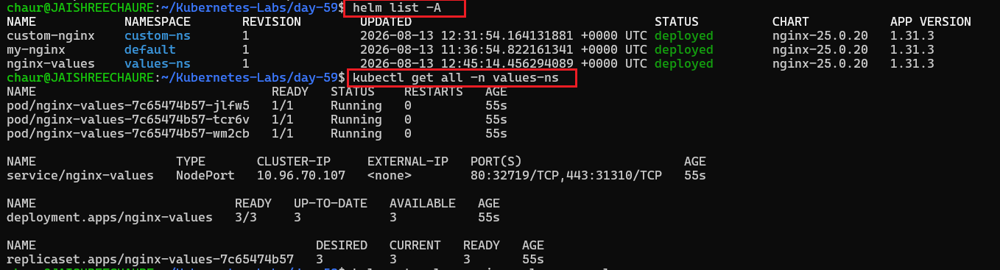

7. Check the values applied to the `nginx-values` release:

```bash
helm get values nginx-values -n values-ns
```
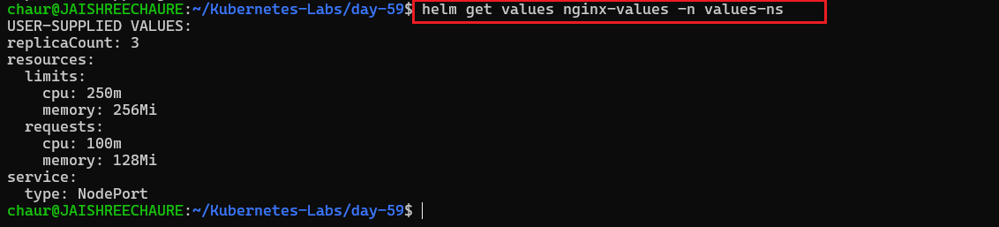

**Verify:** Does the values file release have the correct replicas and service type?

- `nginx-values` deployed with 3 replicas.
- The Service type is `NodePort`.
- Resource requests and limits were applied from `custom-values.yaml`.
- `helm get values` confirmed the custom values used by the release.
- Learned how Helm values allow chart customization without modifying the original chart.

---

## Task 5: Upgrade and Rollback

Helm supports upgrading and rolling back releases while maintaining a revision history.

1. Upgrade the `my-nginx` release to 5 replicas: `helm upgrade my-nginx bitnami/nginx --set replicaCount=5`

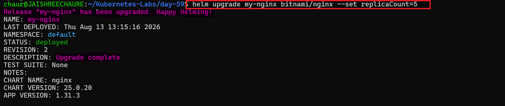

2. Check the release history: `helm history my-nginx`

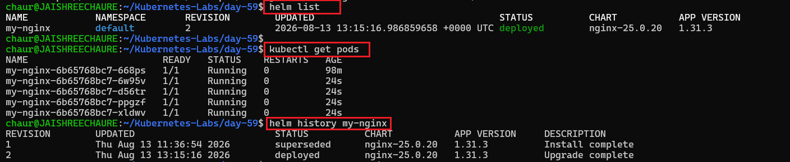

3. Roll back the release to revision `1`: `helm rollback my-nginx 1`

4. Check the release history again: `helm history my-nginx`

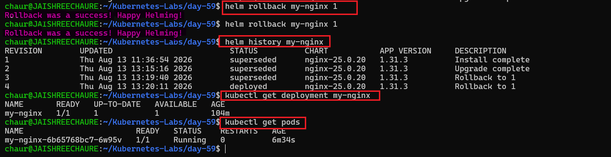

> **Note:** A rollback does not overwrite the previous revision. Helm creates a new revision containing the configuration from the selected revision.

This is the same concept as Deployment rollouts from **Day 52**, but at the full application stack level.

**Verify:** How many revisions are recorded after the rollback?

- **4 revisions** are recorded after the rollback.
- Revision `1` is the original installation.
- Revision `2` contains the upgrade to 5 replicas.
- Revision `3` is created by the first rollback to revision `1`.
- Revision `4` is created by the second rollback to revision `1`.
- The latest revision is `4` with status `deployed`.
- After the rollback, the deployment returned to **1 replica**.

---

## Task 6: Create Your Own Chart

Helm can scaffold a custom chart that uses **Go templates** and `values.yaml` to generate Kubernetes manifests dynamically.

1. Create a new Helm chart: `helm create my-app`

2. Explore the generated chart structure: `ls -la my-app`

Key files and directories:

- `Chart.yaml` — chart metadata and version information
- `values.yaml` — default configuration values
- `templates/` — Kubernetes manifest templates
- `templates/deployment.yaml` — Deployment template

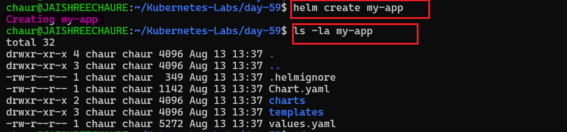 

3. Inspect the chart configuration and templates:

```bash
cat my-app/Chart.yaml
cat my-app/values.yaml
cat my-app/templates/deployment.yaml
```
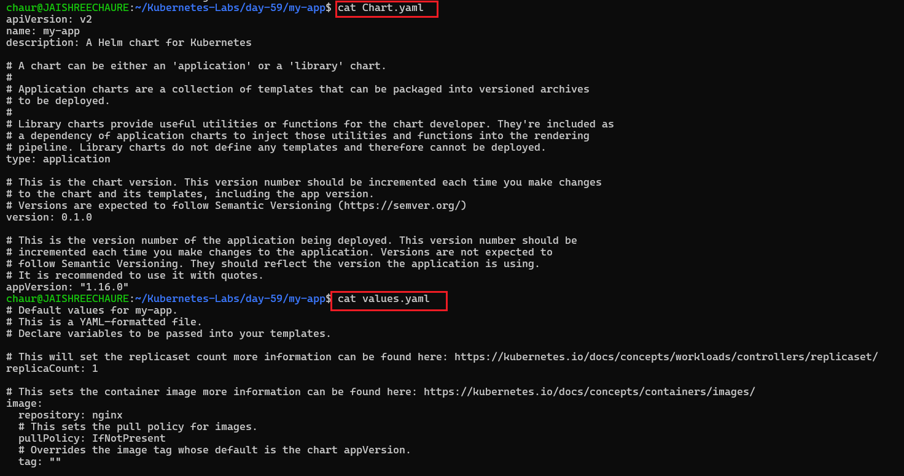

4. Helm templates use Go template expressions to inject values dynamically: `{{ .Values.replicaCount }}`, `{{ .Chart.Name }}`

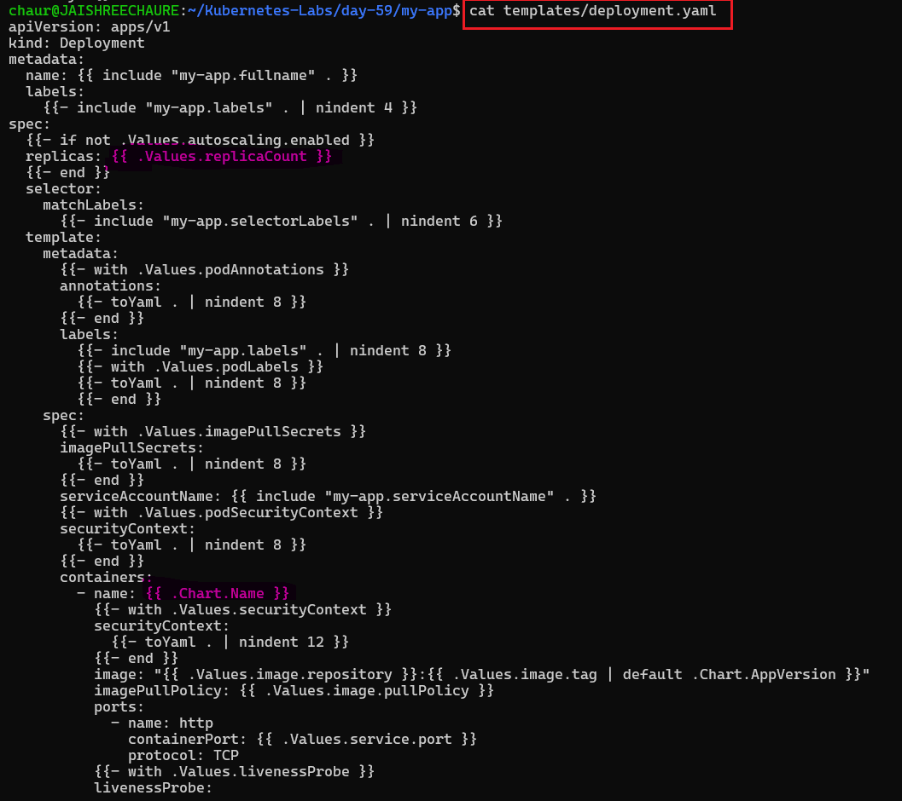 

5. Customize `values.yaml` by setting the replica count to `3` and the Nginx image to `1.25`:

6. Validate: `helm lint my-app`

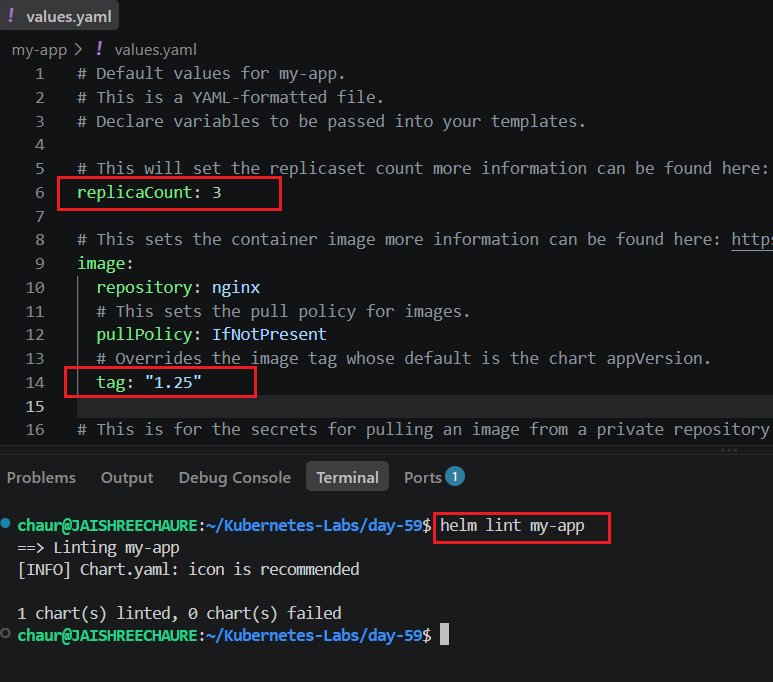 

7. Preview the Kubernetes manifests generated by the chart without installing it: `helm template my-release ./my-app`

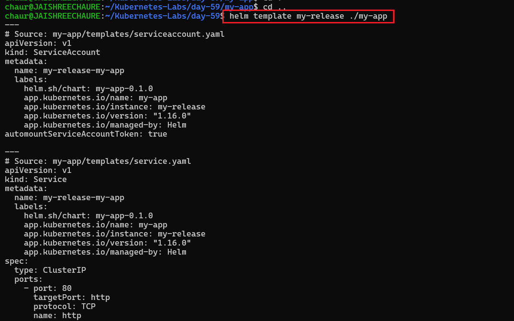 

8. Install the custom chart: `helm install my-release ./my-app`

Verify the release and Deployment:

```bash
helm list
kubectl get deployment my-release-my-app
```
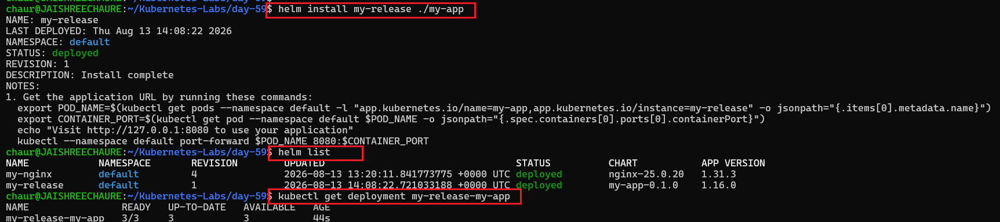

9. Upgrade the release and increase the replicas to 5: `helm upgrade my-release ./my-app --set replicaCount=5`

Verify the updated Deployment and Pods:

```bash
helm list
kubectl get deployment my-release-my-app
kubectl get pods
```
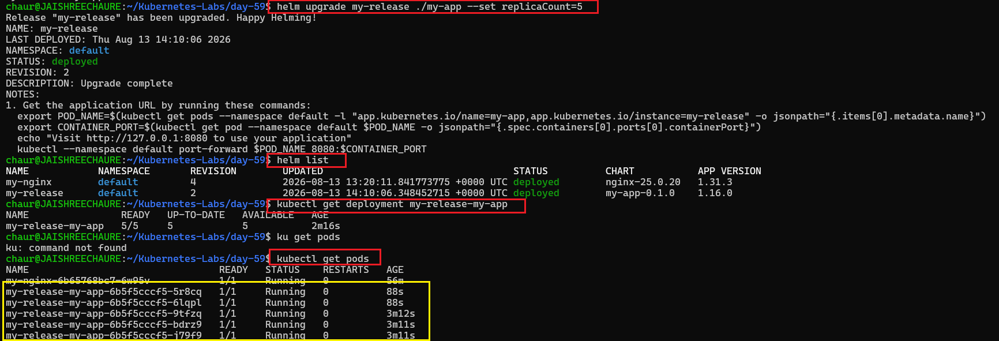

**Manifest:** [my-app](./manifests/my-app/)

**Verify:** 
- After installation, are `3` replicas running?
- After the upgrade, are `5` replicas running?
- Did Helm create a new release revision after the upgrade?

**Result:**

- Created a custom Helm chart using `helm create`.
- Explored `Chart.yaml`, `values.yaml`, and Kubernetes templates.
- Used Helm Go templates to dynamically generate Kubernetes manifests.
- Customized the Nginx image and replica count through `values.yaml`.
- Validated the chart using `helm lint`.
- Previewed rendered manifests using `helm template`.
- Installed the custom chart and verified the generated Kubernetes resources.
- Upgraded the release from `3` to `5` replicas using `--set`.
- Learned how Helm manages application configuration and upgrades through chart values.

---

## Task 7: Clean Up

Clean up the Helm releases and resources created during the lab.

1. List all Helm releases: `helm list -A`

2. Uninstall each release:

```bash
helm uninstall custom-nginx -n custom-ns
helm uninstall my-nginx -n default
helm uninstall my-release -n default
helm uninstall nginx-values -n values-ns
```

3. Remove the custom chart directory and values file: `rm -rf my-app`, `rm -f custom-values.yaml`.

> Note: Use `--keep-history` with `helm uninstall` when you want to remove the release while retaining its revision history for auditing.

4. Verify that all Helm releases have been removed: `helm list -A`

**Verify:** Does `helm list` show zero releases?

- Uninstalled all Helm releases created during the lab.
- Removed the custom chart and values files.
- Verified that no Helm releases remain across the cluster.
- Learned how to clean up Helm-managed resources safely.

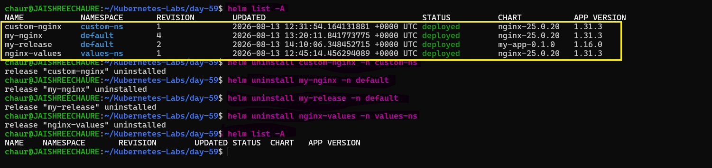

---

## What Helm Is and the Three Core Concepts

Helm is the **package manager for Kubernetes applications**. It provides templating and lifecycle management functionality.

It helps manage Kubernetes resources such as **Deployments, Services, ConfigMaps, Ingresses, and more**.

### Three Core Concepts

- **Chart** — A package containing Kubernetes manifest templates and configuration.
- **Release** — A specific deployed instance of a Helm Chart in a Kubernetes cluster.
- **Repository** — A collection of Helm Charts, similar to a package repository.

---

## How to Install, Customize, Upgrade, and Rollback

### 1. Install

Install a Helm Chart:

```bash
helm install my-app ./my-chart
```
With custom values:

```bash
helm install my-app ./my-chart -f values.yaml
```
### 2. Customize

Helm provides multiple ways to customize a Chart.

Method 1: `values.yaml`

```YAML
replicaCount: 3

image:
  repository: nginx
  tag: "1.25"
```
Method 2: `CLI Override`

```bash
helm install my-app ./my-chart \
  --set replicaCount=5 \
  --set image.tag=latest
  ```

### 3. Upgrade

Upgrade an existing Helm release: `helm upgrade my-app ./my-chart -f values.yaml`

> Helm tracks release revisions and updates the Kubernetes resources based on the changes in the new configuration.

### 4. Rollback

Rollback a release to a previous revision: `helm rollback my-app 1`
Check release revisions: `helm history my-app`

---

## Structure of a Helm Chart and How Go Templating Works

A typical Helm Chart looks like this:
```text
nginx-chart/
├── Chart.yaml
├── values.yaml
├── charts/
├── templates/
│   ├── deployment.yaml
│   ├── service.yaml
│   ├── _helpers.tpl
│   └── ingress.yaml
└── .helmignore
```
### Key Files and Directories

- **`Chart.yaml`** — Contains Chart metadata such as name and version.
- **`values.yaml`** — Contains default configuration values for the Chart.
- **`templates/`** — Contains Kubernetes manifests using Go templating.
- **`charts/`** — Stores Chart dependencies (subcharts).
- **`.helmignore`** — Specifies files that should be excluded when packaging the Chart.

---

## Go Templating in Helm

Helm uses **Go-based templates** to turn parameterized files into valid Kubernetes YAML.

For example:

```yaml
replicas: {{ .Values.replicaCount }}
```

During rendering, the placeholder is replaced with the configured value.

### Where Configuration Values Come From

Helm values can come from:

1. Default values.yaml
2. User-provided values files using -f
3. Command-line overrides using --set

This allows the same Chart to be reused across different environments with different configurations.

---

## `custom-values.yaml` with Explanations

Number of pod replicas to run (scaling)

```text
replicaCount: 3


service:
  type: NodePort  # Exposes the service externally via <NodeIP>:<NodePort>
  port: 80        # Internal service port inside the cluster


resources:
  requests:
    cpu: "100m"      # Minimum CPU requested
    memory: "128Mi"  # Minimum memory requested


  limits:
    cpu: "250m"      # Maximum CPU allowed
    memory: "256Mi"  # Maximum memory allowed
```
### What This Configuration Does

- Runs 3 Pod replicas.
- Exposes the application using a NodePort Service.
- Requests 100m CPU and 128Mi memory per Pod.
- Limits each Pod to 250m CPU and 256Mi memory.

**Helm Chart:** [`my-app`](./manifests/my-app/)


