# Day 61 -- Introduction to Terraform and Your First AWS Infrastructure

## Task 1: Understand Infrastructure as Code

### 1. What is Infrastructure as Code (IaC)? Why does it matter in DevOps?

- **My answer:** IaC means managing infrastructure through code instead of manually creating resources through the cloud console.
- It makes infrastructure faster to create, repeatable, consistent, and easier to manage.

### 2. What problems does IaC solve compared to manually creating resources in the AWS console?

- **My answer:** IaC reduces manual work and human errors, keeps infrastructure consistent, allows configuration to be version-controlled, and makes resources easier to recreate.

### 3. How is Terraform different from AWS CloudFormation, Ansible, and Pulumi?

- **My answer:** Terraform and CloudFormation are mainly used for infrastructure provisioning. Ansible is mainly used for configuration management, while Pulumi also manages infrastructure but uses general-purpose programming languages.

### 4. What does it mean that Terraform is "declarative" and "cloud-agnostic"?

- `Declarative:` I define the desired infrastructure state, and Terraform determines what changes are needed to reach that state.
- `Cloud-agnostic:` Terraform can manage infrastructure across multiple providers such as AWS, Azure, and GCP.

> **Note:** IaC turns infrastructure into code, making it easier to automate, reproduce, version, and manage.

---

## Task 2: Install Terraform and Configure AWS

I installed Terraform on **Ubuntu Linux running through WSL**.

1. Install Terraform:

```bash
# Linux (amd64)
wget -O - https://apt.releases.hashicorp.com/gpg | sudo gpg --dearmor -o /usr/share/keyrings/hashicorp-archive-keyring.gpg
echo "deb [signed-by=/usr/share/keyrings/hashicorp-archive-keyring.gpg] https://apt.releases.hashicorp.com $(lsb_release -cs) main" | sudo tee /etc/apt/sources.list.d/hashicorp.list
sudo apt update && sudo apt install terraform
```

2. Verify:
```bash
terraform -version
```

3. Install and configure the AWS CLI:
```bash
aws configure
# Enter your Access Key ID, Secret Access Key, default region (e.g., ap-south-1), output format (json)
```

4. Verify AWS access:
```bash
aws sts get-caller-identity
```

You should see your AWS account ID and ARN.

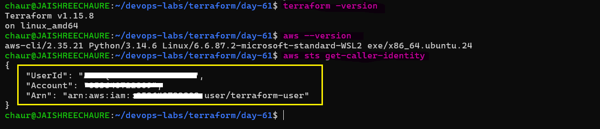

> Terraform and AWS CLI are successfully configured in my WSL environment, and AWS authentication was verified using AWS STS.

---

## Task 3: Your First Terraform Config -- Create an S3 Bucket

Create a project directory and write your first Terraform config:

```bash
mkdir terraform-basics && cd terraform-basics
```

**Directory** [terraform-basics](./terraform-basics/)

Create a file called `main.tf` with:
1. A `terraform` block with `required_providers` specifying the `aws` provider
2. A `provider "aws"` block with your region
3. A `resource "aws_s3_bucket"` that creates a bucket with a globally unique name

**Terraform-file** [main.tf](terraform-basics/main.tf)

Run the Terraform lifecycle:
```bash
terraform init      # Initialize the project and download the AWS provider
terraform fmt       # Format the Terraform configuration
terraform validate  # Check whether the configuration is valid
terraform plan      # Preview the resources Terraform will create
terraform apply     # Create the S3 bucket (type 'yes' to confirm)
```
Verify the bucket from the AWS CLI: `aws s3 ls`

Then go to the AWS S3 Console and verify that the bucket was created successfully.

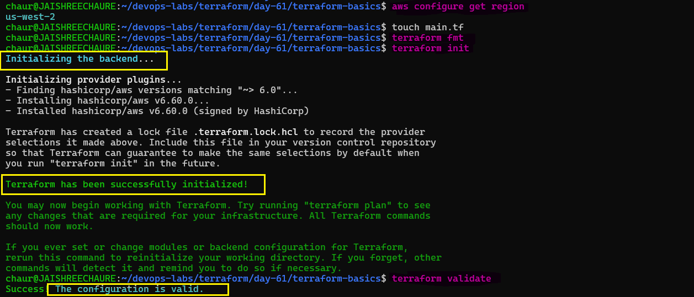 

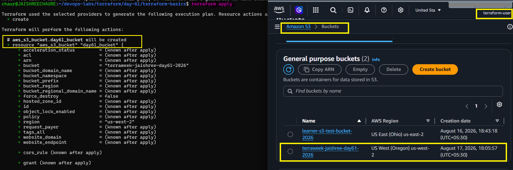

## What I Learned

- `terraform init` downloads the required AWS provider and initializes the Terraform working directory.
- `terraform fmt` formats the Terraform configuration.
- `terraform validate` checks whether the configuration is syntactically and structurally valid.
- `terraform plan` shows what Terraform intends to create, modify, or destroy before making changes.
- `terraform apply` applies the configuration and creates the defined infrastructure.

### Document: What did `terraform init` download? What does the `.terraform/` directory contain?

- `terraform init` downloaded the required **AWS provider plugin** specified in `main.tf`.
- The `.terraform/` directory contains Terraform's local working files, including downloaded **provider plugins** and **module files** when modules are used.
- Terraform also creates `.terraform.lock.hcl` to record the selected provider versions and checksums.

> **Note:** `terraform init` prepares the project by downloading the dependencies Terraform needs to manage the infrastructure.

---

## Task 4: Add an EC2 Instance

In the same `main.tf`, add:

1. A `resource "aws_instance"` using an Amazon Linux AMI suitable for the configured region.
2. Set the instance type to `t3.micro` instead of `t2.micro` because I am using the AWS Free Tier.
3. Add a tag: `Name = "TerraWeek-Day1"`.

> **Note:** I used `t3.micro` instead of `t2.micro` because it was the instance type I selected for my Free Tier usage in `us-west-2`.

Run:
```bash
terraform plan      # You should see 1 resource to add (bucket already exists)
terraform apply
```
Terraform planned and created only the EC2 instance because the S3 bucket was already tracked in Terraform state.

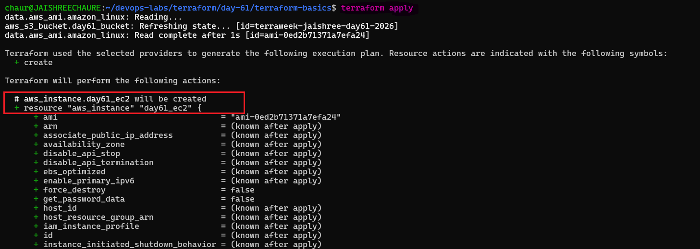 

After applying the configuration, I verified the instance in the AWS EC2 console with the correct name tag.

- Instance: `TerraWeek-Day1`
- Instance type: `t3.micro`
- State: `Running`
- Status checks: `3/3 checks passed`
- Name tag: `TerraWeek-Day1`

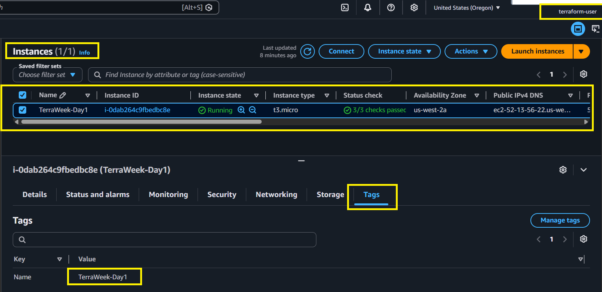

**Document:** How does Terraform know the S3 bucket already exists and only the EC2 instance needs to be created?

- Terraform uses the `state file` to track the resources it manages.
- Since the S3 bucket is already recorded in the `state` and matches the configuration, Terraform `doesn't recreate it`.
- The `EC2 instance is not yet in the state`, so Terraform plans to create it.

---

## Task 5: Understand the State File

Terraform uses a **state file (`terraform.tfstate`)** to keep track of the infrastructure it manages.

### 1. Inspect the State File

Open `terraform.tfstate` in your editor and inspect its JSON structure.

- The state file contains information about the resources managed by Terraform, including their IDs, attributes, provider information, and current configuration details.

### 2. Inspect the Terraform State

Run the following commands:

```bash
terraform show
```
- Shows the current Terraform state in a human-readable format.

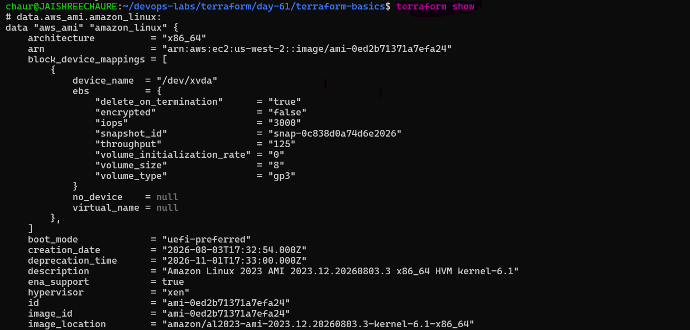 

```bash
terraform state list
```
- Lists all resources currently managed by Terraform.

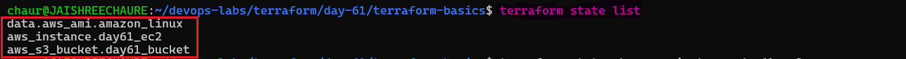 

```bash
terraform state show aws_instance.<name>
```
- Shows detailed state information for the EC2 instance.

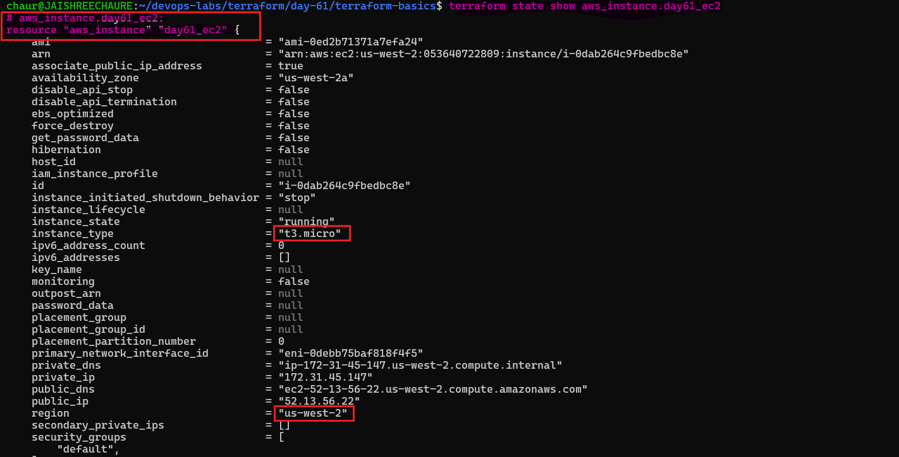 

```bash
terraform state show aws_s3_bucket.<name> 
```
- Shows detailed state information for the S3 bucket.

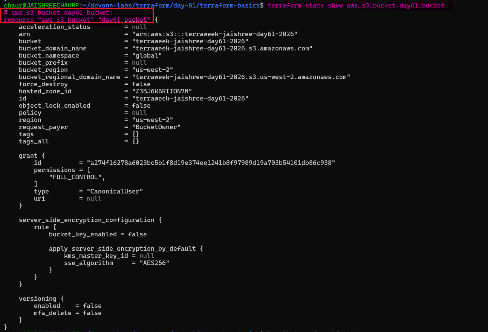

### 3. Questions & Answers

**What information does the state file store about each resource?**

- The state file stores the resource's current attributes, such as resource IDs, ARNs, IP addresses, tags, and dependency information. It helps Terraform map the configuration to the real infrastructure.

**Why should you never manually edit the state file?**

- Manual edits can corrupt the state or create mismatches between Terraform and the actual infrastructure, which can lead to errors or unintended changes.

**Why should the state file not be committed to Git?**

- The state file may contain sensitive information and infrastructure details. Committing it to Git can create security risks and cause state conflicts when working in a team.

---

## Task 6: Modify, Plan, and Destroy

1. Change the EC2 instance tag from `"TerraWeek-Day1"` to `"TerraWeek-Modified"` in your `main.tf`
2. Run `terraform plan` and read the output carefully:
3. Terraform showed:
  ```text
   ~ update in-place
   Plan: 0 to add, 1 to change, 0 to destroy.
  ```
Terraform Plan Symbols:

- `~` → Update the existing resource in-place
- `+` → Create a new resource
- `-` → Destroy an existing resource

In this case, the EC2 instance was updated in-place, not destroyed and recreated. Only the Name tag changed.

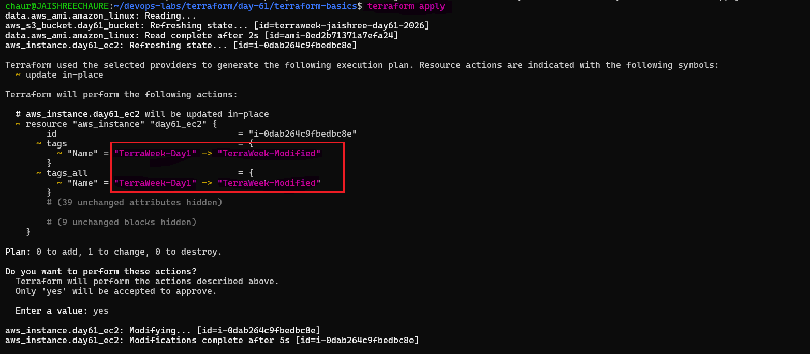 

3. Applied the change: `terraform apply`
- Terraform successfully updated the EC2 instance.

4. Verified in the AWS Console that the instance tag changed from: `TerraWeek-Day1` to `TerraWeek-Modified`
- The instance remained the same and continued using the t3.micro instance type.

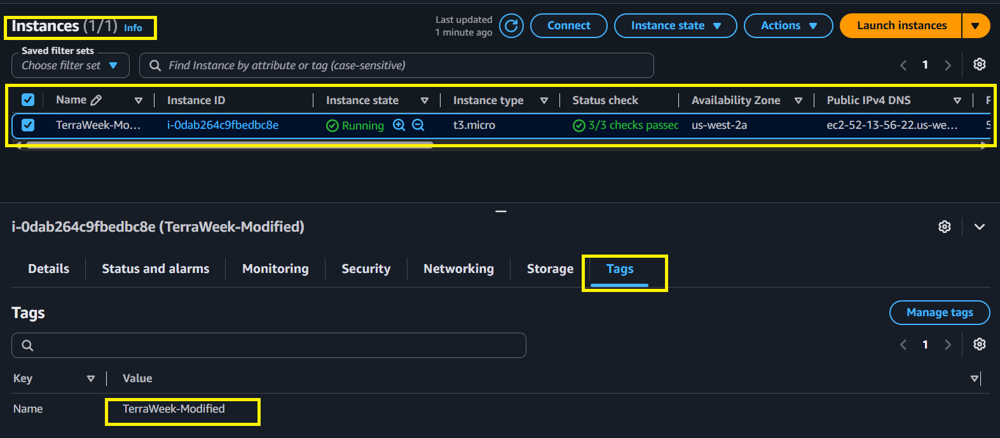 

5. Destroyed the Terraform-managed infrastructure:
```bash
terraform destroy
```
- Terraform destroyed both the EC2 instance and the S3 bucket managed by this configuration.
```text
Destroy complete! Resources: 2 destroyed.
```

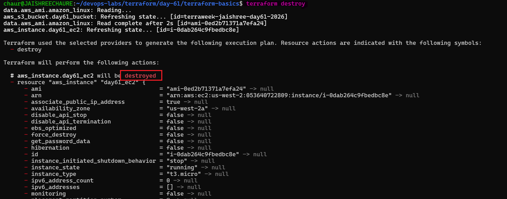 

6. Verified the AWS Console after destruction.
- The Terraform-managed EC2 instance was terminated and the Terraform-managed S3 bucket was removed.

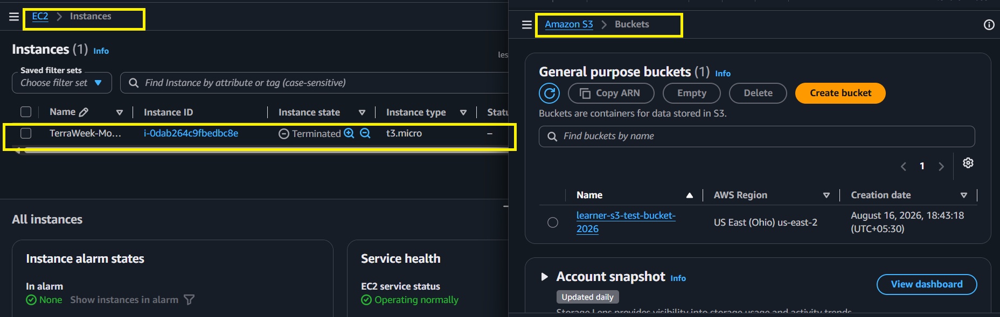

---

## What I Learned
- Terraform uses ~ for in-place updates.
- Changing an EC2 tag does not require recreating the instance.
- terraform plan shows the expected changes before applying them.
- terraform destroy removes resources managed by the Terraform configuration.
- Terraform keeps track of these resources through its state file.

> **Key Takeaway:** Terraform can safely detect small infrastructure changes and update only what is necessary instead of recreating the entire resource.

--- 

## Documentation

### What is IaC (Infrastructure as Code)?

- Infrastructure as Code (IaC) is the practice of managing and provisioning infrastructure using code instead of manual processes.
- It helps automate infrastructure, keep configurations version-controlled, and create consistent environments.

### Terraform Commands

- `terraform init` — Initializes the Terraform project and downloads required providers and modules.
- `terraform plan` — Shows the changes Terraform plans to make before applying them.
- `terraform apply` — Creates or updates infrastructure based on the Terraform configuration.
- `terraform destroy` — Deletes the resources managed by Terraform.
- `terraform show` — Displays the current Terraform state in a human-readable format.
- `terraform state list` — Lists the resources currently tracked in the Terraform state.

### State File: What It Contains & Why It Matters

**What it contains:**

- Resource IDs and ARNs
- Current resource attributes such as IP addresses and tags
- Mapping between Terraform configuration and real infrastructure
- Resource dependencies and other metadata

**Why it matters:**

- Helps Terraform track the infrastructure it manages
- Allows Terraform to detect differences between the desired configuration and current state
- Helps Terraform determine whether resources need to be created, updated, or destroyed
- Maintains the relationship between Terraform configuration and real infrastructure

### Key Takeaway

Terraform uses **configuration + state + provider information** to determine what infrastructure should exist and what changes are required.