# Day 62 -- Providers, Resources and Dependencies


## Task 1: Explore the AWS Provider

1. Create a new project directory: `terraform-aws-infra`
2. Write a `providers.tf` file:
   - Define the `terraform` block with `required_providers` pinning the AWS provider to version `~> 5.0`
   - Define the `provider "aws"` block with your region
3. Run `terraform init` and check the output -- what version was installed?

**Directory** [terraform-aws-infra](./terraform-aws-infra/)

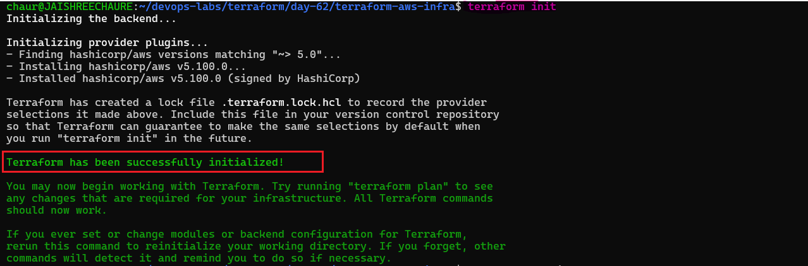

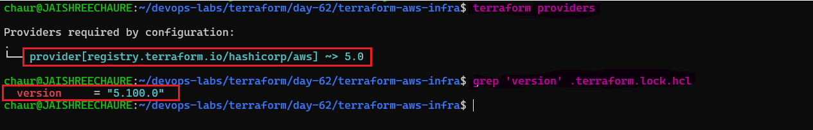

4. Read the provider lock file `.terraform.lock.hcl` -- what does it do?
- The `.terraform.lock.hcl` file locks the exact provider version (`5.100.0`) used in the project and ensures Terraform uses the same provider version that satisfies the constraint `~> 5.0`.
- It also stores hashes to verify the provider's integrity, ensuring it has not been modified.

**Document:** What does `~> 5.0` mean? How is it different from `>= 5.0` and `= 5.0.0`?

- `~> 5.0` — Allows versions `5.x` but not `6.0`
- `>= 5.0` — Allows `5.0` and any higher version
- `= 5.0.0` — Allows only exactly `5.0.0`

---

## Task 2: Build a VPC from Scratch

Create a `main.tf` and define these resources one by one:

1. `aws_vpc` -- CIDR block `10.0.0.0/16`, tag it `"TerraWeek-VPC"`
2. `aws_subnet` -- CIDR block `10.0.1.0/24`, reference the VPC ID from step 1, enable public IP on launch, tag it `"TerraWeek-Public-Subnet"`
3. `aws_internet_gateway` -- attach it to the VPC
4. `aws_route_table` -- create it in the VPC, add a route for `0.0.0.0/0` pointing to the internet gateway
5. `aws_route_table_association` -- associate the route table with the subnet

Run `terraform plan` -- you should see 5 resources to create.

**Verify:** Apply and check the AWS VPC console. Can you see all five resources connected?

- Yes, all five resources were successfully created and connected through Terraform.

### Verification

Applied the configuration successfully:

```text
Plan: 5 to add, 0 to change, 0 to destroy.
Apply complete! Resources: 5 added, 0 changed, 0 destroyed.
```
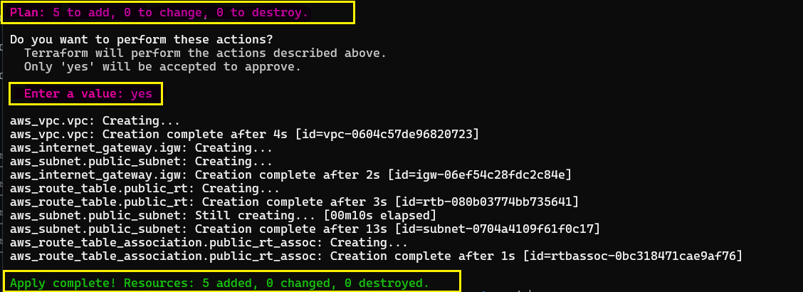 

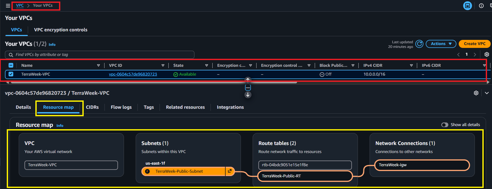

---

## Task 3: Understand Implicit Dependencies

Look at your `main.tf` carefully:

1. The subnet references `aws_vpc.main.id` -- this is an implicit dependency
2. The internet gateway references the VPC ID -- another implicit dependency
3. The route table association references both the route table and the subnet

### Answer these questions:

- **How does Terraform know to create the VPC before the subnet?**

  - Terraform builds a dependency graph based on references between resources.
  - The subnet uses `aws_vpc.vpc.id`.
  - `Terraform sees` that the subnet depends on the VPC.
  - Therefore, Terraform creates the VPC before the subnet.

  ```hcl
  resource "aws_subnet" "public_subnet" {
    vpc_id = aws_vpc.vpc.id
  }
  ```
  Dependency: `aws_vpc.vpc → aws_subnet.public_subnet`
  
- **What would happen if you tried to create the subnet before the VPC existed?**

  - AWS would reject the request because the subnet requires a valid VPC ID.
  - A subnet must belong to a VPC.
  - Terraform automatically prevents this ordering problem through the dependency graph.

  ```text
  No VPC → No valid VPC ID → Subnet creation fails
  ```
- **Find all implicit dependencies in your config and list them.**

| Resource Relationship | Terraform Reference Mapping |
| ---------------------- | ---------------------------- |
| Subnet → VPC | `aws_subnet.public_subnet → aws_vpc.vpc` |
| Internet Gateway → VPC | `aws_internet_gateway.igw → aws_vpc.vpc` |
| Route Table → VPC | `aws_route_table.public_rt → aws_vpc.vpc` |
| Route Table → Internet Gateway | `aws_route_table.public_rt → aws_internet_gateway.igw` |
| Route Table Association → Subnet | `aws_route_table_association.public_rt_assoc → aws_subnet.public_subnet` |
| Route Table Association → Route Table | `aws_route_table_association.public_rt_assoc → aws_route_table.public_rt` |
  
---

## Task 4: Add a Security Group and EC2 Instance

Add to your config:

1. `aws_security_group` in the VPC:
   - Ingress rule: allow SSH (port 22) from `0.0.0.0/0`
   - Ingress rule: allow HTTP (port 80) from `0.0.0.0/0`
   - Egress rule: allow all outbound traffic
   - Tag: `"TerraWeek-SG"`

2. `aws_instance` in the subnet:
   - Use Amazon Linux 2 AMI for your region
   - Instance type: `t3.micro`
   - Associate the security group
   - Set `associate_public_ip_address = true`
   - Tag: `"TerraWeek-Server"`

### SSH Key Setup

- Create the `.ssh` directory if it does not already exist: `mkdir -p ~/.ssh`
- Generate a 4096-bit RSA key pair: `ssh-keygen -t rsa -b 4096 -f ~/.ssh/id_rsa`
- Verify the generated key files: `ls -l ~/.ssh/`
- Display the public key: `cat ~/.ssh/id_rsa.pub`

### Find the Latest Amazon Linux 2 AMI

Use the AWS CLI to find the latest available Amazon Linux 2 AMI in `us-east-1`:

```bash
aws ec2 describe-images \
  --profile terraform \
  --region us-east-1 \
  --owners amazon \
  --filters \
    "Name=name,Values=amzn2-ami-hvm-*-x86_64-gp2" \
    "Name=state,Values=available" \
  --query 'Images | sort_by(@, &CreationDate)[-1].[ImageId,Name,CreationDate]' \
  --output table
```

Result:

- AMI ID: `ami-0355fe804a20b1627`
- AMI Name: `amzn2-ami-hvm-2.0.20260817.0-x86_64-gp2`
- Region: `us-east-1`

Apply and verify -- your EC2 instance should have a public IP and be reachable.

### Verification

Terraform successfully created the required resources.

**1. Terraform Apply — Resources Created**

The Terraform apply completed successfully, creating the Security Group, Key Pair, and EC2 instance.

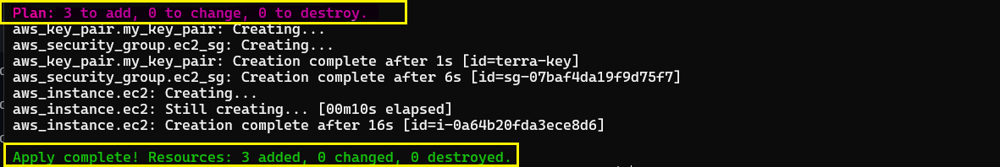

**2. EC2 Console — Instance Verification**

The EC2 instance is running with a public IP address and is attached to `TerraWeek-VPC` and `TerraWeek-Public-Subnet`.

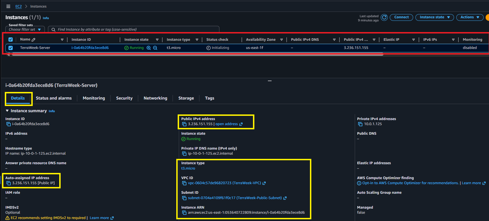

**3. Security Group — Rule Verification**

The `TerraWeek-SG` security group allows inbound SSH (`22`) and HTTP (`80`) traffic and allows all outbound traffic.

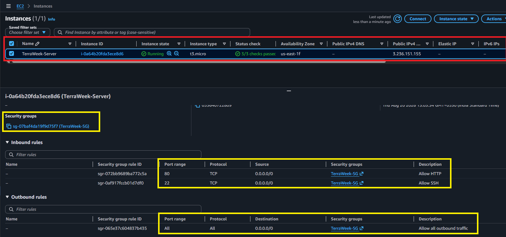

**4. SSH — Connectivity Verification**

SSH connectivity to the EC2 instance was successfully verified, confirming that the instance is reachable using the configured key pair.

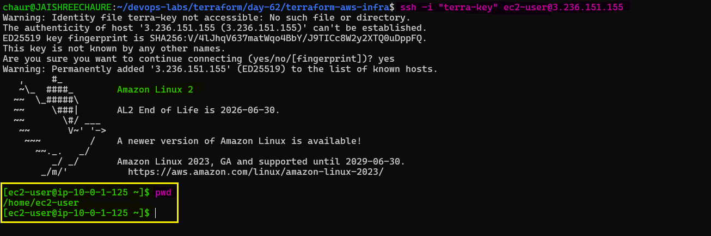

---

## Task 5: Explicit Dependencies with depends_on

Sometimes Terraform cannot detect a dependency automatically.

1. Add a second `aws_s3_bucket` resource for application logs
2. Add `depends_on = [aws_instance.main]` to the S3 bucket -- even though there is no direct reference, you want the bucket created only after the instance
3. Run `terraform plan` and observe the order
4. Run `Terraform apply`

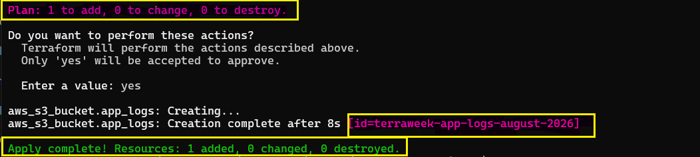

### Visualize the Dependency Tree

- Generate the Terraform dependency graph: `terraform graph`
- If Graphviz is not installed, install it with: `sudo apt update`, `sudo apt install graphviz -y`
- Verify the Graphviz installation: `dot -V`

Generate the dependency graph as a PNG image:
```bash
terraform graph | dot -Tpng > graph.png
```
Verify that the graph image was created: `ls -lh graph.png`

You can also save the Terraform graph output as a `.dot` file:

```bash
terraform graph > dependency-graph.dot
```
Verify the generated .dot file: `ls -lh dependency-graph.dot`

If Graphviz is not available, use: `terraform graph`

and paste the output into an online Graphviz viewer.

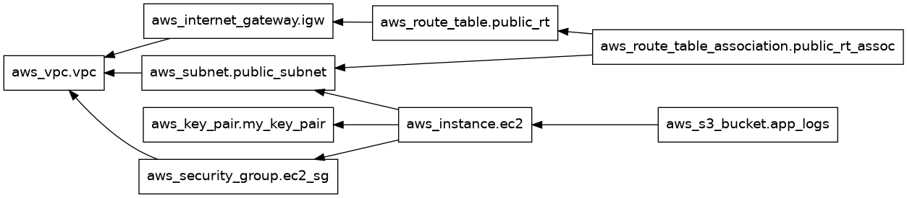

**Document:** When would you use `depends_on` in real projects? Give two examples.

- `depends_on` is used to enforce the creation order of resources when Terraform cannot automatically determine the dependency.

- **Example:**
  - `RDS depends on VPC & Subnets` — Ensure the VPC and subnets exist before creating the RDS database.
  - `EC2 depends on IAM Role` — Make sure an IAM role with S3 access is created before attaching it to an EC2 instance.
  - `ACM Certificate depends on CloudFront` — Ensure the ACM certificate is issued before attaching it to the CloudFront distribution.


---

## Task 6: Lifecycle Rules and Destroy

1. Add a `lifecycle` block to your EC2 instance:
```hcl
lifecycle {
  create_before_destroy = true
}
```
2. Find the latest Amazon Linux 2023 AMI for your region:

```bash
aws ec2 describe-images \
  --profile terraform \
  --region us-east-1 \
  --owners amazon \
  --filters \
    "Name=name,Values=al2023-ami-2023*-x86_64" \
    "Name=state,Values=available" \
  --query 'Images | sort_by(@, &CreationDate)[-1].[ImageId,Name,CreationDate]' \
  --output table
```
Example result:

```text
ami-0db1c5c6dc64eb019
al2023-ami-2023.12.20260817.0-kernel-6.12-x86_64
2026-08-12T23:50:59.000Z
```
3. Change the AMI ID in the EC2 resource to the new AMI and run: `terraform plan`  
Observe that Terraform plans to create the new instance before destroying the old one because of:

```bash
lifecycle {
  create_before_destroy = true
}
```
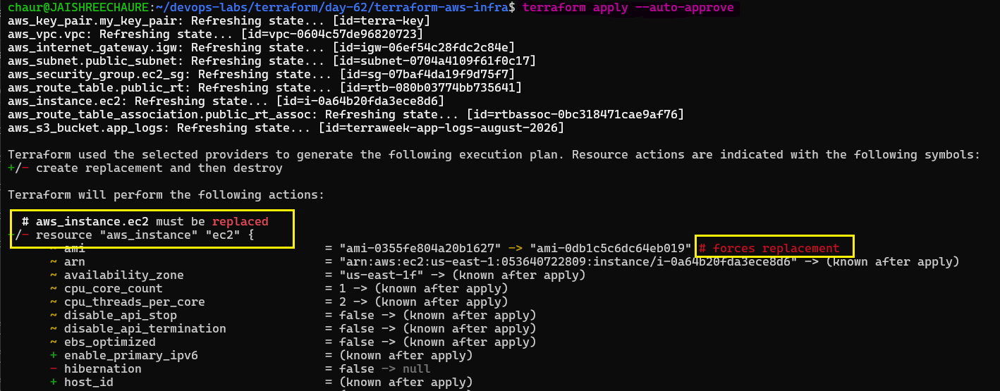 

4. Verify the Terraform state: `terraform state list`

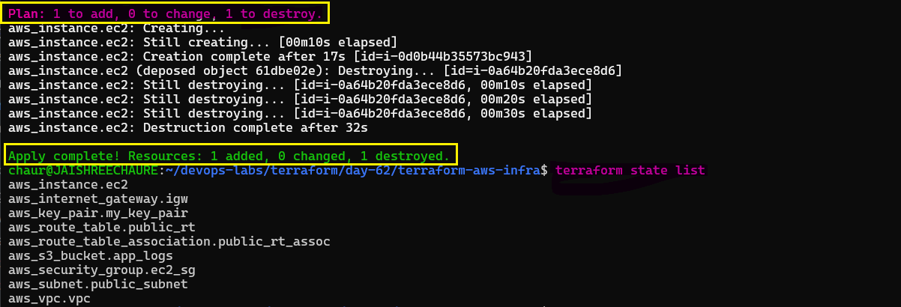 

5. Destroy everything:
```bash
terraform destroy
```
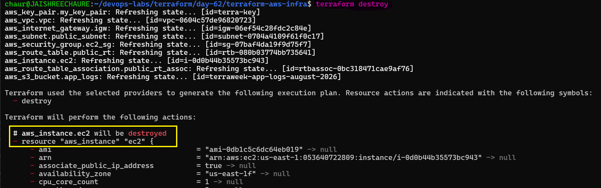 

6. Watch the destroy order. Terraform destroys resources according to their dependency graph, removing dependent resources before the resources they depend on.

7. Verify in the AWS Console that all Terraform-managed resources have been cleaned up.

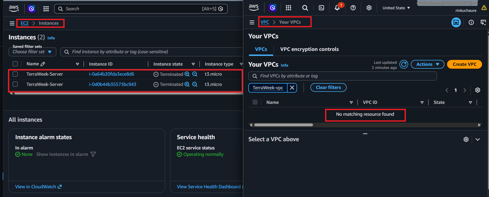

### Lifecycle Arguments

**Document:** What are the three lifecycle arguments (`create_before_destroy`, `prevent_destroy`, `ignore_changes`) and when would you use each?

- **`create_before_destroy`** — By default, Terraform destroys a resource before creating a replacement. With `create_before_destroy = true`, Terraform first creates the new resource and then destroys the old one.
  - **Example:** Update an RDS instance without downtime.

- **`prevent_destroy`** — Protects a resource from accidental or intentional deletion. Terraform blocks destroy operations and raises an error if destruction is attempted.
  - **Example:** Prevent deletion of a production S3 bucket or database containing critical data.

- **`ignore_changes`** — Specifies resource attributes to ignore during updates. Terraform will not manage changes to these attributes, which is useful when they are changed outside Terraform.
  - **Example:** Ignore EC2 instance tags or security group rules that are managed manually.

---

### Implicit vs Explicit Dependencies

- **Implicit dependencies** — Terraform automatically determines the order of resource creation based on references between resources.
  - **Example:** An EC2 instance referencing a security group automatically waits for the security group to be created.

- **Explicit dependencies** — Allow you to manually define the order of resource creation when Terraform cannot automatically determine the dependency.
  - **Example:** An S3 bucket using `depends_on = [aws_instance.ec2]` is created only after the EC2 instance exists.


---