# Day 63 -- Variables, Outputs, Data Sources and Expressions

> Refactoring Terraform infrastructure using variables, outputs, data sources, locals, and conditional expressions.

## Task 1: Extract Variables

Refactor the Day 62 infrastructure by replacing hardcoded values with Terraform input variables.

1. Create a `variables.tf` file with input variables for:
   - `region` (string, default: your preferred region)
   - `vpc_cidr` (string, default: `"10.0.0.0/16"`)
   - `subnet_cidr` (string, default: `"10.0.1.0/24"`)
   - `instance_type` (string, default: `"t2.micro"`)
   - `project_name` (string, no default -- force the user to provide it)
   - `environment` (string, default: `"dev"`)
   - `allowed_ports` (list of numbers, default: `[22, 80, 443]`)
   - `extra_tags` (map of strings, default: `{}`)
2. Replace every hardcoded value in `main.tf` with `var.<name>` references
3. Verify: `terraform init`, `terraform fmt`, `terraform validate`.
4. Run `terraform plan` -- it should prompt you for `project_name` since it has no default

**Terraform-file:** [variables.tf](./terraform-aws-infra-refactored/variables.tf)

### Step 1 — Terraform Initialization

- Initialized the refactored Terraform project and verified that the AWS provider was installed successfully.
 
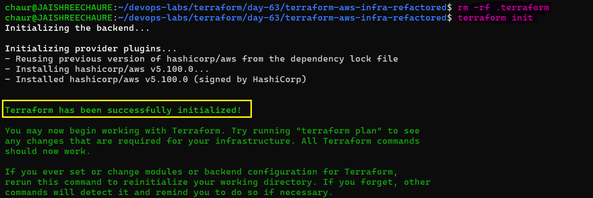 

### Step 2 — Variable References & Validation

- Replaced hardcoded values with Terraform variables and verified that the configuration passes validation.

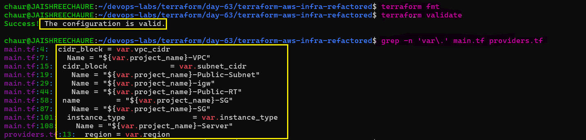 

### Step 3 — AWS Authentication

- Verified the configured Terraform AWS profile and confirmed that Terraform can authenticate with AWS using the intended credentials.

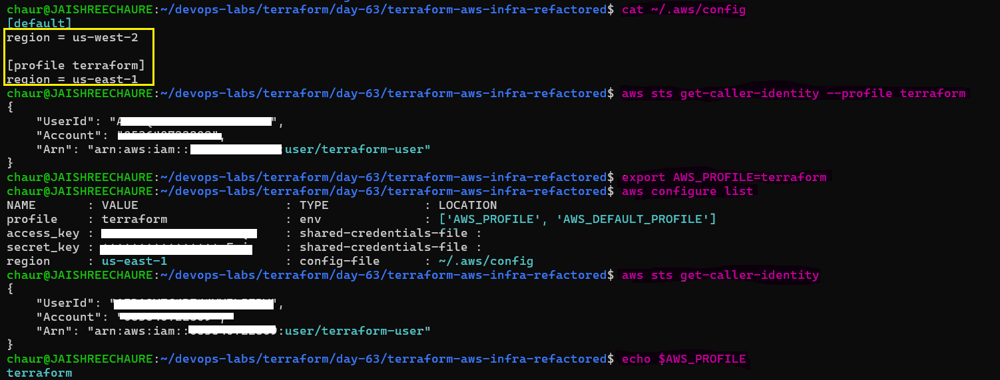 

### Step 4 — Terraform Plan

- Ran `terraform plan` and verified that Terraform correctly interpreted the variables and planned the infrastructure changes.

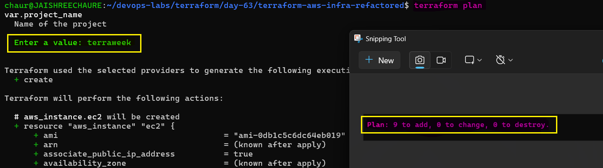

**Document:** What are the five variable types in Terraform? (`string`, `number`, `bool`, `list`, `map`)

### Terraform Variable Types

Terraform variables use different types to define what kind of values a variable can accept.

The five basic types covered in this lab are:

- `string` — text values such as names, regions, and instance types
  ```hcl
  variable "instance_name" {
    type    = string
    default = "my-ec2"
  }

  # Usage
  tags = {
    Name = var.instance_name
  }
  ```

- `number` — numeric values such as counts, ports, and sizes

  ```hcl
  variable "instance_count" {
    type    = number
    default = 2
  }

  # Usage
  count = var.instance_count
  ```

- `bool` — boolean values used to enable or disable features

  ```hcl
  variable "enable_public_ip" {
    type    = bool
    default = true
  }

  # Usage
  associate_public_ip_address = var.enable_public_ip
  ```

- `list` — an ordered collection of values of the same type

  ```hcl
  variable "allowed_ports" {
    type    = list(number)
    default = [22, 80, 443]
  }

  # Example
  allowed_ports = [22, 80, 443]
  ```

- `map` — a collection of key-value pairs, commonly used for tags

  ```hcl
  variable "extra_tags" {
    type    = map(string)
    default = {}
  }

  # Example
  extra_tags = {
    Owner  = "DevOps"
    Backup = "Yes"
  }
  ```
---

## Task 2: Variable Files and Precedence

Use variable files to manage different environments and understand Terraform variable precedence.

### Step 1 — Create `terraform.tfvars`

Create the default variable file:

```hcl
project_name = "terraweek"
environment  = "dev"
instance_type = "t3.micro"
```
**Terraform-file:** [terraform.tfvars](./terraform-aws-infra-refactored/terraform.tfvars)

Run: `terraform plan`

- Terraform automatically loads `terraform.tfvars` and uses these values during the plan.

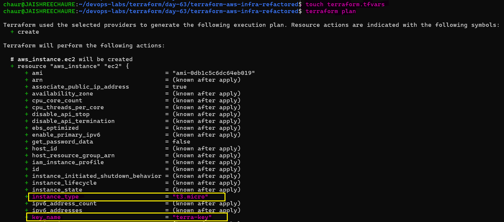 

### Step 2 — Create `prod.tfvars`:

Create a separate configuration for the production environment:

```hcl
project_name = "terraweek"
environment  = "prod"
instance_type = "t3.small"
vpc_cidr     = "10.1.0.0/16"
subnet_cidr  = "10.1.1.0/24"
```
**Terraform-file:** [prod.tfvars](./terraform-aws-infra-refactored/prod.tfvars)

Run: `terraform plan -var-file="prod.tfvars"`

- This explicitly loads `prod.tfvars`, allowing the same Terraform configuration to be used with different environment-specific values.

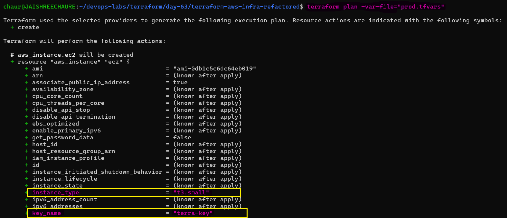 

### Step 3 — Override with CLI Variables

CLI variables have higher priority than values supplied through variable files.

```bash
terraform plan -var="instance_type=t2.nano"  
```
- The plan uses `t2.nano` for `instance_type`, overriding the value defined in the variable file.

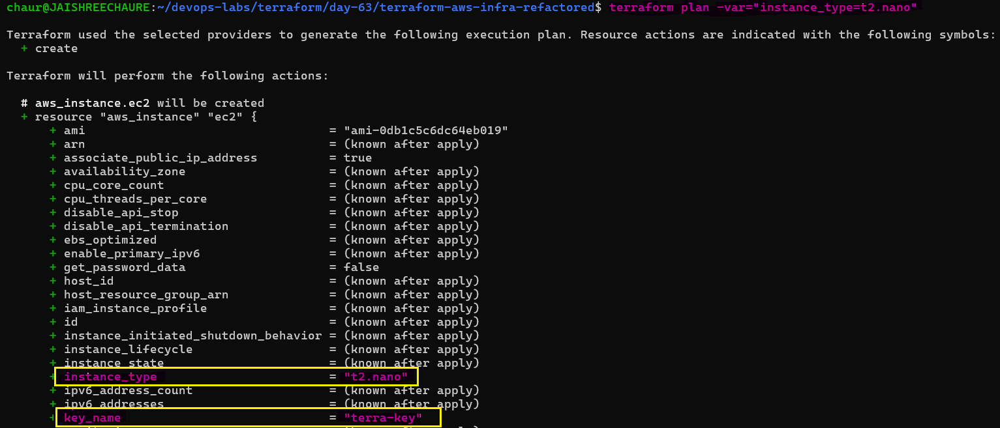 

### Step 4 — Use Environment Variables

Terraform also supports setting variables through `TF_VAR_<variable_name>` environment variables.

Run

```bash
export TF_VAR_environment="staging"

echo $TF_VAR_environment
terraform plan
```
The environment variable overrides the default value when no higher-precedence value is provided.

However, if `terraform.tfvars` also defines the same variable, `terraform.tfvars` has higher precedence.

because `terraform.tfvars` takes precedence over `TF_VAR_environment`.

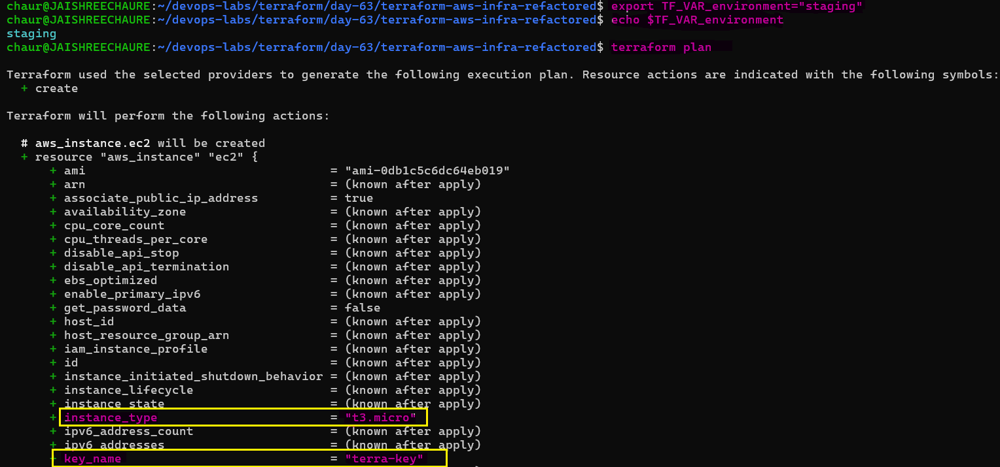

### Document — Variable Precedence

From **lowest to highest priority**:

1. **Default value** — defined in the `variable` block (`variables.tf`)
2. **Environment variables** — `TF_VAR_<variable_name>`
3. **Variable files** — `terraform.tfvars`, `*.tfvars`, and `*.auto.tfvars`
4. **CLI variables** — `-var` and `-var-file`

> Higher-priority values override lower-priority values when the same variable is defined in multiple places.

---

## Task 3: Add Outputs

Expose important infrastructure values through Terraform outputs so they can be easily retrieved after deployment.

### Step 1 — Create `outputs.tf`

Create an `outputs.tf` file with outputs for:

- `vpc_id` — VPC ID
- `subnet_id` — public subnet ID
- `instance_id` — EC2 instance ID
- `instance_public_ip` — EC2 public IP
- `instance_public_dns` — EC2 public DNS
- `security_group_id` — security group ID

**Terraform-file:** [outputs.tf](./terraform-aws-infra-refactored/outputs.tf)

### Step 2 — Validate the Configuration

Formatted and validated the configuration to ensure the new outputs are syntactically correct.

```bash
terraform fmt
terraform validate
terraform plan
```
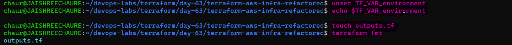 

### Step 3 — Apply the Configuration

Applied the Terraform configuration and created the infrastructure. Terraform displayed the defined outputs after the deployment completed.

```bash
terraform apply
```
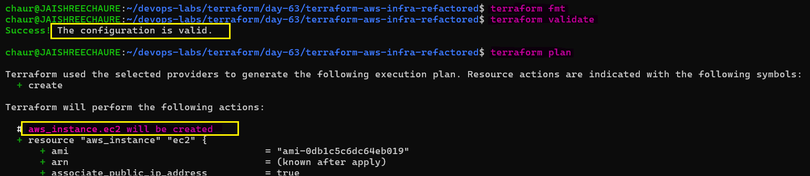 

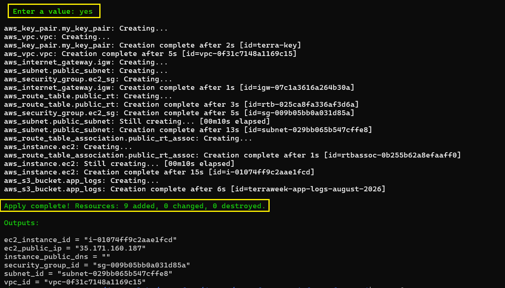 

### Step 4 — View All Outputs

Used `terraform output` to retrieve all output values stored in the Terraform state.

```bash
terraform output     
```                    
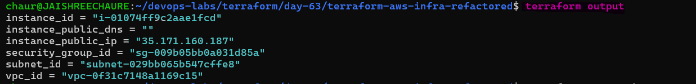

### Step 5 — Retrieve a Specific Output

Retrieved only the EC2 public IP using the output name.

```bash
terraform output instance_public_ip                   
```
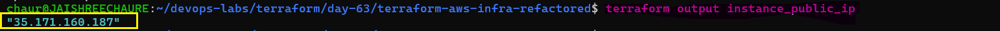 

### Step 6 — Export Outputs as JSON

Used JSON output to make Terraform outputs easier to consume in scripts and automation.

```bash
terraform output -json   
```
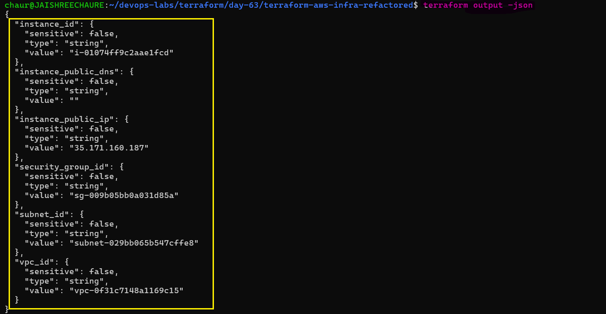 

### Step 7 — Verify in AWS

Verified that the EC2 instance created by Terraform is running and that its public IP matches the Terraform output.

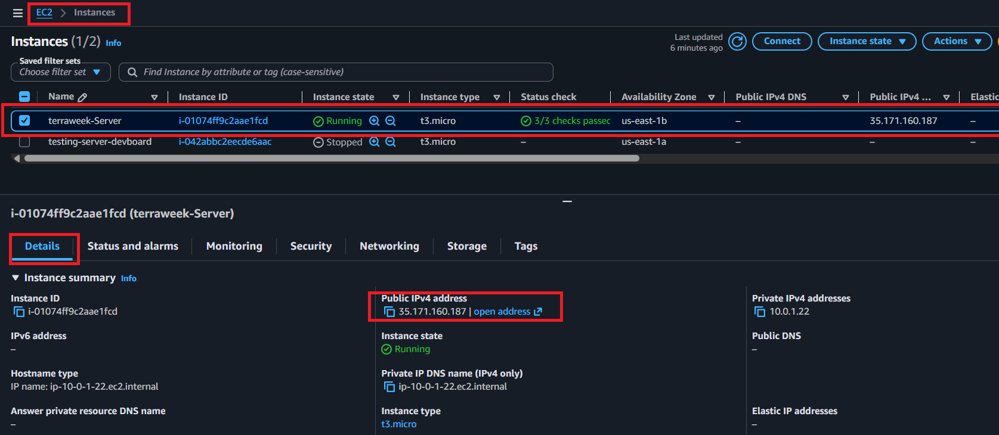

**Verify:** Does `terraform output instance_public_ip` return the correct IP?

- yes

---

## Task 4: Use Data Sources

Replace hardcoded infrastructure values with Terraform data sources so the configuration can dynamically discover existing AWS information.

### Step 1 — Fetch the AMI Dynamically

Added an `aws_ami` data source in `main.tf` to dynamically find the latest matching Amazon Linux image.

The data source uses:

- Amazon as the image owner
- `hvm` virtualization
- `gp2` root device
- `most_recent = true`

The EC2 instance now uses:

```hcl
ami = data.aws_ami.amazon_linux.id
```
### Step 2 — Fetch Available Availability Zones

Added an aws_availability_zones data source to dynamically retrieve the `available AZs` in the selected AWS region.

The public subnet uses the first available AZ:

```hcl
availability_zone = data.aws_availability_zones.available.names[0]
```

### Step 3 — Apply and Verify

Applied the updated configuration and verified that Terraform successfully created the infrastructure using the dynamically discovered AMI and Availability Zone.

```bash
terraform apply
```
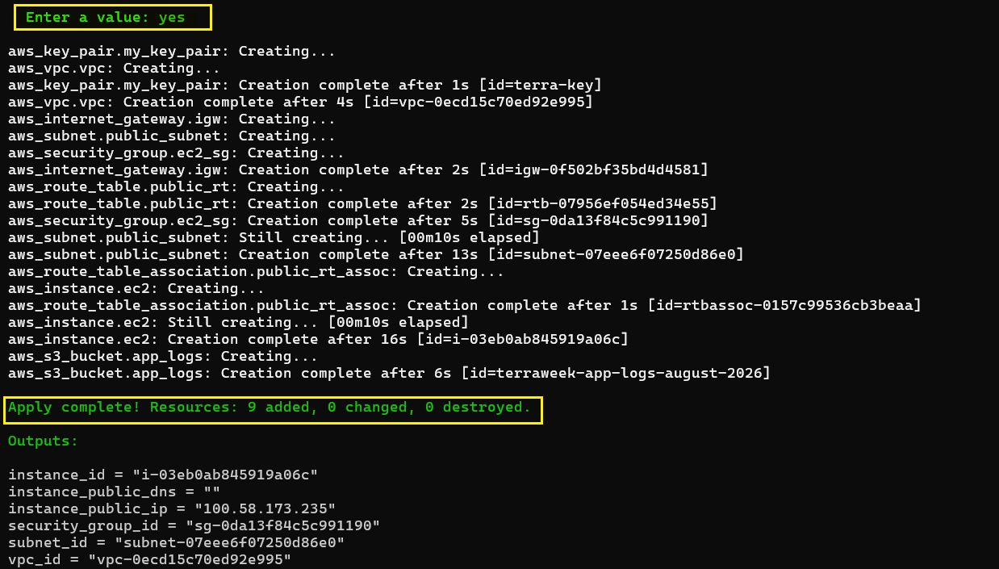 

### Step 4 — Verify the EC2 Instance

Verified in the AWS EC2 console that the Terraform-managed instance is running successfully.

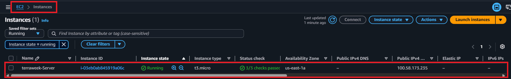 

### Step 5 — Verify the VPC

Verified the VPC resource map and confirmed the expected networking components:

- VPC
- Public Subnet
- Route Table
- Internet Gateway

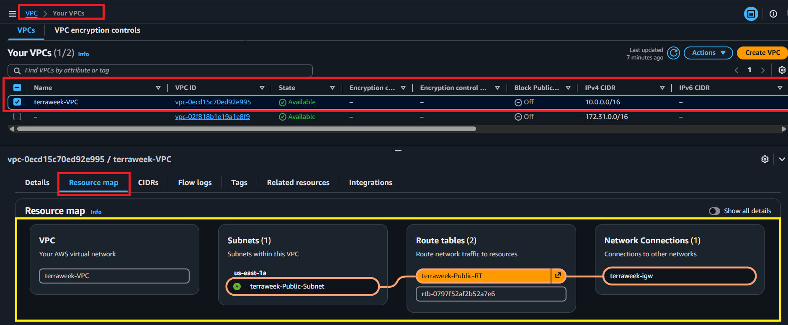

**Document:** What is the difference between a `resource` and a `data` source?

- **Resource `(resource)`** — Terraform creates and manages the lifecycle of infrastructure.

- **Data source `(data)`** — Terraform reads information about existing infrastructure or external data without creating it.

> In this task, the `aws_ami` data source discovers the appropriate AMI dynamically, while resources such as `aws_instance`, `aws_vpc`, and `aws_subnet` create and manage AWS infrastructure.

---

## Task 5: Use Locals for Dynamic Values

Use Terraform `locals` to centralize repeated values and keep resource configuration consistent.

### Step 1 — Define Local Values

Added a `locals` block to create a reusable name prefix and common tags:

```hcl
locals {
  name_prefix = "${var.project_name}-${var.environment}"

  common_tags = {
    Project     = var.project_name
    Environment = var.environment
    ManagedBy   = "Terraform"
  }
}
```
This avoids repeating the same project and environment values across multiple resources.

### Step 2 — Use the Dynamic Name Prefix

Replaced hardcoded resource names with local.name_prefix: `local.name_prefix`:

   - VPC: `"${local.name_prefix}-vpc"`
   - Subnet: `"${local.name_prefix}-subnet"`
   - Instance: `"${local.name_prefix}-server"`

### Step 3 — Merge Common and Resource-Specific Tags

Used `merge()` to combine common tags with resource-specific tags:

```hcl
tags = merge(local.common_tags, {
  Name = "${local.name_prefix}-server"
})
```
This keeps shared tags consistent while allowing each resource to have its own `Name` tag.

### Step 4 — Validate and Plan

Formatted and validated the updated configuration, then reviewed the Terraform plan before applying the changes.

```bash
terraform fmt
terraform validate
terraform plan
```
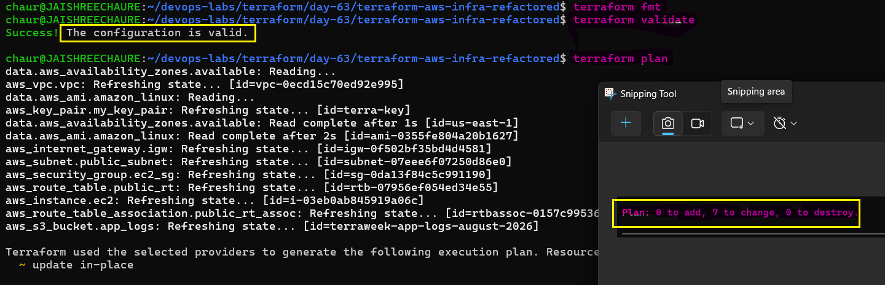 

### Step 5 — Apply Changes

Applied the configuration and verified that Terraform successfully updated the resources.

```bash 
terraform apply
```
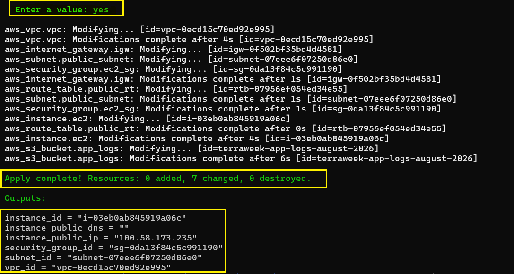 

### Step 6 — Verify Tags in AWS

Verified the AWS console and confirmed that the resources use consistent `Project`, `Environment`, `ManagedBy`, and `Name` tags.

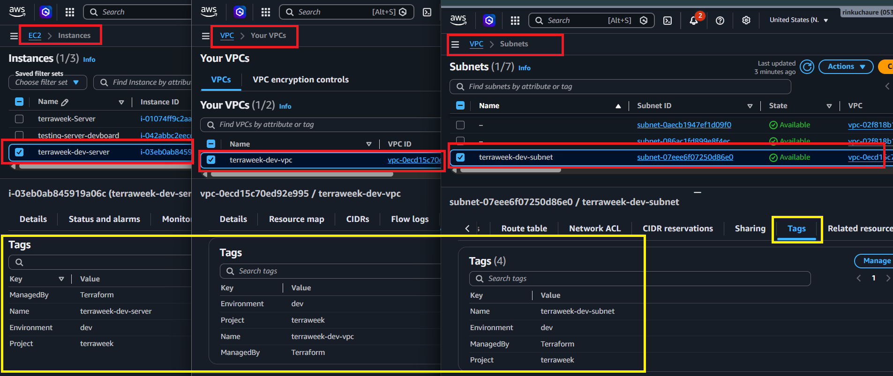

> Note: `locals` help reduce repetition and make Terraform configurations easier to maintain, especially when the same values are used across multiple resources.

---

## Task 6: Built-in Functions and Conditional Expressions

Practice Terraform built-in functions in `terraform console` and use a conditional expression to select the EC2 instance type based on the environment.

### Step 1 — Explore Terraform Functions

Open the Terraform console:

```bash
terraform console
```
### Step 2 — String Functions

Practice common functions for manipulating strings:

```hcl
upper("terraweek")
# "TERRAWEEK"

join("-", ["terra", "week", "2026"])
# "terra-week-2026"

format("arn:aws:s3:::%s", "my-bucket")
# "arn:aws:s3:::my-bucket"
```

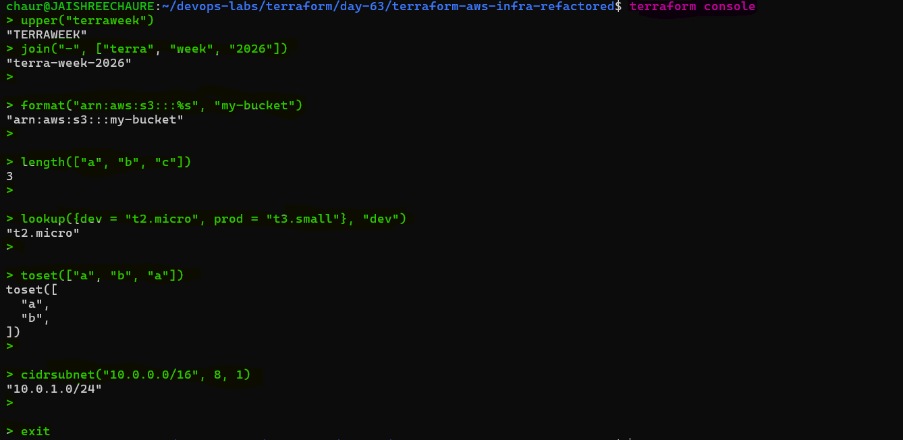 

### Step 3 — Collection Functions

Practice functions for working with lists and maps:

```hcl
length(["a", "b", "c"])
# 3

lookup({dev = "t2.micro", prod = "t3.small"}, "dev")
# "t2.micro"

toset(["a", "b", "a"])
# Removes duplicate values
```
Use `cidrsubnet()` to calculate a subnet CIDR from a VPC CIDR:

```hcl
cidrsubnet("10.0.0.0/16", 8, 1)
# "10.0.1.0/24"
```

### Step 5 — Conditional Expression

Use a conditional expression to select the EC2 instance type based on the environment:

```hcl
instance_type = var.environment == "prod" ? "t3.small" : "t2.micro"
```
- `prod` → `t3.small`
- `Any other environment` → `t2.micro`

Apply with the production variable file:

```bash
terraform apply -var-file="prod.tfvars"
```
Terraform should select `t3.small` for the production environment.

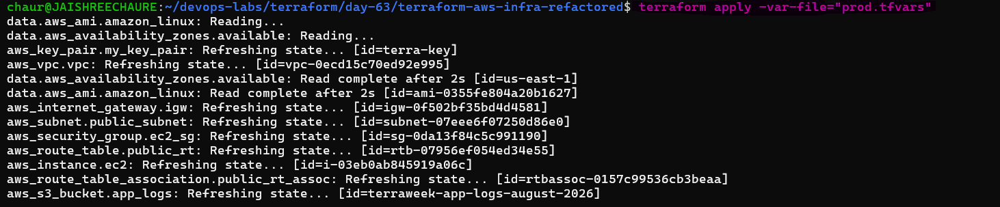 

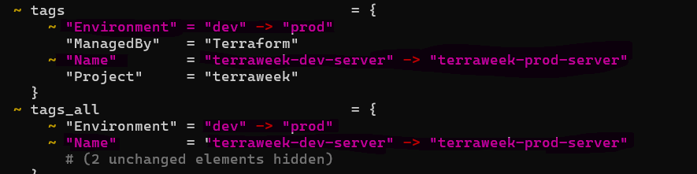

### Step 6 — Verify the Output

Verify the resulting instance and Terraform outputs: `terraform output`

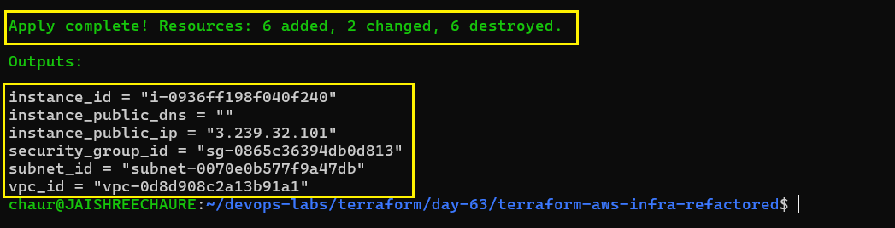 

Verify the production EC2 instance in the AWS console:

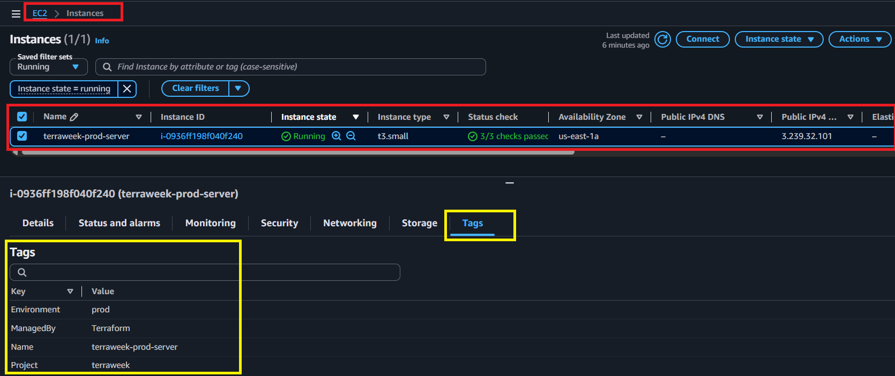 

### Step 7 — Clean Up

Destroy the production infrastructure after verification:

```bash
terraform destroy -var-file="prod.tfvars"
```
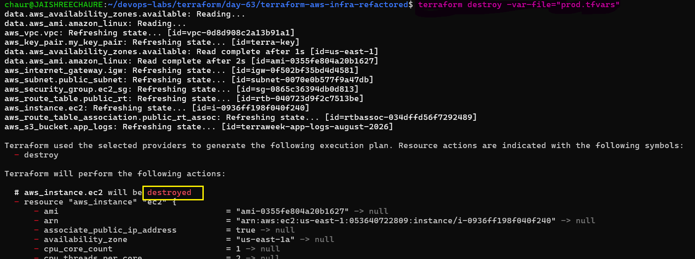

**Document:** Pick five functions you find most useful and explain what each does.

- `upper()` — converts text to uppercase
  - `upper(var.environment)` → `"dev"` → `"DEV"`

- `join()` — combines multiple values using a separator
  - `join("-", ["app", var.environment, "2026"])` → `"app-dev-2026"`

- `format()` — builds structured strings such as ARNs
  - `format("arn:aws:s3:::%s", "my-bucket")` → `"arn:aws:s3:::my-bucket"`

- `lookup()` — selects a value from a map based on a key
  - `lookup({dev = "t2.micro", prod = "t3.small"}, "dev")` → `"t2.micro"`

- `cidrsubnet()` — calculates a subnet CIDR from a network CIDR
  - `cidrsubnet("10.0.0.0/16", 8, 1)` → `"10.0.1.0/24"`

---

### Explanation of Variable Precedence with Examples

| **Priority (High → Low)** | **Source** | **Example** | **Value** |
|---|---|---|---|
| 1 (Highest) | Command-line (`-var`) | `terraform plan -var="environment=qa"` | `qa` |
| 2 | Command-line (`-var-file`) | `terraform plan -var-file="prod.tfvars"` | `prod` |
| 3 | Auto-loaded `.tfvars` | `terraform.tfvars → environment = "stage"` | `stage` |
| 4 | Environment variable | `TF_VAR_environment=uat` | `uat` |
| 5 (Lowest) | Default value | `default = "dev"` | `dev` |

### Difference Between `variable`, `local`, `output`, and `data`

- `variable` — used to accept input values from the user or environment.
- `local` — used to define internal reusable values or expressions.
- `data` — used to fetch existing resources from the provider (read-only).
- `output` — used to display or export values after Terraform execution.