# Day 64 — Terraform State Management and Remote Backends

> **Lab Setup:** Reused the Day 63 Terraform infrastructure for this hands-on lab and renamed the copied folder for Day 64.

```bash
- Initial Setup

cd ~/devops-labs/terraform/day-64/terraform-aws-state-management
rm -rf .terraform

- Configure & Verify AWS Profile

cat ~/.aws/config
export AWS_PROFILE=terraform
aws configure list
aws sts get-caller-identity

- Initialize & Validate Terraform

terraform init
terraform fmt
terraform validate
```

## Task 1: Inspect Your Current State

Use the reused Day 63 infrastructure and explore the Terraform state.

### Create Infrastructure

```bash
terraform plan
terraform apply
```
### Inspect Terraform State

```bash
terraform show                                    # Full state in human-readable format
terraform state list                              # All resources tracked by Terraform
terraform state show aws_instance.ec2             # Every attribute of the instance
terraform state show aws_vpc.vpc                  # Every attribute of the VPC
```
### Inspect State Metadata

```bash
grep -E '"version"|"serial"|"lineage"|"terraform_version"' terraform.tfstate
ls -lh terraform.tfstate
terraform state list | grep '^aws_' | wc -l
```

### Answer

1. **How many resources does Terraform track?**

   - Terraform tracks **9 resources** in the state.
   - Data sources are read-only and are **not counted as managed resources**.

2. **What attributes does the state store for an EC2 instance?**
   
   Terraform state stores much more information than what is explicitly defined in the `.tf` configuration, including:

   - `ami`, `instance_type`, `tags`, `key_name`
   - `private_ip`, `public_ip`, `private_dns`, `public_dns`
   - `subnet_id`, `vpc_security_group_ids`
   - `primary_network_interface_id`
   - `root_block_device`, `volume_id`, `volume_size`, `volume_type`
   - `delete_on_termination`
   
   This allows Terraform to compare the **desired configuration**, **stored state**, and **actual infrastructure**.

3. **Open `terraform.tfstate` in an editor — find the `serial` number. What does it represent?**

   - The `serial` number represents the **revision/version of the Terraform state**.
   - It increments whenever Terraform writes an updated state.
   - It helps Terraform identify the **latest state version** and prevent stale state from overwriting newer state.

---

## Task 2: Set Up S3 Remote Backend

Move the existing Terraform state from local storage to an **Amazon S3 remote backend**.

### 2.1 Create S3 Bucket & Enable Versioning

```bash
aws s3api head-bucket \
  --bucket terraweek-state-jaishree-2026

aws s3api create-bucket \
  --bucket terraweek-state-jaishree-2026 \
  --region us-east-1

aws s3api put-bucket-versioning \
  --bucket terraweek-state-jaishree-2026 \
  --versioning-configuration Status=Enabled

aws s3api get-bucket-versioning \
  --bucket terraweek-state-jaishree-2026
```
Expected: `"Status": "Enabled"`

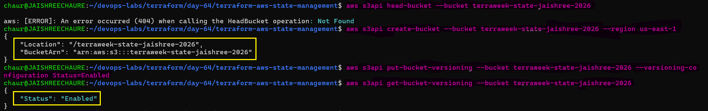

### 2.2 Configure S3 Backend

```hcl
terraform {
  backend "s3" {
    bucket       = "terraweek-state-jaishree-2026"
    key          = "dev/terraform.tfstate"
    region       = "us-east-1"
    encrypt      = true
    use_lockfile = true
  }
}
```
**Terraform-file** [providers.tf](./terraform-aws-state-management/providers.tf)

Migrate the existing local state:

```bash
terraform init
```
When prompted: `Enter a value: yes`

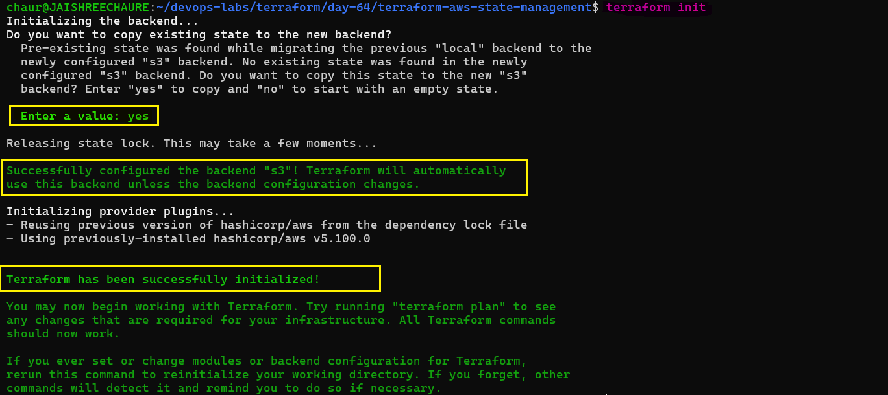

### 2.3 Why Not DynamoDB?

- The original task mentions DynamoDB for state locking.
- This lab uses **S3 native state locking** with `use_lockfile = true`.
- Therefore, no DynamoDB table was created.

Terraform confirms locking during operations:

```text
Acquiring state lock...
Releasing state lock...
```
### 2.4 Verify Remote State

```bash
aws s3 ls s3://terraweek-state-jaishree-2026/dev/
terraform state list
terraform plan
```
Expected: `terraform.tfstate`
and: `No changes. Your infrastructure matches the configuration.`

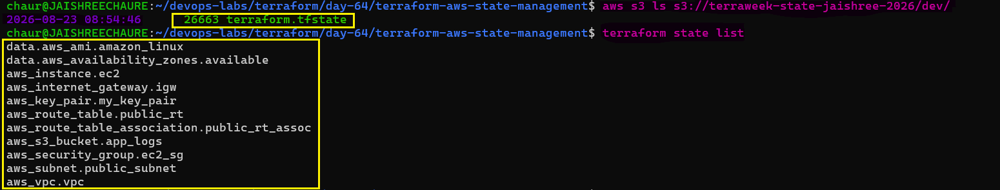

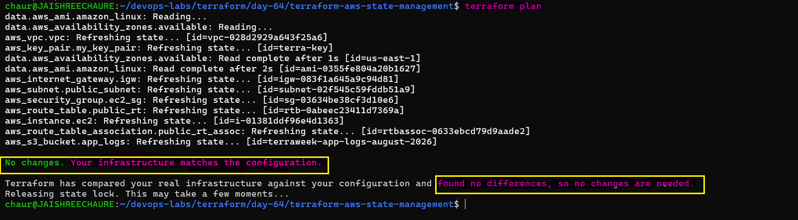

### 2.5 Verify in AWS Console

**AWS Console → S3 → `terraweek-state-jaishree-2026` → `dev/`**

Verify: `terraform.tfstate`

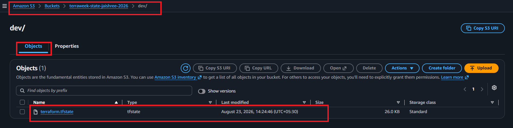

Check the local state file:

```bash
ls -lh terraform.tfstate
```
The local file is now **0 bytes** because the active state is stored remotely in S3.

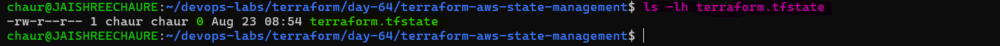

### Key Takeaways

- Migrated Terraform state from **local → S3**.
- Enabled **S3 Versioning**.
- Enabled **S3 native state locking** with `use_lockfile = true`.
- DynamoDB was not required.
- Verified the remote state and confirmed **No changes** with `terraform plan`.

---

## Task 3: Test State Locking

State locking prevents multiple Terraform operations from modifying the same state simultaneously.

### 3.1 Add a Temporary Change

Add a temporary tag to the EC2 instance:

```hcl
tags = merge(local.common_tags, {
  Name     = "${local.name_prefix}-server"
  LockTest = "temporary"
})
```

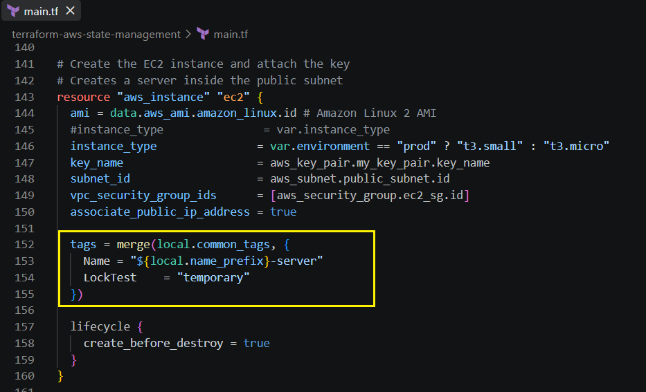

### 3.2 Test State Locking

Open **two terminals** in the same project directory.

**Terminal 1:**

```bash
terraform apply 
```
- Wait at the approval prompt without entering `yes`.
- While Terminal 1 is waiting, run `terraform plan` in Terminal 2.

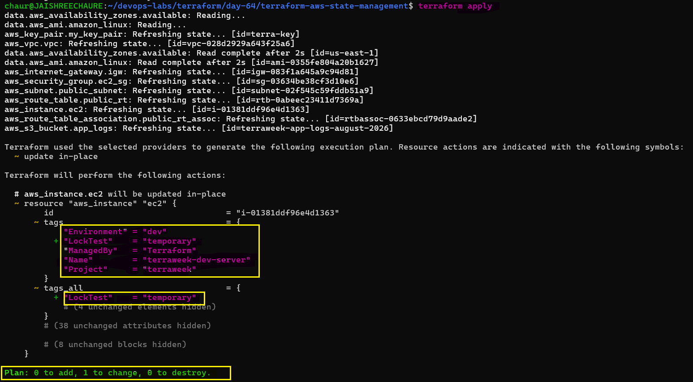

While Terminal 1 is waiting, run in **Terminal 2:**

```bash
terraform plan
```
Terminal 2 should show: `Error acquiring the state lock`

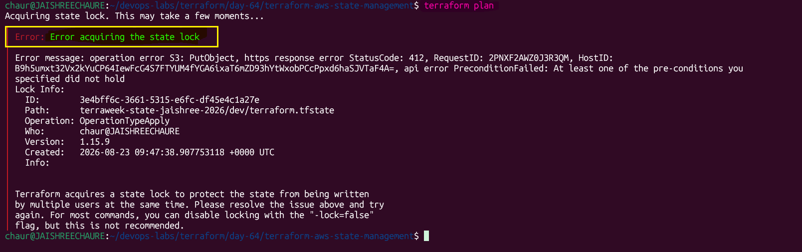

### 3.3 Handle a Stale Lock

If a stale lock remains: `terraform force-unlock <LOCK_ID>`

> Only force-unlock when you are certain no other Terraform operation is running.

### 3.4 Remove the Temporary Change

Remove `LockTest` from `main.tf`, then run:

```bash
terraform fmt
terraform plan
```
Expected: `No changes. Your infrastructure matches the configuration.`

**Document:** What is the error message? Why is locking critical for team environments?

- **Error:** - Terraform reports `Error acquiring the state lock` because another Terraform operation is already holding the state lock.
- **Why is locking critical?** - It prevents multiple users or processes from modifying the same state simultaneously, avoiding conflicting updates and possible state corruption in team environments.

> **Key Takeaway:** State locking protects shared Terraform state from **concurrent operations, conflicting changes, and corruption**.

---

## Task 4: Import an Existing Resource

Not everything starts with Terraform. Existing AWS resources can be brought under Terraform management using `terraform import`.

### 4.1 Create an S3 Bucket

Create an S3 bucket manually:

```bash
aws s3api create-bucket \
  --bucket terraweek-import-test-jaishree-2026 \
  --region us-east-1
```
Verify it exists:

```bash
aws s3api head-bucket \
  --bucket terraweek-import-test-jaishree-2026
```

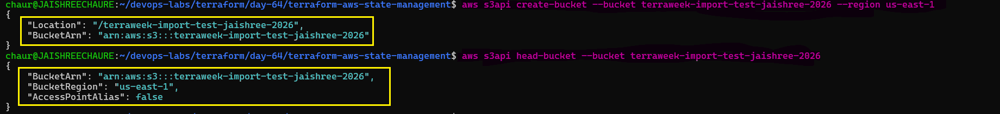

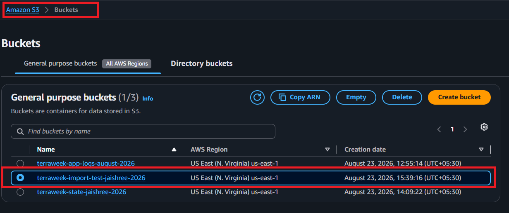

### 4.2 Add the Resource to Terraform

Add the bucket to the Terraform configuration with only its name:

```hcl
resource "aws_s3_bucket" "imported" {
  bucket = "terraweek-import-test-jaishree-2026"
}
```
Format, validate and check the plan: `terraform fmt`, `terraform validate`, `terraform plan`

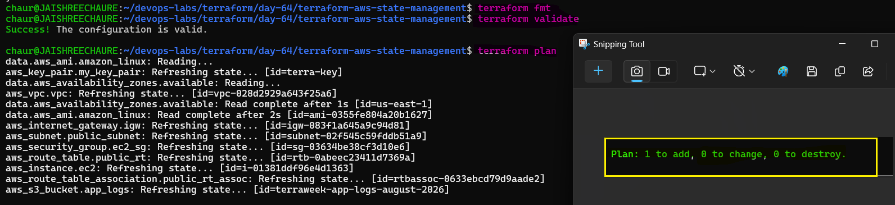

### 4.3 Import the Existing Bucket

```bash
terraform import \
  aws_s3_bucket.imported \
  terraweek-import-test-jaishree-2026
```
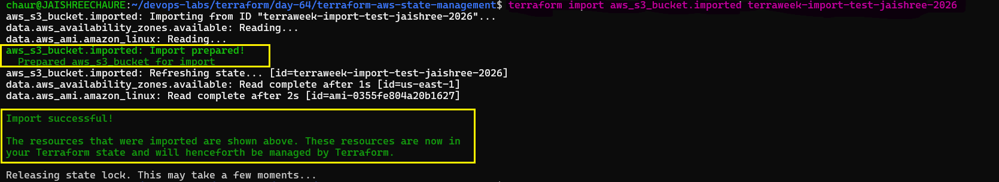

Verify it is now tracked: `terraform state list`

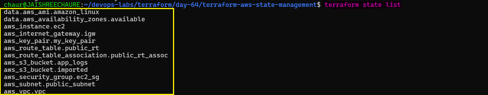

### 4.4 Verify the Import

Run: `terraform plan`

Expected: `No changes. Your infrastructure matches the configuration.`

This confirms the imported resource matches the Terraform configuration.

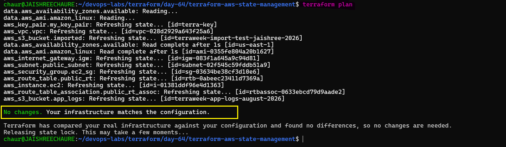

**Document** 

**What is the difference between `terraform import` and creating a resource from scratch?**

- `terraform import` brings an **existing AWS resource** into Terraform state without creating a new resource.
- Creating a resource from scratch with Terraform means Terraform **provisions the resource** based on the configuration.
- After importing, the resource must still have a matching Terraform configuration so Terraform can manage it correctly.

---

## Task 5: State Surgery -- `mv` and `rm`

Sometimes Terraform state needs to be modified without destroying the actual AWS resource.

### 5.1 Rename a Resource in State

Check the current resource:

```bash
terraform state list | grep aws_s3_bucket
```
Rename it in Terraform state:

```bash
terraform state mv \
  aws_s3_bucket.imported \
  aws_s3_bucket.logs_bucket
```
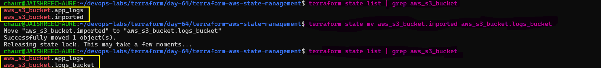

Update the `main.tf` resource name to `logs_bucket`, then verify:

```bash
terraform fmt
terraform plan
```
Expected: `No changes. Your infrastructure matches the configuration.`

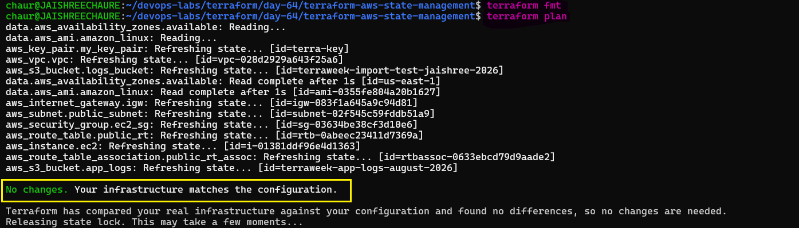

### 5.2 Remove a Resource from State

Remove the bucket from Terraform state:

```bash
terraform state rm aws_s3_bucket.logs_bucket
```
The resource is removed **only from Terraform state**; the S3 bucket still exists in AWS.

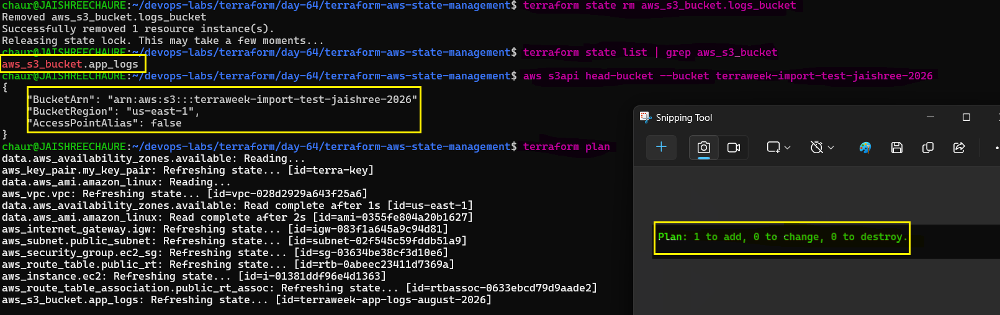

### 5.3 Re-import the Resource

Bring the existing bucket back under Terraform management:

```bash
terraform import \
  aws_s3_bucket.logs_bucket \
  terraweek-import-test-jaishree-2026
```
Verify:

```bash
terraform state list | grep aws_s3_bucket
terraform plan
```
Expected: `No changes. Your infrastructure matches the configuration.`

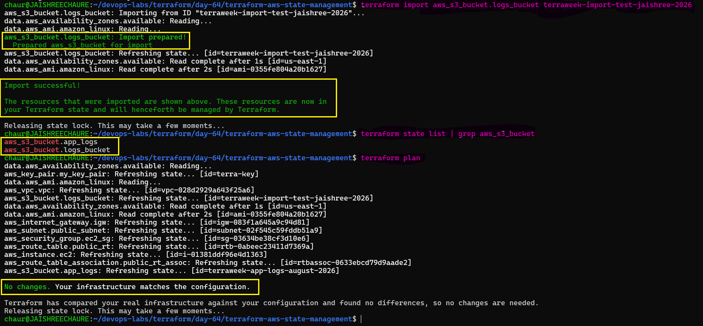

**Document** 

**When would you use `terraform state mv`?**

- When renaming or restructuring resources in Terraform without destroying the existing infrastructure.
- Useful when refactoring configurations or moving resources between modules.

**When would you use `terraform state rm`?**

- When Terraform should stop managing a resource **without destroying it in AWS**.
- Useful when transferring resource management to another Terraform configuration or tool.

---

## Task 6: Simulate and Fix State Drift

State drift happens when infrastructure is changed outside Terraform, such as through the AWS Console or CLI.

### 6.1 Create Manual Changes

First, apply the Terraform configuration so infrastructure is in sync.

Then create changes outside Terraform:

- **EC2:** Changed the `Name` tag from `terraweek-dev-server` to `ManuallyChanged` using the AWS Console.

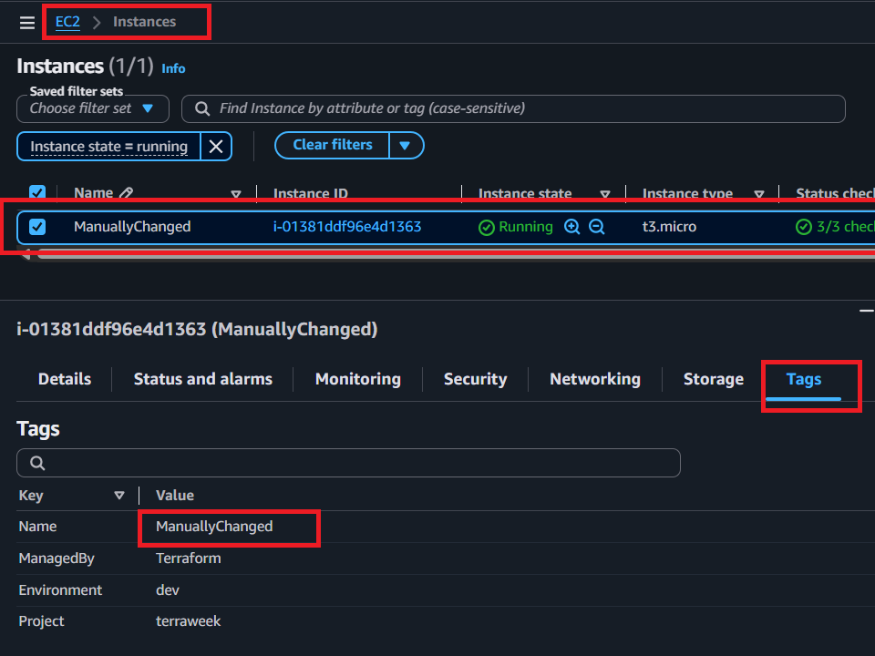

- **S3:** Added a `DriftTest=ManualChange` tag using the AWS CLI.

```bash
aws s3api put-bucket-tagging \
  --bucket terraweek-import-test-jaishree-2026 \
  --tagging 'TagSet=[{Key=DriftTest,Value=ManualChange}]'
```
Verify the S3 tag:

```bash
aws s3api get-bucket-tagging \
  --bucket terraweek-import-test-jaishree-2026
```
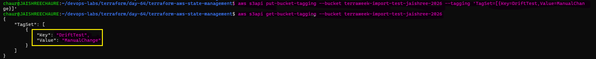

### 6.2 Detect State Drift

Run:

```bash
terraform plan
```
Terraform detected that AWS no longer matched the Terraform configuration.

Expected: `Plan: 0 to add, 2 to change, 0 to destroy.`

The plan detected:

- EC2 `Name` tag changed manually.
- S3 `DriftTest` tag was added manually.

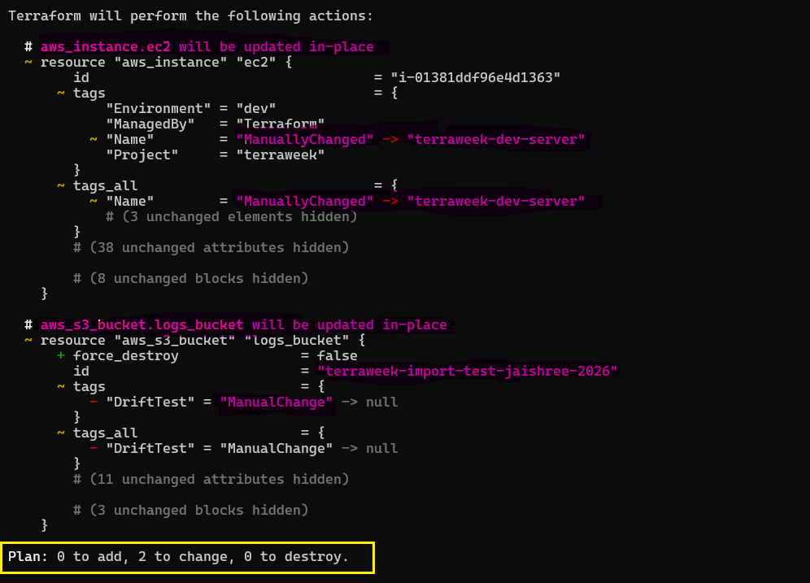 

### 6.3 Fix the Drift

Two options are possible:

- **Option A:** Run `terraform apply` to reconcile AWS with the Terraform configuration.
- **Option B:** Update the `.tf` files to accept the manual changes..

Choose **Option A** and run:

```bash
terraform apply
``` 
Approve with: `Yes`

Terraform restored the resources to the configuration defined in the `.tf` files.

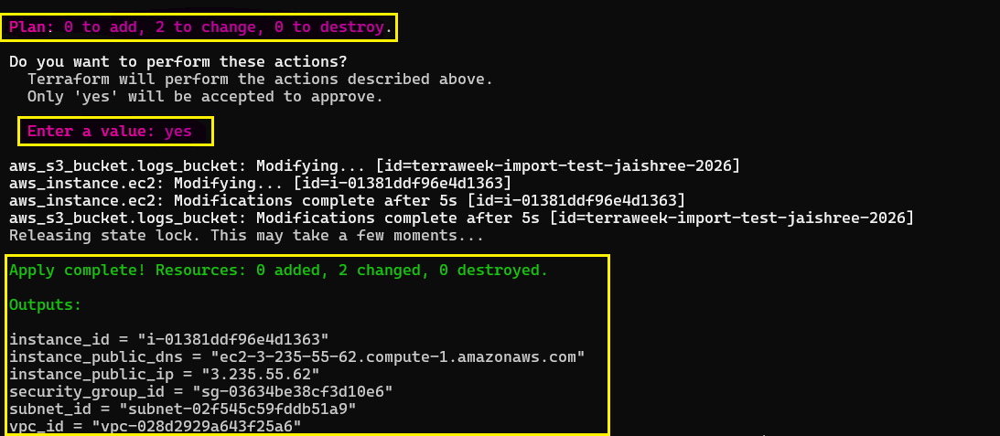 

Verify the EC2 tags:

```bash
aws ec2 describe-instances \
  --instance-ids i-01381ddf96e4d1363 \
  --query 'Reservations[0].Instances[0].Tags'
```
The `Name` tag should be restored to: `terraweek-dev-server`

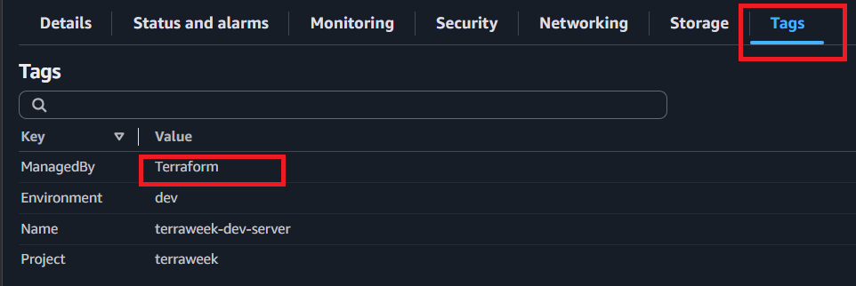

Finally, run: `terraform plan`

Expected: `No changes. Your infrastructure matches the configuration.`

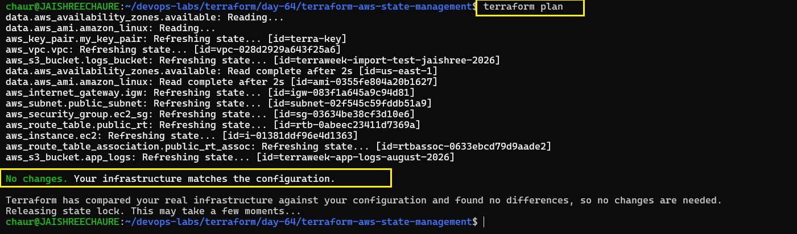 

**Document:** 

**How do teams prevent state drift in production? (hint: restrict console access, use CI/CD for all changes)**

- Restrict direct console access.
- Use CI/CD for infrastructure changes.
- Manage infrastructure through Terraform/IaC.
- Use IAM permissions and approval workflows.
- Run regular `terraform plan` checks to detect unexpected changes.
 
### 6.4 Cleanup

After completing the Day 64 hands-on practice: `terraform destroy` Approve with: `Yes`

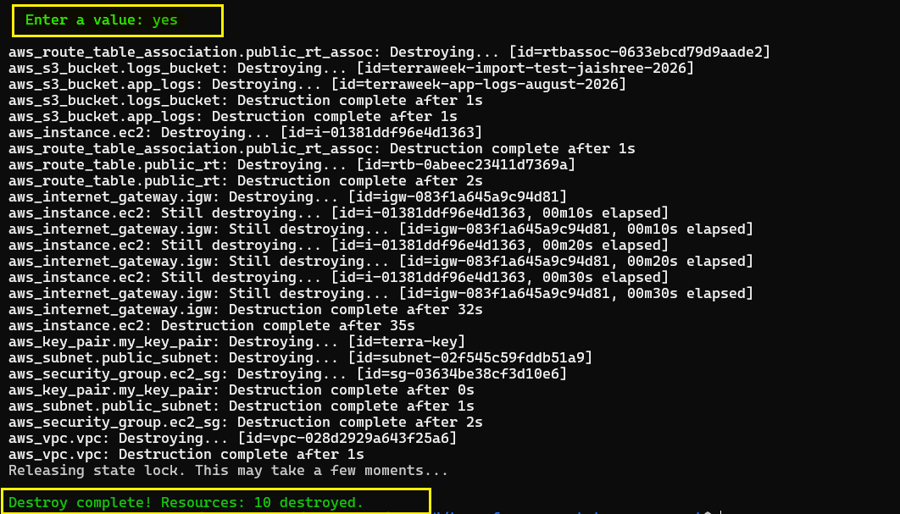 

---

## Documentation

### 1. Local State vs Remote State

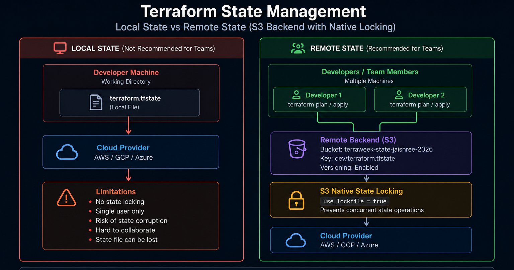

- **Local:** `terraform.tfstate` stored on the developer machine.
- **Remote:** State stored in **S3** with Versioning and native locking.
- This lab uses `use_lockfile = true`; **DynamoDB is not used**.

### 2. Terraform Import

```bash
terraform import aws_s3_bucket.imported terraweek-import-test-jaishree-2026
terraform state list
terraform plan
```
Result: 

```text
Import successful!
No changes. Your infrastructure matches the configuration.
```

### 3. State Drift

1. Changed the EC2 `Name` tag to `ManuallyChanged` in the AWS Console.
2. Added an S3 `DriftTest=ManualChange` tag using AWS CLI.
3. `terraform plan` detected the drift.
4. `terraform apply` restored the desired configuration.
5. Final `terraform plan` showed **No changes**.

### 4. State Commands

| Command         | Use                                                           |
| --------------- | ------------------------------------------------------------- |
| `state mv`      | Rename/move a resource in state                               |
| `state rm`      | Remove a resource from state without deleting AWS resource   |
| `import`        | Bring an existing resource under Terraform management         |
| `force-unlock`  | Remove a stale state lock                                     |
| `refresh`       | Refresh state from real infrastructure                        |

