# Day 65 -- Terraform Modules: Build Reusable Infrastructure

## Task 1: Understand Module Structure

A Terraform module is just a directory with `.tf` files. Create this structure:

```
terraform-modules/
  main.tf                    # Root module -- calls child modules
  variables.tf               # Root variables
  outputs.tf                 # Root outputs
  providers.tf               # Provider config
  modules/
    ec2-instance/
      main.tf                # EC2 resource definition
      variables.tf           # Module inputs
      outputs.tf             # Module outputs
    security-group/
      main.tf                # Security group resource definition
      variables.tf           # Module inputs
      outputs.tf             # Module outputs
```

Create all the directories and empty files. This is a common and recommended layout for organizing Terraform projects and reusable modules.

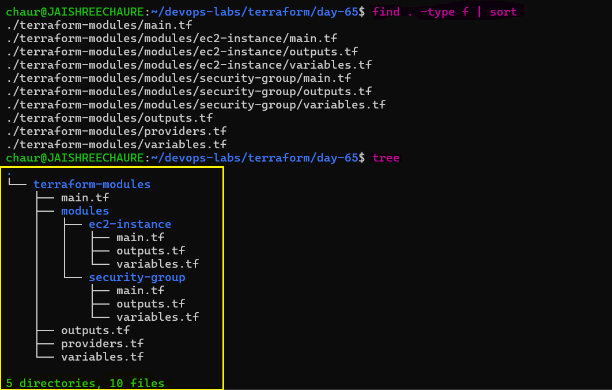

**Document:** What is the difference between a "root module" and a "child module"?

- **Root Module**
  - The root module is the main place where everything starts.
  - It’s the folder where you run Terraform commands.

- **Child Module**
  - A child module is a smaller part used by the root module.
  - It does a specific task (like creating a VPC, EC2 instance, or database).

---

## Task 2: Build a Custom EC2 Module

Create `modules/ec2-instance/`:

1. **`variables.tf`** -- define inputs:

   - `ami_id` (string)
   - `instance_type` (string, default: `"t3.micro"`)
   - `subnet_id` (string)
   - `security_group_ids` (list of strings)
   - `instance_name` (string)
   - `tags` (map of strings, default: `{}`)

2. **`main.tf`** -- define the resource:

   - `aws_instance` using all the variables
   - Merge the `Name` tag with additional tags

3. **`outputs.tf`** -- expose:

   - `instance_id`
   - `public_ip`
   - `private_ip`

**Do NOT apply yet -- just write the module.**

---

## Task 3: Build a Custom Security Group Module

Create `modules/security-group/`:

1. **`variables.tf`** -- define inputs:

   - `vpc_id` (string)
   - `sg_name` (string)
   - `ingress_ports` (list of numbers, default: `[22, 80]`)
   - `tags` (map of strings, default: `{}`)

2. **`main.tf`** -- define the resource:

   - `aws_security_group` in the given VPC
   - Use `dynamic "ingress"` block to create rules from the `ingress_ports` list
   - Allow all egress

3. **`outputs.tf`** -- expose:

   - `sg_id`

This is your first time using a `dynamic` block -- it loops over a list to generate repeated nested blocks.

---

## Task 4: Call Your Modules from Root

In the root `main.tf`, wire everything together:

### 1. Create the VPC and Subnet

Create the VPC and public subnet directly in the root module. The EC2 instances will be launched inside this subnet.

### 2. Call the Security Group Module

Use the custom Security Group module and allow SSH, HTTP, and HTTPS traffic.

```hcl
module "web_sg" {
  source        = "./modules/security-group"
  vpc_id        = aws_vpc.main.id
  sg_name       = "terraweek-web-sg"
  ingress_ports = [22, 80, 443]
  tags          = local.common_tags
}
```
The module creates the Security Group and exposes its ID through `sg_id`.

### 3. Reuse the EC2 Module for Two Servers

Call the same EC2 module twice with different `instance_name` values.

```hcl
module "web_server" {
  source             = "./modules/ec2-instance"
  ami_id             = data.aws_ami.amazon_linux.id
  instance_type      = "t3.micro"
  subnet_id          = aws_subnet.public.id
  security_group_ids = [module.web_sg.sg_id]
  instance_name      = "terraweek-web"
  tags               = local.common_tags
}

module "api_server" {
  source             = "./modules/ec2-instance"
  ami_id             = data.aws_ami.amazon_linux.id
  instance_type      = "t3.micro"
  subnet_id          = aws_subnet.public.id
  security_group_ids = [module.web_sg.sg_id]
  instance_name      = "terraweek-api"
  tags               = local.common_tags
}
```
> **Key concept: Module Reusability**

The EC2 resource is defined once in `modules/ec2-instance/` and reused twice with different inputs.

### 4. Add Root Outputs

Expose the public IPs returned by the EC2 modules.

```hcl
output "web_server_ip" {
  value = module.web_server.public_ip
}

output "api_server_ip" {
  value = module.api_server.public_ip
}
```
This shows how the root module consumes outputs from child modules.

### 5. Initialize Terraform

```bash
terraform init    # Downloads/links the local modules
```
Terraform initializes the configuration, child modules, and AWS provider.

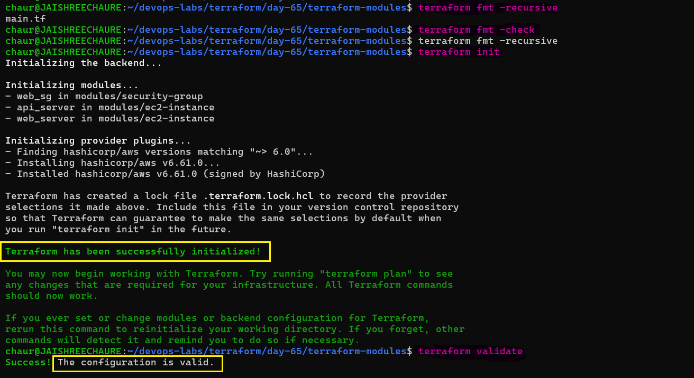 

### 6. Create and review the execution plan

```bash
terraform plan    # Should show all resources from both module calls
```
The plan should show the infrastructure Terraform intends to create, including the VPC, subnet, route table, Security Group, and two EC2 instances.

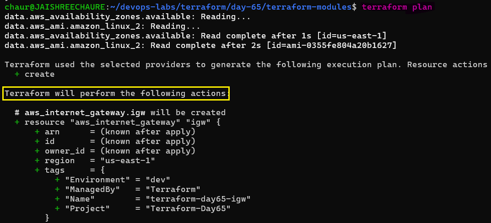 

### 7. Apply the configuration

```bash
terraform apply
```
Review the plan and enter:

```text
Yes
```
Terraform creates the infrastructure defined by the root module and its child modules.

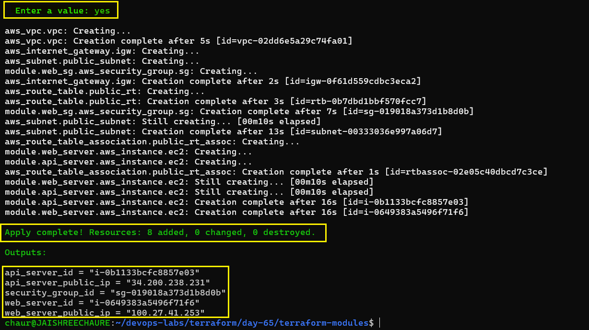 


### 8. Verify EC2 Instances in AWS

Verify that:

- Two EC2 instances are running.
- Both use the same Security Group.
- Both have different names.
- Both use the expected instance type.

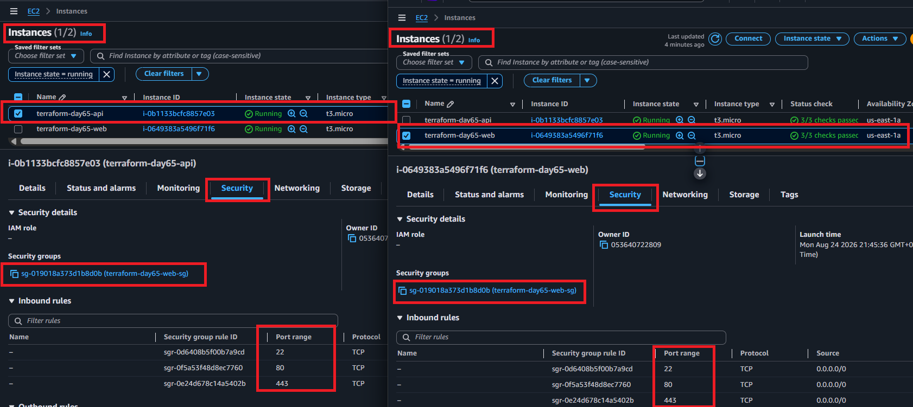 

### 9. Verify EC2 Tags

Check the `Tags` tab for both instances.

Verify that the EC2 module applied the `Name` tag and common tags such as `Project`, `Environment`, and `ManagedBy`.

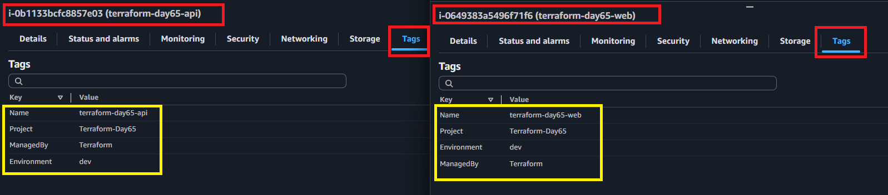

The same custom EC2 module was successfully reused to create two different servers, while the Security Group module was shared between them.

**Key takeaway:** Terraform modules allow infrastructure components to be defined once and reused with different input values.

---

## Task 5: Use a Public Registry Module

Replace the hand-written VPC resources with the official VPC module from the Terraform Registry.

### 1. Use the VPC Registry Module

```hcl
module "vpc" {
  source  = "terraform-aws-modules/vpc/aws"
  version = "6.0.1"

  name = "terraform-day65-vpc"
  cidr = "10.0.0.0/16"

  azs             = ["us-east-1a", "us-east-1b"]
  public_subnets  = ["10.0.1.0/24", "10.0.2.0/24"]
  private_subnets = ["10.0.3.0/24", "10.0.4.0/24"]

  enable_nat_gateway  = false
  enable_dns_hostnames = true

  tags = local.common_tags
}
```
The registry module replaces the manually defined VPC, subnets, route tables, Internet Gateway, and related networking resources.

### 2. Update Module References

Update the custom modules to use outputs from the registry VPC module:

```hcl
vpc_id    = module.vpc.vpc_id
subnet_id = module.vpc.public_subnets[0]
```
The Security Group receives the VPC ID, while both EC2 instances use the first public subnet.

### 3. Initialize the Registry Module

```bash
terraform init -upgrade 
```
Terraform downloads the VPC module from the Registry and initializes the provider.

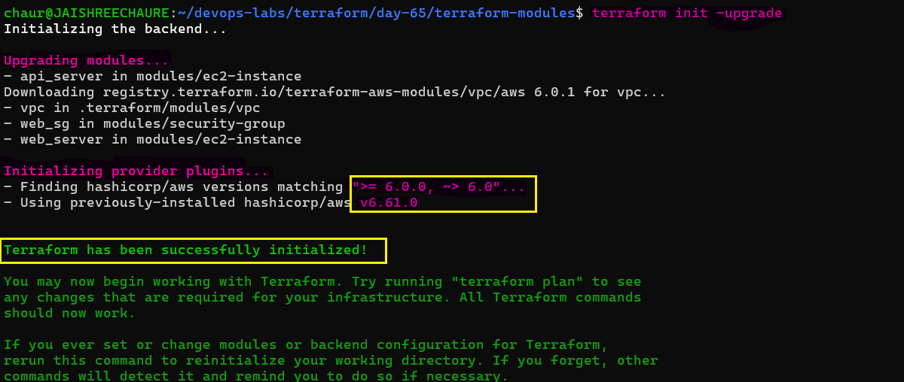 

### 4. Review the Plan

```bash
terraform plan
```
Terraform evaluates the registry VPC module together with the custom Security Group and EC2 modules.

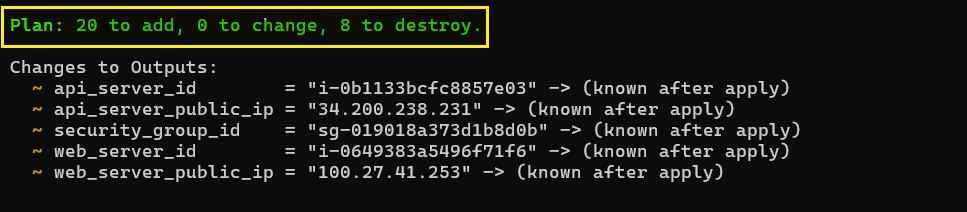 

### 5. Apply the Configuration

```bash
terraform apply
```
Review the plan and enter:

```text
yes
```
Terraform creates the VPC infrastructure and two EC2 instances.

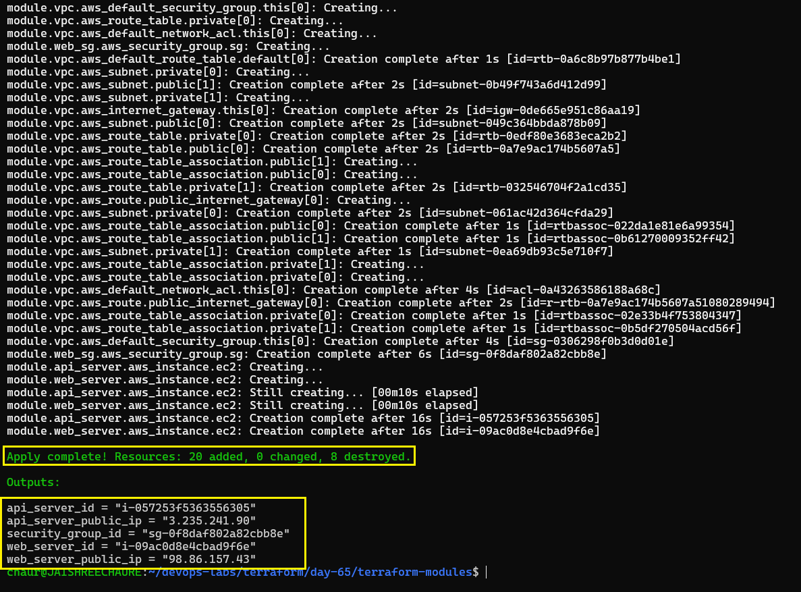 

### 6. Verify the AWS Infrastructure

Verify the resources in the AWS Console, including the two EC2 instances and the Terraform-managed VPC resource map.

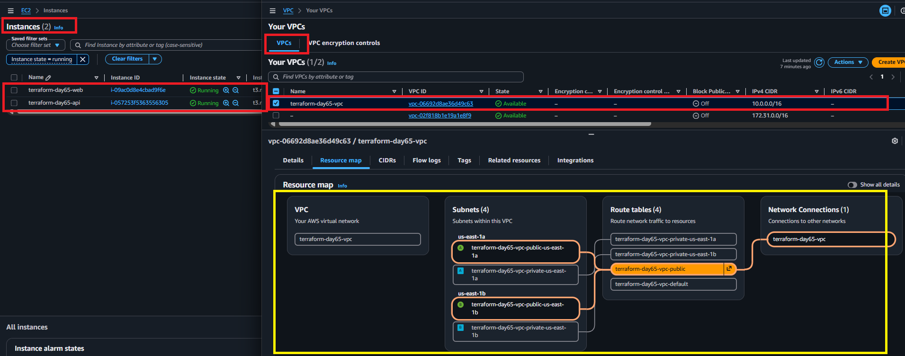 

### 7. Compare the VPC Implementations

The registry module manages multiple networking components, including:

- Public and private subnets
- Public and private route tables
- Route table associations
- Internet Gateway
- Default networking resources

This demonstrates how a reusable public module can encapsulate more infrastructure than a hand-written VPC configuration.

**Resource Comparison:**

In this configuration, the `VPC module` created 20 resources, compared with 5 resources in the `hand-written VPC` from Day 62.

### 8. Locate the Downloaded Module

Terraform stores downloaded modules in `.terraform/modules/`.

```bash
ls -la .terraform/modules/
cat .terraform/modules/modules.json
```
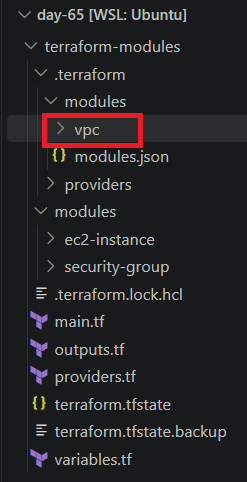

---

## Task 6: Module Versioning and Best Practices

### 1. Pin Module Versions

Use an explicit version constraint for registry modules:

```hcl
version = "6.0.1"          # Exact version
version = "~> 6.0"         # Compatible 6.x version
version = ">= 6.0, < 7.0"  # Version range
```
Pinning versions keeps module behavior predictable and prevents unexpected upgrades.

### 2. Test Module Version Pinning

Change the VPC module version in `main.tf`:

```hcl
module "vpc" {
  source  = "terraform-aws-modules/vpc/aws"
  version = "6.1.0"
}
```
Verify and initialize:

```bash
terraform fmt
grep -A3 'module "vpc"' main.tf
terraform init
terraform validate
terraform plan
```
Expected:

```text
Success! The configuration is valid.
No changes. Your infrastructure matches the configuration.
```
### 3. Change the Version Back  

Restore the pinned version:

```hcl
module "vpc" {
  source  = "terraform-aws-modules/vpc/aws"
  version = "6.0.1"
}
```
Reinitialize, validate, and review:

```bash
terraform fmt
terraform init
terraform validate
terraform plan
```
Changing the module version requires Terraform to reinitialize the module dependency.

### 4. Check for Module Updates

```bash
terraform init -upgrade
```
This intentionally checks for newer module and provider versions allowed by the configured constraints.

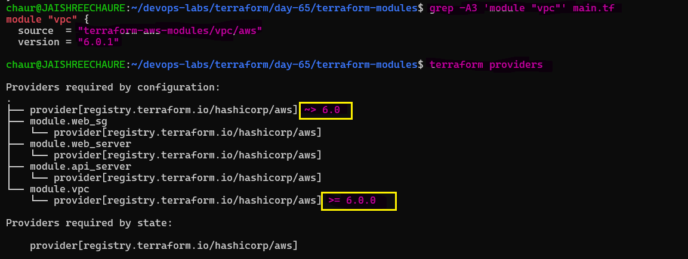 

### 5. Inspect Modules in Terraform State

```bash
terraform state list
```
Module-managed resources appear with prefixes such as:

```text
module.vpc.*
module.web_server.*
module.web_sg.*
```
This shows how Terraform tracks resources created through reusable modules.

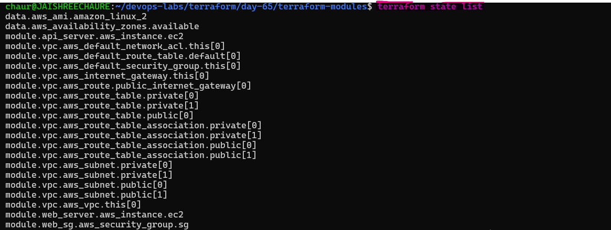 

### 6. Destroy the Infrastructure

After completing the hands-on exercise:

```bash
terraform destroy
```
Review the resources Terraform plans to remove and confirm with:

```text
yes
```
A successful destroy removes the infrastructure managed by the current Terraform state.

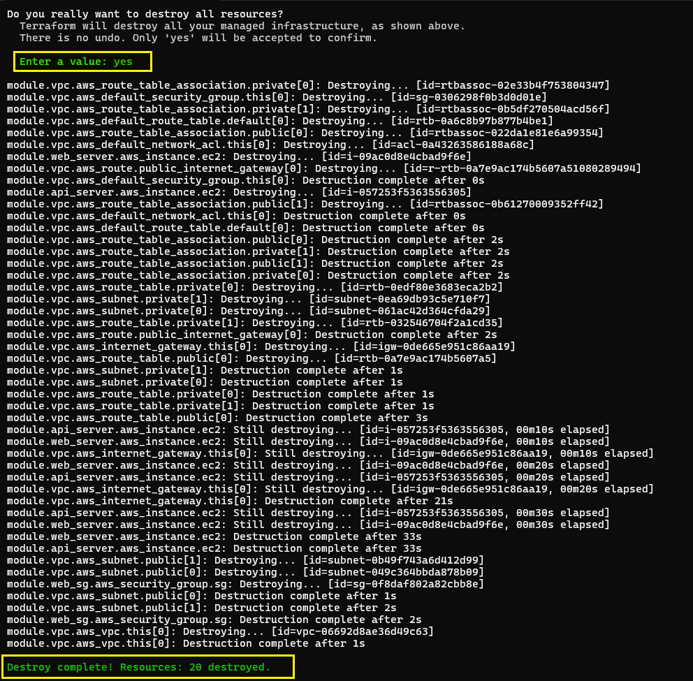

### Key Takeaway

- Pin module versions for predictable deployments.
- Re-run `terraform init` after changing module versions.
- Run `terraform validate` after configuration changes.
- Use `terraform init -upgrade` to intentionally check for updates.
- Use `terraform state list` to inspect module-managed resources.
- Run `terraform destroy` after lab work to avoid unnecessary AWS costs.

---

## Hand-Written VPC vs Registry VPC Module

| Aspect | Hand-written VPC | Registry VPC Module |
|---|---|---|
| Resources Managed | Fewer | More |
| Lines of Code | ~50 | ~20 |
| Production Readiness | Depends on implementation | Community-maintained |
| Maintained | By Developer | By Community |
| Reusable | Limited | High |

> **Note:** The exact number of resources created by the registry module depends on the module configuration and enabled features.

### Module Best Practices

- `Use clear names` — Make resources, modules, and variables easy to understand.
- `Keep files organized` — Use `main.tf`, `variables.tf`, and `outputs.tf`.
- `Use locals` — Avoid repeating common values such as tags.
- `Don’t assume the environment` — Avoid unnecessary hardcoded regions, accounts, or environment-specific values.
- `Validate inputs` — Add validation rules so invalid values fail early.
- `Use defaults carefully` — Add defaults only when they provide sensible behavior.
- `Keep modules small` — Focus each module on a clear responsibility to make it easier to reuse and debug.
- `Pin module versions` — Use explicit version constraints for predictable and repeatable deployments.
- `Test before applying` — Run `terraform fmt`, `terraform validate`, and `terraform plan`.
- `Document modules` — Explain the module's purpose, inputs, outputs, structure, and usage.