# Day 66 -- Provision an EKS Cluster with Terraform Modules

## Task 1: Project Setup

Create a new project directory with proper file structure:

```
terraform-eks/
  providers.tf        # Provider and backend config
  vpc.tf              # VPC module call
  eks.tf              # EKS module call
  variables.tf        # All input variables
  outputs.tf          # Cluster outputs
  terraform.tfvars    # Variable values
```

In `providers.tf`:
1. Pin the AWS provider to `~> 5.0`
2. Pin the Kubernetes provider (you will need it later)
3. Set your region

In `variables.tf`, define:
- `region` (string)
- `cluster_name` (string, default: `"terraweek-eks"`)
- `cluster_version` (string, default: `"1.31"`)
- `node_instance_type` (string, default: `"m7i-flex.large"`)
- `node_desired_count` (number, default: `2`)
- `vpc_cidr` (string, default: `"10.0.0.0/16"`)

> **Note:** `m7i-flex.large` is Free Tier eligible for eligible AWS accounts. Check your AWS Free Tier eligibility and remaining credits before running the lab.

### Verification

Formatted and initialized the Terraform configuration:

```bash
terraform fmt
terraform init
terraform validate
```
Terraform successfully initialized the required providers and validated the configuration.

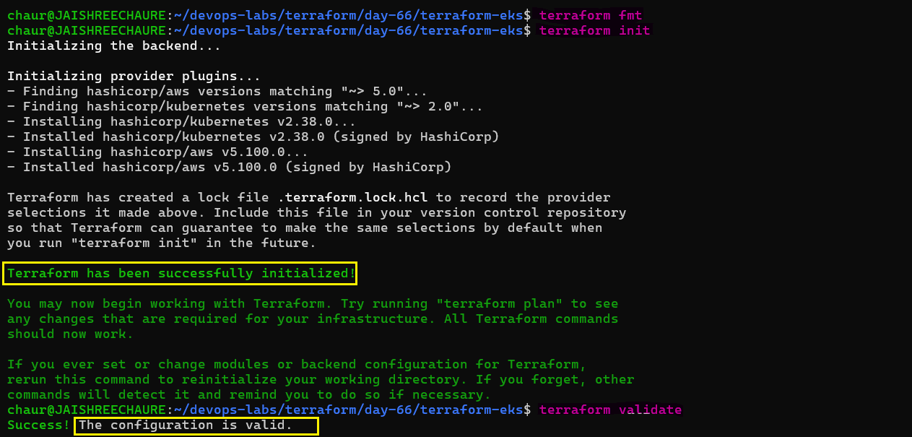 

Verified the required Terraform providers and the active AWS identity

```bash
terraform providers
aws sts get-caller-identity
```
The AWS identity was confirmed as the Terraform IAM user being used for this lab.

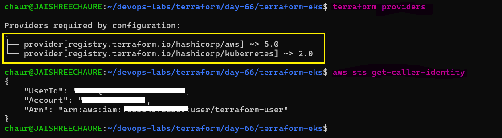

---

## Task 2: Create the VPC with Registry Module

EKS requires a VPC with both public and private subnets across multiple availability zones.

In `vpc.tf`, use the `terraform-aws-modules/vpc/aws` module:
1. CIDR: `var.vpc_cidr`
2. At least 2 availability zones
3. 2 public subnets and 2 private subnets
4. Enable NAT gateway (single NAT to save cost): `enable_nat_gateway = true`, `single_nat_gateway = true`
5. Enable DNS hostnames: `enable_dns_hostnames = true`
6. Add the required EKS tags on subnets:
```hcl
public_subnet_tags = {
  "kubernetes.io/role/elb" = 1
}

private_subnet_tags = {
  "kubernetes.io/role/internal-elb" = 1
}
```
Run `terraform init` and `terraform plan` to verify the VPC config before moving on.

### Verification

Initialized and validated the VPC module configuration:

```bash 
terraform fmt
terraform init
terraform validate
terraform providers
```
Terraform successfully downloaded the VPC module from the Terraform Registry and validated the configuration.

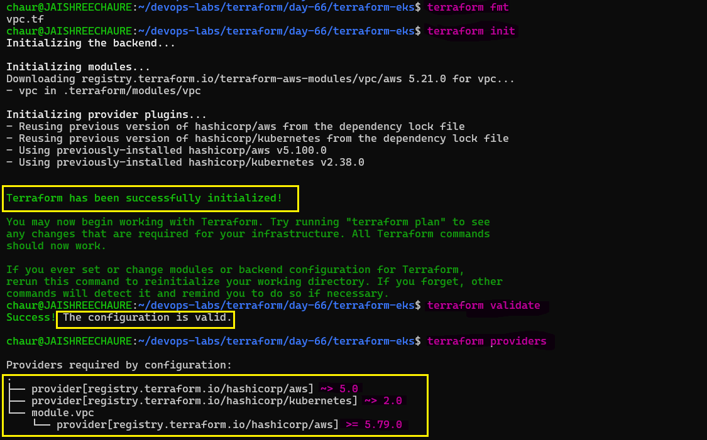 

Reviewed the Terraform execution plan before creating the infrastructure:

```bash
terraform plan
```
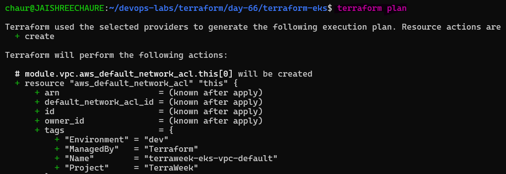 

Applied the VPC configuration:

```bash
terraform apply
```
Terraform successfully created the VPC infrastructure.

```text
Apply complete! Resources: 19 added, 0 changed, 0 destroyed.
```
The VPC, public and private subnets, Internet Gateway, NAT Gateway, route tables, security groups, and required networking resources were created successfully.

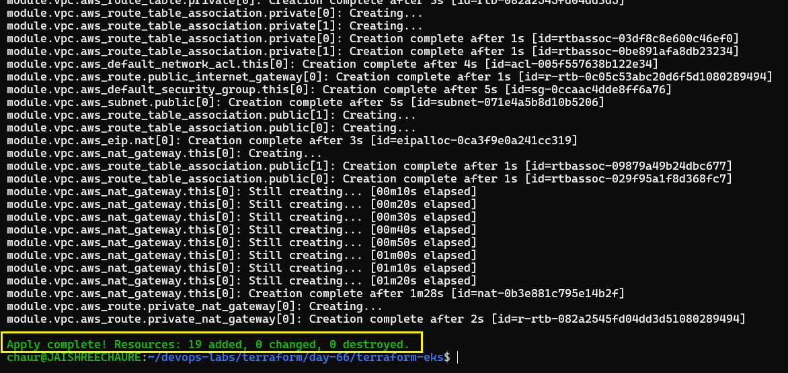

**Document:** Why does EKS need both public and private subnets? What do the subnet tags do?

### Why both?

- **Private subnets:** Run EKS nodes and workloads without direct inbound internet access.
- **Public subnets:** Host internet-facing load balancers.

### What do the tags do?

- `kubernetes.io/role/elb` → tells AWS to use these public subnets for external load balancers.
- `kubernetes.io/role/internal-elb` → tells AWS to use these private subnets for internal load balancers.

---

## Task 3: Create the EKS Cluster with Registry Module

In `eks.tf`, use the `terraform-aws-modules/eks/aws` module:

```hcl
data "aws_caller_identity" "current" {}

module "eks" {
  source  = "terraform-aws-modules/eks/aws"
  version = "~> 20.0"

  cluster_name    = var.cluster_name
  cluster_version = var.cluster_version

  vpc_id     = module.vpc.vpc_id
  subnet_ids = module.vpc.private_subnets

  authentication_mode = "API"

  cluster_endpoint_public_access  = true
  cluster_endpoint_private_access = true

  access_entries = {
    terraform_user = {
      principal_arn = data.aws_caller_identity.current.arn

      policy_associations = {
        cluster_admin = {
          policy_arn = "arn:aws:eks::aws:cluster-access-policy/AmazonEKSClusterAdminPolicy"

          access_scope = {
            type = "cluster"
          }
        }
      }
    }
  }

  eks_managed_node_groups = {
    terraweek_nodes = {
      ami_type       = "AL2023_x86_64_STANDARD"
      instance_types = [var.node_instance_type]

      min_size     = 1
      max_size     = 3
      desired_size = var.node_desired_count
    }
  }

  tags = {
    Environment = "dev"
    Project     = "TerraWeek"
    ManagedBy   = "Terraform"
  }
}
```
### Key Configuration

- `module.vpc.vpc_id` → Connects the EKS cluster to the VPC created in Task 2.
- `module.vpc.private_subnets` → Places EKS worker nodes in private subnets.
- `authentication_mode = "API"` → Uses the EKS Access Entry API for cluster authentication.
- `data.aws_caller_identity.current.arn` → Dynamically identifies the IAM identity running Terraform.
- `access_entries` → Grants the current IAM identity access to the EKS cluster.
- `AmazonEKSClusterAdminPolicy` → Provides cluster-wide administrative access for this lab.
- `AL2023_x86_64_STANDARD` → Uses Amazon Linux 2023 for the managed nodes.

Run:
```bash
terraform init      
terraform validate
terraform plan      
```
Review the plan carefully before applying. The plan should include the EKS cluster, IAM roles, managed node group, security groups, Access Entry, policy association, KMS resources, and other supporting resources.

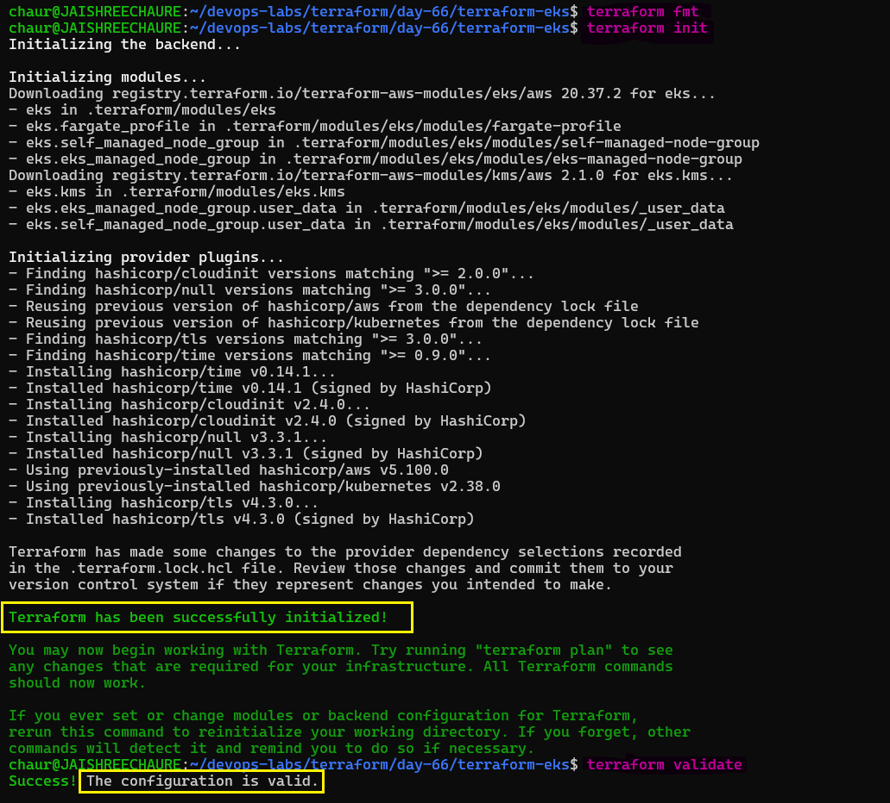 

Reviewed the EKS Terraform plan:

```text
Plan: 38 to add, 0 to change, 0 to destroy.
```
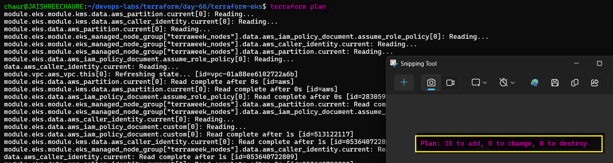

---

## Task 4: Apply and Connect kubectl

Apply the Terraform configuration to provision the EKS cluster and its required AWS resources.

1. Apply the config:
```bash
terraform apply
```
EKS cluster creation can take several minutes — be patient.

2. Add outputs in `outputs.tf`:
```hcl
output "cluster_name" {
  value = module.eks.cluster_name
}

output "cluster_endpoint" {
  value = module.eks.cluster_endpoint
}

output "cluster_region" {
  value = var.region
}
```
### Verification

The EKS cluster and its supporting AWS resources were successfully created.

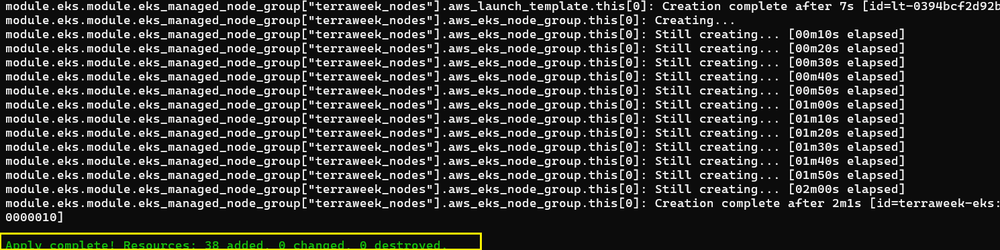 

3. Connect your local kubectl to the EKS cluster:
```bash
aws eks update-kubeconfig --name terraweek-eks --region us-east-1
```
4. Verify the active Kubernetes context:

```bash
kubectl config current-context
```
5. Then verify the cluster:
```bash
kubectl get nodes
kubectl get pods -A
kubectl cluster-info
```
The cluster showed 2 nodes in `Ready` state, and the `kube-system` pods were running successfully.

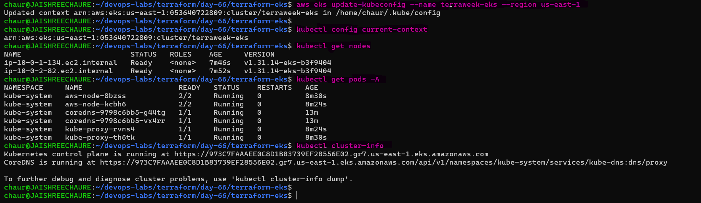 

Verify the AWS infrastructure created by Terraform, including the EKS VPC, subnets, route tables, and network connections.

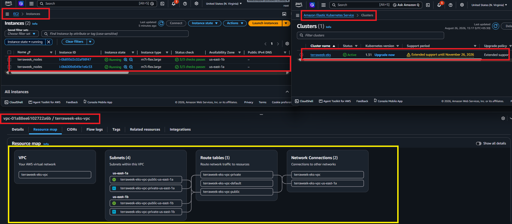

**Verify:** Do you see 2 nodes in `Ready` state? Can you see the kube-system pods running?

- Yes, both nodes are in the `Ready` state, and all `kube-system` pods are running.

---

## Task 5: Deploy a Workload on the Cluster

The Terraform-provisioned EKS cluster is now running. Deploy an Nginx workload and expose it through an AWS LoadBalancer.

1. Create a file `k8s/nginx-deployment.yaml`:
```yaml
apiVersion: apps/v1
kind: Deployment
metadata:
  name: nginx
  labels:
    app: nginx
spec:
  replicas: 3
  selector:
    matchLabels:
      app: nginx
  template:
    metadata:
      labels:
        app: nginx
    spec:
      containers:
      - name: nginx
        image: nginx:latest
        ports:
        - containerPort: 80
---
apiVersion: v1
kind: Service
metadata:
  name: nginx-service
spec:
  type: LoadBalancer
  selector:
    app: nginx
  ports:
  - port: 80
    targetPort: 80
```

2. Apply the Kubernetes manifest:
```bash
kubectl apply -f k8s/nginx-deployment.yaml
```
3. Verify the Deployment and Pods:

```bash
kubectl get deployment nginx
kubectl get pods -o wide
```
4. Verify the LoadBalancer Service:

```bash
kubectl get svc nginx-service
```
Wait for the AWS LoadBalancer endpoint to become available if it initially shows `<pending>`.

### Verification

The Nginx Deployment was created successfully with 3 replicas, and all Pods reached the `Running` state.

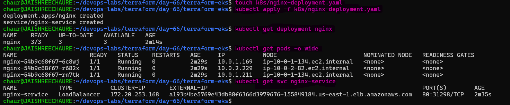 

The `nginx-service` received an AWS LoadBalancer DNS endpoint.

Verified connectivity using `curl`:

```bash
curl -I http://<load-balancer-dns>
```
The request returned: 

```text
HTTP/1.1 200 OK
Server: nginx/1.31.4
Content-Type: text/html
```
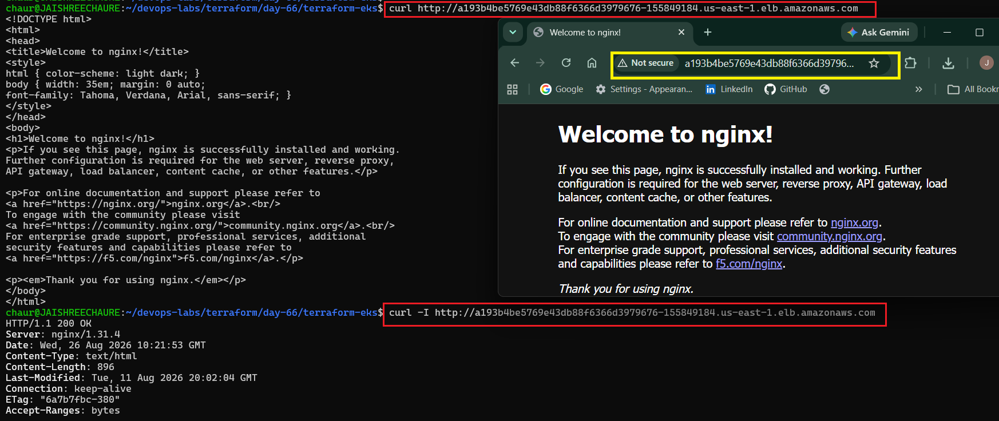

The Nginx welcome page was also successfully accessed through the LoadBalancer URL in the browser.


**Verify:** Can you access the Nginx welcome page through the LoadBalancer URL?

- Yes, the Nginx welcome page was accessible, and the LoadBalancer returned `HTTP` 200 OK.

---

## Task 6: Destroy Everything

EKS and NAT Gateway resources can incur AWS charges, so clean up the entire environment after completing the lab.

1. First, remove the Kubernetes resources (so the AWS LoadBalancer gets deleted):
```bash
kubectl delete -f k8s/nginx-deployment.yaml
```
### Verification

The Nginx Deployment and LoadBalancer Service were removed successfully.

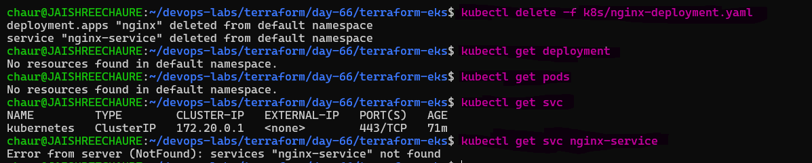 

2. Wait for the AWS LoadBalancer to be fully removed before destroying the underlying Terraform infrastructure.

3. Destroy all Terraform resources:
```bash
terraform destroy
```
This will take 10-15 minutes.

4. Verify in the AWS console:
   - EKS clusters: empty
   - EC2 instances: no node group instances
   - VPC: the terraweek VPC should be gone
   - NAT Gateways: deleted
   - Elastic IPs: released

Terraform successfully destroyed the complete infrastructure:

```text
Destroy complete! Resources: 57 destroyed.
```
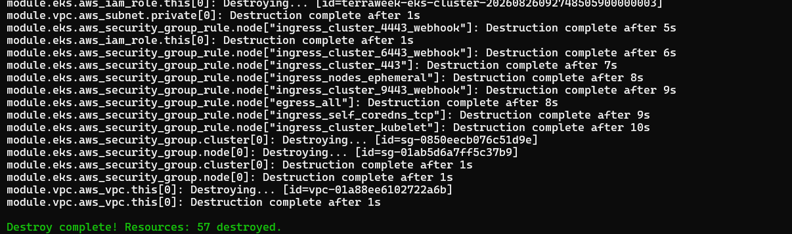 

Verified the AWS resources were removed successfully.

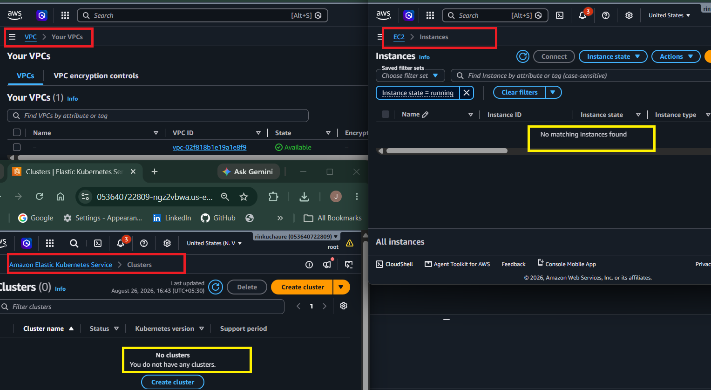

**Verify:** Is your AWS account completely clean? No leftover resources?

- Yes, the EKS cluster, node group, VPC, NAT Gateway, Elastic IPs, and other lab resources were successfully removed.

---

## Complete File Structure and Key Configuration Files

```text
terraform-eks/
├── eks.tf                         # EKS module and Access Entry configuration
├── k8s/
│   └── nginx-deployment.yaml      # Kubernetes Deployment and LoadBalancer Service
├── outputs.tf                     # EKS cluster outputs
├── providers.tf                   # Terraform provider configuration
├── terraform.tfstate              # Terraform state file
├── terraform.tfstate.backup       # Terraform state backup
├── terraform.tfvars               # Variable values
├── tfplan                         # Saved Terraform plan
├── variables.tf                   # Input variables
└── vpc.tf                         # VPC module configuration
```
### Terraform Resource Count

Terraform created a total of 57 resources during the lab lifecycle.

All 57 Terraform-managed resources were successfully destroyed during cleanup.

---

## Local Cluster Manual Setup vs Terraform + EKS

| **Local Cluster** | **Production-Grade Cluster** |
|---|---|
| Manual setup | Automated (IaC with Terraform) |
| Not reusable | Reusable |
| Not scalable | Scalable |
| No IAM integration | IAM integrated (Amazon EKS) |
| Limited availability | Highly available |
| Runs on local machine | Runs on AWS cloud |
| Free | Paid |
| Basic networking | Advanced VPC networking |
| Learning/testing | Production workloads |

## Challenges Faced and Fixes

| **Challenge** | **Cause** | **Fix** |
|---|---|---|
| `kubectl get nodes` fails with "the server has asked for the client to provide credentials" | IAM user has AWS permissions but is not mapped to the EKS cluster | Add `access_entries` in the Terraform v20 module using `data.aws_caller_identity.current.arn`, run `terraform apply`, then refresh kubeconfig with `aws eks update-kubeconfig` |

## Configuration

| **Configuration** | **Description** |
|---|---|
| `data "aws_caller_identity" "current"` | Fetches current IAM user/role details from AWS |
| `principal_arn` | Uses the current IAM identity ARN for cluster access |
| `access_entries` | Maps the IAM identity to EKS cluster access |
| `policy_arn` | Grants admin access using an Amazon EKS cluster access policy |
| `access_scope` | Defines the access level as cluster-wide |