# Day 67 -- TerraWeek Capstone: Multi-Environment Infrastructure with Workspaces and Modules

## Task 1: Learn Terraform Workspaces

Before building the project, I first created and explored Terraform workspaces to understand how Terraform separates state between environments.

```bash
mkdir terraweek-capstone && cd terraweek-capstone

terraform init

# See current workspace
terraform workspace show
# default

# Create new workspaces
terraform workspace new dev
terraform workspace new staging
terraform workspace new prod

# List all workspaces
terraform workspace list

# Switch between workspaces
terraform workspace select dev
terraform workspace select staging
terraform workspace select prod
```

### Step 1 - Workspaces Created

Created separate `dev`, `staging`, and `prod` workspaces to isolate environment state.

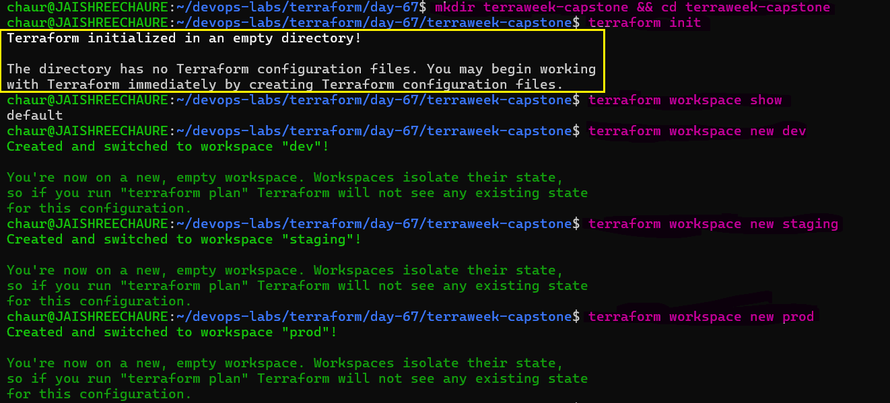

### Step-2 - Switching Between Workspaces

Switched between workspaces to verify that Terraform can manage each environment independently.

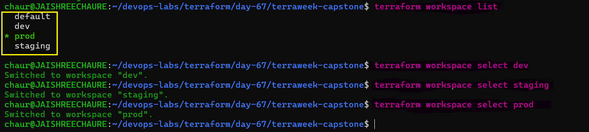

### Answers

**1. What does `terraform.workspace` return inside a config?**

- Returns the name of the currently selected Terraform workspace.

**2. Where does each workspace store its state file?**

- Each workspace has a separate state under `terraform.tfstate.d/<workspace>/` when using the local backend.

**3. How is this different from using separate directories per environment?**

- **Workspaces:** One codebase, multiple environments with separate state.
- **Directories:** Separate directories/codebases for each environment.

---

## Task 2: Set Up the Project Structure

To keep the Terraform project modular, reusable, and easy to manage, I created a structured directory layout with separate modules for networking, security, and compute resources.

```
terraweek-capstone/
  main.tf                   # Root module -- calls child modules
  variables.tf              # Root variables
  outputs.tf                # Root outputs
  providers.tf              # AWS provider and backend
  locals.tf                 # Local values using workspace
  dev.tfvars                # Dev environment values
  staging.tfvars            # Staging environment values
  prod.tfvars               # Prod environment values
  .gitignore                # Ignore state, .terraform, tfvars with secrets
  modules/
    vpc/
      main.tf
      variables.tf
      outputs.tf
    security-group/
      main.tf
      variables.tf
      outputs.tf
    ec2-instance/
      main.tf
      variables.tf
      outputs.tf
```

### Step-1 Project Structure Created

Created the root configuration files and reusable child modules for VPC, Security Group, and EC2 resources.

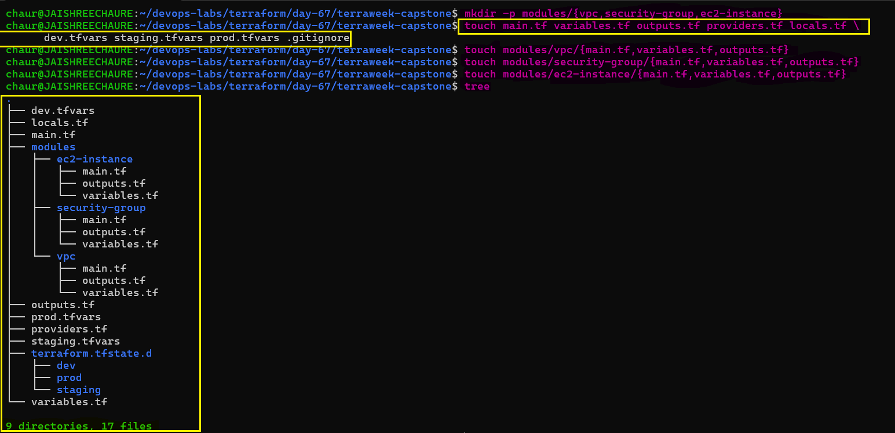

### Step-2 .gitignore Configuration

Added a `.gitignore` file to prevent Terraform state files, local cache, and sensitive values from being committed to Git.

```gitignore
.terraform/
*.tfstate
*.tfstate.backup
*.tfvars
.terraform.lock.hcl
```
### Why is this file structure considered best practice?

This structure keeps the Terraform project clean, modular, and easy to manage.

- Separate `main.tf`, `variables.tf`, and `outputs.tf` files keep the configuration organized.
- **Modules** make the infrastructure reusable and reduce code duplication.
- Separate `.tfvars` files support `dev`, `staging`, and `prod` with environment-specific values.
- `.gitignore` prevents Terraform state files and sensitive configuration from being committed.
- Overall, the structure improves **reusability, maintainability, and security** for real-world IaC projects.

---

## Task 3: Build the Custom Modules

Create three focused Terraform modules:

### Module 1: `modules/vpc/`

- **Inputs:** `cidr`, `public_subnet_cidr`, `environment`, `project_name`
- **Resources:** VPC, public subnet, Internet Gateway, route table, and association
- **Outputs:** `vpc_id`, `subnet_id`
- Tag resources with the environment and project name.

### Module 2: `modules/security-group/`

- **Inputs:** `vpc_id`, `ingress_ports`, `environment`, `project_name`
- **Resources:** Security group with dynamic ingress rules and allow-all egress
- **Output:** `sg_id`

### Module 3: `modules/ec2-instance/`

- **Inputs:** `ami_id`, `instance_type`, `subnet_id`, `security_group_ids`, `environment`, `project_name`
- **Resource:** EC2 instance with environment and project tags
- **Outputs:** `instance_id`, `public_ip`

### Validate the Modules

After creating the modules, format and validate the configuration:

```bash
terraform fmt -recursive
terraform validate
```
> **Note:** Formatting keeps the code consistent, while validation catches Terraform configuration and module errors before deployment.

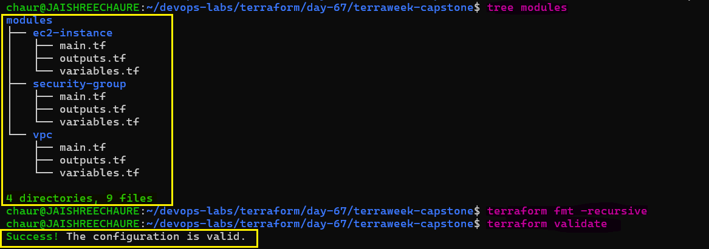 

### Initialize the Terraform Backend

Create the S3 bucket for remote Terraform state:

```bash
aws s3api create-bucket \
  --bucket terraweek-capstone-jaishree-2026 \
  --region us-east-1

aws s3api put-bucket-versioning \
  --bucket terraweek-capstone-jaishree-2026 \
  --versioning-configuration Status=Enabled

aws s3api put-bucket-encryption \
  --bucket terraweek-capstone-jaishree-2026 \
  --server-side-encryption-configuration \
  '{"Rules":[{"ApplyServerSideEncryptionByDefault":{"SSEAlgorithm":"AES256"}}]}'
```
### Verify the configuration:

```bash
aws s3api get-bucket-versioning \
  --bucket terraweek-capstone-jaishree-2026

aws s3api get-bucket-encryption \
  --bucket terraweek-capstone-jaishree-2026

aws s3 ls | grep terraweek-capstone
```
> **Note:** S3 provides centralized remote state storage, versioning helps recover previous state versions, and encryption protects the state data.

### Initialize and Validate Terraform

Now that the modules, `providers.tf`, and S3 remote backend are configured, initialize Terraform:

```bash
terraform init
terraform validate
```
> **Note:** `terraform init` connects the project to the S3 backend and initializes the modules and AWS provider. `terraform validate` confirms the configuration is syntactically valid.

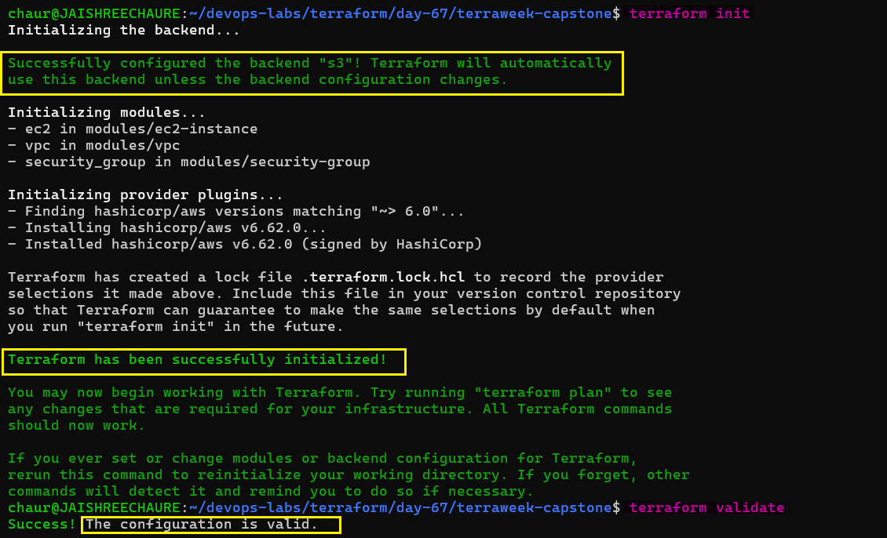 

### Recreate and Manage Workspaces

The workspaces were created in Task 1 for learning and testing, then deleted during cleanup. Now we recreate them for the actual capstone deployment:

> **Note:** Now the dev, staging, and prod workspaces will use the configured S3 backend to maintain separate Terraform state for each environment.

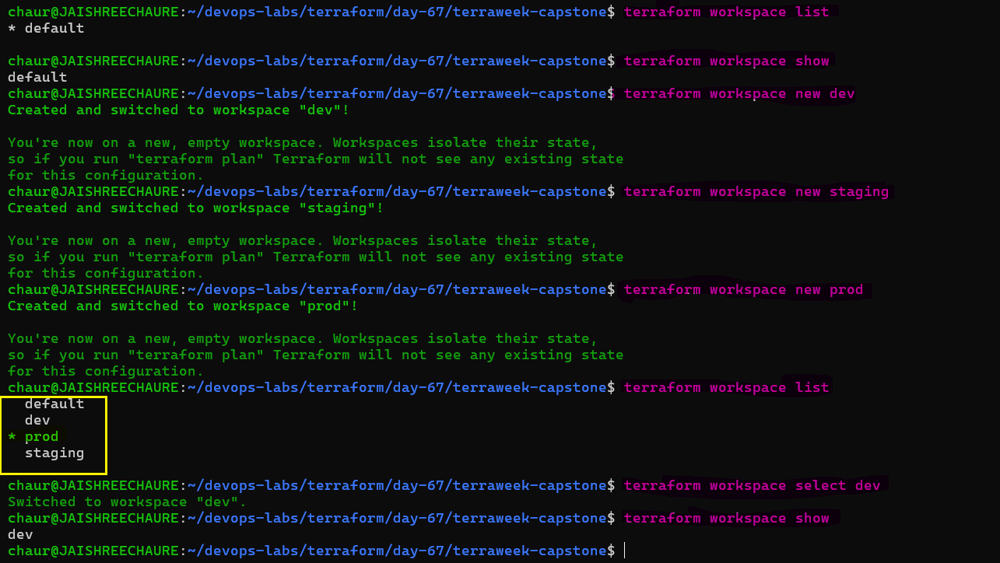

---

## Task 4: Wire It All Together with Workspace-Aware Config

Use `terraform.workspace` in the root module to drive environment-specific configuration.

**`locals.tf`:**
```hcl
locals {
  environment = terraform.workspace
  name_prefix = "${var.project_name}-${local.environment}"

  common_tags = {
    Project     = var.project_name
    Environment = local.environment
    ManagedBy   = "Terraform"
    Workspace   = terraform.workspace
  }
}
```

**`variables.tf`:**
```hcl
variable "project_name" {
  type    = string
  default = "terraweek"
}

variable "vpc_cidr" {
  type = string
}

variable "subnet_cidr" {
  type = string
}

variable "instance_type" {
  type = string
}

variable "ingress_ports" {
  type    = list(number)
  default = [22, 80]
}
```

**`main.tf`** -- Call the VPC, security-group, and EC2 modules, passing the required variables and workspace-aware values.

**Environment-specific tfvars:**

`dev.tfvars`:
```hcl
vpc_cidr      = "10.0.0.0/16"
subnet_cidr   = "10.0.1.0/24"
instance_type = "t3.micro"      # t3.micro used because t2.micro isn't available.
ingress_ports = [22, 80]
```

`staging.tfvars`:
```hcl
vpc_cidr      = "10.1.0.0/16"
subnet_cidr   = "10.1.1.0/24"
instance_type = "t3.small"      # More capacity for staging.
ingress_ports = [22, 80, 443]
```

`prod.tfvars`:
```hcl
vpc_cidr      = "10.2.0.0/16"
subnet_cidr   = "10.2.1.0/24"
instance_type = "c7i-flex.large" # Higher compute capacity for production.
ingress_ports = [80, 443]
```
> **Note:** The same Terraform code is reused across environments, while workspaces and .tfvars provide environment-specific state and configuration.

> **Key differences:** Dev allows SSH, prod does not. Separate CIDRs prevent network overlap, and instance types can scale based on the environment.

---

## Task 5: Deploy All Three Environments

Deploy each environment using its workspace and tfvars file:

**Dev:**
```bash
terraform workspace select dev
terraform workspace show
terraform plan -var-file="dev.tfvars"
terraform apply -var-file="dev.tfvars"
```

**Staging:**
```bash
terraform workspace select staging
terraform workspace show
terraform plan -var-file="staging.tfvars"
terraform apply -var-file="staging.tfvars"
```

**Prod:**
```bash
terraform workspace select prod
terraform workspace show
terraform plan -var-file="prod.tfvars"
terraform apply -var-file="prod.tfvars"
```
### Step-1 - Deploy All Three Environments

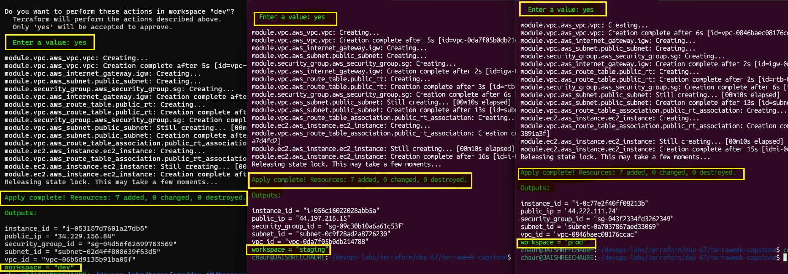 

### Step-2 - Verify Workspace Outputs

After all three are deployed, verify each workspace:

```bash
# Check each workspace's resources
terraform workspace select dev && terraform output
terraform workspace select staging && terraform output
terraform workspace select prod && terraform output
```
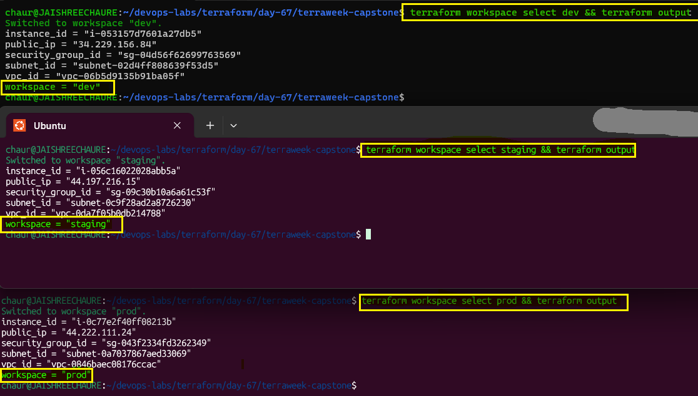 

### Step-3 - Verify Resources in AWS

Go to the AWS Console and verify:

- Three separate VPCs with different CIDR ranges
- Three EC2 instances with different instance types
- Different Name tags per environment: `terraweek-dev-server`, `terraweek-staging-server`, `terraweek-prod-server`

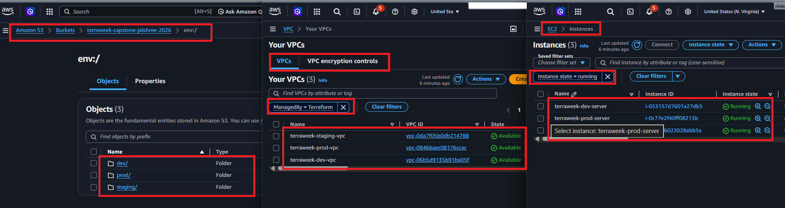

**Verify:** Are all three environments completely isolated from each other?

- Yes. Each environment has its own Terraform state, VPC, subnet, security group, and EC2 instance, providing separate infrastructure and network isolation.

---

## Task 6: Document Best Practices

Write down everything you have learned this week as a Terraform best practices guide:

1. **File Structure** — Separate files for each concern: `providers.tf`, `variables.tf`, `outputs.tf`, `locals.tf`, `main.tf`

2. **State Management** — Remote S3 backend with `encrypt = true`, `use_lockfile = true`. Each workspace maintains separate state under `env:/<workspace>/terraweek-capstone/terraform.tfstate`

3. **Variables** — Avoid hardcoding values. Use `dev.tfvars`, `staging.tfvars`, and `prod.tfvars` per environment.

4. **Modules** — One concern per module: `vpc/` (networking), `security-group/` (access control), `ec2-instance/` (compute). Each module has `main.tf`, `variables.tf`, and `outputs.tf`

5. **Workspaces** — Use `dev`, `staging`, and `prod` workspaces. `terraform.workspace` drives the environment through `locals.tf`. One codebase, three environments.

6. **Security** — `.gitignore` excludes `*.tfvars`, `*.tfstate`, and `.terraform/`. State is encrypted at rest. No credentials are hardcoded.

7. **Commands** — Follow `terraform fmt` → `validate` → `plan` → `apply`. Never skip `plan`.

8. **Tagging** — Tag every resource with `Environment`, `Project`, and `ManagedBy = "Terraform"`.

9. **Naming** — Use consistent environment-based names, e.g. `terraweek-dev-server`, `terraweek-staging-server`, `terraweek-prod-server`.

10. **Cleanup** — Run `terraform destroy` for non-production environments when they are no longer needed to avoid unnecessary AWS costs.

---

## Task 7: Destroy All Environments

Clean up all three environments in reverse order:

```bash
terraform workspace select prod
terraform workspace show
terraform destroy -var-file="prod.tfvars"

terraform workspace select staging
terraform workspace show
terraform destroy -var-file="staging.tfvars"

terraform workspace select dev
terraform workspace show
terraform destroy -var-file="dev.tfvars"
```

### Step-1 - Destroy All Environment Resources

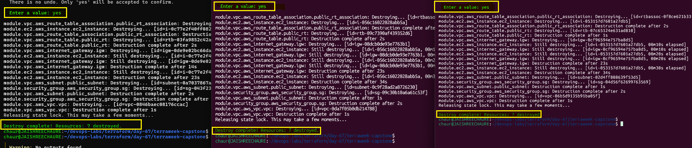 

> **Note:** Destroying in reverse order provides a controlled cleanup of the environments, starting with production.

### Step-2 - Verify AWS Resources Are Removed

Verify in the AWS Console that all Terraform-managed VPCs, EC2 instances, security groups, and gateways are removed.

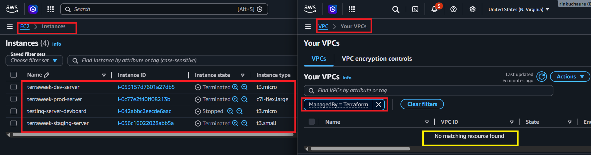 

### Step-3 - Delete the Workspaces:

```bash
terraform workspace select default
terraform workspace show
terraform workspace delete dev
terraform workspace delete staging
terraform workspace delete prod
```

### Step-4 - 4 - Verify Workspace Cleanup

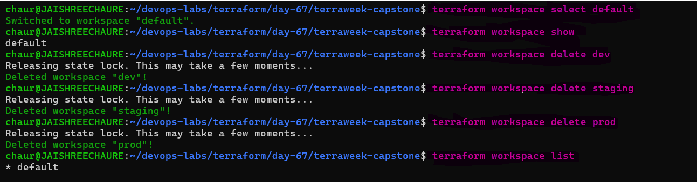

> **Note:** After destroying the infrastructure, the environment workspaces can be safely removed, leaving only the default workspace.

**Verify:** Is your AWS account completely clean?

- Yes. All Terraform-managed resources were destroyed, and the `dev`, `staging`, and `prod` workspaces were deleted, leaving only the `default` workspace.

---

## Complete Project Structure

```text
terraweek-capstone/
├── main.tf                    # Root module — calls all 3 child modules
├── variables.tf               # Input variables with validation blocks
├── outputs.tf                 # Root outputs — VPC, subnet, SG, instance, public IP
├── providers.tf               # AWS provider + S3 remote backend
├── locals.tf                  # Workspace-aware locals — environment, name prefix, tags
├── dev.tfvars                 # Dev environment values
├── staging.tfvars             # Staging environment values
├── prod.tfvars                # Prod environment values
├── .gitignore                 # Ignores .terraform/, *.tfstate, *.tfvars
└── modules/
    ├── vpc/
    │   ├── main.tf            # VPC, subnet, Internet Gateway, route table + association
    │   ├── variables.tf       # cidr, public_subnet_cidr, environment, project_name
    │   └── outputs.tf         # vpc_id, subnet_id
    ├── security-group/
    │   ├── main.tf            # Security group — dynamic ingress + allow-all egress
    │   ├── variables.tf       # vpc_id, ingress_ports, environment, project_name
    │   └── outputs.tf         # sg_id
    └── ec2-instance/
        ├── main.tf            # EC2 instance with environment and project tags
        ├── variables.tf       # ami_id, instance_type, subnet_id, security_group_ids,
        │                       # environment, project_name
        └── outputs.tf         # instance_id, public_ip
```
---

## Three tfvars Files — Differences Highlighted

```hcl
# ── dev.tfvars ─────────────────────────────────────
vpc_cidr      = "10.0.0.0/16"
subnet_cidr   = "10.0.1.0/24"
instance_type = "t3.micro"          
ingress_ports = [22, 80]            # SSH allowed for development

# ── staging.tfvars ─────────────────────────────────
vpc_cidr      = "10.1.0.0/16"      # different CIDR — no overlap with dev
subnet_cidr   = "10.1.1.0/24"
instance_type = "t3.small"          
ingress_ports = [22, 80, 443]       # HTTPS added for staging tests

# ── prod.tfvars ────────────────────────────────────
vpc_cidr      = "10.2.0.0/16"      # different CIDR — no overlap with dev/staging
subnet_cidr   = "10.2.1.0/24"
instance_type = "c7i-flex.large"    
ingress_ports = [80, 443]           # NO SSH in prod — security hardened
```

| **Setting**        | **dev**        | **staging**     | **prod**         |
|--------------------|----------------|-----------------|------------------|
| `vpc_cidr`         | `10.0.0.0/16`  | `10.1.0.0/16`   | `10.2.0.0/16`    |
| `subnet_cidr`      | `10.0.1.0/24`  | `10.1.1.0/24`   | `10.2.1.0/24`    |
| `instance_type`    | `t3.micro`     | `t3.small`      | `c7i-flex.large` |
| `ingress_ports`    | `[22, 80]`     | `[22, 80, 443]` | `[80, 443]`      |
| SSH (port 22)      | Yes            | Yes             | No               |
| HTTPS (port 443)   | No             | Yes             | Yes              |

---

## TerraWeek Day-by-Day Concepts

| **Day** | **Concepts** |
|---------|--------------|
| 61 | IaC, HCL, `init`/`plan`/`apply`/`destroy`, state basics |
| 62 | Providers, resources, dependencies, lifecycle |
| 63 | Variables, outputs, data sources, locals, functions |
| 64 | Remote backend, locking, import, drift |
| 65 | Custom modules, Registry modules, versioning |
| 66 | EKS with modules, real-world provisioning |
| 67 | Workspaces, multi-environment, capstone project |