# Day 68 -- Introduction to Ansible and Inventory Setup

## Task 1: Understand Ansible

Research and write short notes on:

### 1. What is configuration management? Why do we need it?

- `Configuration Management` is the practice of automating the setup and management of servers using code.
- Instead of manually configuring each system, we define the desired setup and apply it automatically using tools like `Ansible`.

  `Why do we need it?`

  - We need Configuration Management because:
    - `Saves time` — No need to configure servers manually
    - `Ensures consistency` — All systems are set up the same way
    - `Reduces errors` — Automation avoids human mistakes
    - `Supports DevOps` — Helps with fast deployments and CI/CD pipelines

### 2. How is Ansible different from Chef, Puppet, and Salt?

- Ansible is **agentless and easy to use**, working over SSH with a simple YAML syntax. It primarily uses a **push model**.
- Chef and Puppet traditionally use a **pull model** and require agents on managed nodes.
- `Salt` supports **push and event-driven models** and commonly uses agents on managed nodes.
- Overall, **Ansible is simple and quick to set up**, while `Chef`, `Puppet`, and `Salt` provide different architectures and advanced capabilities.

### 3. What does "agentless" mean? How does Ansible connect to managed nodes?

- **Agentless** means that no dedicated Ansible agent needs to be installed or continuously running on the managed nodes.
- Ansible connects directly to managed nodes using:
  - **SSH** for Linux/Unix systems
  - **WinRM** for Windows systems
- Ansible uses the connection to execute tasks on the managed nodes and return the results to the control node.

### 4. Describe the Ansible architecture

- **Control Node** — the machine where Ansible runs (your EC2 control node)
  - Where Ansible is installed and where all commands and playbooks are run from.

- **Managed Nodes** — the servers Ansible configures (your EC2 instances)
  - The servers/instances Ansible manages. No Ansible agent needs to be installed.

- **Inventory** — the list of managed nodes
  - A file containing the list of managed nodes. It can define IP addresses, hostnames, connection details, and organize hosts into groups for easier management.

- **Modules** — units of work Ansible executes
  - Small programs Ansible uses to perform specific tasks on managed nodes (install a package, copy a file, start a service). Many modules are designed to be idempotent.

- **Playbooks** — YAML files that define what to do on which hosts
  - YAML files that define the workflow or configuration instructions. They describe the tasks to be executed on managed nodes.

```text
                 CONTROL NODE
              Ansible + Inventory
                       |
                       | SSH
          +------------+------------+
          |            |            |
          v            v            v
        WEB          APP           DB
      SERVER        SERVER        SERVER
    Managed Node  Managed Node  Managed Node
```

---

## Task 2: Set Up Your Lab Environment

I used **Option A: Terraform** to provision the lab environment.

The lab consists of **4 EC2 instances**:

- **Control Node** — the machine where Ansible runs
- **Web Server** — managed node
- **App Server** — managed node
- **DB Server** — managed node

All instances use **Amazon Linux 2023** and the **t3.micro** instance type.

### 1. Configure AWS Profile

```bash
export AWS_PROFILE=terraform
aws sts get-caller-identity
```
This confirms that the AWS CLI is using the expected IAM profile.

### 2. Generate SSH Key Pair

Generate an ED25519 SSH key pair for the lab:

```bash
ssh-keygen -t ed25519 -f ~/.ssh/day68-ansible-key -C "day68-ansible"
```
This creates:

- `~/.ssh/day68-ansible-key` — private key
- `~/.ssh/day68-ansible-key.pub` — public key

Verify the generated keys:

```bash
ls -l ~/.ssh/day68-ansible-key*
```

### 3. Verify the Amazon Linux AMI

Verify the AMI used by the Terraform configuration:

```bash
aws ec2 describe-images \
  --region us-east-1 \
  --image-ids ami-01b14b7ad41e17ba4 \
  --query 'Images[0].[ImageId,Name,State,Architecture,OwnerId]' \
  --output table
```
The AMI was verified as:

- AMI: ami-01b14b7ad41e17ba4
- OS: Amazon Linux 2023
- Architecture: x86_64
- State: available

### 4. Format, Initialize, and Validate Terraform

Initialize the Terraform working directory:

```bash
terraform fmt
terraform init
terraform validate
```
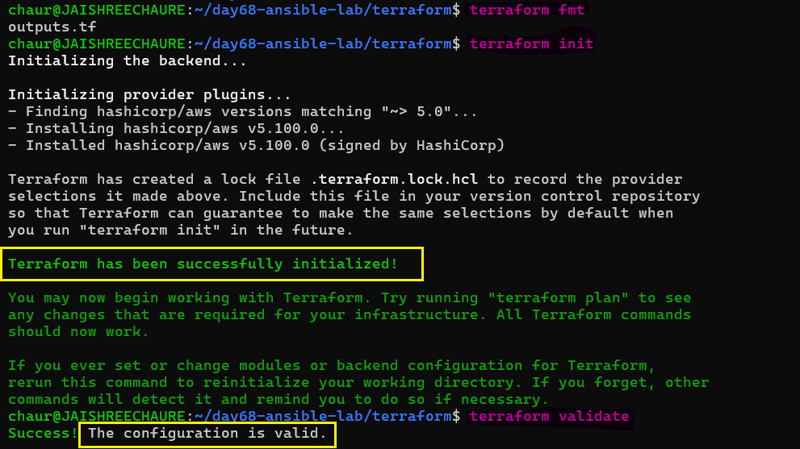 

```bash
terraform plan   
``` 
Terraform planned:

```bash
Plan: 7 to add, 0 to change, 0 to destroy.
```
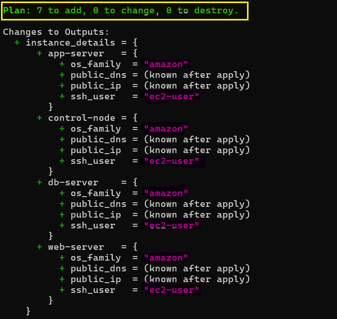 

```bash
terraform apply
```
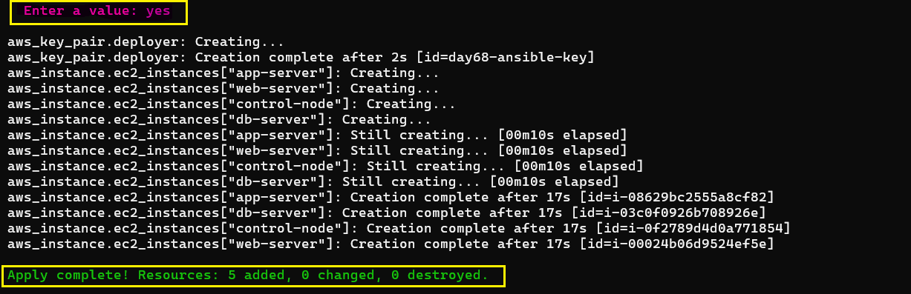

### 5. Verify EC2 Instances

The four EC2 instances were created successfully:

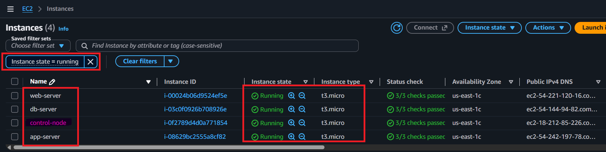

### 6. Configure the Control Node for SSH

Copy the private SSH key to the Control Node so that Ansible can use it to connect to the managed nodes:

```bash
scp -i ~/.ssh/day68-ansible-key \
  ~/.ssh/day68-ansible-key \
  ec2-user@<CONTROL_NODE_PUBLIC_IP>:/home/ec2-user/.ssh/
```
Connect to Control Node: 

```bash
ssh -i ~/.ssh/day68-ansible-key ec2-user@<CONTROL_NODE_IP>
```

Configure SSH Key Permissions: 

```bash
chmod 400 ~/.ssh/day68-ansible-key
ls -l ~/.ssh/day68-ansible-key
```

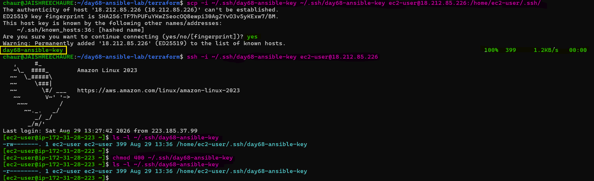

### 7. Verify SSH Connectivity from the Control Node

From the Control Node, verify SSH access to all three managed nodes:

```bash
ssh -i ~/.ssh/day68-ansible-key ec2-user@<WEB_SERVER_PUBLIC_IP>
ssh -i ~/.ssh/day68-ansible-key ec2-user@<APP_SERVER_PUBLIC_IP>
ssh -i ~/.ssh/day68-ansible-key ec2-user@<DB_SERVER_PUBLIC_IP>
```
SSH connectivity was successfully verified for: `web-server`, `app-server`, `db-server`

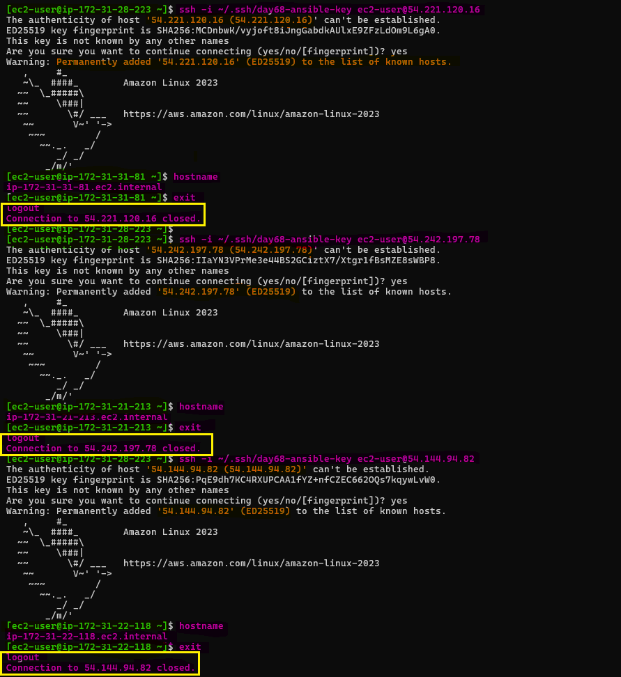

---

## Task 3: Install Ansible

Install Ansible on your **control node**. In this lab, the **control node is an EC2 instance running Amazon Linux 2023**.

Ansible is installed only on the control node because it it runs Ansible commands and playbooks and connects to managed nodes over SSH. The managed nodes do not require an Ansible agent.

### 1. Install Ansible

```bash
# Amazon Linux / RHEL
sudo dnf search ansible
sudo dnf install ansible -y
```
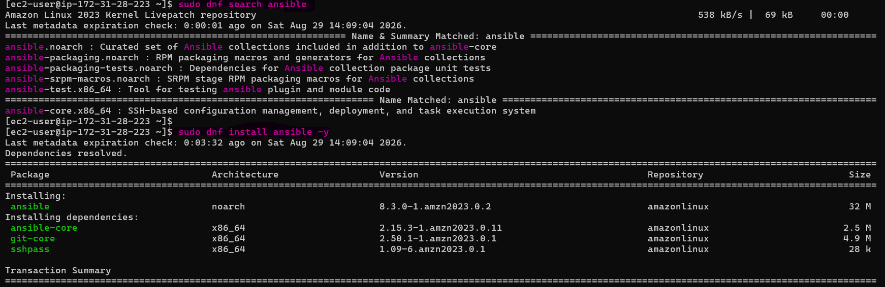 

### 2. Verify Ansible

```bash
ansible --version
```
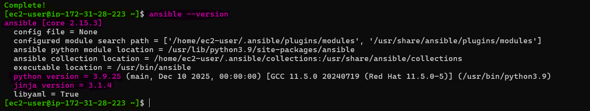

The installation completed successfully, and Ansible version `2.15.3` was verified.

- **Ansible:** `core 2.15.3`
- **Python:** `3.9.25`
- **Executable:** `/usr/bin/ansible`
- **Config file:** `None` at this stage

**Document:** On which machine did you install Ansible? Why is it only needed on the control node?

- Ansible was installed on the **control node EC2 instance** because it connects to managed nodes over SSH and executes tasks remotely. Managed nodes do not require an Ansible agent.

---

## Task 4: Create Your Inventory File

The inventory tells Ansible which servers to manage. Create a project directory and your first inventory:

```bash
mkdir ansible-practice && cd ansible-practice
```

Create a file called `inventory.ini`:
```ini
[web]
web-server ansible_host=<WEB_SERVER_PUBLIC_IP>

[app]
app-server ansible_host=<APP_SERVER_PUBLIC_IP>

[db]
db-server ansible_host=<DB_SERVER_PUBLIC_IP>

[all:vars]
ansible_user=ec2-user
ansible_ssh_private_key_file=~/.ssh/day68-ansible-key
ansible_python_interpreter=/usr/bin/python3.9
```
This inventory groups the managed nodes into `web`, `app`, and `db` and defines the SSH user, private key, and Python interpreter.

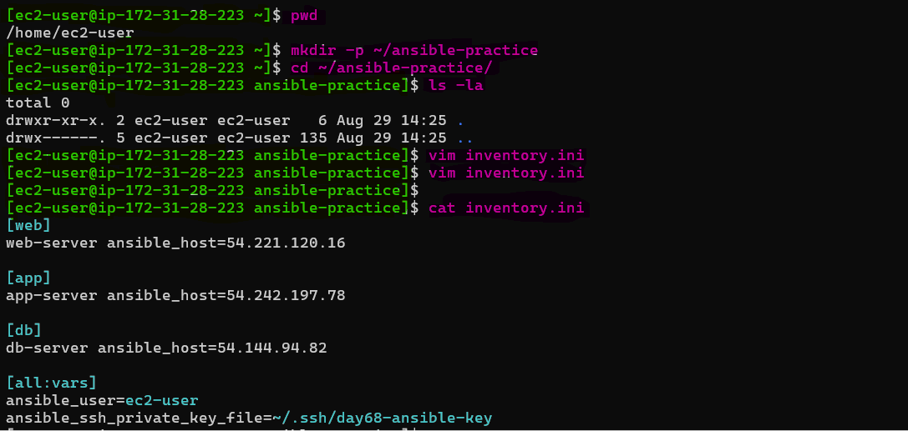 

### 1. Verify the Inventory Groups

Check the inventory group structure:

```bash
ansible-inventory -i inventory.ini --graph
```
This verifies the hosts and their connection variables defined in the inventory.

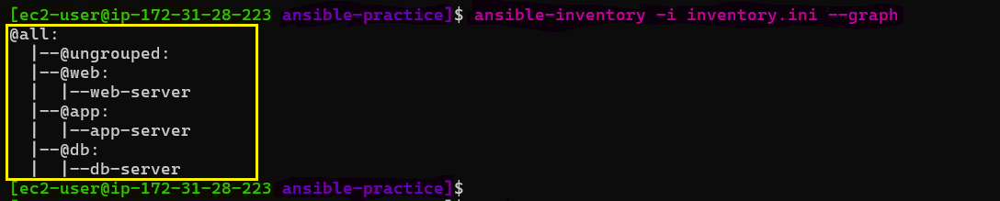

### 2. Verify the inventory details:

Display the complete inventory information:

```bash
ansible-inventory -i inventory.ini --list
```
This verifies the hosts and their connection variables defined in the inventory.

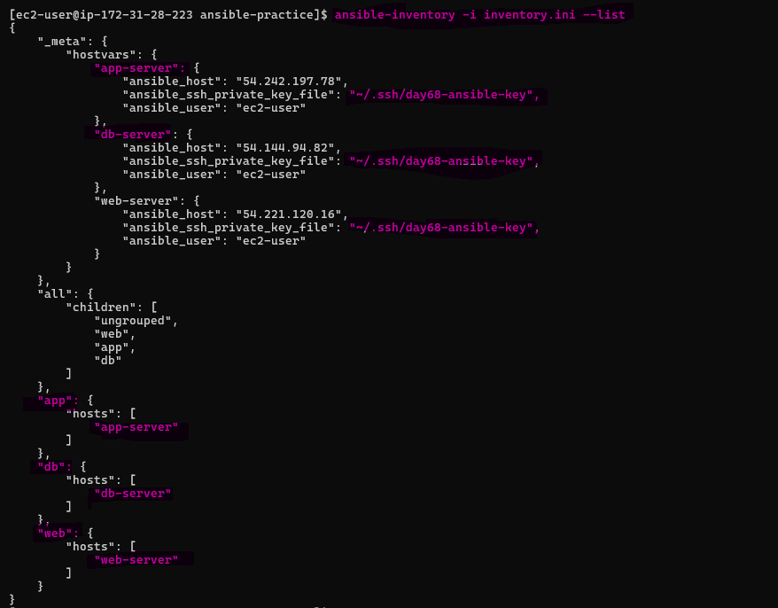 

### 3. Verify Ansible Can Reach All Hosts

Test connectivity to all managed nodes

```bash
ansible all -i inventory.ini -m ping
```
Ansible should return green `SUCCESS` with `"ping": "pong"` for each host.

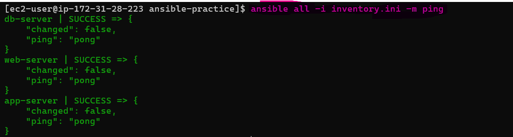

You should see green `SUCCESS` with `"ping": "pong"` for each host.

**Troubleshoot:** If ping fails:
- Check the SSH key path and permissions `(chmod 400 ~/.ssh/day68-ansible-key)`
- Check the security group allows SSH from your IP
- Check the `ansible_user` matches your AMI (`ec2-user` for Amazon Linux, `ubuntu` for Ubuntu)

---

## Task 5: Run Ad-Hoc Commands

Ad-hoc commands let you run quick one-off tasks without writing a playbook.

### 1. Check uptime on all servers

Check the system uptime of all managed nodes:

```bash
ansible all -i inventory.ini -m command -a "uptime"
```
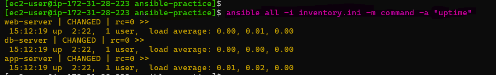 

### 2. Check free memory on web servers only

Check the available and used memory on the web `group`:

```bash
ansible web -i inventory.ini -m command -a "free -h"
```
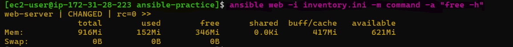 

### 3. Check disk space on all servers

Check disk usage on all managed nodes:

```bash
ansible all -i inventory.ini -m command -a "df -h"
```
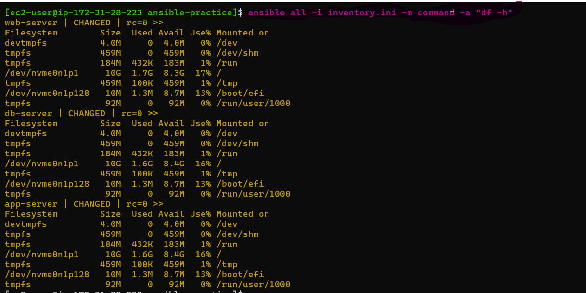 

### 4. Install a package on the web group

Install Git on the `web` server using the `yum` module with elevated privileges:

```bash
ansible web -i inventory.ini -m yum -a "name=git state=present" --become
```
(Use `apt` instead of `yum` if running Ubuntu)

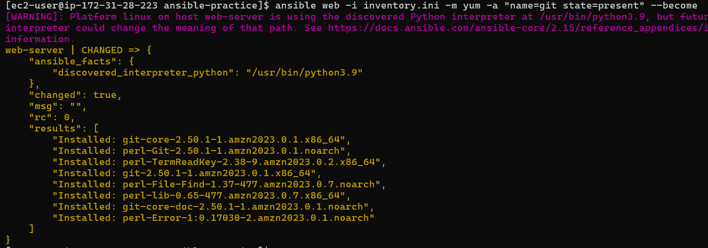

### 5. Copy a file to all servers

Create a file on the control node and copy it to all managed nodes:

```bash
echo "Hello from Ansible" > hello.txt
ansible all -i inventory.ini -m copy -a "src=hello.txt dest=/tmp/hello.txt"
```
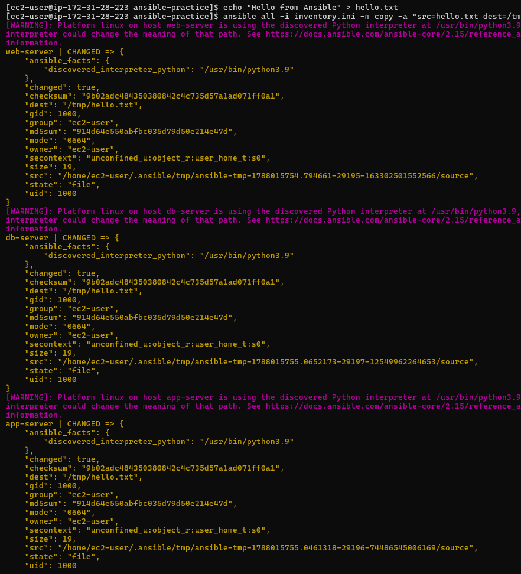 

### 6. Verify the file was copied

Read the copied file from all managed nodes to verify the content:

```bash
ansible all -i inventory.ini -m command -a "cat /tmp/hello.txt"
``` 
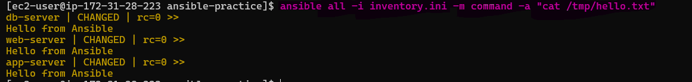

**Document:** What does `--become` do? When do you need it?

- `--become` allows Ansible to execute a task with elevated privileges, usually using `sudo`.
- It is needed when the task requires administrative/root permissions, such as installing packages, modifying system files, or managing services.

---

## Task 6: Explore Inventory Groups and Patterns

### 1. Create a group of groups

Add the following to your `inventory.ini`:
```ini
[application:children]
web
app

[all_servers:children]
application
db
```
This creates higher-level groups so `application` contains the `web` and `app` groups, while `all_servers` contains `application` and `db`.

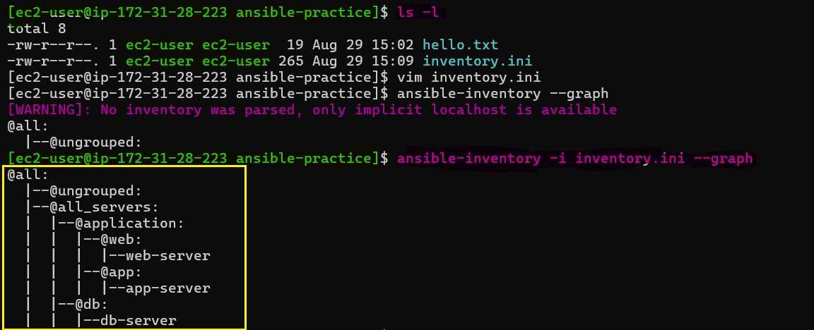 

### 2. Run commands against different groups

Test different inventory groups to understand how group targeting works:

```bash
ansible application -i inventory.ini -m ping     # web + app servers
ansible db -i inventory.ini -m ping               # only db server
ansible all_servers -i inventory.ini -m ping      # everything
```
The `application` group targets the web and app servers, `db` targets only the DB server, and `all_servers` targets all managed nodes.

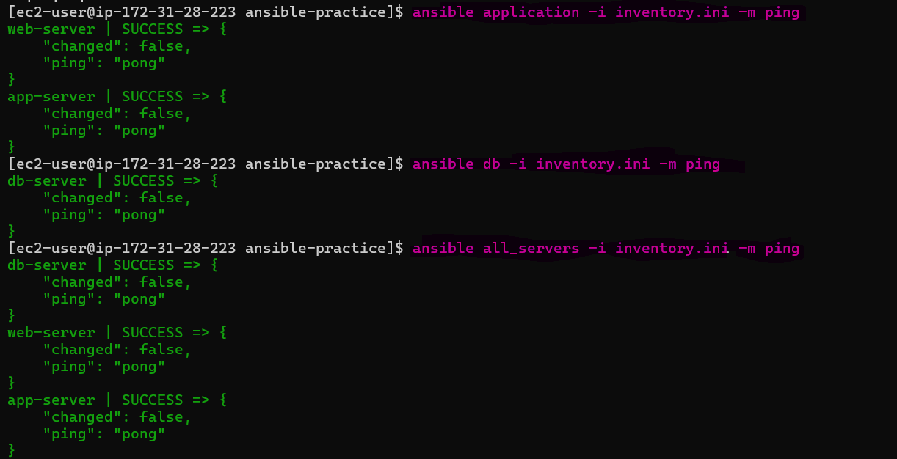

### 3. Use patterns

Use patterns to target multiple groups or exclude specific groups:

```bash
ansible 'web:app' -i inventory.ini -m ping        # OR: web or app
ansible 'all:!db' -i inventory.ini -m ping        # NOT: all except db
```
The `web:app` pattern targets the web or app groups, while `all:!db` targets all hosts except the DB server.

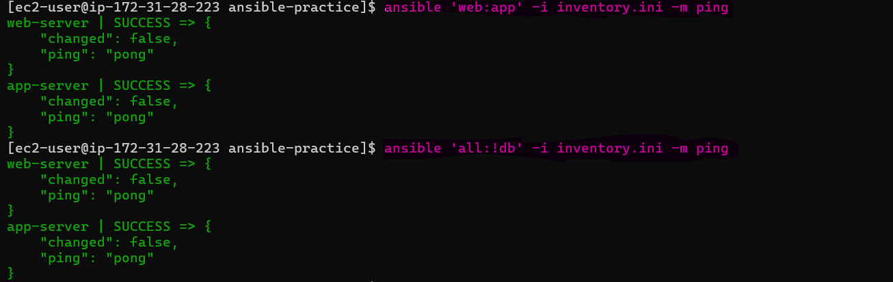 

### 4. Create an ansible.cfg

Create an `ansible.cfg` to avoid typing `-i inventory.ini` every time: `vim ansible.cfg`

```ini
[defaults]
inventory = inventory.ini
host_key_checking = False
remote_user = ec2-user
private_key_file = ~/your-key.pem
```
This configuration tells Ansible which inventory and SSH settings to use by default.

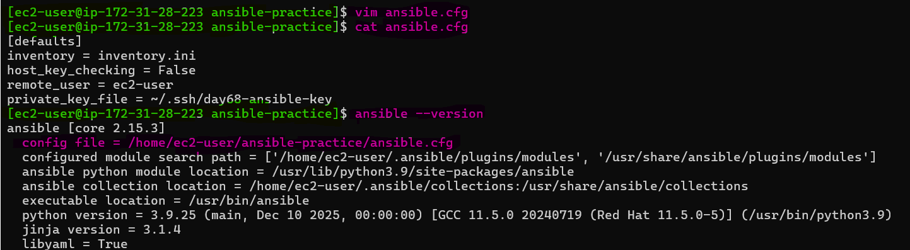

Now you can simply run:

```bash
ansible all -m ping
``` 
This verifies that Ansible automatically uses the `inventory.ini` specified in `ansible.cfg`.

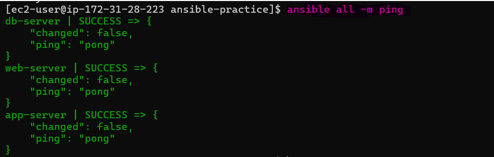 

**Verify:** Does `ansible all -m ping` work without specifying the inventory file?

- Yes, `ansible all -m ping` worked successfully without specifying the inventory file.

### 5. Destroy Terraform resources

After completing the Ansible tasks, Exit the Control Node: `exit`, return to the Terraform directory: `cd ~/day68-ansible-lab/terraform`

Check Terraform State : `terraform state list`

Expected resources:

```text
aws_default_vpc.default
aws_key_pair.deployer
aws_security_group.ec2_sg
aws_instance.ec2_instances["control-node"]
aws_instance.ec2_instances["web-server"]
aws_instance.ec2_instances["app-server"]
aws_instance.ec2_instances["db-server"]
```
This verifies the Terraform resources created for the lab before destroying them.

Run : `terraform destroy`

This removes the EC2 instances and other AWS resources created for the lab.

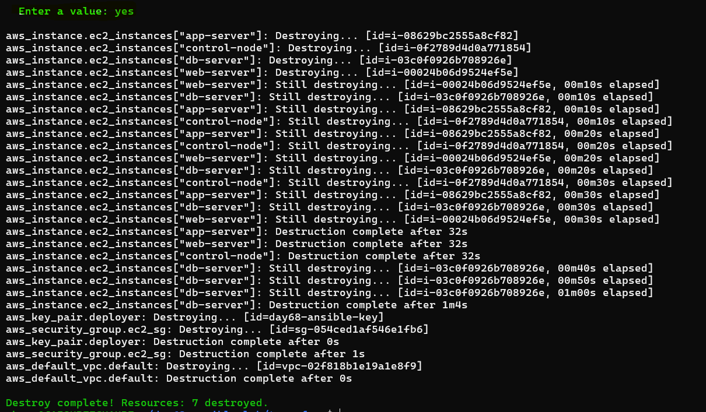

---

### Key Takeaways

- Ansible uses SSH by default — no agent installation is needed on managed nodes.
- `ansible.cfg` is read from the current directory first, then `~/.ansible.cfg`, then `/etc/ansible/ansible.cfg`.
- `-m` specifies the module, while `-a` specifies the module arguments.
- The `command` module runs simple commands, while the `shell` module supports pipes and redirects.
- Ad-hoc commands are great for quick tasks, but playbooks are better for anything repeatable.