# Day 69 — Ansible Playbooks and Modules

> Lab Setup: Reused the Day 68 Terraform infrastructure and existing `ansible-practice` files.

```bash
1. Copy Day 68 Infrastructure

cp -r ~/day-68-ansible-lab ~/day-69-ansible-lab
cd ~/day-69-ansible-lab/terraform

2. Configure AWS & Validate Terraform

export AWS_PROFILE=terraform
aws sts get-caller-identity
terraform fmt
terraform init
terraform validate
terraform apply

3. Get EC2 IPs

terraform output

4. Configure Ansible Control Node from Terraform Folder

scp -i ~/.ssh/day68-ansible-key ~/.ssh/day68-ansible-key ec2-user@<CONTROL_NODE_PUBLIC_IP>:/home/ec2-user/.ssh/
ssh -i ~/.ssh/day68-ansible-key ec2-user@<CONTROL_NODE_PUBLIC_IP>
chmod 400 ~/.ssh/day68-ansible-key

5. Install & Verify Ansible on Control Node

sudo dnf install ansible -y
ansible --version

6. Reuse Day 68 Ansible Files on control Node

ansible-practice/
├── ansible.cfg
└── inventory.ini

7. Verify Inventory & Connectivity on Control Node

mkdir -p ~/ansible-practice
cd ~/ansible-practice
ls -la
ansible all -m ping

Expected:

app-server | SUCCESS => {"changed": false, "ping": "pong"}
web-server | SUCCESS => {"changed": false, "ping": "pong"}
db-server  | SUCCESS => {"changed": false, "ping": "pong"}

> Once all three nodes return `pong`, the environment is ready.
```
---

## Task 1: Your First Playbook

The goal of this task is to create your `first Ansible playbook` and use it to configure the web server automatically.

The playbook will:

1. Install Nginx on the web server.
2. Start and enable the Nginx service.
3. Create a custom HTML page.

Create `install-nginx.yml`:

```yaml
---
- name: Install and start Nginx on web servers
  hosts: web
  become: true

  tasks:
    - name: Install Nginx
      yum:
        name: nginx
        state: present

    - name: Start and enable Nginx
      service:
        name: nginx
        state: started
        enabled: true

    - name: Create a custom index page
      copy:
        content: "<h1>Deployed by Ansible - TerraWeek Server</h1>"
        dest: /usr/share/nginx/html/index.html
```

> **Note:** Use `apt` instead of `yum` if your instances run Ubuntu.

### 1. Syntax Check

First, verify the playbook syntax before executing it.

```bash
ansible-playbook install-nginx.yml --syntax-check
```
### 2. Run the Playbook:

Run the playbook to configure the web server.

```bash
ansible-playbook install-nginx.yml
```
The playbook targets only the `web` group, so Nginx will be configured on the web server.

Read the output carefully -- every task shows `changed`, `ok`, or `failed`.

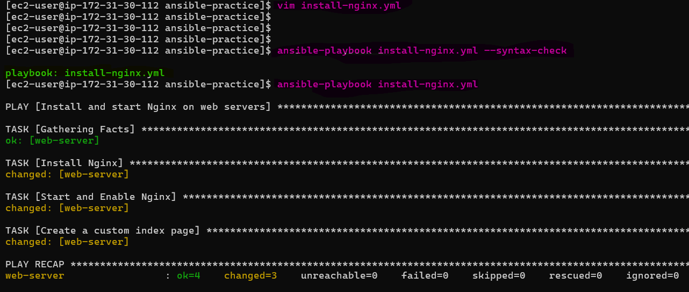 

Now run it **again**. Notice that tasks show `ok` instead of `changed`. This is **idempotency** -- Ansible only makes changes when needed.

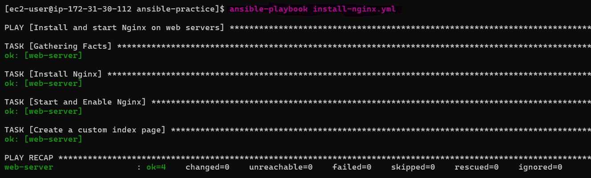

### 3. Verify the Deployment

Finally, use `curl` to confirm that the custom HTML page is being served by Nginx.

```bash
curl http://<WEB_SERVER_PUBLIC_IP>
```
- yes, the custom Ansible page is displayed.

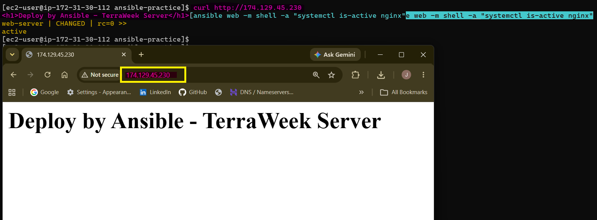

---

## Task 2: Understand the Playbook Structure

Open your playbook and annotate each part to understand how an Ansible playbook is structured:

```yaml
---                                    # YAML document start
- name: Play name                      # PLAY -- targets a group of hosts
  hosts: web                           # Which inventory group to run on
  become: true                         # Run tasks as root (sudo)

  tasks:                               # List of TASKS in this play
    - name: Task name                  # TASK -- one unit of work
      module_name:                     # MODULE -- what Ansible does
        key: value                     # Module arguments
```

### Answer:

### 1. What is the difference between a play and a task?

   - A `play` defines:
     - Which hosts to target
     - Which tasks or roles to apply
   - A `task` defines:
     - A single unit of work
     - Uses one Ansible module (such as `yum`, `copy`, or `service`)
     - Performs a specific action on the target hosts

### 2. Can you have multiple plays in one playbook?

   - Yes. A playbook can contain multiple plays.
   - Each play:
     - Targets a specific host group
     - Contains its own tasks
     - Runs independently in sequence

### 3. What does `become: true` do at the play level vs the task level?

   - `play level`:
     - Applies privilege escalation to ALL tasks in that play
   - `task level`:
     - Applies privilege escalation only to that specific task

### 4. What happens if a task fails — do remaining tasks still run?

   - `Default behavior:`
     - Execution stops for that host
     - Remaining tasks are skipped for that host

     ```yaml
     tasks:
       - name: Task 1
         # fails

       - name: Task 2
         # won't run on that host
     ```
   - Other hosts:
     - Continue executing normally

---

## Task 3: Learn the Essential Modules

Practice the essential Ansible modules by creating `essential-modules.yml`.  

This playbook runs against **all servers** and demonstrates package management, services, file operations, commands, shell features, and line editing.

### Create `files/` Directory and `app.conf`

Before creating the playbook, create a `files/` directory and add a sample `app.conf` file for the `copy` task.

```bash
mkdir -p files
vim files/app.conf
```
### Create `essential-modules.yml`

1. **`yum`/`apt`** -- Install and remove packages:
```yaml
- name: Install multiple packages
  yum:
    name:
      - git
      #- curl
      - wget
      - tree
      - nginx
    state: present
```
> **Note:** `curl` was already installed on the Amazon Linux 2023 instances, so it was commented out to demonstrate installing a package that was not already present. `nginx` was added instead.

2. **`service`** -- Manage services:
```yaml
- name: Ensure Nginx is running
  service:
    name: nginx
    state: started
    enabled: true
```

3. **`copy`** -- Copy files from control node to managed nodes:
```yaml
- name: Copy config file
  copy:
    src: files/app.conf
    dest: /etc/app.conf
    owner: root
    group: root
    mode: '0644'
```

4. **`file`** -- Create directories and manage permissions:
```yaml
- name: Create application directory
  file:
    path: /opt/myapp
    state: directory
    owner: ec2-user
    mode: '0755'
```

5. **`command`** -- Run a command (no shell features):
```yaml
- name: Check disk space
  command: df -h
  register: disk_output

- name: Print disk space
  debug:
    var: disk_output.stdout_lines
```

6. **`shell`** -- Run a command with shell features (pipes, redirects):
```yaml
- name: Count running processes
  shell: ps aux | wc -l
  register: process_count

- name: Show process count
  debug:
    msg: "Total processes: {{ process_count.stdout }}"
```

7. **`lineinfile`** -- Add or modify a single line in a file:
```yaml
- name: Set timezone in environment
  lineinfile:
    path: /etc/environment
    line: 'TZ=Asia/Kolkata'
    create: true
```

### 1. Syntax Check

Validate the playbook before executing it:

```bash
ansible-playbook essential-modules.yml --syntax-check
```
### 2. Run the Playbook

Run it against all managed nodes:

```bash
ansible-playbook essential-modules.yml
```
The output confirms that the tasks are executed across `app-server`, `web-server`, and `db-server`.

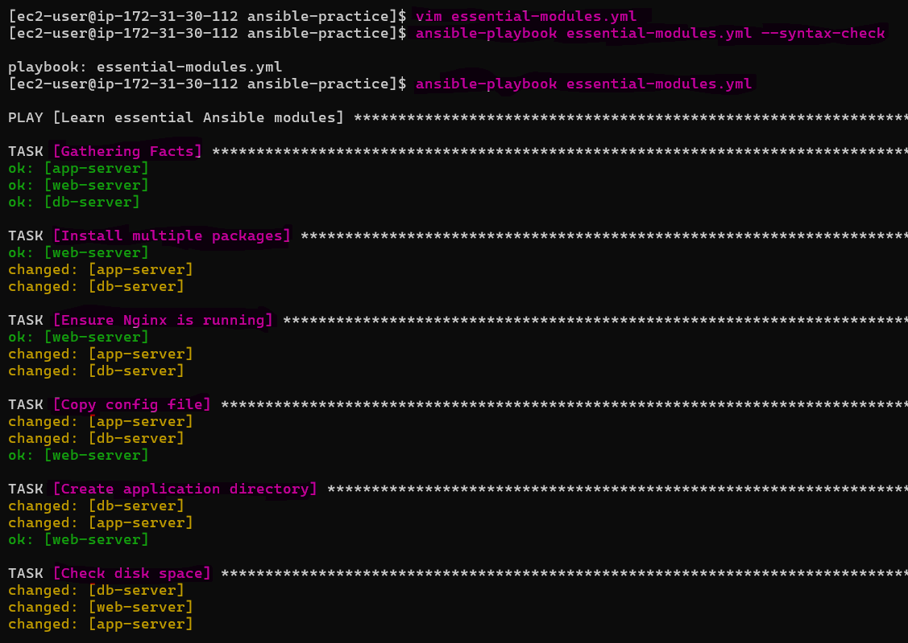 

> **What this verifies:** The essential modules completed successfully across all three managed nodes. 

### 3. Verify Disk Space

The `command` module runs `df -h` and registers the output. The `debug` task then displays the disk-space information.

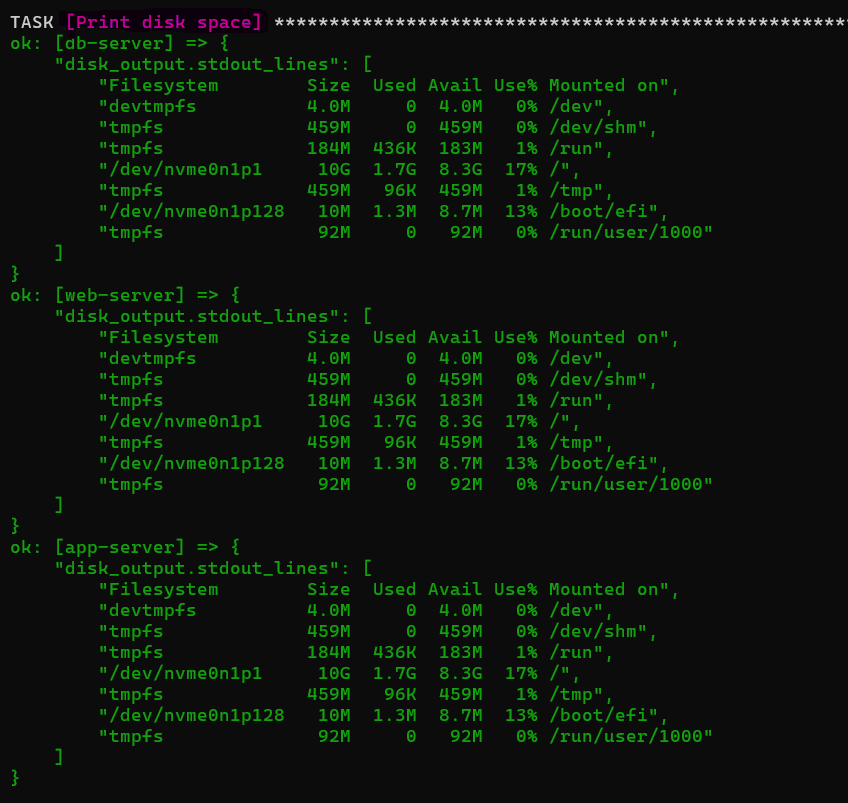 

### 4. Verify Processes and Timezone

The shell module demonstrates shell features such as the pipe (|) while lineinfile ensures the timezone entry exists.

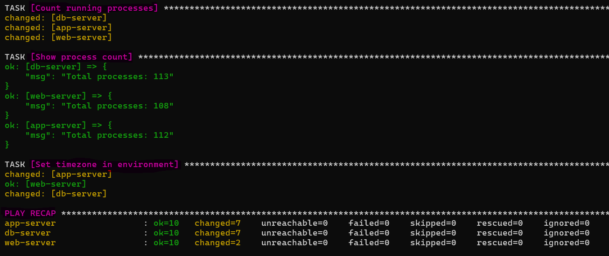 

### 5. Verify Files, Directories, Nginx, and Timezone

The `copy` and `file` modules created `/etc/app.conf` and `/opt/myapp` on all managed nodes.

```bash
ansible all -b -m shell -a "ls -l /etc/app.conf && ls -ld /opt/myapp"
ansible all -b -m shell -a "systemctl is-active nginx && grep 'TZ=Asia/Kolkata' /etc/environment"
```
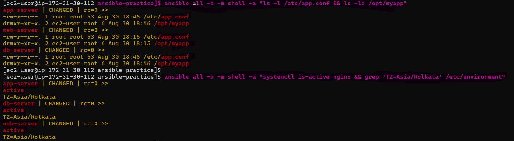

> **What this verifies:** The configuration file, application directory, Nginx service, and timezone configuration are present across the managed nodes.

**Document:** What is the difference between `command` and `shell`? When should you use each?

- **`command`**
  - Runs commands directly.
  - Does not support shell features such as pipes (`|`) or redirects (`>`).
  - Prefer it when shell features are not required.

- **`shell`**
  - Runs commands through a shell.
  - Supports pipes, redirects, variables, and other shell features.
  - Use it when shell functionality is actually required.

**Rule of thumb:** Prefer `command` for simple commands and use `shell` only when shell features are needed.

---

## Task 4: Handlers -- Restart Services Only When Needed

Handlers run only when triggered by a `notify`. This helps avoid unnecessary service restarts.

### Create `nginx-config.yml`

```yaml
---
- name: Configure Nginx with a custom config
  hosts: web
  become: true

  tasks:
    - name: Install Nginx
      yum:
        name: nginx
        state: present

    - name: Deploy Nginx config
      copy:
        src: files/nginx.conf
        dest: /etc/nginx/nginx.conf
        owner: root
        mode: '0644'
      notify: Restart Nginx

    - name: Deploy custom index page
      copy:
        content: "<h1>Managed by Ansible</h1><p>Server: {{ inventory_hostname }}</p>"
        dest: /usr/share/nginx/html/index.html

    - name: Ensure Nginx is running
      service:
        name: nginx
        state: started
        enabled: true

  handlers:
    - name: Restart Nginx
      service:
        name: nginx
        state: restarted
```

Create `files/nginx.conf` with a basic Nginx config.

### 1. Syntax Check

Validate the playbook before running it:

```bash
ansible-playbook nginx-config.yml --syntax-check
```
### 2. First Run

Run the playbook for the first time: 

```bash
ansible-playbook nginx-config.yml
```
Because `files/nginx.conf` is new or has changed, the `Deploy Nginx config` task reports `changed` and triggers the `Restart Nginx` handler.

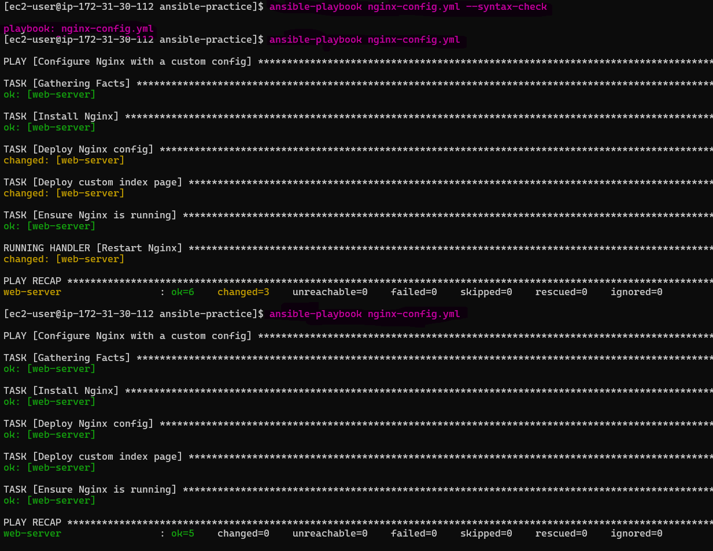 

> **What this verifies:** The configuration was changed and the `Restart Nginx` handler ran automatically.

### 3. Second Run

Run the same playbook again:

```bash
ansible-playbook nginx-config.yml
```
This time, the configuration is already up to date, so the `Deploy Nginx config` task reports `ok` and the handler does not run.

> **What this verifies:** The handler runs only when the task that notifies it reports a change.

### 4. Verify the Web Server

Check the deployed page using the web server's public IP:

```bash
curl http://<WEB_SERVER_PUBLIC_IP>
```
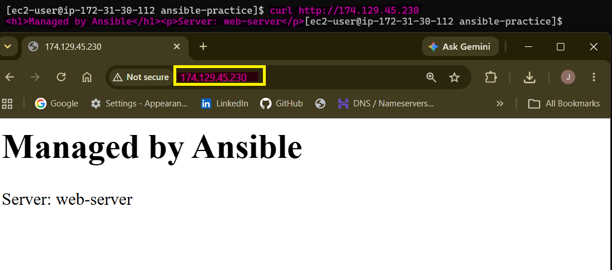

### 5. Verify Handler Behavior

Compare the two playbook runs:

- **First run:** `Deploy Nginx config` → `changed` → handler runs.
- **Second run:** `Deploy Nginx config` → `ok` → handler does not run.

**Answer:** No, the handler does **not** run both times. It runs only when the notified task makes a change.

---

## Task 5: Dry Run, Diff, and Verbosity

Before running playbooks on production, preview changes first. These options help verify what Ansible will do, understand file changes, troubleshoot problems, and limit execution to specific hosts.

### 1. Dry Run (`--check`)

The `--check` option performs a **dry run**. It shows what would change without actually applying the changes.

```bash
ansible-playbook install-nginx.yml --check
```
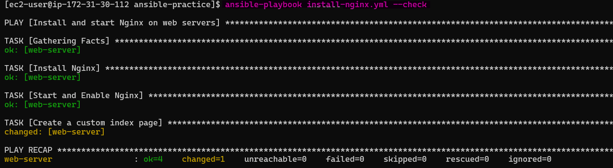 

> **What this verifies:** Ansible checks the current state and reports potential changes without modifying the web server.

### 2. Diff Mode (`--diff`)

The `--diff` option shows the actual before-and-after differences for files that Ansible would modify. Combining it with `--check` lets you preview file changes without applying them.

```bash
ansible-playbook nginx-config.yml --check --diff
```
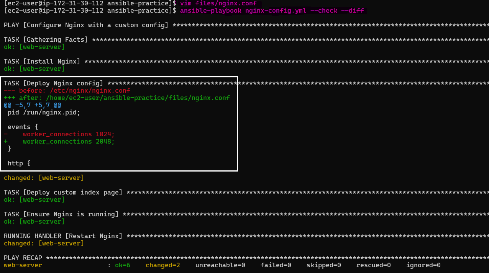 

> **What this verifies:** You can see exactly what content would change in the Nginx configuration before applying it.

### 3. Verbosity

Verbosity increases the amount of information Ansible displays. Higher levels are useful for troubleshooting and connection debugging.

```bash
ansible-playbook install-nginx.yml -v       # verbose
ansible-playbook install-nginx.yml -vv      # more verbose
ansible-playbook install-nginx.yml -vvv     # connection debugging
```
- `v` → Verbose output
- `vv` → More detailed output
- `vvv` → Connection and SSH debugging

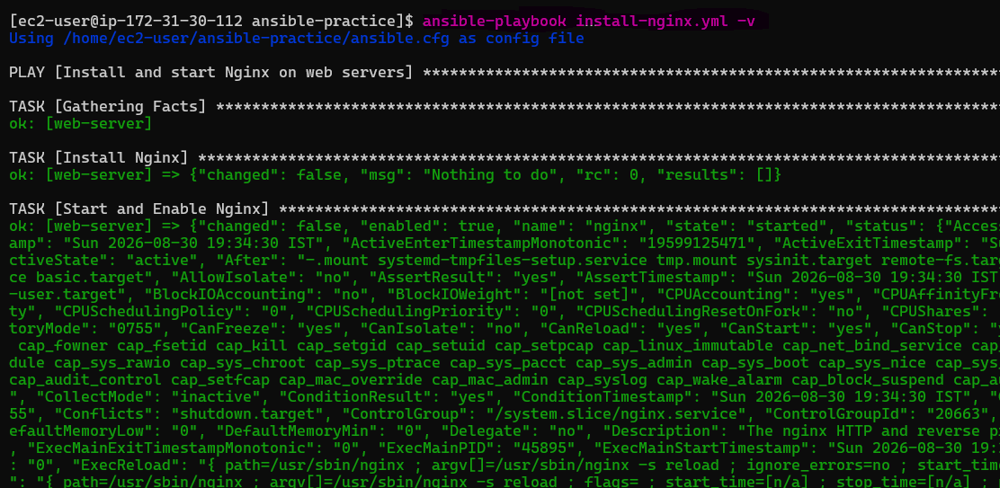 

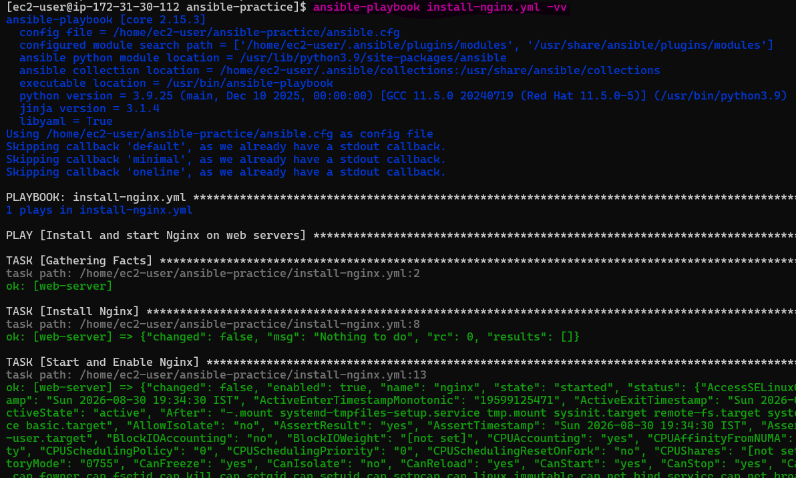 

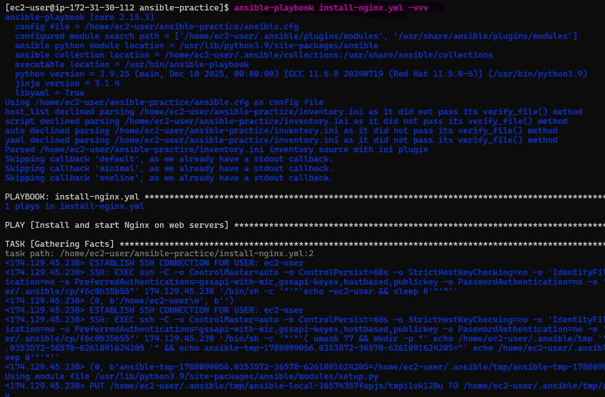 

### 4. Limit to Specific Hosts

The `--limit` option restricts the playbook execution to a specific host.

```bash
ansible-playbook install-nginx.yml --limit web-server
```
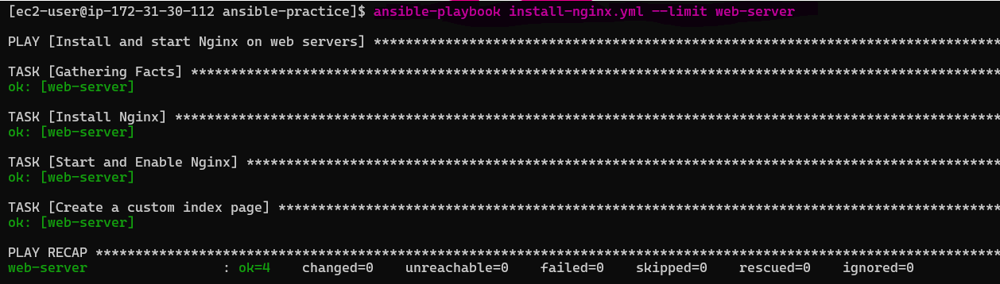 

> **What this verifies:** Only web-server is targeted, even though the playbook uses the `web` group.

### 5. List Affected Hosts and Tasks

Use `--list-hosts` to see which hosts would be targeted without running the playbook.

```bash
ansible-playbook install-nginx.yml --list-hosts
```
Use `--list-tasks` to see which tasks are defined in the playbook without executing them.

```bash
ansible-playbook install-nginx.yml --list-tasks
```
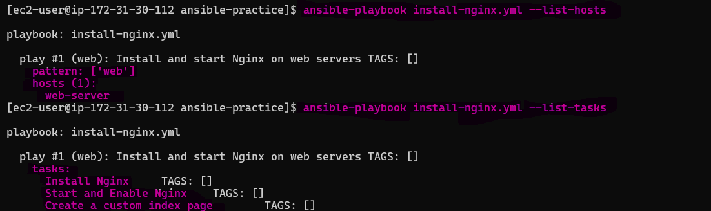

> **What this verifies:** You can review the target hosts and tasks before making any changes.

**Document:** Why is `--check --diff` Important for Production?

`--check --diff` is useful in production because it allows you to **preview changes before applying them**.

- `--check` → Shows what would change without making changes.
- `--diff` → Shows the exact file differences.
- **Together** → Provides a safer way to review configuration changes before deployment.

**Answer:** `--check --diff` reduces the risk of unexpected production changes by showing **what Ansible plans to change and exactly how files will change** before the playbook is actually applied.

---

## Task 6: Multiple Plays in One Playbook

A single playbook can contain multiple plays. Each play targets a specific inventory group, allowing different configurations for web, app, and database servers.

### Write `multi-play.yml` with separate plays for each server group:

```yaml
---
- name: Configure web servers
  hosts: web
  become: true
  tasks:
    - name: Install Nginx
      yum:
        name: nginx
        state: present
    - name: Start Nginx
      service:
        name: nginx
        state: started
        enabled: true

- name: Configure app servers
  hosts: app
  become: true
  tasks:
    - name: Install Node.js dependencies
      yum:
        name:
          - gcc
          - make
        state: present
    - name: Create app directory
      file:
        path: /opt/app
        state: directory
        mode: '0755'

- name: Configure database servers
  hosts: db
  become: true
  tasks:
    - name: Install MySQL-compatible client utilities
      yum:
        name: mariadb1011-client-utils
        state: present
    - name: Create data directory
      file:
        path: /var/lib/appdata
        state: directory
        mode: '0700'
```
> **Note:** The original task uses `mysql`, but on Amazon Linux 2023 the `mysql` package may not be available. `mariadb1011-client-utils` provides MySQL-compatible client utilities and was used successfully in this lab.

### 1. Syntax Check

Validate the playbook before running it:

```bash
ansible-playbook multi-play.yml --syntax-check
```

### 2. Run the Playbook

```bash
ansible-playbook multi-play.yml
```
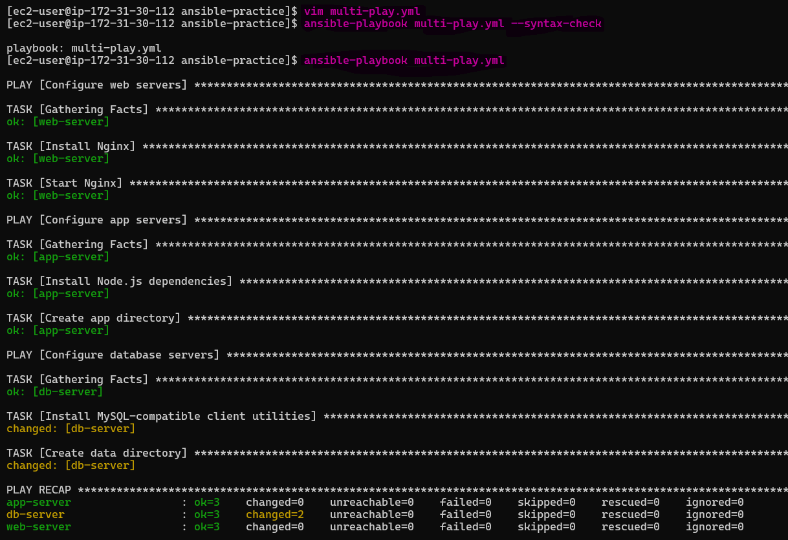 

> **What this verifies:** Each play runs only against its corresponding inventory group — `web`, `app`, or `db`.

### 3. Verify Each Server Group

Check that Nginx is installed on the web server:

```bash
ansible web -b -m command -a "nginx -v"
```
Check that the required app packages are installed: 

```bash
ansible app -b -m command -a "rpm -q gcc make"
```
Check that the MySQL-compatible client is installed on the database server:

```bash
ansible db -b -m command -a "mysql --version"
```
Check that the database directory exists:

```bash
ansible db -b -m shell -a "ls -ld /var/lib/appdata"
```
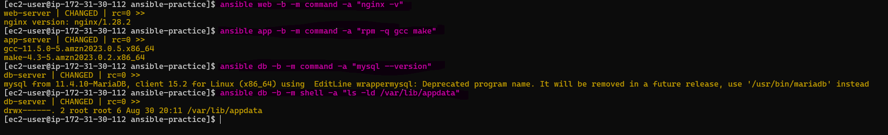

> **What this verifies:** Each play targets a different server group, and tasks run only on the relevant hosts.

**Verify:** Is Nginx only installed on web servers? Is the MySQL-compatible client only installed on db servers?

- **Web server:** Nginx is installed and running.
- **App server:** `gcc` and `make` are installed and `/opt/app` exists.
- **DB server:** MySQL-compatible client utilities are installed and `/var/lib/appdata` exists.

**Answer:** Yes. The playbook targets each server group separately, so Nginx tasks run only on `web`, app dependencies only on `app`, and database tasks only on `db`.

---

## First playbook with annotations explaining each section

```yaml
---
- name: Install and start Nginx on web servers                 # PLAY name
  hosts: web                                                    # Target inventory group: Executes on hosts in the 'web' group
  become: true                                                  # Privilege escalation: Executes tasks with elevated privileges
  tasks:                                                       # List of tasks

    - name: Install Nginx                                       # Task 1: Ensure Nginx is installed
      yum:                                                      # Module: yum
        name: nginx                                             # Package to install
        state: present                                           # Desired state: Package must be installed (idempotent)

    - name: Start and Enable Nginx                             # Task 2: Ensure Nginx is running and enabled on boot
      service:                                                  # Module: service (manages system services)
        name: nginx                                             # Service to manage
        state: started                                           # Desired state: Service must be running
        enabled: true                                            # Boot behavior: Service starts automatically on boot

    - name: Create a custom index page                         # Task 3: Create a custom HTML page
      copy:                                                     # Module: copy (copies files or content to remote hosts)
        content: "<h1>Deployed by Ansible - TerraWeek Server</h1>" # Inline content for index.html
        dest: /usr/share/nginx/html/index.html                  # Destination path on the remote web server
```
---

## Difference between `--check`, `--diff`, and `-v`

- `--check` → Dry run; shows what would change without applying changes.
- `--diff` → Shows the actual file differences before and after changes.
- `-v` → Displays verbose output.